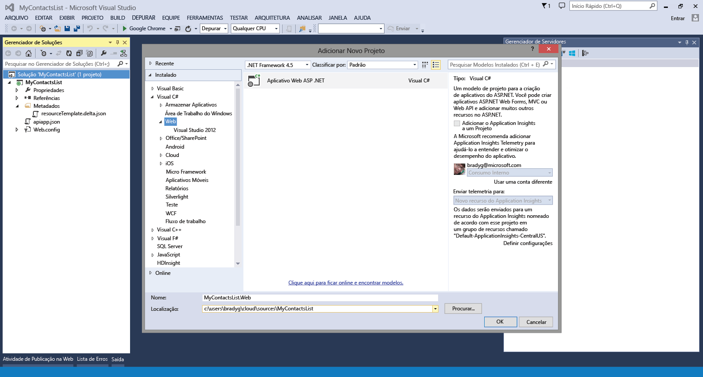
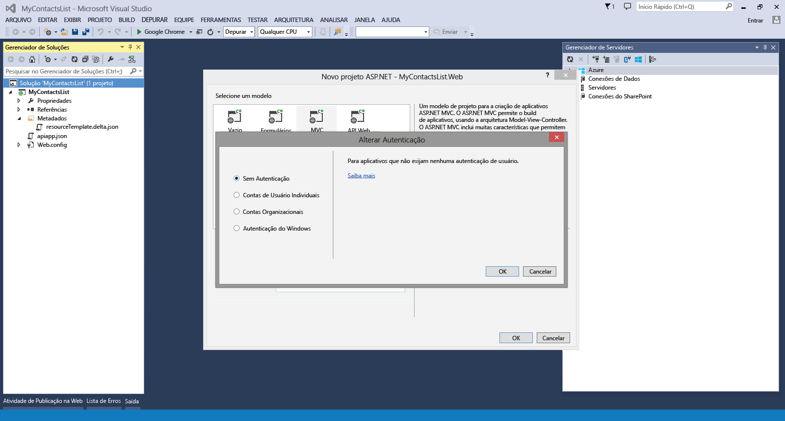
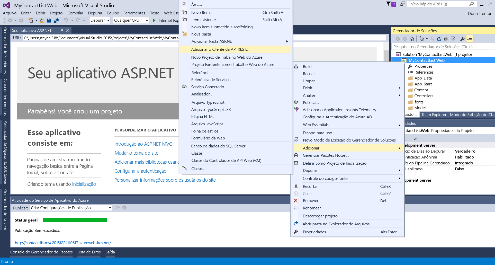
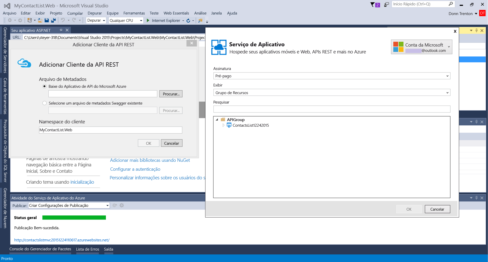
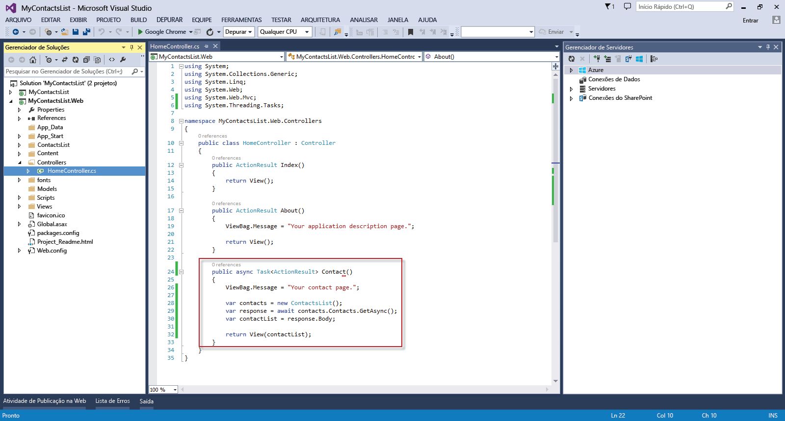
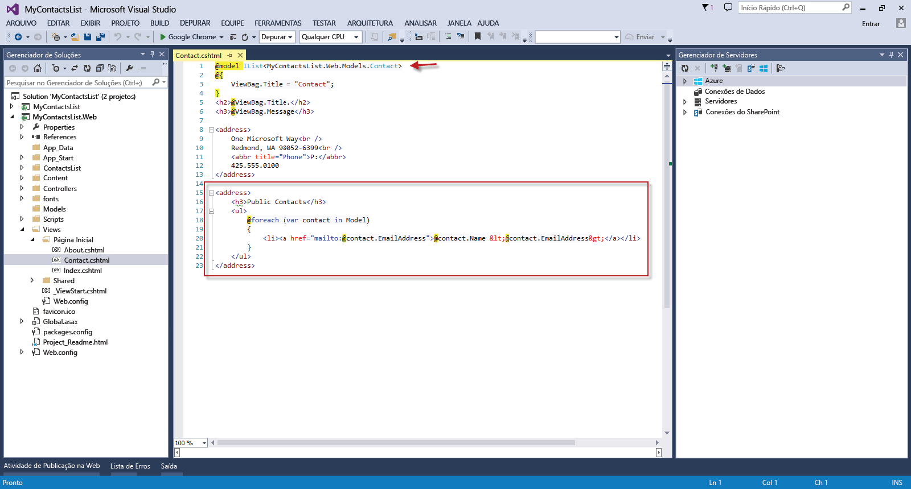

<properties 
	pageTitle="Conectar um aplicativo Web a um aplicativo de API no Serviço de Aplicativo do Azure" 
	description="Este tutorial mostra como consumir um aplicativo de API de um aplicativo Web ASP.NET hospedado no Serviço de Aplicativo do Azure." 
	services="app-service\web" 
	documentationCenter=".net" 
	authors="syntaxc4" 
	manager="yochayk" 
	editor="jimbe"/>

<tags
	ms.service="app-service-web"
	ms.devlang="dotnet"
	ms.topic="article"
	ms.tgt_pltfrm="na"
	ms.workload="na" 
	ms.date="09/15/2015"
	ms.author="cfowler"/>

# Conectar um aplicativo Web a um aplicativo de API no Serviço de Aplicativo do Azure

Este tutorial mostra como consumir um aplicativo de API de um aplicativo Web ASP.NET hospedado em [Serviço de Aplicativo](../app-service.md).

## Pré-requisitos

Este tutorial se baseia na série de tutoriais de Aplicativos de API:

1. [Criar um aplicativo de API do Azure](../app-service-dotnet-create-api-app)
3. [Implantar um aplicativo de API do Azure](../app-service-dotnet-deploy-api-app)
4. [Depurar um aplicativo de API do Azure](../app-service-dotnet-remotely-debug-api-app)

## Tornar o aplicativo de API publicamente acessível

No [Portal de visualização do Azure](http://go.microsoft.com/fwlink/?LinkId=529715), selecione o aplicativo de API. Clique no botão **Configurações** na barra de comandos. Na folha **Configurações do Aplicativo**, altere o **Nível de Acesso** para **Público (anônimo)**.

## Criar um Aplicativo MVC ASP.NET no Visual Studio

1. Abra o Visual Studio. Use a caixa de diálogo **Novo Projeto** para adicionar um novo **Aplicativo Web ASP.NET**. Clique em **OK**.

	

1. Selecione o modelo **MVC**. Clique em **Alterar Autenticação**, selecione **Sem Autenticação** e, em seguida, clique em **OK** duas vezes.

	

1. No Gerenciador de Soluções, clique com botão direito do mouse no projeto de Aplicativo Web recém-criado e selecione **Adicionar Referência de Aplicativo do Azure**.

	

1. Na lista suspensa **Aplicativos de API existentes**, selecione o aplicativo de API ao qual você deseja se conectar.

	

	>[AZURE.NOTE]O código do cliente para se conectar ao aplicativo de API será gerado automaticamente de um ponto de extremidade de API Swagger.

1. Para aproveitar o código de API gerado, abra o arquivo HomeController.cs e substitua a ação `Contact` pelo seguinte:

	    public async Task<ActionResult> Contact()
	    {
	        ViewBag.Message = "Your contact page.";
	
	        var contacts = new ContactsList();
	        var response = await contacts.Contacts.GetAsync();
	        var contactList = response.Body;
	
	        return View(contactList);
	    }

	

1. Atualize a exibição `Contact` para refletir a lista dinâmica de contatos com o seguinte código:
	<pre>// Add to the very top of the view file
@model IList&lt;MyContactsList.Web.Models.Contact>

// Replace the default email addresses with the following
&lt;h3>Contatos públicos&lt;/h3>
&lt;ul>
    @foreach (contato var no Modelo)
    {
        &lt;li>&lt;a href="mailto:@contact.EmailAddress">@contact.Name &amp;lt;@contact.EmailAddress&amp;gt;&lt;/a>&lt;/li>
    }
&lt;/ul> 
</pre>

## Implantar o aplicativo Web para Aplicativos Web no Serviço de Aplicativo

Siga as instruções disponíveis em [Como Implantar um Aplicativo Web do Azure](web-sites-deploy.md).

>[AZURE.NOTE]Se você deseja começar a usar o Serviço de Aplicativo do Azure antes de se inscrever em uma conta do Azure, vá até [Experimentar o Serviço de Aplicativo](http://go.microsoft.com/fwlink/?LinkId=523751), em que você pode criar imediatamente um aplicativo Web inicial de curta duração no Serviço de Aplicativo. Nenhum cartão de crédito é exigido, sem compromissos.

## O que mudou
* Para obter um guia sobre a alteração de Sites para o Serviço de Aplicativo, consulte: [Serviço de Aplicativo do Azure e seu impacto sobre os serviços do Azure existentes](http://go.microsoft.com/fwlink/?LinkId=529714)
* Para obter um guia sobre a alteração do portal antigo para o novo portal, consulte: [Referência para navegar no portal de visualização](http://go.microsoft.com/fwlink/?LinkId=529715)
 

<!---HONumber=Oct15_HO4-->