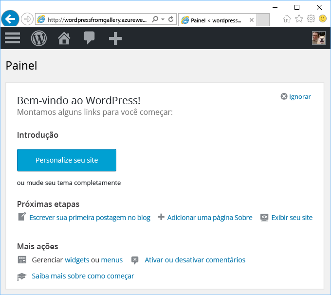

# Criar um aplicativo Web do Azure Marketplace
<!-- Note: This article replaces web-sites-php-web-site-gallery.md -->

[!INCLUDE [tabs](../../includes/app-service-web-get-started-nav-tabs.md)]

O Azure Marketplace fornece uma ampla variedade de aplicativos Web populares desenvolvidos por comunidades de software livre, como WordPress e Umbraco CMS. Neste tutorial, você aprenderá a criar um aplicativo do WordPress do Azure Marketplace.
que cria um Aplicativo Web do Azure e um banco de dados MySQL. 

## Antes de começar 

Se você não tiver uma assinatura do Azure, crie uma [conta gratuita](https://azure.microsoft.com/free/?WT.mc_id=A261C142F) antes de começar.

## Implantar do Azure Marketplace
Siga as etapas a seguir para implantar o WordPress do Azure Marketplace.

### Entrar no Azure
Faça logon no [Portal do Azure](https://portal.azure.com).

### Implantar modelo do WordPress
O Azure Marketplace fornece modelos para configurar recursos. Configure o modelo do [WordPress](https://portal.azure.com/#create/WordPress.WordPress) para começar.
   
Insira as informações a seguir para implantar o aplicativo do WordPress e seus recursos.

  

| Campo         | Valor sugerido           | Descrição  |
| ------------- |-------------------------|-------------|
| Nome do aplicativo      | mywordpressapp          | Insira um nome de aplicativo exclusivo em **Nome do aplicativo Web**. Esse nome é usado como parte do nome DNS padrão de seu aplicativo `<app_name>.azurewebsites.net` e, portanto, deve ser exclusivo entre todos os aplicativos no Azure. Posteriormente, você poderá mapear um nome de domínio personalizado para seu aplicativo antes de expô-lo para seus usuários |
| Assinatura  | Pré-paga             | Selecione uma **Assinatura**. Se tiver várias assinaturas, escolha a que for adequada. |
| Grupo de recursos| mywordpressappgroup                 |    Insira um **grupo de recursos**. Um grupo de recursos é um contêiner lógico no qual recursos do Azure, como aplicativos Web e bancos de dados, são implantados e gerenciados. Você pode criar um novo grupo de recursos ou usar um grupo existente |
| Plano do Serviço de Aplicativo | myappplan          | Os Planos do Serviço de Aplicativo representam a coleta de recursos físicos usados para hospedar seus aplicativos. Selecione o **Local** e o **Tipo de preço**. Para obter mais informações sobre preços, consulte [Tipo de preço do Serviço de Aplicativo](https://azure.microsoft.com/pricing/details/app-service/) |
| Banco de dados      | mywordpressapp          | Selecione o provedor de banco de dados apropriado para o MySQL. Os Aplicativos Web dão suporte a **ClearDB**, **Banco de Dados do Azure para MySQL** e **MySQL no aplicativo**. Para obter mais detalhes, consulte a seção [Configuração do banco de dados](#database-config). |
| Application Insights | ATIVAR ou DESATIVAR          | Isso é opcional. O [Application Insights](https://azure.microsoft.com/en-us/services/application-insights/) fornece serviços de monitoramento para seu aplicativo Web clicando em **ATIVAR**.|

### Configuração do banco de dados
Siga as etapas abaixo com base em sua escolha de provedor de banco de dados MySQL.  Recomenda-se que o Aplicativo Web e o banco de dados MySQL estejam no mesmo local.

#### ClearDB 
O [ClearDB](https://azuremarketplace.microsoft.com/en-us/marketplace/apps/SuccessBricksInc.ClearDBMySQLDatabase?tab=Overview) é uma solução de terceiros para um serviço MySQL totalmente integrado no Azure. Para usar bancos de dados ClearDB, você precisará associar um cartão de crédito à sua [conta do Azure](http://account.windowsazure.com/subscriptions). Se tiver selecionado o provedor de banco de dados ClearDB, você poderá exibir uma lista de bancos de dados existentes para escolher ou clique no botão **Criar novo** para criar um banco de dados.

#### Banco de Dados do Azure para MySQL (versão prévia)
O [Banco de Dados do Azure para MySQL](https://azure.microsoft.com/en-us/services/mysql) fornece um serviço de banco de dados gerenciado para desenvolvimento e implantação de aplicativos que permite que você crie um banco de dados MySQL em minutos e o dimensione dinamicamente na nuvem em que mais confia. Com modelos de preços acessíveis, você obtém todos os recursos que deseja, como alta disponibilidade, segurança e recuperação – internos, sem nenhum custo extra. Clique em **Tipo de preço** para escolher outro [tipo de preço](https://azure.microsoft.com/pricing/details/mysql). Para usar um banco de dados ou servidor MySQL existente, use um grupo de recursos existente no qual o servidor reside. 

> [!NOTE]
>  O Banco de Dados do Azure para MySQL (versão prévia) e Aplicativo Web no Linux (versão prévia) não estão disponíveis em todas as regiões. Para saber mais sobre as limitações, consulte [Banco de Dados do Azure para MySQL (versão prévia)](https://docs.microsoft.com/en-us/azure/mysql) e [Aplicativo Web no Linux](./app-service-linux-intro.md). 

#### MySQL no aplicativo
O [MySQL no aplicativo](https://blogs.msdn.microsoft.com/appserviceteam/2017/03/06/announcing-general-availability-for-mysql-in-app) é um recurso do Serviço de Aplicativo que permite executar o MySql nativamente na plataforma. A principal funcionalidade com suporte da versão do recurso:

- Servidor MySQL em execução na mesma instância, lado a lado com o servidor Web que hospeda o site. Isso aumenta o desempenho do seu aplicativo.
- O armazenamento é compartilhado entre o MySQL e os arquivos do aplicativo Web. Observe que, com os planos Gratuito e Compartilhado, você pode atingir nossos limites de cota quando usar o site com base nas ações que executar. Veja as [limitações de cota](https://azure.microsoft.com/en-us/pricing/details/app-service/plans/) para os planos Gratuito e Compartilhado.
- Você pode ativar o Log de consultas lentas e o log geral para MySQL. Observe que isso pode afetar o desempenho do site e NÃO deve estar sempre ATIVADO. O recurso de log ajuda a investigar problemas do aplicativo. 

Para obter mais detalhes, consulte este [artigo](https://blogs.msdn.microsoft.com/appserviceteam/2016/08/18/announcing-mysql-in-app-preview-for-web-apps/ )

Você pode observar o progresso clicando no ícone de sino na parte superior da página do portal enquanto o aplicativo do WordPress está sendo implantado.    

## Gerenciar seu novo aplicativo Web do Azure

Vá para o portal do Azure para examinar o aplicativo Web que você acabou de criar.

Para fazer isso, entre em [https://portal.azure.com](https://portal.azure.com).

No menu à esquerda, clique em **Serviço de Aplicativos** e, em seguida, clique no nome do seu aplicativo Web do Azure.

Você foi para a _folha_ de seu aplicativo Web (uma página do portal que abre horizontalmente).

Por padrão, a folha de seu aplicativo Web mostra a página **Visão Geral**. Esta página fornece uma visão de como está seu aplicativo. Aqui, você também pode executar tarefas básicas de gerenciamento como procurar, parar, iniciar, reiniciar e excluir. As guias no lado esquerdo da folha mostram as páginas de configuração diferentes que você pode abrir.

Essas guias na folha mostram muitos recursos excelentes que você pode adicionar ao seu aplicativo Web. A lista a seguir fornece algumas possibilidades:

* mapear um nome DNS personalizado
* associar um certificado SSL personalizado
* configurar uma implantação contínua
* Escalar vertical e horizontalmente
* adicionar a autenticação do usuário

Conclua o assistente de instalação do WordPress de 5 minutos para colocar o aplicativo do WordPress em funcionamento. Veja a [documentação do Wordpress](https://codex.WordPress.org/) para desenvolver seu aplicativo Web.

## Configurando seu aplicativo 
Existem várias etapas envolvidas no gerenciamento de seu aplicativo do WordPress antes que ele esteja pronto para uso em produção. Siga estas etapas para configurar e gerenciar seu aplicativo do WordPress:

| Para fazer isto... | Use isto... |
| --- | --- |
| **Carregar ou armazenar arquivos grandes** |[Plug-in do WordPress para usar o Armazenamento de Blobs](https://wordpress.org/plugins/windows-azure-storage/)|
| **Enviar email** |Compre o serviço de email [SendGrid](https://azuremarketplace.microsoft.com/en-us/marketplace/apps/SendGrid.SendGrid?tab=Overview) e use o [Plug-in do WordPress para usar o SendGrid](https://wordpress.org/plugins/sendgrid-email-delivery-simplified/) para configurá-lo|
| **Nomes de domínio personalizados** |[Configurar um nome de domínio personalizado no Serviço de Aplicativo do Azure](app-service-web-tutorial-custom-domain.md) |
| **HTTPS** |[Habilitar HTTPS para um aplicativo Web no Serviço de Aplicativo do Azure](app-service-web-tutorial-custom-ssl.md) |
| **Validação de pré-produção** |[Configurar ambientes de preparo e desenvolvimento para aplicativos Web no Serviço de Aplicativo do Azure](web-sites-staged-publishing.md)|
| **Monitoramento e solução de problemas** |[Habilitar o log de diagnóstico para aplicativos Web no Serviço de Aplicativo do Azure](web-sites-enable-diagnostic-log.md) e [Monitorar aplicativos Web no Serviço de Aplicativo do Azure](app-service-web-tutorial-monitoring.md) |
| **Implantar o site** |[Implantar um aplicativo Web no Serviço de Aplicativo do Azure](app-service-deploy-local-git.md) |

## Proteja seu aplicativo 
Existem várias etapas envolvidas no gerenciamento de seu aplicativo do WordPress antes que ele esteja pronto para uso em produção. Siga estas etapas para configurar e gerenciar seu aplicativo do WordPress:

| Para fazer isto... | Use isto... |
| --- | --- |
| **Nome de usuário e senha forte**|  Altere a senha com frequência. Não use nomes de usuário comuns, como *admin* ou *wordpress* etc. Force todos os usuários do WordPress a usarem um nome de usuário exclusivo e senhas fortes. |
| **Mantenha-se atualizado** | Mantenha o núcleo, os temas e plug-ins do WordPress atualizados. Use o tempo de execução PHP mais recente disponível no Serviço de Aplicativo do Azure |
| **Atualizar as chaves de segurança do WordPress** | Atualize a [chave de segurança do WordPress](https://codex.wordpress.org/Editing_wp-config.php#Security_Keys) para melhorar a criptografia armazenada em cookies|

## Melhorar o desempenho
O desempenho na nuvem é obtido principalmente por meio de cache e escalonamento. No entanto, a memória, a largura de banda e outros atributos da hospedagem de Aplicativos da Web devem ser consideradas.

| Para fazer isto... | Use isto... |
| --- | --- |
| **Compreender recursos de instância do Site** |[Detalhes do preço, incluindo recursos de camadas do Serviço de Aplicativo](https://azure.microsoft.com/en-us/pricing/details/app-service/)|
| **Recursos do cache** |Use o [Cache Redis do Azure](https://azure.microsoft.com/en-us/services/cache/) ou uma das outras opções de cache na [Azure Store](https://azuremarketplace.microsoft.com) |
| **Dimensionar o aplicativo** |É necessário dimensionar [o aplicativo Web no Serviço de Aplicativo do Azure](web-sites-scale.md) e/ou o banco de dados MySQL. O MySQL no aplicativo não tem suporte para expansão, sendo assim, escolha o ClearDB ou o Banco de Dados do Azure para MySQL (versão prévia). [Dimensione o banco de dados do Azure para MySQL (versão prévia)](https://azure.microsoft.com/en-us/pricing/details/mysql/) ou se estiver usando o [Roteamento de Alta Disponibilidade do ClearDB](http://w2.cleardb.net/faqs/) para escalar verticalmente o banco de dados |

## Disponibilidade e recuperação de desastre
A alta disponibilidade inclui o aspecto da recuperação de desastre para manter a continuidade de negócios. Planejamento para falhas e desastres na nuvem exige que você reconheça as falhas rapidamente. Essas soluções ajudam a implementar uma estratégia de alta disponibilidade.

| Para fazer isto... | Use isto... |
| --- | --- |
| **Sites de balanceamento de carga** ou **sites distribuídos geograficamente** |[Encaminhar tráfego com o Gerenciador de Tráfego do Azure](https://azure.microsoft.com/en-us/services/traffic-manager/) |
| **Backup e restauração** |[Fazer backup de um aplicativo Web no Serviço de Aplicativo do Azure](web-sites-backup.md) e [Restaurar um aplicativo Web no Serviço de Aplicativo do Azure](web-sites-restore.md) |

## Próximas etapas
Saiba mais sobre os diversos recursos do [Serviço de Aplicativo para desenvolvimento e dimensionamento](/app-service-web/).
