<properties 
	pageTitle="Adicionar funcionalidade ao seu primeiro aplicativo Web" 
	description="Adicione recursos interessantes ao seu primeiro aplicativo Web em alguns minutos." 
	services="app-service\web"
	documentationCenter=""
	authors="cephalin" 
	manager="wpickett" 
	editor="" 
/>

<tags 
	ms.service="app-service-web" 
	ms.workload="web" 
	ms.tgt_pltfrm="na" 
	ms.devlang="na" 
	ms.topic="hero-article"
	ms.date="05/12/2016" 
	ms.author="cephalin"
/>

# Adicionar funcionalidade ao seu primeiro aplicativo Web

Em [Implantar um aplicativo Web no Azure em cinco minutos](app-service-web-get-started.md), você implantou um aplicativo Web de exemplo para [Serviço de Aplicativo do Azure](../app-service/app-service-value-prop-what-is.md). Neste artigo, você adicionará rapidamente algumas ótimas funcionalidades ao seu aplicativo Web implantado. Em alguns minutos, você irá:

- impor a autenticação para os usuários
- dimensionar seu aplicativo automaticamente
- receba alertas sobre o desempenho de seu aplicativo

Independentemente do aplicativo de exemplo que implantou no artigo anterior, você pode acompanhar os itens no tutorial.

As três atividades deste tutorial são apenas alguns exemplos dos muitos recursos úteis que você obtém quando coloca seu aplicativo Web no Serviço de Aplicativo. Muitos dos recursos estão disponíveis na camada **Gratuita** (que é onde seu primeiro aplicativo Web está em execução), e você pode usar seus créditos de avaliação para experimentar os recursos que exigem tipos de preço mais altos. Tenha certeza de que seu aplicativo Web permanecerá na camada **Gratuita**, a menos que você o mude explicitamente para um tipo de preço diferente.

>[AZURE.NOTE] O aplicativo Web criado com a CLI do Azure é executado na camada **Gratuita**, o que permite apenas uma instância compartilhada da VM com as cotas de recursos. Para saber mais sobre o que você obtém com a camada **Gratuita**, confira [Limites do Serviço de Aplicativo](../azure-subscription-service-limits.md#app-service-limits).

## Autenticar os usuários

Agora, vamos ver como é fácil adicionar autenticação ao seu aplicativo (leia mais em [Autenticação/Autorização do Serviço de Aplicativo](https://azure.microsoft.com/blog/announcing-app-service-authentication-authorization/)).

1. Na folha do portal do seu aplicativo, que você acabou de abrir, clique em **Configurações** > **Autenticação/Autorização**. 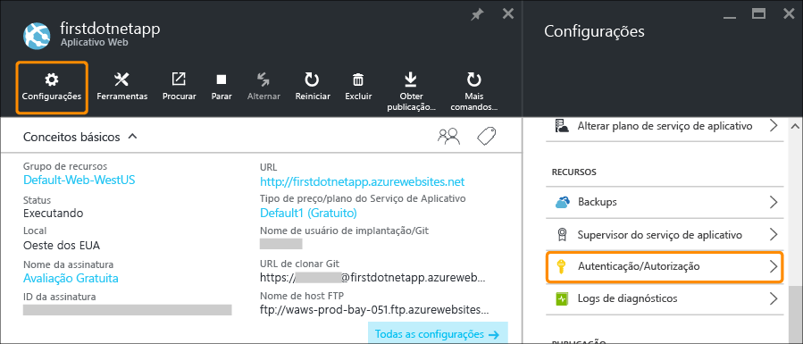
    
2. Clique em **Ativado** para ativar a autenticação.
    
4. Em **Provedores de Autenticação**, clique em **Azure Active Directory**. 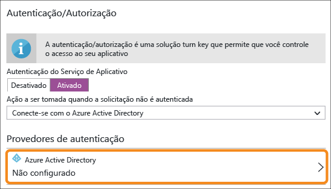

5. Na folha **Configurações do Azure Active Directory**, clique em **Express** e em **OK**. As configurações padrão criarão um novo aplicativo do AD do Azure no diretório padrão. 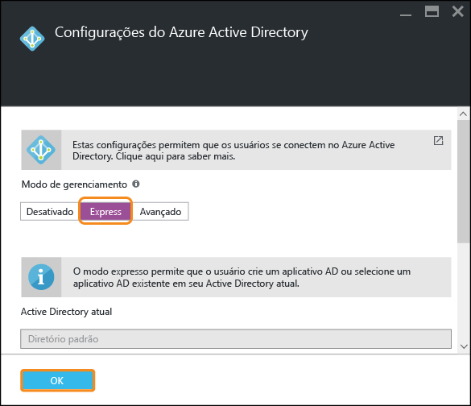

6. Clique em **Salvar**. 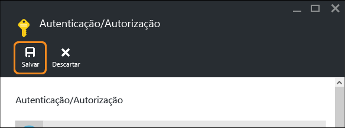

    Depois que a alteração for bem-sucedida, o sino de notificação ficará verde e uma mensagem amigável será exibida.

7. De volta à folha do portal do aplicativo, clique no link **URL** (ou em **Procurar** na barra de menus). O link é um endereço HTTP. 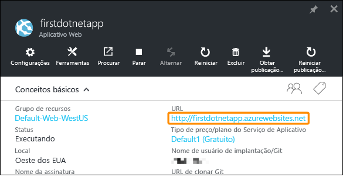 Porém, quando ele abre o aplicativo em uma nova guia, a caixa URL é redirecionada várias vezes e termina no aplicativo com um endereço HTTPS. O que você está vendo é que já está conectado à sua assinatura do Azure, e é autenticado automaticamente no aplicativo. 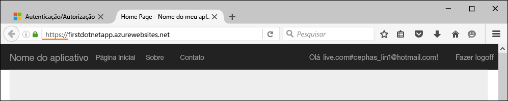 Dessa forma, se agora você abrir uma sessão não autenticada em um navegador diferente, verá uma tela de logon ao navegar até a mesma URL.
    <!-- 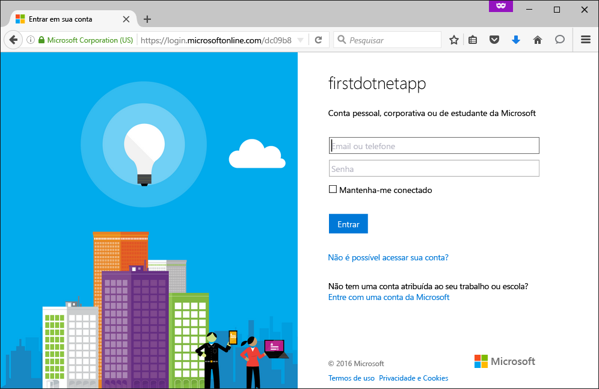  -->
    Se você nunca tiver feito nada com o Azure Active Directory, talvez seu diretório padrão não tenha usuários do Azure AD. Nesse caso, provavelmente a única conta aqui será a conta da Microsoft com sua assinatura do Azure. É por isso que você foi conectado automaticamente ao aplicativo no mesmo navegador antes. Você pode usar essa mesma conta da Microsoft para fazer logon nessa página de logon.

Parabéns, você está autenticando todo o tráfego para seu aplicativo Web.

Talvez você tenha observado na folha **Autenticação/Autorização** que pode fazer muito mais, como:

- Habilitar o logon social
- Habilitar várias opções de logon
- Alterar o comportamento padrão quando as pessoas navegam pela primeira vez para o aplicativo

O Serviço de Aplicativo fornece uma solução pronta para algumas das necessidades de autenticação comuns, para que você não precise fornecer a lógica de autenticação por conta própria. Para saber mais, veja [Autenticação/Autorização do Serviço de Aplicativo](https://azure.microsoft.com/blog/announcing-app-service-authentication-authorization/).

## Dimensionar seu aplicativo automaticamente com base na demanda

Em seguida, dimensionaremos automaticamente o aplicativo para que ele ajuste automaticamente sua capacidade de modo a atender à demanda do usuário (leia mais em [Dimensionar seu aplicativo no Azure](web-sites-scale.md) e [Dimensionar a contagem de instâncias manualmente ou automaticamente](../azure-portal/insights-how-to-scale.md)).

Com rapidez, você pode dimensionar o aplicativo Web de duas maneiras:

- [Escalar verticalmente](https://en.wikipedia.org/wiki/Scalability#Horizontal_and_vertical_scaling): obtenha mais CPU, memória, espaço em disco e recursos adicionais como VMs dedicadas, domínios e certificados personalizados, slots de preparação, dimensionamento automático e muito mais. Você escala horizontalmente ao alterar o tipo de preço do plano do Serviço de Aplicativo ao qual seu aplicativo pertence.
- [Escalar horizontalmente](https://en.wikipedia.org/wiki/Scalability#Horizontal_and_vertical_scaling): aumentando o número de instâncias de VM que executam seu aplicativo. Você pode escalar horizontalmente até 50 instâncias, dependendo de seu tipo de preço.

Sem mais demora, vamos configurar o dimensionamento automático.

1. Primeiro, vamos escalar verticalmente para habilitar o dimensionamento automático. Na folha do portal do aplicativo, clique em **Configurações** > **Escalar Verticalmente (Plano do Serviço de Aplicativo)**. 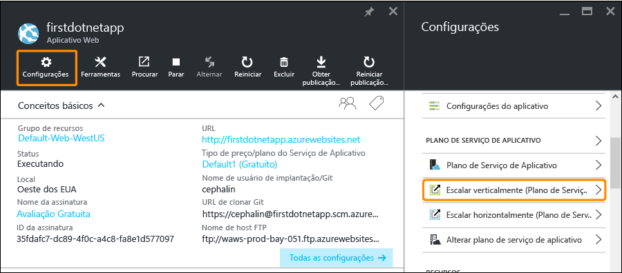

2. Role e selecione **Standard S1**, o tipo mais baixo que dá suporte ao dimensionamento automático (circulado na captura de tela) e clique em **Selecionar**. 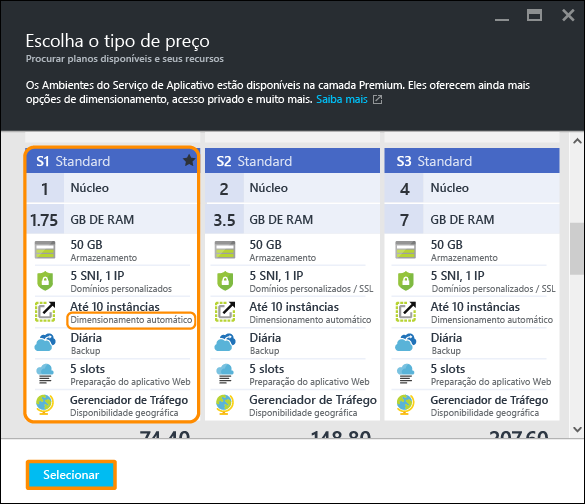

    Você concluiu a escala vertical.
    
    >[AZURE.IMPORTANT] Esta camada gasta seus créditos de avaliação gratuita. Se você tiver uma conta pré-paga, isso incorrerá em encargos em sua conta.
    
3. Em seguida, vamos configurar o dimensionamento automático. Na folha do portal do aplicativo, clique em **Configurações** > **Escalar Horizontalmente (Plano do Serviço de Aplicativo)**. 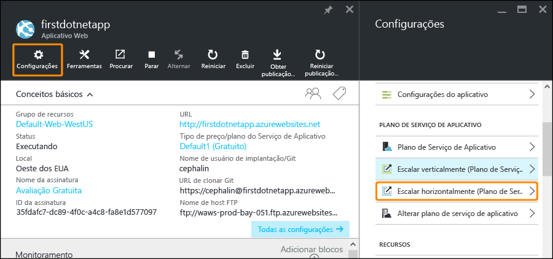

4. Altere **Escalar por** para **Percentual de CPU**. Os controles deslizantes abaixo do menu suspenso serão atualizados de maneira correspondente. Em seguida, defina um intervalo de **Instâncias** entre **1** e **2** e um **Intervalo de destino** entre **40** e **80**. Faça isso digitando nas caixas ou movendo os controles deslizantes. 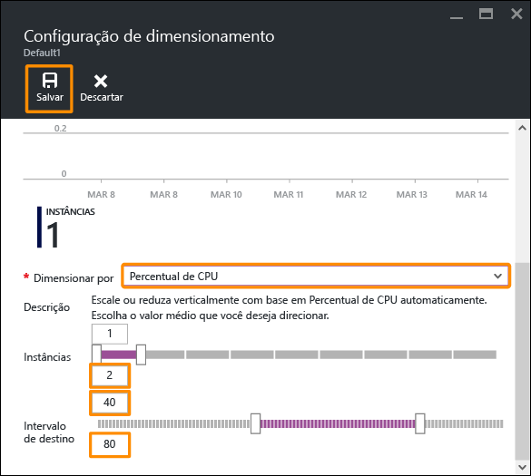
    
    Com base nesta configuração, o aplicativo é escalado horizontalmente de forma automática quando a utilização da CPU é superior a 80% e é escalado verticalmente quando a utilização da CPU é inferior a 40%.
    
5. Clique em **Salvar** na barra de menus.

Parabéns, agora o aplicativo tem o dimensionamento automático.

Você talvez tenha observado na folha **Configurações de dimensionamento** que pode fazer muito mais, como:

- Escalar manualmente até um número específico de instâncias
- Escalar por outras métricas de desempenho, como percentual de memória ou fila do disco
- Personalizar o comportamento da escala quando uma regra de desempenho é disparada
- Fazer o dimensionamento automático de acordo com uma agenda
- Definir o comportamento de dimensionamento automático para um evento futuro

Para saber mais sobre o dimensionamento do aplicativo, confira [dimensionar seu aplicativo no Azure](../app-service-web/web-sites-scale.md). Para saber mais sobre a escala vertical, consulte [Escalar a contagem de instâncias manualmente ou automaticamente](../azure-portal/insights-how-to-scale.md).

## Receber alertas para o aplicativo

Agora que seu aplicativo está sendo dimensionado automaticamente, o que acontece quando ele atinge a contagem máxima de instâncias (2) e se CPU está acima da utilização desejada (80%)? Você pode configurar um alerta (leia mais em [Receber notificações de alerta](../azure-portal/insights-receive-alert-notifications.md)) para informá-lo dessa situação para que possa continuar a escalar verticalmente o aplicativo, por exemplo. Vamos configurar rapidamente um alerta para esse cenário.

1. Na folha do portal do seu aplicativo do portal, clique em **Ferramentas** > **Alertas**. 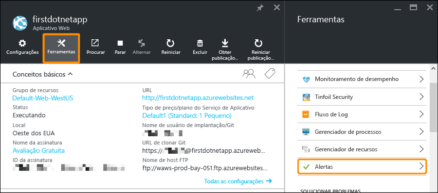

2. Clique em **Adicionar alerta**. Em seguida, na caixa **Recurso**, selecione o recurso que termina com **(farmsdeservidores)**. Esse é seu plano do Serviço de Aplicativo. 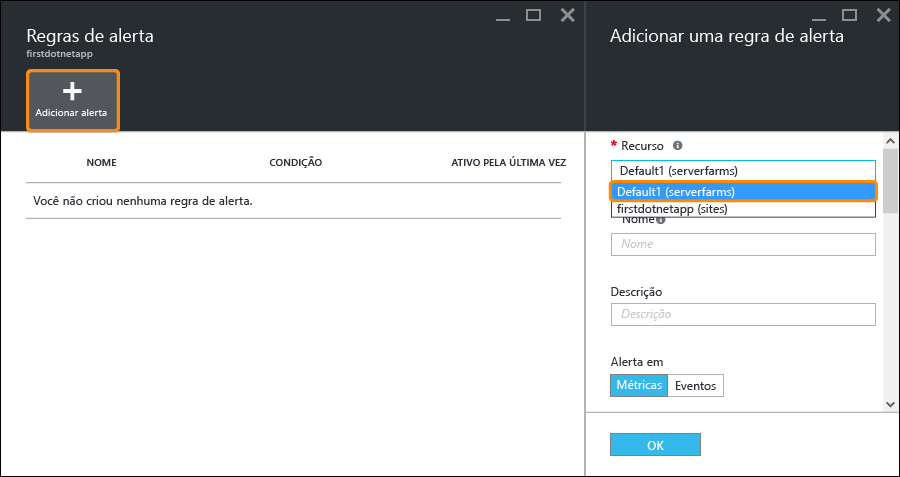

3. Especifique o **Nome** como `CPU Maxed`, **Métrica** como **Percentual de CPU** e **Limite** como `90`. Em seguida, selecione **Proprietários, colaboradores e leitores de email** e clique em **OK**. 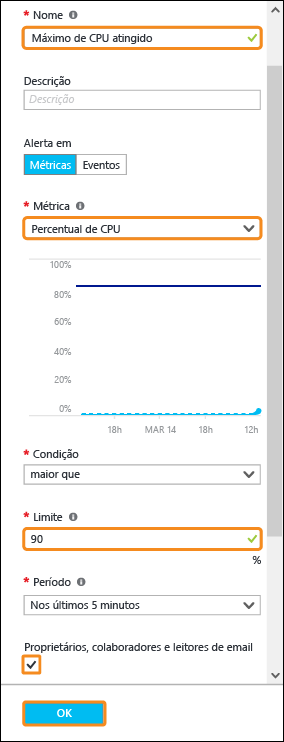
    
    Quando o Azure terminar de criar o alerta, você o verá na folha **Alertas**. 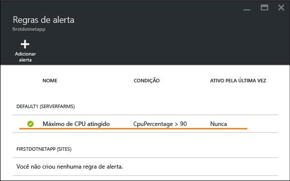

Parabéns, agora você está recebendo alertas.

Essa configuração de alerta verifica a utilização da CPU a cada cinco minutos. Se o número ficar acima de 90%, você e qualquer pessoa que estiver autorizada receberão um alerta por email. Para ver quem está autorizado a receber os alertas, retorne à folha do portal do aplicativo e clique no botão **Acessar**. 

Você verá que os **Administradores de assinatura** já são os **Proprietários** do aplicativo. Esse grupo inclui se você é o administrador da conta de sua assinatura do Azure (por exemplo, sua assinatura de avaliação). Para saber mais sobre o controle de acesso baseado em função do Azure, confira [Controle de acesso baseado em função do Azure](../active-directory/role-based-access-control-configure.md).

> [AZURE.NOTE] As Regras de alerta são recursos do Azure. Para saber mais, veja [Receber notificações de alerta](../azure-portal/insights-receive-alert-notifications.md).

## Próximas etapas

Quando foi configurar o alerta, talvez você tenha notado um conjunto avançado de ferramentas na folha **Ferramentas**. Aqui, você pode solucionar problemas, monitorar o desempenho, testar vulnerabilidades, gerenciar recursos, interagir com o console da VM e adicionar extensões úteis. Nós o convidamos a clicar em cada uma dessas ferramentas para descobrir as ferramentas simples mas eficientes que estão ao seu dispor.

Saiba como fazer mais com o aplicativo implantado. Esta é apenas uma lista parcial:

- [Comprar e configurar um nome de domínio personalizado](custom-dns-web-site-buydomains-web-app.md) - compre um domínio atraente para seu aplicativo Web em vez do domínio *.azurewebsites.net. Ou use um domínio que você já tenha.
- [Configurar ambientes de preparo](web-sites-staged-publishing.md) - implante seu aplicativo em uma URL de preparo antes de colocá-lo em produção. Atualize o aplicativo Web dinâmico com confiança. Configure uma solução DevOps elaborada com vários slots de implantação.
- [Configurar implantação contínua](app-service-continuous-deployment.md) - integre a implantação de aplicativo em seu sistema de controle de origem. Implante no Azure com cada confirmação.
- [Acessar recursos locais](web-sites-hybrid-connection-get-started.md) - acesse um banco de dados local existente ou um sistema CRM.
- [Fazer backup de seu aplicativo](web-sites-backup.md) – configure o backup e a restauração para seu aplicativo Web. Prepare-se para falhas inesperadas e recupere-se delas.
- [Habilitar logs de diagnóstico](web-sites-enable-diagnostic-log.md) - leia os logs do IIS do Azure ou de rastreamentos de aplicativo. Leia-os em um fluxo, baixe-os ou porte-os para o [Application Insights](../application-insights/app-insights-overview.md) para análise turn key.
- [Examinar seu aplicativo em busca de vulnerabilidades](https://azure.microsoft.com/blog/web-vulnerability-scanning-for-azure-app-service-powered-by-tinfoil-security/) - verifique seu aplicativo Web contra ameaças modernas usando o serviço fornecido pela [Tinfoil Security](https://www.tinfoilsecurity.com/).
- [Executar trabalhos em segundo plano](../azure-functions/functions-overview.md) - execute trabalhos de processamento de dados, relatórios, etc.
- [Saber como funciona o Serviço de Aplicativo](../app-service/app-service-how-works-readme.md)

<!---HONumber=AcomDC_0803_2016-->