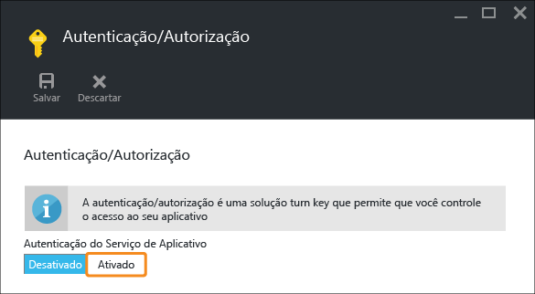

<properties 
	pageTitle="Introdução a aplicativos Web no Serviço de Aplicativo do Azure - parte 2" 
	description="Adicione recursos essenciais ao aplicativo Web no Serviço de Aplicativo com apenas alguns cliques." 
	services="app-service\web"
	documentationCenter=""
	authors="cephalin" 
	manager="wpickett" 
	editor="" 
/>

<tags 
	ms.service="app-service-web" 
	ms.workload="web" 
	ms.tgt_pltfrm="na" 
	ms.devlang="na" 
	ms.topic="hero-article"
	ms.date="03/17/2016" 
	ms.author="cephalin"
/>

# Introdução ao Serviço de Aplicativo do Azure - parte 2

Em [Introdução ao Serviço de Aplicativo do Azure](app-service-web-get-started.md), você implantou um aplicativo Web no Serviço de Aplicativo do Azure e configurou tudo para atualizações rápidas e fáceis. Neste artigo, você adicionará rapidamente funcionalidade essencial ao aplicativo implantado para mantê-lo funcionando perfeitamente. Assim, você descobrirá por si mesmo que o Serviço de Aplicativo é muito mais do que um hoster de site. Ele oferece recursos de classe empresarial ao seu ótimo aplicativo, para que você possa concentrar sua energia criativa em satisfazer os usuários com o aplicativo, não em atender às demandas do mundo real de segurança, escalabilidade, desempenho, gerenciamento etc.

Com alguns cliques, você aprenderá a:

- impor a autenticação para os usuários
- dimensionar automaticamente o aplicativo
- receber alertas sobre o desempenho do aplicativo

Independentemente do aplicativo de exemplo que implantou no artigo anterior, você pode acompanhar os itens no tutorial.

## Autenticar os usuários

Agora vamos ver como é fácil adicionar a autenticação ao aplicativo.

1. Na folha do portal do seu aplicativo, que você acabou de abrir, clique em **Configurações** > **Autenticação/Autorização**. 
    
2. Clique em **Ativado** para ativar a autenticação. 
    
4. Em **Provedores de Autenticação**, clique em **Azure Active Directory**. 

5. Na folha **Configurações do Azure Active Directory**, clique em **Express** e em **OK**. As configurações padrão criarão um novo aplicativo do AD do Azure no diretório padrão. 

6. Clique em **Salvar**. 

    Depois que a alteração for bem-sucedida, o sino de notificação ficará verde e uma mensagem amigável será exibida.

7. De volta à folha do portal do aplicativo, clique no link **URL** (ou em **Procurar** na barra de menus). O link é um endereço HTTP.  Porém, quando ele abre o aplicativo em uma nova guia, a caixa URL é redirecionada várias vezes e termina no aplicativo com um endereço HTTPS. O que você está vendo é que já está conectado à conta da Microsoft com sua assinatura do Azure e é conectado automaticamente ao aplicativo usando essa conta.  Portanto, se agora você uma sessão não autenticada em um navegador diferente, você verá uma tela de logon ao navegar até a mesma URL:  se nunca fez nada com o Azure Active Directory, o diretório padrão talvez não tenha usuários do AD do Azure. Nesse caso, provavelmente a única conta aqui será a conta da Microsoft com sua assinatura do Azure. É por isso que você foi conectado automaticamente ao aplicativo no mesmo navegador antes. Você pode usar essa mesma conta da Microsoft para fazer logon nessa página de logon.

Parabéns, você está autenticando todo o tráfego para seu site.

Talvez você tenha observado na folha **Autenticação/Autorização** que pode fazer muito mais, como:

- Habilitar o logon social
- Habilitar várias opções de logon
- Alterar o comportamento padrão quando os usuários navegam pela primeira vez para o aplicativo

O Serviço de Aplicativo fornece uma solução pronta para algumas das necessidades de autenticação comuns, para que você não precise fornecer a lógica de autenticação por conta própria. Para saber mais, consulte [Autenticação/autorização do Serviço de Aplicativo](/blog/announcing-app-service-authentication-authorization/).

## Escalar o aplicativo verticalmente ou horizontalmente

Em seguida, vamos escalar o aplicativo. Você pode esalar o aplicativo do Serviço de Aplicativo de duas maneiras:

- [Escalar verticalmente](https://en.wikipedia.org/wiki/Scalability#Horizontal_and_vertical_scaling): ao escalar verticalmente um aplicativo do Serviço de Aplicativo, você altera o tipo de preço do plano do Serviço de Aplicativo à qual o aplicativo pertence. A escala vertical oferece mais CPU, memória, espaço em disco e recursos extra, como instâncias de VM dedicadas, dimensionamento automático, SLA de 99,95%, domínios personalizados, certificados SSL personalizados, slots de implantação, backup, restauração etc. As camadas mais altas oferecem mais recursos ao aplicativo do Serviço de Aplicativo.  
- [Escalar horizontalmente](https://en.wikipedia.org/wiki/Scalability#Horizontal_and_vertical_scaling): ao escalar horizontalmente um aplicativo do Serviço de Aplicativo, você altera o número de instâncias de VM em que o aplicativo é executado (ou em que aplicativos do mesmo plano do Serviço de Aplicativo são executados). Com o tipo de preço Standard ou superior, você pode habilitar o dimensionamento automático de instâncias VM com base em métricas de desempenho. 

Sem mais demora, vamos configurar o dimensionamento automático para o aplicativo.

1. Primeiro, vamos escalar verticalmente para habilitar o dimensionamento automático. Na folha do portal do aplicativo, clique em **Configurações** > **Escalar Verticalmente (Plano do Serviço de Aplicativo)**. 

2. Role e selecione **Standard S1**, o tipo mais baixo que dá suporte ao dimensionamento automático (circulado na captura de tela) e clique em **Selecionar**. 

    Você concluiu a escala vertical.
    
    >[AZURE.IMPORTANT] Essa camada usará seus créditos de avaliação gratuita. Se você tiver uma conta pré-paga, isso incorrerá em encargos em sua conta.
    
3. Em seguida, vamos configurar o dimensionamento automático. Na folha do portal do aplicativo, clique em **Configurações** > **Escalar Horizontalmente (Plano do Serviço de Aplicativo)**. 

4. Altere **Escalar por** para **Percentual de CPU**. Os controles deslizantes abaixo do menu suspenso serão alterados de maneira correspondente. Em seguida, defina um intervalo de **Instâncias** entre **1** e **2** e um **Intervalo de destino** entre **40** e **80**. Faça isso digitando nas caixas ou movendo os controles deslizantes. 
    
    Com base nesta configuração, o aplicativo será escalado horizontalmente quando a utilização da CPU for superior a 80% e será escalado verticalmente quando a utilização da CPU for inferior a 40%.
    
5. Clique em **Salvar** na barra de menus.

Parabéns, agora o aplicativo tem o dimensionamento automático.

Você talvez tenha observado na folha **Configurações de dimensionamento** que pode fazer muito mais, como:

- Escalar manualmente até um número específico de instâncias
- Escalar por outras métricas de desempenho, como percentual de memória ou fila do disco
- Personalizar o comportamento da escala quando uma regra de desempenho é disparada
- Fazer o dimensionamento automático de acordo com uma agenda
- Definir o comportamento de dimensionamento automático para um evento futuro

Para saber mais sobre a escala vertical para o aplicativo, confira [Dimensionar o tipo de preço no Serviço de Aplicativo do Azure](../app-service/app-service-scale.md). Para saber mais sobre a escala vertical, consulte [Escalar a contagem de instâncias manualmente ou automaticamente](../azure-portal/insights-how-to-scale.md).

## Receber alertas para o aplicativo

Agora que seu aplicativo está sendo dimensionado automaticamente, o que acontece quando ele atinge a contagem máxima de instâncias (2) e se CPU está acima da utilização desejada (80%)? Você pode configurar um alerta para informá-lo dessa situação para que possa continuar a escalar verticalmente o aplicativo, por exemplo. Vamos configurar rapidamente um alerta para esse cenário.

1. Na folha do portal do seu aplicativo do portal, clique em **Ferramentas** > **Alertas**. 

2. Clique em **Adicionar alerta**. Em seguida, na caixa **Recurso**, selecione o recurso que termina com **(farmsdeservidores)**. Esse é seu plano do Serviço de Aplicativo. 

3. Especifique o **Nome** como `CPU Maxed`, **Métrica** como **Percentual de CPU** e **Limite** como `90`. Em seguida, selecione **Proprietários, colaboradores e leitores de email** e clique em **OK**. 
    
    Quando o Azure terminar de criar o alerta, você o verá na folha **Alertas**. 

Parabéns, agora você está recebendo alertas.

Essa configuração de alerta agora verificará a utilização da CPU a cada cinco minutos. Se o número ficar acima de 90%, você e qualquer pessoa que estiver autorizada receberão um alerta por email. Para ver quem está autorizado a receber os alertas, retorne à folha do portal do aplicativo e clique no botão **Acessar**. 

Você verá que os **Administradores de assinatura** já são os **Proprietários** do aplicativo. Esse grupo inclui se você é o administrador da conta de sua assinatura do Azure (por exemplo, sua assinatura de avaliação). Para saber mais sobre o controle de acesso baseado em função do Azure, confira [Controle de acesso baseado em função do Azure](../active-directory/role-based-access-control-configure.md).

## Próximas etapas

Quando foi configurar o alerta, talvez você tenha notado um conjunto avançado de ferramentas na folha **Ferramentas**. Aqui, você pode solucionar problemas, monitorar o desempenho, testar vulnerabilidades, gerenciar recursos, interagir com o console da VM e adicionar extensões úteis. Nós o convidamos a clicar em cada uma dessas ferramentas para descobrir as ferramentas simples mas eficientes que estão ao seu dispor.

Saiba como fazer mais com o aplicativo implantado. Aqui está uma lista parcial:

- [Comprar e configurar um nome de domínio personalizado](custom-dns-web-site-buydomains-web-app.md)
- [Configurar ambientes de preparo](web-sites-staged-publishing.md)
- [Configurar a implantação contínua](web-sites-publish-source-control.md)
- [Fazer backup de seu aplicativo](web-sites-backup.md)
- [Habilitar logs de diagnóstico](web-sites-enable-diagnostic-log.md)
- [Acessar recursos locais](web-sites-hybrid-connection-get-started.md)
- [Saber como funciona o Serviço de Aplicativo](../app-service/app-service-how-works-readme.md) 

<!---HONumber=AcomDC_0323_2016--->