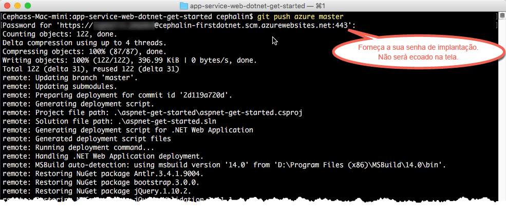

# Implantar seu primeiro aplicativo Web ASP.NET no Azure em cinco minutos (CLI 2.0 Preview)

> [!div class="op_single_selector"]
> * [Primeiro site HTML](app-service-web-get-started-html.md)
> * [Primeiro aplicativo .NET](app-service-web-get-started-dotnet.md)
> * [Primeiro aplicativo PHP](app-service-web-get-started-php.md)
> * [Primeiro aplicativo Node.js](app-service-web-get-started-nodejs.md)
> * [Primeiro aplicativo Python](app-service-web-get-started-python.md)
> * [Primeiro aplicativo Java](app-service-web-get-started-java.md)
> 
> 

Este tutorial ajuda a implantar um aplicativo Web ASP.NET simples no [Serviço de Aplicativo do Azure](../app-service/app-service-value-prop-what-is.md).
Você pode usar o Serviço de Aplicativo para criar aplicativos Web, [back-ends de aplicativos móveis](/documentation/learning-paths/appservice-mobileapps/) e [aplicativos de API](../app-service-api/app-service-api-apps-why-best-platform.md).

Você irá: 

* Criar um aplicativo Web no Serviço de Aplicativo do Azure.
* Implantar o exemplo de código ASP.NET.
* Ver seu código em execução na produção.
* Atualize o aplicativo Web da mesma maneira como faria com [confirmações do Git por push](https://git-scm.com/docs/git-push).

[!INCLUDE [app-service-linux](../../includes/app-service-linux.md)]

## Versões da CLI para concluir a tarefa

Você pode concluir a tarefa usando uma das seguintes versões da CLI:

- [CLI do Azure 1.0](app-service-web-get-started-dotnet-cli-nodejs.md) – nossa CLI para os modelos de implantação clássico e de gerenciamento de recursos
- [CLI do Azure 2.0 (Visualização)](app-service-web-get-started-dotnet.md) - nossa próxima geração de CLI para o modelo de implantação de gerenciamento de recursos

## Pré-requisitos
* [Git](http://www.git-scm.com/downloads).
* [Visualização da CLI do Azure 2.0](/cli/azure/install-az-cli2).
* Uma conta do Microsoft Azure. Se não tiver uma conta, você poderá [inscrever-se para uma avaliação gratuita](https://azure.microsoft.com/pricing/free-trial/?WT.mc_id=A261C142F) ou [ativar seus benefícios de assinante do Visual Studio](https://azure.microsoft.com/pricing/member-offers/msdn-benefits-details/?WT.mc_id=A261C142F).

> [!NOTE]
> Você pode [Experimentar o Serviço de Aplicativo](https://azure.microsoft.com/try/app-service/) sem uma conta do Azure. Crie um aplicativo inicial e brinque com ele por até uma hora: não é necessário cartão de crédito ou compromissos.
> 
> 

## Implantar um aplicativo Web ASP.NET
1. Abra um novo prompt de comando do Windows, janela do PowerShell, shell do Linux ou terminal do OS X. Execute `git --version` e `azure --version` para verificar se o Git e a CLI do Azure estão instalados em seu computador.
   
    
   
    Se ainda não tiver instalado as ferramentas, confira [Pré-requisitos](#Prerequisites) para obter links de download.
2. Faça logon no Azure da seguinte forma:
   
        az login
   
    Siga a mensagem de ajuda para continuar o processo de logon.
   
    

3. Defina o usuário de implantação para o Serviço de Aplicativo. Mais tarde, você implantará o código usando essas credenciais.
   
        az appservice web deployment user set --user-name <username> --password <password>

3. Criar um novo [grupo de recursos](../azure-resource-manager/resource-group-overview.md). Para este primeiro tutorial sobre o Serviço de Aplicativo, você realmente não precisa saber o que ele é.

        az group create --location "<location>" --name my-first-app-group

    Para ver quais possíveis valores você pode usar para `<location>`, use o comando `az appservice list-locations` da CLI.

3. Criar um novo [plano do Serviço de Aplicativo](../app-service/azure-web-sites-web-hosting-plans-in-depth-overview.md) ”GRATUITO”. Para este primeiro tutorial do Serviço de Aplicativo, saiba que você não será cobrado pelos aplicativos Web deste plano.

        az appservice plan create --name my-free-appservice-plan --resource-group my-first-app-group --sku FREE

4. Crie um novo aplicativo Web com um nome exclusivo no `<app_name>`.

        az appservice web create --name <app_name> --resource-group my-first-app-group --plan my-free-appservice-plan

4. Em seguida, você obterá o código ASP.NET de exemplo que deseja implantar. Altere para um diretório de trabalho (`CD`) e clone o aplicativo de exemplo desta forma:
   
        cd <working_directory>
        git clone https://github.com/Azure-Samples/app-service-web-dotnet-get-started.git

5. Altere para o repositório do aplicativo de exemplo. 
   
        cd app-service-web-dotnet-get-started
5. Configure a implantação Git local para seu aplicativo Web do Serviço de Aplicativo com o seguinte comando:

        az appservice web source-control config-local-git --name <app_name> --resource-group my-first-app-group

    Você receberá uma saída JSON como esta, o que significa que o repositório Git remoto está configurado:

        {
        "url": "https://<deployment_user>@<app_name>.scm.azurewebsites.net/<app_name>.git"
        }

6. Adicione a URL no JSON como um Git remoto para seu repositório local (chamado de `azure` para manter a simplicidade).

        git remote add azure https://<deployment_user>@<app_name>.scm.azurewebsites.net/<app_name>.git
   
7. Implante o código de exemplo no aplicativo do Azure como você faria com qualquer código do Git. Quando solicitado, use a senha configurada anteriormente.
   
        git push azure master
   
    
   
    `git push` não apenas coloca um código no Azure, mas também restaura os pacotes necessários e compila os binários do ASP.NET. 

Parabéns, você implantou seu aplicativo no Serviço de Aplicativo do Azure.

## Ver o aplicativo em execução
Para ver seu aplicativo em execução no Azure, execute este comando em qualquer pasta no repositório:

    azure site browse

## Fazer atualizações no aplicativo
Agora você pode usar o Git para enviar da raiz do projeto (repositório) a qualquer momento e fazer uma atualização no site ativo. Você faz isso da mesma forma que foi feito ao implantar o aplicativo no Azure pela primeira vez. Por exemplo, sempre que você desejar enviar novas alterações que testou localmente, bastará executar os seguintes comandos da raiz do projeto (repositório):

    git add .
    git commit -m "<your_message>"
    git push azure master

## Próximas etapas
Descubra como criar, desenvolver e implantar aplicativos web .NET no Azure diretamente no Visual Studio em [Implantar um aplicativo web ASP.NET para o Serviço de Aplicativo do Azure, usando o Visual Studio](web-sites-dotnet-get-started.md).

Ou faça mais com seu primeiro aplicativo Web. Por exemplo:

* Experimente [outras maneiras de implantar seu código no Azure](web-sites-deploy.md). Por exemplo, para implantar de um dos repositórios GitHub, basta selecionar **GitHub** em vez de **Repositório Git Local** nas **Opções de implantação**.
* Leve o aplicativo do Azure para o próximo patamar. Autenticar os usuários. Dimensione-o com base na demanda. Configure alguns alertas de desempenho. Tudo isso com apenas alguns cliques. Confira [Adicionar funcionalidade a seu primeiro aplicativo Web](app-service-web-get-started-2.md).

<!--HONumber=Jan17_HO3-->

