# <a name="create-your-first-aspnet-web-app-in-azure-in-five-minutes"></a>Criar seu primeiro aplicativo Web ASP.NET no Azure em cinco minutos

[!INCLUDE [app-service-web-selector-get-started](../../includes/app-service-web-selector-get-started.md)] 

Este Início Rápido ajuda a implantar seu primeiro aplicativo Web ASP.NET para [o Serviço de Aplicativo do Azure](../app-service/app-service-value-prop-what-is.md) em apenas alguns minutos. Após a conclusão, você terá um aplicativo Web simples em execução na nuvem.

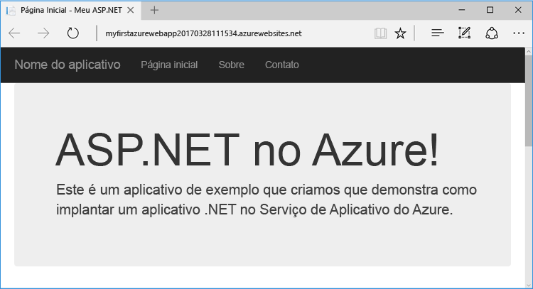

## <a name="prerequisites"></a>Pré-requisitos

Este tutorial demonstra como usar o Visual Studio 2017 para compilar e implantar um aplicativo Web ASP.NET no Azure. Se você ainda não tem o Visual 2017 Studio instalado, poderá baixar e usar o **Visual Studio 2017 Community Edition** [gratuito](https://www.visualstudio.com/downloads/). Verifique se você habilitou o **desenvolvimento do Azure** durante a instalação do Visual Studio.

[!INCLUDE [quickstarts-free-trial-note](../../includes/quickstarts-free-trial-note.md)]

## <a name="create-an-aspnet-web-app"></a>Criar um aplicativo Web ASP .NET

No Visual Studio, crie um projeto com `Ctrl`+`Shift`+`N`.

Na caixa de diálogo **Novo Projeto**, clique em **Visual C# > Web > Aplicativo Web ASP .NET (.NET Framework)**.

Nomeie o aplicativo como **myFirstAzureWebApp** e clique em **OK**.
   
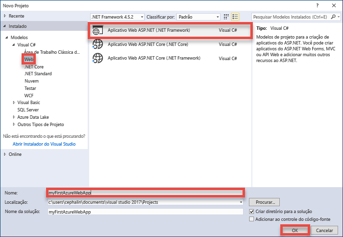

Você pode implantar qualquer tipo de aplicativo Web ASP.NET no Azure. Para este tutorial, selecione o modelo **MVC** e verifique se a autenticação está definida para **Sem Autenticação**.
      
Clique em **OK**.

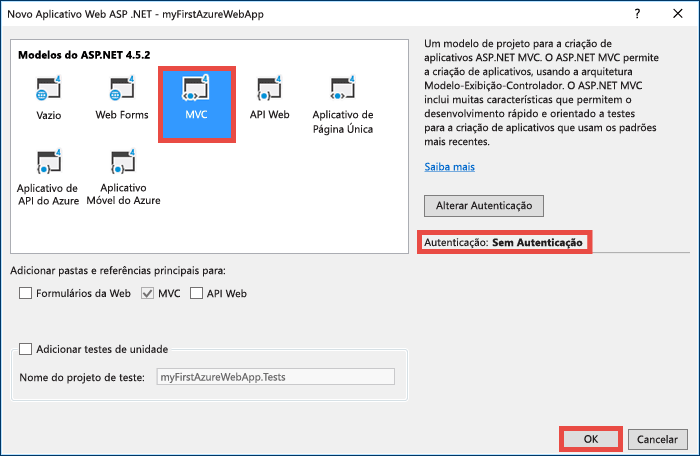

## <a name="publish-to-azure"></a>Publicar no Azure

No **Gerenciador de Soluções**, clique com botão direito no projeto **myFirstAzureWebApp** e selecione **Publicar**.

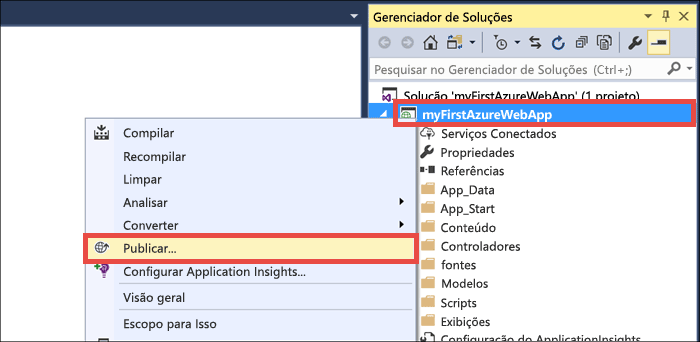

Verifique se o **Serviço de Aplicativo do Microsoft Azure** está selecionado e clique em **Publicar**.

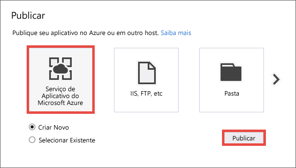

Isso abre a caixa de diálogo **Criar Serviço de Aplicativo**, o que ajuda a criar todos os recursos do Azure necessários executar seu aplicativo Web ASP.NET no Azure.

## <a name="sign-in-to-azure"></a>Entrar no Azure

Na caixa de diálogo **Criar Serviço de Aplicativo**, clique em **Adicionar uma conta**, depois, faça logon em sua assinatura do Azure. Se você já entrou em uma conta da Microsoft, verifique se a conta tem sua assinatura do Azure. Se a conta da Microsoft conectada não tiver sua assinatura do Azure, clique nela para adicionar a conta correta.
   
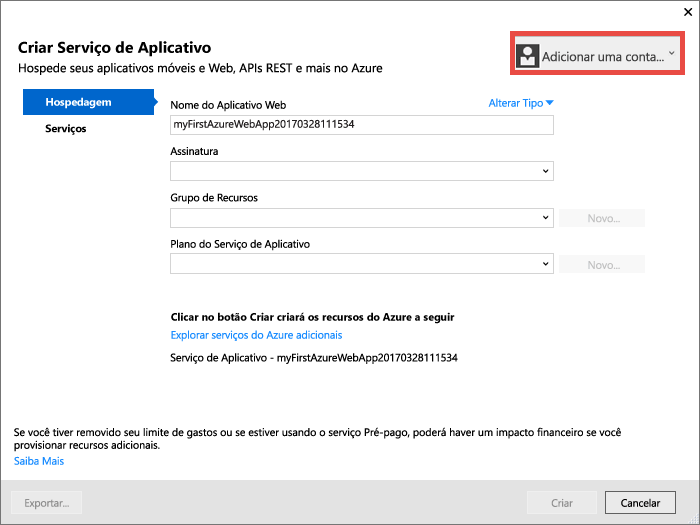

Depois de conectado, você está pronto para criar todos os recursos necessários para seu aplicativo Web do Azure nesta caixa de diálogo.

## <a name="create-a-resource-group"></a>Criar um grupo de recursos

Primeiro, é necessário um _grupo de recursos_. 

> [!NOTE] 
> Um grupo de recursos é um contêiner lógico no qual os recursos do Azure, como aplicativos Web, bancos de dados e contas de armazenamento, são implantados e gerenciados.
>
>

Lado do **Grupo de Recursos**, clique em **Novo**.

Nome seu grupo de recursos como **myResourceGroup** e clique em **OK**.

## <a name="create-an-app-service-plan"></a>Criar um plano de Serviço de Aplicativo

Seu aplicativo Web também precisa de um _plano do Serviço de Aplicativo_. 

> [!NOTE]
> Um plano do Serviço de Aplicativo representa a coleção de recursos físicos usados para hospedar seus aplicativos. Todos os aplicativos atribuídos a um plano do Serviço de Aplicativo compartilham os recursos definidos por ele, permitindo que você economize ao hospedar vários aplicativos. 
>
> Os Planos do Serviço de Aplicativo definem:
>
> - Região (Europa Setentrional, Leste dos EUA, Sudeste Asiático)
> - Tamanha da Instância (Pequena, Média, Grande)
> - Contagem da Escala (uma, duas ou três instâncias etc.) 
> - SKU (Gratuito, Compartilhado, Básico, Standard, Premium)
>
>

Lado do **Plano do Serviço de Aplicativo**, clique em **Novo**. 

Na caixa de diálogo **Configurar Plano do Serviço de Aplicativo**, configure o novo plano do Serviço de Aplicativo com as seguintes definições:

- **Plano do Serviço de Aplicativo**: digite **myAppServicePlan**. 
- **Local**: escolha **Europa Ocidental** ou qualquer outra região desejada.
- **Tamanho**: escolha **Gratuito** ou qualquer outro [tipo de preços](https://azure.microsoft.com/pricing/details/app-service/) desejado.

Clique em **OK**.

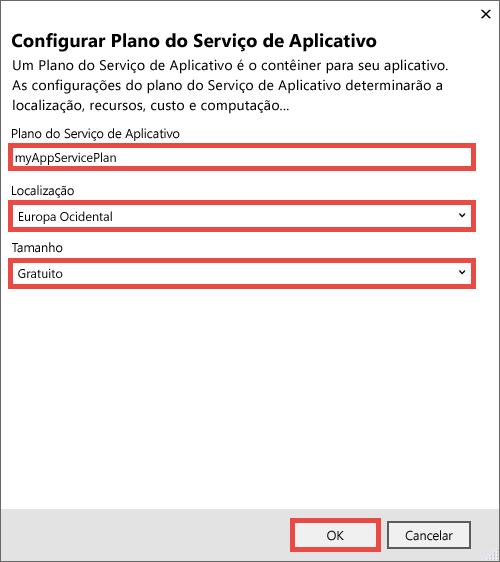

## <a name="create-and-publish-the-web-app"></a>Publicar e publicar o aplicativo Web

A única coisa que resta a fazer é nomear seu aplicativo Web. Em **Nome do Aplicativo Web**, digite um nome exclusivo do aplicativo. Esse nome será usado como parte do nome DNS padrão de seu aplicativo (`<app_name>.azurewebsites.net`), portanto, ele deve ser exclusivo entre todos os aplicativos no Azure. Posteriormente, você poderá mapear um nome de domínio personalizado para seu aplicativo antes de expor para seus usuários.

Também é possível aceitar o nome gerado automaticamente, que já é exclusivo.

Clique em **Criar** para começar a criar os recursos do Azure.

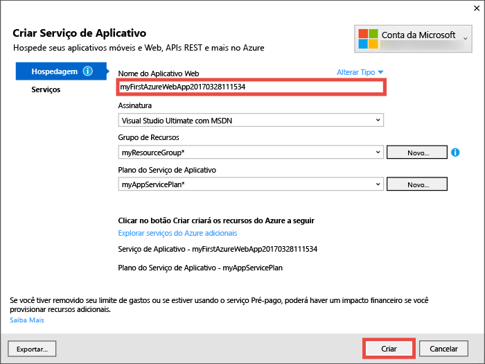

Depois do assistente terminar de criar os recursos do Azure, ele publicará automaticamente seu aplicativo Web ASP.NET para o Azure pela primeira vez e, depois, iniciará o aplicativo Web do Azure publicado no navegador padrão.

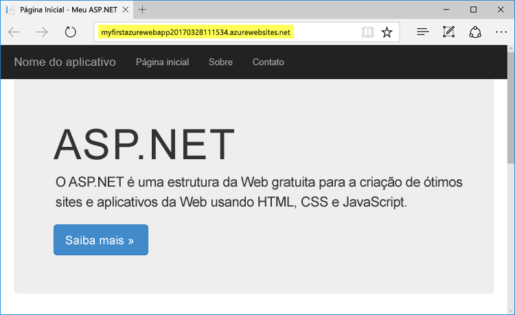

A URL usa o nome do aplicativo Web especificado anteriormente, com o formato `http://<app_name>.azurewebsites.net`. 

Parabéns, seu primeiro aplicativo Web ASP.NET está em execução no Serviço de Aplicativo do Azure.

## <a name="update-the-app-and-redeploy"></a>Atualizar o aplicativo e reimplantar

É muito fácil atualizar e implantar novamente uma atualização para o Azure. Faremos uma atualização para a home page.

No **Gerenciador de Soluções**, abra **Views\Home\Index.cshtml**.

Encontre a marcação HTML `<div class="jumbotron">` próximo à parte superior e substitua a marcação inteira pelo seguinte código:

```HTML
<div class="jumbotron">
    <h1>ASP.NET in Azure!</h1>
    <p class="lead">This is a simple app that we’ve built that demonstrates how to deploy a .NET app to Azure App Service.</p>
</div>
```

Para implantar novamente no Azure, clique com o botão direito do mouse no projeto **myFirstAzureWebApp** no **Gerenciador de Soluções** e selecione **Publicar**.

Na página de publicação, clique em **Publicar**.

Quando o Visual Studio for concluído, ele iniciará o aplicativo Web do Azure atualizado em seu navegador.


## <a name="manage-your-new-azure-web-app"></a>Gerenciar seu novo aplicativo Web do Azure

Vá para o portal do Azure para examinar o aplicativo Web que você acabou de criar. 

Para fazer isso, entre em [https://portal.azure.com](https://portal.azure.com).

No menu à esquerda, clique em **Serviço de Aplicativos** e, em seguida, clique no nome do seu aplicativo Web do Azure.

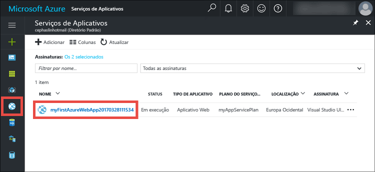

Você foi para a _folha_ de seu aplicativo Web (uma página do portal que abre horizontalmente). 

Por padrão, a folha de seu aplicativo Web mostra a página **Visão Geral**. Esta página fornece uma visão de como está seu aplicativo. Aqui, você também pode executar tarefas básicas de gerenciamento como procurar, parar, iniciar, reiniciar e excluir.  

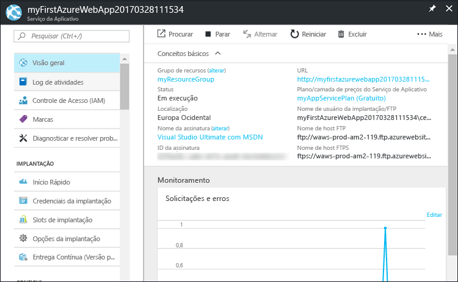

As guias no lado esquerdo da folha mostram as páginas de configuração diferentes que você pode abrir. A lista a seguir fornece algumas possibilidades:

- mapear um nome DNS personalizado
- associar um certificado SSL personalizado
- configurar uma implantação contínua
- Escalar vertical e horizontalmente
- adicionar a autenticação do usuário

## <a name="clean-up-resources"></a>Limpar recursos

Para excluir seu primeiro aplicativo Web do Azure, você pode clicar em **Excluir** na página **Visão Geral**. No entanto, há uma maneira melhor de excluir tudo o que você criou neste início rápido. Na página **Visão Geral** de seu aplicativo Web, clique no grupo de recursos para abrir sua folha. 


Na folha do grupo de recursos, você pode ver o plano do Serviço de Aplicativo e o aplicativo Serviço de Aplicativo que o Visual Studio criou para você. 

Na parte superior da folha, clique em **Excluir**. 

<!---->

Na folha de confirmação, confirme digitando o nome do grupo de recursos **myResourceGroup** na caixa de texto e clique em **Excluir**.

## <a name="next-steps"></a>Próximas etapas

> [!div class="nextstepaction"]
> [Saiba como criar um aplicativo ASP.NET no Azure com Banco de Dados SQL](app-service-web-tutorial-dotnet-sqldatabase.md)

> [!div class="nextstepaction"]
> [Explore os scripts do PowerShell dos aplicativos Web de exemplo](app-service-powershell-samples.md)

