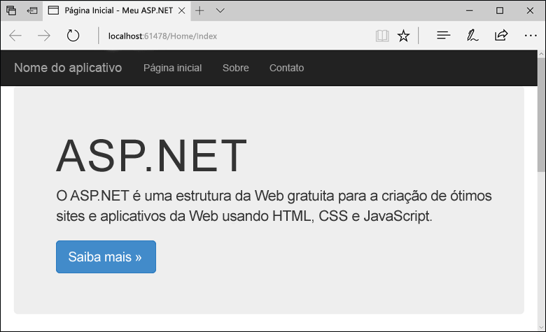

# <a name="create-an-aspnet-web-app-in-azure"></a>Criar um aplicativo Web ASP.NET no Azure

Os [aplicativos Web do Azure](https://docs.microsoft.com/azure/app-service-web/app-service-web-overview) fornecem um serviço de hospedagem na Web altamente escalonável,com aplicação automática de patches.  Este guia de início rápido mostra como implantar seu primeiro aplicativo web ASP.NET em aplicativos Web do Azure. Quando terminar, você terá um grupo de recursos que consiste em um plano do Serviço de Aplicativo e um aplicativo Web do Azure com um aplicativo Web implantado.


## <a name="prerequisites"></a>Pré-requisitos

Para concluir este tutorial:

* Instale o [Visual Studio 2017](https://www.visualstudio.com/en-us/visual-studio-homepage-vs.aspx) com as cargas de trabalho a seguir:
    - **Desenvolvimento Web e do ASP.NET**
    - **Desenvolvimento do Azure**

    

[!INCLUDE [quickstarts-free-trial-note](../../includes/quickstarts-free-trial-note.md)]

## <a name="create-an-aspnet-web-app"></a>Criar um aplicativo Web ASP .NET

No Visual Studio, crie um projeto selecionando **Arquivo > Novo > Projeto**. 

Na caixa de diálogo **Novo Projeto**, clique em **Visual C# > Web > Aplicativo Web ASP.NET (.NET Framework)**.

Nomeie o aplicativo como _myFirstAzureWebApp_ e clique em **OK**.
   


Você pode implantar qualquer tipo de aplicativo Web ASP.NET no Azure. Para este início rapido, selecione o modelo **MVC** e verifique se a autenticação está definida para **Sem Autenticação**.
      
Selecione **OK**.


No menu, selecione **Depurar > Iniciar sem depuração** para executar o aplicativo Web localmente.



## <a name="publish-to-azure"></a>Publicar no Azure

No **Gerenciador de Soluções**, clique com o botão direito do mouse no projeto **myFirstAzureWebApp** e selecione **Publicar**.


Verifique se o **Serviço de Aplicativo do Microsoft Azure** está selecionado e clique em **Publicar**.


Isso abre a caixa de diálogo **Criar Serviço de Aplicativo**, o que ajuda a criar todos os recursos do Azure necessários para executar seu aplicativo Web ASP.NET no Azure.

## <a name="sign-in-to-azure"></a>Entrar no Azure

Na caixa de diálogo **Criar Serviço de Aplicativo**, clique em **Adicionar uma conta** e, em seguida, entre com sua assinatura do Azure. Se você já entrou, certifique-se de que a conta tenha sua assinatura do Azure. Você pode selecionar a conta conectada para adicionar a conta correta.

> [!NOTE]
> Se você já estiver conectado, não selecione **Criar** ainda.
>
>
   


Depois de conectado, você está pronto para criar todos os recursos necessários para um aplicativo Web do Azure nesta caixa de diálogo.

## <a name="create-a-resource-group"></a>Criar um grupo de recursos

[!INCLUDE [resource group intro text](../../includes/resource-group.md)]

Ao lado de **Grupo de recursos**, selecione **Novo**.

Nomeie o grupo de recursos **myResourceGroup** e selecione **Ok**.

## <a name="create-an-app-service-plan"></a>Criar um plano de Serviço de Aplicativo

[!INCLUDE [app-service-plan](../../includes/app-service-plan.md)]

Ao lado de **Plano do Serviço de Aplicativo**, selecione **Novo**. 

Na caixa de diálogo **Configurar Plano do Serviço de Aplicativo**, use as configurações na tabela de acordo com a captura de tela.


| Configuração | Valor sugerido | Descrição |
|-|-|-|
|Plano do Serviço de Aplicativo| myAppServicePlan | O nome do plano do Serviço de Aplicativo. |
| Local | Europa Ocidental | O datacenter onde o aplicativo Web está hospedado. |
| Tamanho | Grátis | O [Tipo de preço](https://azure.microsoft.com/pricing/details/app-service/) determina os recursos de hospedagem. |

Selecione **OK**.

## <a name="create-and-publish-the-web-app"></a>Publicar e publicar o aplicativo Web

Em **Nome do aplicativo Web**, digite um nome exclusivo do aplicativo (os caracteres válidos são `a-z`, `0-9` e `-`). A URL do aplicativo Web é `http://<app_name>.azurewebsites.net`, onde `<app_name>` é o nome do aplicativo Web. 

Você pode aceitar o nome gerado automaticamente, que é exclusivo.

Clique em **Criar** para começar a criar os recursos do Azure.


Depois que o assistente é concluído, ele publica o aplicativo Web ASP.NET no Azure e, em seguida, inicia o aplicativo no navegador padrão.


A URL usa o nome do aplicativo Web especificado anteriormente, com o formato `http://<app_name>.azurewebsites.net`. 

Parabéns, seu primeiro aplicativo Web ASP.NET está em execução no Serviço de Aplicativo do Azure.

## <a name="update-the-app-and-redeploy"></a>Atualizar o aplicativo e reimplantar

No **Gerenciador de Soluções**, abra _Views\Home\Index.cshtml_.

Encontre o rótulo HTML `<div class="jumbotron">` próximo à parte superior e substitua o elemento inteiro pelo seguinte código:

```HTML
<div class="jumbotron">
    <h1>ASP.NET in Azure!</h1>
    <p class="lead">This is a simple app that we’ve built that demonstrates how to deploy a .NET app to Azure App Service.</p>
</div>
```

Para implantar novamente no Azure, clique com o botão direito do mouse no projeto **myFirstAzureWebApp**, no **Gerenciador de Soluções** e selecione **Publicar**.

Na página de publicação, selecione **Publicar**.

Quando a publicação está concluída, o Visual Studio inicia um navegador para a URL do aplicativo Web.


## <a name="manage-the-azure-web-app"></a>Gestão do aplicativo web do Azure

Acesse o <a href="https://portal.azure.com" target="_blank">portal do Azure</a> para gerenciar o aplicativo Web.

No menu à esquerda, selecione **Serviços de Aplicativos** e, em seguida, selecione o nome do seu aplicativo Web do Azure.


A página Visão Geral do seu aplicativo Web é exibida. Aqui você pode executar tarefas básicas de gerenciamento como procurar, parar, iniciar, reiniciar e excluir. 


O menu à esquerda fornece páginas diferentes para configurar seu aplicativo. 

[!INCLUDE [Clean-up section](../../includes/clean-up-section-portal.md)]

## <a name="next-steps"></a>Próximas etapas

> [!div class="nextstepaction"]
> [ASP.NET com o Banco de dados SQL](app-service-web-tutorial-dotnet-sqldatabase.md)

