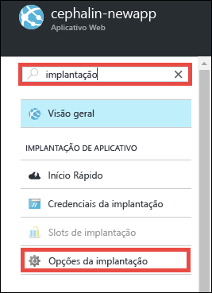
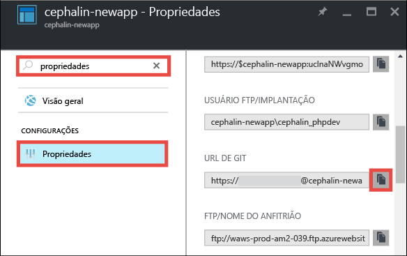

<properties
	pageTitle="Implante seu primeiro aplicativo Web .NET no Azure em cinco minutos | Microsoft Azure"
	description="Saiba como é fácil executar aplicativos Web no Serviço de Aplicativo implantando um aplicativo de exemplo. Inicie o desenvolvimento real rapidamente e veja os resultados imediatamente."
	services="app-service\web"
	documentationCenter=""
	authors="cephalin"
	manager="wpickett"
	editor=""
/>

<tags
	ms.service="app-service-web"
	ms.workload="web"
	ms.tgt_pltfrm="na"
	ms.devlang="na"
	ms.topic="hero-article"
	ms.date="09/16/2016"
	ms.author="cephalin"
/>

# Implante seu primeiro aplicativo Web .NET no Azure em cinco minutos

Este tutorial o ajuda a implantar um aplicativo Web .NET simples para o [Serviço de Aplicativo do Azure](../app-service/app-service-value-prop-what-is.md). Você pode usar o Serviço de Aplicativo para criar aplicativos Web, [back-ends de aplicativos móveis](/documentation/learning-paths/appservice-mobileapps/) e [aplicativos de API](../app-service-api/app-service-api-apps-why-best-platform.md).

Você irá:

- Criar um aplicativo Web no Serviço de Aplicativo do Azure.
- Implantar o exemplo de código ASP.NET.
- Ver seu código em execução na produção.
- Atualize o aplicativo Web da mesma maneira como faria com [confirmações do Git por push](https://git-scm.com/docs/git-push).

## Pré-requisitos

- [Instalar o Git](http://www.git-scm.com/downloads). Verifique se a instalação foi bem-sucedida executando `git --version` de um novo prompt de comando do Windows, de uma janela do PowerShell, do shell do Linux ou de um terminal OS X.
- Obtenha uma conta do Microsoft Azure. Se não tiver uma conta, você poderá [inscrever-se para uma avaliação gratuita](/pricing/free-trial/?WT.mc_id=A261C142F) ou [ativar seus benefícios de assinante do Visual Studio](/pricing/member-offers/msdn-benefits-details/?WT.mc_id=A261C142F).

>[AZURE.NOTE] Você pode [Experimentar o Serviço de Aplicativo](http://go.microsoft.com/fwlink/?LinkId=523751) sem uma conta do Azure. Crie um aplicativo inicial e brinque com ele por até uma hora: não é necessário cartão de crédito ou compromissos.

## Criar um aplicativo Web

1. Entre no [portal do Azure](https://portal.azure.com) com sua conta do Azure.

2. No menu à esquerda, clique em **Novo** > **Web + Móvel** > **Aplicativo Web**.

    

3. Na folha de criação do aplicativo, use as seguintes configurações para o novo aplicativo:

    - **Nome do aplicativo**: digite um nome exclusivo.
    - **Grupo de recursos**: selecione **Criar novo** e dê um nome ao grupo de recursos.
    - **Local/Plano do Serviço de Aplicativo**: clique para configurar e clique em **Criar Novo** para definir o nome, o local e o tipo de preço do Plano do Serviço de Aplicativo. Fique à vontade para usar o tipo de preço **Gratuito**.

    Quando terminar, a folha de criação do aplicativo deve ter esta aparência:

    

3. Clique em **Criar** na parte inferior. Você pode clicar no ícone **Notificação** na parte superior para ver o progresso.

    

4. Quando a implantação for concluída, você verá esta mensagem de notificação. Clique na mensagem para abrir a folha da implantação.

    

5. Na folha **Implantação com êxito**, clique no link **Recurso** para abrir a folha do novo aplicativo Web.

    

## Implantar código no aplicativo Web

Agora, vamos implantar algum código no Azure usando o Git.

5. Na folha do aplicativo Web, role para baixo até as **Opções de implantação** ou procure-as e clique nelas.

    

6. Clique em **Escolher Fonte** > **Repositório Git local** > **OK**.

7. Na folha do aplicativo Web, clique em **Credenciais de implantação**.

8. Configure suas credenciais de implantação e clique em **Salvar**.

7. Na folha do aplicativo Web, role para baixo até as **Propriedades** ou procure-as e clique nelas. Ao lado da **URL do Git**, clique no botão **Copiar**.

    

    Você está pronto para implantar o código com o Git.

1. No terminal de linha de comando, mude para um diretório de trabalho (`CD`) e clone o aplicativo de exemplo desta forma:

        git clone https://github.com/Azure-Samples/app-service-web-dotnet-get-started.git

    

2. Altere para o repositório do aplicativo de exemplo. Por exemplo,

        cd app-service-web-dotnet-get-started

3. Configure o Git remoto para seu aplicativo do Azure com a URL do Git que você copiou do Portal anteriormente.

        git remote add azure <giturlfromportal>

4. Implante o código de exemplo no aplicativo do Azure como você faria com qualquer código com o Git:

        git push azure master

    

    `git push` não apenas coloca um código no Azure, mas também restaura os pacotes necessários e compila os binários do ASP.NET.

É isso! Seu código agora está em execução no Azure. No navegador, vá até http://*&lt;appname>*.azurewebsites.net para vê-lo em ação.

## Fazer atualizações no aplicativo

Agora você pode usar o Git para enviar da raiz do projeto (repositório) a qualquer momento e fazer uma atualização no site ativo. Você faz isso da mesma forma que foi feito ao implantar seu código pela primeira vez. Por exemplo, sempre que você desejar enviar novas alterações que testou localmente, bastará executar os seguintes comandos da raiz do projeto (repositório):

    git add .
    git commit -m "<your_message>"
    git push azure master

## Próximas etapas

Descubra como criar, desenvolver e implantar aplicativos web .NET no Azure diretamente no Visual Studio em [Implantar um aplicativo web ASP.NET para o Serviço de Aplicativo do Azure, usando o Visual Studio](web-sites-dotnet-get-started.md).

Ou faça mais com seu primeiro aplicativo Web. Por exemplo:

- Experimente [outras maneiras de implantar seu código no Azure](../app-service-web/web-sites-deploy.md). Por exemplo, para implantar de um dos repositórios GitHub, basta selecionar **GitHub** em vez de **Repositório Git Local** nas **Opções de implantação**.
- Leve o aplicativo do Azure para o próximo patamar. Autentique seus usuários. Dimensione-o com base na demanda. Configure alguns alertas de desempenho. Tudo isso com apenas alguns cliques. Confira [Adicionar funcionalidade a seu primeiro aplicativo Web](app-service-web-get-started-2.md).

<!----HONumber=AcomDC_0920_2016-->
