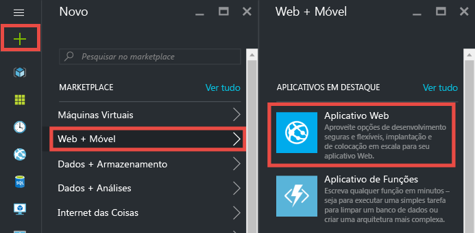
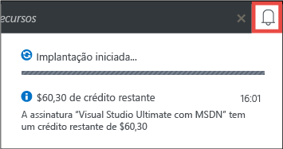
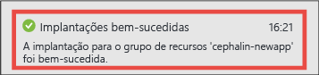
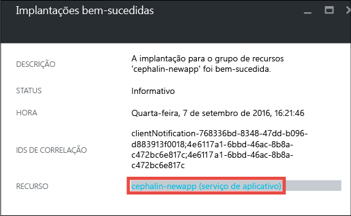
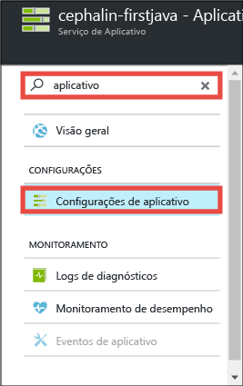
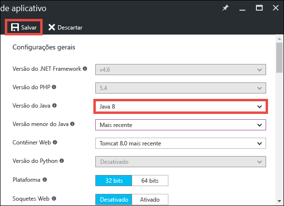
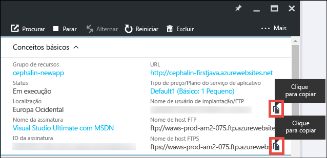
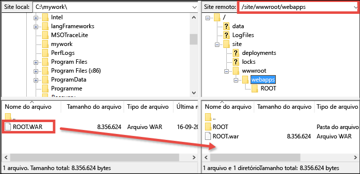

# Implantar seu primeiro aplicativo Web Java no Azure em cinco minutos (CLI 2.0 Preview)

> [!div class="op_single_selector"]
> * [Primeiro site HTML](app-service-web-get-started-html-cli-nodejs.md)
> * [Primeiro aplicativo .NET](app-service-web-get-started-dotnet-cli-nodejs.md)
> * [Primeiro aplicativo PHP](app-service-web-get-started-php-cli-nodejs.md)
> * [Primeiro aplicativo Node.js](app-service-web-get-started-nodejs-cli-nodejs.md)
> * [Primeiro aplicativo Python](app-service-web-get-started-python-cli-nodejs.md)
> * [Primeiro aplicativo Java](app-service-web-get-started-java.md)
> 
> 

Este tutorial o ajuda a implantar um aplicativo Web Java simples para o [Serviço de Aplicativo do Azure](../app-service/app-service-value-prop-what-is.md).
Você pode usar o Serviço de Aplicativo para criar aplicativos Web, [back-ends de aplicativos móveis](/documentation/learning-paths/appservice-mobileapps/) e [aplicativos de API](../app-service-api/app-service-api-apps-why-best-platform.md).

Você irá: 

* Criar um aplicativo Web no Serviço de Aplicativo do Azure.
* Implante um aplicativo Java de exemplo.
* Ver seu código em execução na produção.

## Pré-requisitos
* Obtenha um cliente FTP/FTPS, como [FileZilla](https://filezilla-project.org/).
* Obtenha uma conta do Microsoft Azure. Se não tiver uma conta, você poderá [inscrever-se para uma avaliação gratuita](https://azure.microsoft.com/pricing/free-trial/?WT.mc_id=A261C142F) ou [ativar seus benefícios de assinante do Visual Studio](https://azure.microsoft.com/pricing/member-offers/msdn-benefits-details/?WT.mc_id=A261C142F).

> [!NOTE]
> Você pode [Experimentar o Serviço de Aplicativo](http://go.microsoft.com/fwlink/?LinkId=523751) sem uma conta do Azure. Crie um aplicativo inicial e brinque com ele por até uma hora: não é necessário cartão de crédito ou compromissos.
> 
> 

## Criar um aplicativo Web
1. Entre no [portal do Azure](https://portal.azure.com) com sua conta do Azure.
2. No menu à esquerda, clique em **Novo** > **Web + Móvel** > **Aplicativo Web**.
   
    
3. Na folha de criação do aplicativo, use as seguintes configurações para o novo aplicativo:
   
   * **Nome do aplicativo**: digite um nome exclusivo.
   * **Grupo de recursos**: selecione **Criar novo** e dê um nome ao grupo de recursos.
   * **Local/Plano do Serviço de Aplicativo**: clique para configurar e clique em **Criar Novo** para definir o nome, o local e o tipo de preço do Plano do Serviço de Aplicativo. Fique à vontade para usar o tipo de preço **Gratuito** .
     
     Quando terminar, a folha de criação do aplicativo deve ter esta aparência:
     
     
4. Clique em **Criar** na parte inferior. Você pode clicar no ícone **Notificação** na parte superior para ver o progresso.
   
    
5. Quando a implantação for concluída, você verá esta mensagem de notificação. Clique na mensagem para abrir a folha da implantação.
   
    
6. Na folha **Implantação com êxito**, clique no link **Recurso** para abrir a folha do novo aplicativo Web.
   
    

## Implante um aplicativo Java em seu aplicativo Web
Agora, vamos implantar um aplicativo Java no Azure usando FTPS.

1. Na folha do aplicativo Web, role para baixo até as **Configurações do aplicativo** ou procure-as e clique nelas. 
   
    
2. Em **Versão Java**, selecione **Java 8** e clique em **Salvar**.
   
    
   
    Quando chegar a notificação **Configurações do aplicativo Web atualizadas com êxito**, navegue até http://*&lt;appname>*.azurewebsites.net para ver o servlet do JSP padrão em ação.
3. Na folha do aplicativo Web, role para baixo até as **Credenciais de implantação** ou procure-as e clique nelas.
4. Configure suas credenciais de implantação e clique em **Salvar**.
5. Na folha do aplicativo Web, clique em **Visão geral**. Próximo ao **Nome de usuário FTP/Implantação** e **Nome de host FTPS**, clique no botão **Copiar** para copiar esses valores.
   
    
   
    Você está pronto para implantar seu aplicativo Java com o FTPS.
6. Em seu cliente FTP/FTPS, faça logon no servidor FTP do seu aplicativo web do Azure usando os valores que você copiou na última etapa. Use a senha de implantação que você criou anteriormente.
   
    A captura de tela a seguir mostra o log usando o FileZilla.
   
    
   
    Você pode ver avisos de segurança para o certificado SSL não reconhecido do Azure. Vá em frente e continue.
7. Clique [nesse link](https://github.com/Azure-Samples/app-service-web-java-get-started/raw/master/webapps/ROOT.war) para baixar o arquivo WAR em seu computador local.
8. Em seu cliente FTP/FTPS, navegue até **/site/wwwroot/webapps** no site remoto e arraste o arquivo WAR baixado em seu computador local no diretório remoto.
   
    
   
    Clique em **OK** para substituir o arquivo no Azure.
   
   > [!NOTE]
   > De acordo com o comportamento padrão do Tomcat, o nome de arquivo **ROOT.war** em /site/wwwroot/webapps lhe dá o aplicativo Web raiz (http://*&lt;appname>*.azurewebsites.net) e o nome de arquivo ***&lt;anyname>*.war** fornece um aplicativo Web nomeado (http://*&lt;appname>*.azurewebsites.net/*&lt;anyname>*).
   > 
   > 

É isso! Seu aplicativo Java agora está em execução no Azure. No navegador, vá até http://*&lt;nomedoaplicativo>*.azurewebsites.net para vê-lo em ação. 

## Fazer atualizações no aplicativo
Sempre que você precisar fazer uma atualização, basta carregar o novo arquivo WAR no mesmo diretório remoto com o cliente FTP/FTPS.

## Próximas etapas
[Crie um aplicativo Web Java de um modelo no Azure Marketplace](web-sites-java-get-started.md#marketplace). Você pode obter seu próprio contêiner Tomcat totalmente personalizável e obter interface do usuário do Manager familiar. 

Depure seu aplicativo Web, diretamente no [IntelliJ](app-service-web-debug-java-web-app-in-intellij.md) ou [Eclipse](app-service-web-debug-java-web-app-in-eclipse.md).

Ou faça mais com seu primeiro aplicativo Web. Por exemplo:

* Experimente [outras maneiras de implantar seu código no Azure](web-sites-deploy.md). 
* Leve o aplicativo do Azure para o próximo patamar. Autenticar os usuários. Dimensione-o com base na demanda. Configure alguns alertas de desempenho. Tudo isso com apenas alguns cliques. Confira [Adicionar funcionalidade a seu primeiro aplicativo Web](app-service-web-get-started-2.md).

<!--HONumber=Jan17_HO1-->

