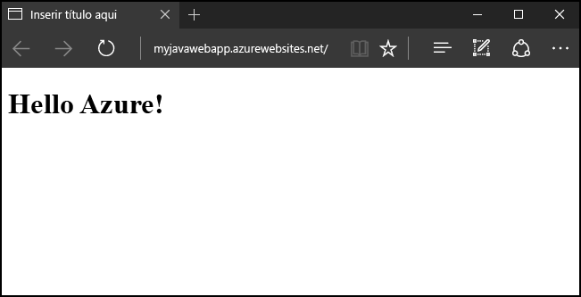
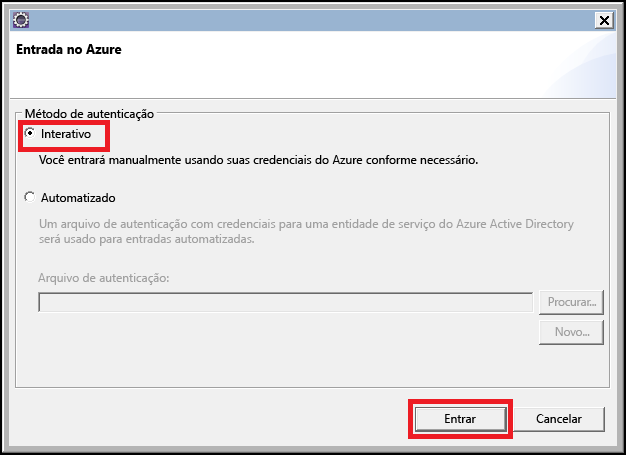
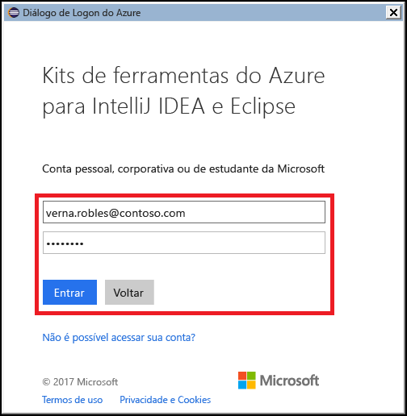
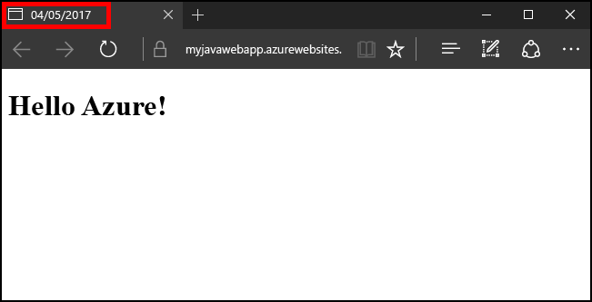

# <a name="create-your-first-java-web-app-in-azure-in-five-minutes"></a>Criar seu primeiro aplicativo Web Java no Azure em cinco minutos

[!INCLUDE [app-service-web-selector-get-started](../../includes/app-service-web-selector-get-started.md)] 

Este Início Rápido ajuda a implantar seu primeiro aplicativo Web Java para [o Serviço de Aplicativo do Azure](../app-service/app-service-value-prop-what-is.md) em apenas alguns minutos. Quando terminar este tutorial, você terá um aplicativo Web simples em Java em execução na nuvem.



## <a name="before-you-begin"></a>Antes de começar

Este tutorial demonstra como usar o IDE do Eclipse para desenvolvedores Java EE para criar e implantar um aplicativo Web Java no Azure. Se ainda não tiver instalado o Eclipse, você poderá baixá-lo gratuitamente de http://www.eclipse.org/.

Para simplificar o processo de publicação de aplicativos Web Java no Azure, as etapas deste tutorial usarão o [Kit de Ferramentas do Azure para Eclipse](/azure/azure-toolkit-for-eclipse). Para obter instruções sobre como instalar o Kit de Ferramentas, confira [Instalação do Kit de Ferramentas do Azure para Eclipse](/azure/azure-toolkit-for-eclipse-installation).

> [!NOTE]
>
> Você também pode usar o [IntelliJ IDEA](https://www.jetbrains.com/idea/) da JetBrains para concluir as etapas deste tutorial. Algumas das etapas podem ser ligeiramente diferentes para esse ambiente de desenvolvimento, embora também haja um [Kit de Ferramentas do Azure para IntelliJ](/azure/azure-toolkit-for-intellij) que você pode usar para simplificar o processo de publicação de IDE.
>

Você também precisará de uma assinatura do Azure para concluir as etapas deste tutorial. Se ainda não tiver uma assinatura do Azure, você poderá ativar os [Benefícios do assinante do MSDN](https://azure.microsoft.com/pricing/member-offers/msdn-benefits-details/) ou inscrever-se para obter uma [conta gratuita do Azure](https://azure.microsoft.com/pricing/free-trial/).

## <a name="create-a-dynamic-web-project-in-eclipse"></a>Criar um projeto Web dinâmico no Eclipse

No IDE do Eclipse, clique em **Arquivo** **Novo** **Projeto Web Dinâmico**.


Quando for exibida a caixa de diálogo do projeto Web dinâmico, nomeie o aplicativo como **MyFirstJavaOnAzureWebApp**e clique em **Concluir**.
   


> [!NOTE]
>
> Se tiver um ambiente de tempo de execução local, como [Apache Tomcat](https://tomcat.apache.org/), instalado, você poderá especificar isso no campo **Tempo de execução de destino**.
>

Depois que o projeto Web dinâmico tiver sido criado, adicione uma nova página JSP expandindo o projeto no Explorador de Projetos, clicando duas vezes na pasta **WebContent**, clicando em **Novo** e em **Arquivo JSP**.


Quando for exibida a caixa de diálogo Novo Arquivo JSP, nomeie o arquivo como **index.jsp**, mantenha a pasta pai como **MyFirstJavaOnAzureWebApp/WebContent**e clique em **Avançar**.


Na segunda página da caixa de diálogo Novo Arquivo JSP, nomeie o arquivo **JSP**, mantenha a pasta pai como **MyFirstJavaOnAzureWebApp/WebContent**e clique em **Concluir**.


Quando a nova página for aberta no Eclipse, substitua a seção `<body></body>` pelo seguinte código:

```jsp
<body>
<h1><% out.println("Java on Azure!"); %></h1>
</body>
```

Salve suas alterações na página.


## <a name="publish-your-web-app-to-azure"></a>Publicar seu aplicativo Web no Azure

Para implantar o aplicativo Web no Azure, você aproveitará vários recursos fornecidos pelo Kit de Ferramentas do Azure para Eclipse.

Para iniciar o processo de publicação, use um dos seguintes métodos:

* Clique com o botão direito do mouse no projeto no **Explorador de Projetos** do Eclipse, clique em **Azure** e em **Publicar como Aplicativo Web do Azure**.

   

* Clique no ícone **Publicar** na barra de ferramentas do Eclipse e depois clique em **Publicar como Aplicativo Web do Azure**.

   

Se ainda não tiver entrado em sua conta do Azure, você será solicitado a entrar. Para fazer isso, execute as seguintes etapas:

1. Há duas opções diferentes para entrar em sua conta do Azure; para este tutorial, escolha **Interativa**.

   

1. Insira suas credenciais do Azure e clique em **Entrar**.

   

1. Escolha as assinaturas do Azure e clique em **Selecionar**.

   

> [!NOTE]
>
> Instruções detalhadas sobre entradas **interativa** e **automatizadas** estão disponíveis no artigo [Instruções de entrada no Azure para o Kit de Ferramentas do Azure para Eclipse](https://go.microsoft.com/fwlink/?linkid=846174).
>

Depois que você entrar em sua conta do Azure, a caixa de diálogo **Implantar Aplicativo Web** será exibida. Você não deverá ver nenhum Serviços de Aplicativos listado se essa for a primeira vez que publica um aplicativo Web no Azure. Se esse for o caso ou se você quiser criar um novo Serviço de Aplicativo, a próxima etapa será criar um novo Serviço de Aplicativo. Para fazer isso, clique em **Criar**.


Quando a caixa de diálogo **Criar Serviço de Aplicativo** for exibida, os dados iniciais que você precisa fornecer serão:

* Um nome exclusivo para o aplicativo Web, que se tornará o endereço DNS do aplicativo Web. Por exemplo: **MyJavaWebApp** será *myjavawebapp.azurewebsites.net*.

* O contêiner da Web usará o aplicativo Web. Por exemplo: **Tomcat 8.5 mais recente**.

* Sua assinatura do Azure.

   

Se você não tiver Planos do Serviço de Aplicativo existentes ou se desejar criar um novo plano de serviço, precisará fornecer as seguintes informações:

* Um nome exclusivo para seu novo plano de serviço. Esse nome aparecerá quando você publicar aplicativos Web no futuro usando o Kit de Ferramentas do Azure e ele será listado no [Portal do Azure](https://portal.azure.com) quando você estiver gerenciando sua conta.

* A localização geográfica onde o plano de serviço será criado.

* O tipo de preços para seu plano de serviço.

   

Em seguida, clique na guia **Grupo de recursos**. Se você não tiver grupos de recursos existentes ou se quiser criar um novo, será necessário fornecer um nome exclusivo para o novo grupo de recursos. Caso contrário, escolha um grupo de recursos existente no menu suspenso.


Por fim, clique na guia **JDK**. Há várias opções listadas que permitem que os desenvolvedores especifiquem JDKs (Kits para Desenvolvedores de Java) personalizados ou de terceiros, mas, para este tutorial, você deve escolher o **Padrão**e clicar em **Criar**.


O Kit de Ferramentas do Azure começará a criar seu novo serviço de aplicativo e exibirá uma caixa de diálogo de progresso durante o processamento.


Quando o novo serviço de aplicativo for criado, a última opção que você precisará escolher é implantar o aplicativo Web na raiz do novo site. Por exemplo, se você tiver um serviço de aplicativo em *wingtiptoys.azurewebsites.net* e não puder implantar na raiz, o aplicativo Web chamado **MyFirstJavaOnAzureWebApp** será implantado em *wingtiptoys.azurewebsites.net/MyFirstJavaOnAzureWebApp*.


Depois de concluir todas as etapas anteriores, clique em **Implantar** para publicar o aplicativo Web no Azure.


Parabéns! Você implantou com sucesso o aplicativo Web no Azure! Agora, você pode visualizar o aplicativo Web no site do Azure:


## <a name="updating-your-web-app"></a>Atualizando seu aplicativo Web

Depois de publicar com êxito o aplicativo Web do Azure, atualizar o aplicativo Web é um processo muito mais simples, e as etapas a seguir orientarão você no processo de publicação de alterações no aplicativo Web.

Primeiro, altere o código de exemplo JSP anterior para que o título seja substituído pela data de hoje:

```jsp
<%@ page
    language="java"
    contentType="text/html; charset=ISO-8859-1"
    pageEncoding="ISO-8859-1"
    import="java.text.SimpleDateFormat"
    import="java.util.Date" %>
<!DOCTYPE html PUBLIC "-//W3C//DTD HTML 4.01 Transitional//EN" "http://www.w3.org/TR/html4/loose.dtd">
<html>
<head>
<meta http-equiv="Content-Type" content="text/html; charset=ISO-8859-1">
<% SimpleDateFormat date = new SimpleDateFormat("yyyy/MM/dd"); %>
<title><% out.println(date.format(new Date())); %></title>
</head>
<body>
<h1><% out.println("Java on Azure!"); %></h1>
</body>
</html>
```


Depois de salvar as alterações na página, clique no projeto no X**Explorador de Projetos** do Eclipse, clique em **Azure**e em **Publicar como Aplicativo Web do Azure**.


Quando a caixa de diálogo **Implantar Aplicativo Web** for exibida, o serviço de aplicativo anterior será listado. Para atualizar o aplicativo Web, basta realçar um serviço de aplicativo e clicar em **Implantar** para publicar as alterações.


> [!NOTE]
>
> Se estiver implantando o aplicativo Web para a raiz do serviço de aplicativo, você precisará marcar novamente **Implantar na raiz** sempre que publicar as alterações.
>

Após publicar as alterações, você observará que o título da página foi alterado para a data de hoje no navegador.



## <a name="deleting-your-web-app"></a>Excluindo seu aplicativo web

Para excluir um aplicativo Web, você pode usar o **Gerenciador do Azure**, que faz parte do Kit de Ferramentas do Azure. Se a exibição **Azure Explorer** ainda estiver não visível no Eclipse, execute as seguintes etapas para exibi-lo:

1. Clique em **Janela**, em **Mostrar Exibição** e em **Outros**.

   

2. Quando a caixa de diálogo **Mostrar Exibição** for exibida, selecione **Azure Explorer** e clique em **OK**.

   

Para excluir o aplicativo Web do Gerenciador do Azure, você precisa expandir o nó **Aplicativos Web**, clicar com o botão direito do mouse no aplicativo Web e selecionar **Excluir**.


Quando for solicitado a excluir o aplicativo Web, clique em **OK**.

## <a name="next-steps"></a>Próximas etapas

Para obter mais informações sobre os kits de ferramentas do Azure para Java IDEs, confira os links a seguir:

* [Kit de ferramentas do Azure para o Eclipse (Este artigo)](../azure-toolkit-for-eclipse.md)
  * [Novidades no Kit de Ferramentas do Azure para o Eclipse](../azure-toolkit-for-eclipse-whats-new.md)
  * [Instalação do Kit de Ferramentas do Azure para o Eclipse](../azure-toolkit-for-eclipse-installation.md)
  * [Instruções de entrada para o Kit de ferramentas do Azure para Eclipse](https://go.microsoft.com/fwlink/?linkid=846174)
* [Kit de Ferramentas do Azure para IntelliJ](../azure-toolkit-for-intellij.md)
  * [Novidades no Kit de Ferramentas do Azure para IntelliJ](../azure-toolkit-for-intellij-whats-new.md)
  * [Instalação do Kit de Ferramentas do Azure para IntelliJ](../azure-toolkit-for-intellij-installation.md)
  * [Instruções de entrada para o Kit de ferramentas do Azure para IntelliJ](https://go.microsoft.com/fwlink/?linkid=846179)

Para saber mais sobre como usar o Azure com Java, confira o [Centro de Desenvolvedores Java do Azure](https://azure.microsoft.com/develop/java/) e as [Ferramentas Java para Visual Studio Team Services](https://java.visualstudio.com/).

