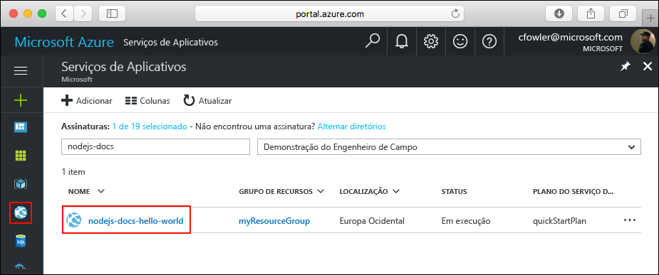

# <a name="create-a-python-web-app-in-azure"></a>Criar um aplicativo Web do Python no Azure

Os [aplicativos Web do Azure](https://docs.microsoft.com/azure/app-service-web/app-service-web-overview) fornecem um serviço de hospedagem na Web altamente escalonável,com aplicação automática de patches.  Este início rápido orienta como desenvolver e implantar um aplicativo Python nos Aplicativos Web do Azure. Crie o aplicativo Web usando a [CLI do Azure](https://docs.microsoft.com/cli/azure/get-started-with-azure-cli) e use o Git para implantar o código Python de exemplo para o aplicativo Web.


Você pode seguir as etapas abaixo usando um computador Mac, Windows ou Linux. A conclusão das etapas demora cerca de cinco minutos assim que os pré-requisitos são instalados.
## <a name="prerequisites"></a>Pré-requisitos

Para concluir este tutorial:

1. [Instalar o Git](https://git-scm.com/)
1. [Instalar o Python](https://www.python.org/downloads/)

[!INCLUDE [quickstarts-free-trial-note](../../includes/quickstarts-free-trial-note.md)]

[!INCLUDE [cloud-shell-try-it.md](../../includes/cloud-shell-try-it.md)]

Se você optar por instalar e usar a CLI localmente, este tópico exigirá que você esteja executando a CLI do Azure versão 2.0 ou posterior. Execute `az --version` para encontrar a versão. Se você precisa instalar ou atualizar, consulte [Instalar a CLI 2.0 do Azure]( /cli/azure/install-azure-cli). 

## <a name="download-the-sample"></a>Baixar o exemplo

Em uma janela de terminal, execute o comando a seguir para clonar o repositório de aplicativo de exemplo para o computador local.

```bash
git clone https://github.com/Azure-Samples/python-docs-hello-world
```

Você pode usar essa janela de terminal para executar todos os comandos neste guia de início rápido.

Altere para o diretório que contém o código de exemplo.

```bash
cd Python-docs-hello-world
```

## <a name="run-the-app-locally"></a>Executar o aplicativo localmente

Instale os pacotes necessários usando `pip`.

```bash
pip install -r requirements.txt
```

Execute o aplicativo localmente abrindo uma janela do terminal e usando a linha de comando `Python` do exemplo para iniciar o servidor interno da Web Python.

```bash
python main.py
```

Abra um navegador da Web e navegue até o aplicativo de exemplo em http://localhost:5000.

Você poderá ver a mensagem **Hello World** no aplicativo de exemplo exibido na página.


Na janela do terminal, pressione **Ctrl+C** para sair do servidor Web.

[!INCLUDE [Log in to Azure](../../includes/login-to-azure.md)] 

[!INCLUDE [Configure deployment user](../../includes/configure-deployment-user.md)] 

[!INCLUDE [Create resource group](../../includes/app-service-web-create-resource-group.md)] 

[!INCLUDE [Create app service plan](../../includes/app-service-web-create-app-service-plan.md)] 

[!INCLUDE [Create web app](../../includes/app-service-web-create-web-app.md)] 


Você criou um novo aplicativo Web vazio no Azure.

## <a name="configure-to-use-python"></a>Configurar para usar o Python

Use o comando [az webapp config set](/cli/azure/webapp/config#set) para configurar o uso da versão do Python `3.4` pelo aplicativo Web.

```azurecli-interactive
az webapp config set --python-version 3.4 --name <app_name> --resource-group myResourceGroup
```


A definição da versão do Python dessa maneira usa um contêiner padrão fornecido pela plataforma. Para usar seu próprio contêiner, veja a referência de CLI para o comando [az webapp config container set](/cli/azure/webapp/config/container#set).

[!INCLUDE [Configure local git](../../includes/app-service-web-configure-local-git.md)] 

[!INCLUDE [Push to Azure](../../includes/app-service-web-git-push-to-azure.md)] 

```bash
Counting objects: 18, done.
Delta compression using up to 4 threads.
Compressing objects: 100% (16/16), done.
Writing objects: 100% (18/18), 4.31 KiB | 0 bytes/s, done.
Total 18 (delta 4), reused 0 (delta 0)
remote: Updating branch 'master'.
remote: Updating submodules.
remote: Preparing deployment for commit id '44e74fe7dd'.
remote: Generating deployment script.
remote: Generating deployment script for python Web Site
remote: Generated deployment script files
remote: Running deployment command...
remote: Handling python deployment.
remote: KuduSync.NET from: 'D:\home\site\repository' to: 'D:\home\site\wwwroot'
remote: Deleting file: 'hostingstart.html'
remote: Copying file: '.gitignore'
remote: Copying file: 'LICENSE'
remote: Copying file: 'main.py'
remote: Copying file: 'README.md'
remote: Copying file: 'requirements.txt'
remote: Copying file: 'virtualenv_proxy.py'
remote: Copying file: 'web.2.7.config'
remote: Copying file: 'web.3.4.config'
remote: Detected requirements.txt.  You can skip Python specific steps with a .skipPythonDeployment file.
remote: Detecting Python runtime from site configuration
remote: Detected python-3.4
remote: Creating python-3.4 virtual environment.
remote: .................................
remote: Pip install requirements.
remote: Successfully installed Flask click itsdangerous Jinja2 Werkzeug MarkupSafe
remote: Cleaning up...
remote: .
remote: Overwriting web.config with web.3.4.config
remote:         1 file(s) copied.
remote: Finished successfully.
remote: Running post deployment command(s)...
remote: Deployment successful.
To https://<app_name>.scm.azurewebsites.net/<app_name>.git
 * [new branch]      master -> master
```

## <a name="browse-to-the-app"></a>Navegar até o aplicativo

Navegue até o aplicativo implantado usando o navegador da Web.

```bash
http://<app_name>.azurewebsites.net
```

O código de exemplo em Python está em execução em um aplicativo Web do Serviço de Aplicativo do Azure.


**Parabéns!** Você implantou seu primeiro aplicativo Python no Serviço de Aplicativo.

## <a name="update-and-redeploy-the-code"></a>Atualizar e reimplantar o código

Usando um editor de texto local, abra o arquivo `main.py` no aplicativo do Python e faça uma pequena alteração no texto próximo à instrução `return`:

```python
return 'Hello, Azure!'
```

Confirme suas alterações no Git e, em seguida, envie as alterações de código por push para o Azure.

```bash
git commit -am "updated output"
git push azure master
```

Depois que a implantação for concluída, troque para a janela do navegador aberta na etapa [Navegar até o aplicativo](#browse-to-the-app) e atualize a página.


## <a name="manage-your-new-azure-web-app"></a>Gerenciar seu novo aplicativo Web do Azure

Vá para o <a href="https://portal.azure.com" target="_blank">portal do Azure</a> para gerenciar o aplicativo Web que você criou.

No menu à esquerda, clique em **Serviços de Aplicativos** e então clique no nome do seu aplicativo Web do Azure.



A página Visão Geral do seu aplicativo Web é exibida. Aqui você pode executar tarefas básicas de gerenciamento como procurar, parar, iniciar, reiniciar e excluir. 


O menu à esquerda fornece páginas diferentes para configurar seu aplicativo. 

[!INCLUDE [cli-samples-clean-up](../../includes/cli-samples-clean-up.md)]

## <a name="next-steps"></a>Próximas etapas

> [!div class="nextstepaction"]
> [Python com PostgreSQL](app-service-web-tutorial-docker-python-postgresql-app.md)

