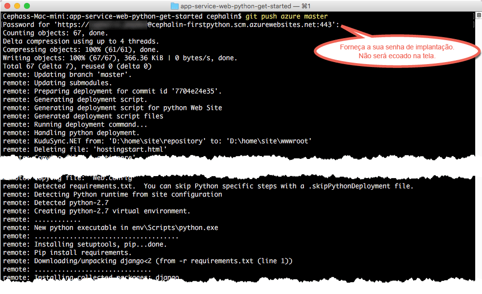

# Implante seu primeiro aplicativo Web Python no Azure em cinco minutos
Este tutorial o ajuda a implantar seu primeiro aplicativo Web Python para o [Serviço de Aplicativo do Azure](../app-service/app-service-value-prop-what-is.md).
Você pode usar o Serviço de Aplicativo para criar aplicativos Web, [back-ends de aplicativos móveis](/documentation/learning-paths/appservice-mobileapps/) e [aplicativos de API](../app-service-api/app-service-api-apps-why-best-platform.md).

Você irá: 

* Criar um aplicativo Web no Serviço de Aplicativo do Azure.
* Implantar código Python de exemplo.
* Ver seu código em execução na produção.
* Atualize o aplicativo Web da mesma maneira como faria com [confirmações do Git por push](https://git-scm.com/docs/git-push).

## Pré-requisitos
* [Git](http://www.git-scm.com/downloads).
* [CLI do Azure](../xplat-cli-install.md).
* Uma conta do Microsoft Azure. Se não tiver uma conta, você poderá [inscrever-se para uma avaliação gratuita](/pricing/free-trial/?WT.mc_id=A261C142F) ou [ativar seus benefícios de assinante do Visual Studio](/pricing/member-offers/msdn-benefits-details/?WT.mc_id=A261C142F).

> [!NOTE]
> Você pode [Experimentar o Serviço de Aplicativo](http://go.microsoft.com/fwlink/?LinkId=523751) sem uma conta do Azure. Crie um aplicativo inicial e brinque com ele por até uma hora: não é necessário cartão de crédito ou compromissos.
> 
> 

## Implantar um aplicativo Web Python
1. Abra um novo prompt de comando do Windows, janela do PowerShell, shell do Linux ou terminal do OS X. Execute `git --version` e `azure --version` para verificar se o Git e a CLI do Azure estão instalados em seu computador.
   
    
   
    Se ainda não tiver instalado as ferramentas, confira [Pré-requisitos](#Prerequisites) para obter links de download.
2. Faça logon no Azure da seguinte forma:
   
        azure login
   
    Siga a mensagem de ajuda para continuar o processo de logon.
   
    
3. Altere a CLI do Azure para o modo ASM e defina o usuário de implantação para o Serviço de Aplicativo. Mais tarde, você implantará o código usando as credenciais.
   
        azure config mode asm
        azure site deployment user set --username <username> --pass <password>
4. Altere para um diretório de trabalho (`CD`) e clone o aplicativo de exemplo desta forma:
   
        git clone https://github.com/Azure-Samples/app-service-web-python-get-started.git
5. Altere para o repositório do aplicativo de exemplo. Por exemplo:
   
        cd app-service-web-python-get-started
6. Crie o recurso de aplicativo do Serviço de Aplicativo no Azure com um nome exclusivo de aplicativo e o usuário de implantação que você configurou anteriormente. Quando solicitado, especifique o número da região desejada.
   
        azure site create <app_name> --git --gitusername <username>
   
    
   
    Seu aplicativo está criado no Azure. Além disso, seu diretório atual é inicializado no Git e conectado ao novo aplicativo do Serviço de Aplicativo como um remoto do Git.
    Você pode navegar até a URL do aplicativo (http://&lt;nome_aplicativo>.azurewebsites.net) para ver a bela página HTML padrão, mas agora vamos incluir seu código lá.
7. Implante o código de exemplo no aplicativo do Azure como você faria com qualquer código do Git. Quando solicitado, use a senha configurada anteriormente.
   
        git push azure master
   
    
   
    O `git push` não apenas coloca o código no Azure, mas também dispara as tarefas de implantação no mecanismo de implantação. 
    Se você tiver arquivos requirements.txt (Python) na raiz do projeto (repositório), o script de implantação restaurará os pacotes necessários para você. 

Parabéns, você implantou seu aplicativo no Serviço de Aplicativo do Azure.

## Ver o aplicativo em execução
Para ver seu aplicativo em execução no Azure, execute este comando em qualquer pasta no repositório:

    azure site browse

## Fazer atualizações no aplicativo
Agora você pode usar o Git para enviar da raiz do projeto (repositório) a qualquer momento e fazer uma atualização no site ativo. Você faz isso da mesma forma que foi feito ao implantar o aplicativo no Azure pela primeira vez. Por exemplo, sempre que você desejar enviar novas alterações que testou localmente, bastará executar os seguintes comandos da raiz do projeto (repositório):

    git add .
    git commit -m "<your_message>"
    git push azure master

## Próximas etapas
[Criar, configurar e implantar um aplicativo Web Django no Azure no Visual Studio](web-sites-python-ptvs-django-mysql.md). Seguindo este tutorial, você aprenderá as habilidades básicas necessárias para executar um aplicativo Web Python no Azure, incluindo:

* Criar e implantar um aplicativo Python usando um modelo.
* Definir versão do Python.
* Criar ambientes virtuais.
* Conectar a um banco de dados.

Ou faça mais com seu primeiro aplicativo Web. Por exemplo:

* Experimente [outras maneiras de implantar seu código no Azure](web-sites-deploy.md). Por exemplo, para implantar de um dos repositórios GitHub, basta selecionar **GitHub** em vez de **Repositório Git Local** nas **Opções de implantação**.
* Leve o aplicativo do Azure para o próximo patamar. Autenticar os usuários. Dimensione-o com base na demanda. Configure alguns alertas de desempenho. Tudo isso com apenas alguns cliques. Confira [Adicionar funcionalidade a seu primeiro aplicativo Web](app-service-web-get-started-2.md).

<!--HONumber=Nov16_HO2-->

