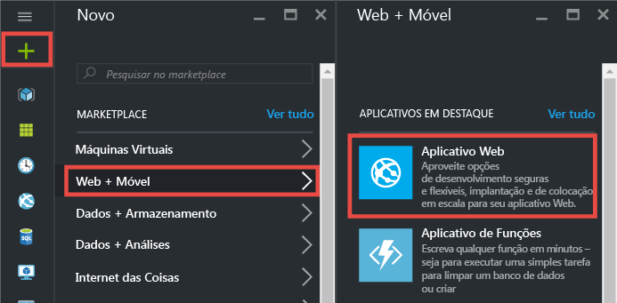
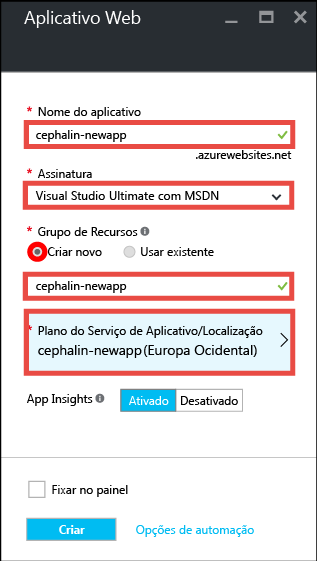
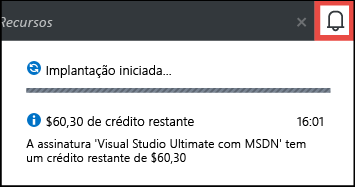
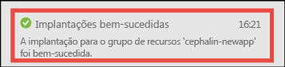
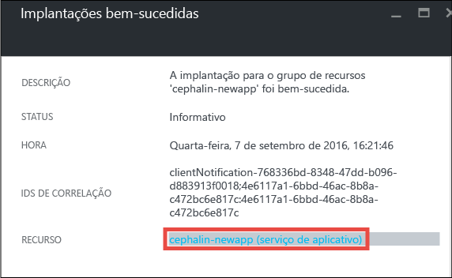
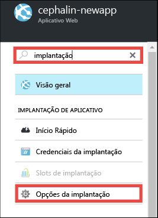
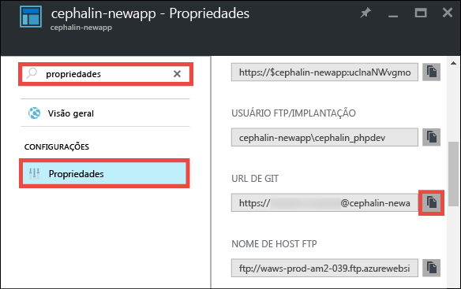
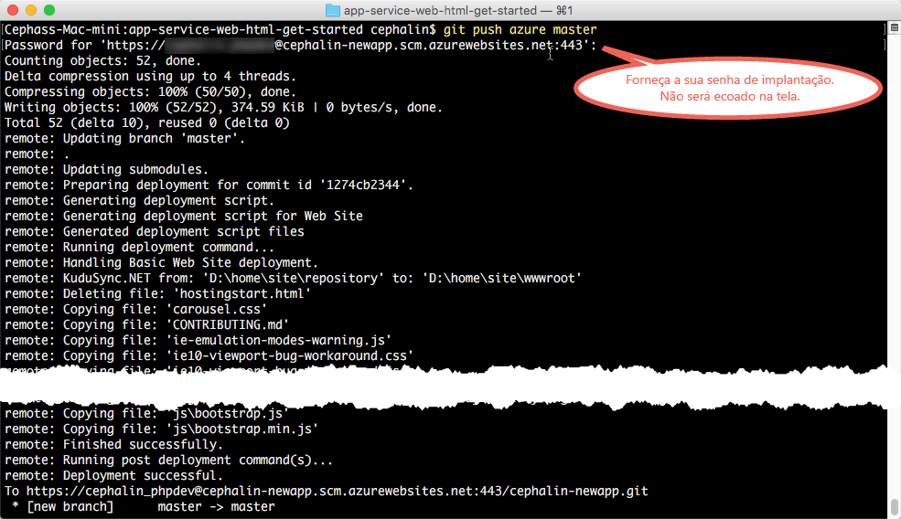

# Implante seu primeiro aplicativo Web no Azure em cinco minutos
Esse tutorial o ajuda a implantar seu primeiro aplicativo Web para o [Serviço de Aplicativo do Azure](../app-service/app-service-value-prop-what-is.md).
Você pode usar o Serviço de Aplicativo para criar aplicativos Web, [back-ends de aplicativos móveis](/documentation/learning-paths/appservice-mobileapps/) e [aplicativos de API](../app-service-api/app-service-api-apps-why-best-platform.md).

Você irá: 

* Criar um aplicativo Web no Serviço de Aplicativo do Azure.
* Implantar um código de exemplo (escolha entre ASP.NET, PHP, Node.js, Java ou Python).
* Veja seu código em execução na produção.
* Atualize o aplicativo Web da mesma maneira como faria com [confirmações do Git por push](https://git-scm.com/docs/git-push).

## Pré-requisitos
> [!INCLUDE [app-service-linux](../../includes/app-service-linux.md)]
> 
> 

* [Instalar o Git](http://www.git-scm.com/downloads). Verifique se a instalação foi bem-sucedida executando `git --version` de um novo prompt de comando do Windows, de uma janela do PowerShell, do shell do Linux ou de um terminal OS X.
* Obtenha uma conta do Microsoft Azure. Se não tiver uma conta, você poderá [inscrever-se para uma avaliação gratuita](/pricing/free-trial/?WT.mc_id=A261C142F) ou [ativar seus benefícios de assinante do Visual Studio](/pricing/member-offers/msdn-benefits-details/?WT.mc_id=A261C142F).

> [!NOTE]
> Você pode [Experimentar o Serviço de Aplicativo](http://go.microsoft.com/fwlink/?LinkId=523751) sem uma conta do Azure. Crie um aplicativo inicial e brinque com ele por até uma hora: não é necessário cartão de crédito ou compromissos.
> 
> 

## Criar um aplicativo Web
1. Entre no [portal do Azure](https://portal.azure.com) com sua conta do Azure.
2. No menu à esquerda, clique em **Novo** > **Web + Móvel** > **Aplicativo Web**.
   
    
3. Na folha de criação do aplicativo, use as seguintes configurações para o novo aplicativo:
   
   * **Nome do aplicativo**: digite um nome exclusivo.
   * **Grupo de recursos**: selecione **Criar novo** e dê um nome ao grupo de recursos.
   * **Local/Plano do Serviço de Aplicativo**: clique para configurar e clique em **Criar Novo** para definir o nome, o local e o tipo de preço do Plano do Serviço de Aplicativo. Fique à vontade para usar o tipo de preço **Gratuito** .
     
     Quando terminar, a folha de criação do aplicativo deve ter esta aparência:
     
     
4. Clique em **Criar** na parte inferior. Você pode clicar no ícone **Notificação** na parte superior para ver o progresso.
   
    
5. Quando a implantação for concluída, você verá esta mensagem de notificação. Clique na mensagem para abrir a folha da implantação.
   
    
6. Na folha **Implantação com êxito**, clique no link **Recurso** para abrir a folha do novo aplicativo Web.
   
    

## Implantar código no aplicativo Web
Agora, vamos implantar algum código no Azure usando o Git.

1. Na folha do aplicativo Web, role para baixo até as **Opções de implantação** ou procure-as e clique nelas. 
   
    
2. Clique em **Escolher Fonte** > **Repositório Git Local** > **OK**.
3. Na folha do aplicativo Web, clique em **Credenciais de implantação**.
4. Configure suas credenciais de implantação e clique em **Salvar**.
5. Na folha do aplicativo Web, role para baixo até as **Propriedades** ou procure-as e clique nelas. Ao lado da **URL do Git**, clique no botão **Copiar**.
   
    
   
    Você está pronto para implantar o código com o Git.
6. No terminal de linha de comando, mude para um diretório de trabalho (`CD`) e clone o aplicativo de exemplo desta forma:
   
        git clone <github_sample_url>
   
    
   
    Para *&lt;url_exemplo_github>*, use uma das seguintes URLs, dependendo da estrutura de sua preferência:
   
   * HTML+CSS+JS: [https://github.com/Azure-Samples/app-service-web-html-get-started.git](https://github.com/Azure-Samples/app-service-web-html-get-started.git)
   * ASP.NET: [https://github.com/Azure-Samples/app-service-web-dotnet-get-started.git](https://github.com/Azure-Samples/app-service-web-dotnet-get-started.git)
   * PHP (CodeIgniter): [https://github.com/Azure-Samples/app-service-web-php-get-started.git](https://github.com/Azure-Samples/app-service-web-php-get-started.git)
   * Node.js (Express): [https://github.com/Azure-Samples/app-service-web-nodejs-get-started.git](https://github.com/Azure-Samples/app-service-web-nodejs-get-started.git)
   * Java: [https://github.com/Azure-Samples/app-service-web-java-get-started.git](https://github.com/Azure-Samples/app-service-web-java-get-started.git)
   * Python (Django): [https://github.com/Azure-Samples/app-service-web-python-get-started.git](https://github.com/Azure-Samples/app-service-web-python-get-started.git)
7. Altere para o repositório do aplicativo de exemplo. Por exemplo, 
   
        cd app-service-web-html-get-started
8. Configure o Git remoto para seu aplicativo do Azure com a URL do Git que você copiou do Portal anteriormente.
   
        git remote add azure <giturlfromportal>
9. Implante o código de exemplo no aplicativo do Azure como você faria com qualquer código com o Git:
   
        git push azure master
   
        
   
    Se usar uma das estruturas de linguagem, você verá uma saída diferente. Isso ocorre porque o `git push` não só coloca o código no Azure, mas também dispara tarefas de implantação no mecanismo de implantação. Se houver um arquivo package.json (Node.js) ou requirements.txt (Python) na raiz do projeto (repositório) ou um arquivo packages.config no projeto ASP.NET, o script de implantação restaurará os pacotes necessários para você. Você também pode [habilitar a extensão do Composer](web-sites-php-mysql-deploy-use-git.md#composer) para processar automaticamente arquivos composer.json no aplicativo PHP.

É isso! Seu código agora está em execução no Azure. No navegador, vá até http://*&lt;nomedoaplicativo>*.azurewebsites.net para vê-lo em ação. 

## Fazer atualizações no aplicativo
Agora você pode usar o Git para enviar da raiz do projeto (repositório) a qualquer momento e fazer uma atualização no site ativo. Você faz isso da mesma forma que foi feito ao implantar o aplicativo no Azure pela primeira vez. Por exemplo, sempre que você desejar enviar novas alterações que testou localmente, bastará executar os seguintes comandos da raiz do projeto (repositório):

    git add .
    git commit -m "<your_message>"
    git push azure master

## Próximas etapas
Encontre as etapas preferidas de desenvolvimento e implantação para sua estrutura de linguagem:

> [!div class="op_single_selector"]
> * [.NET](web-sites-dotnet-get-started.md)
> * [PHP](app-service-web-php-get-started.md)
> * [Node.js](app-service-web-nodejs-get-started.md)
> * [Python](web-sites-python-ptvs-django-mysql.md)
> * [Java](web-sites-java-get-started.md)
> 
> 

Ou faça mais com seu primeiro aplicativo Web. Por exemplo:

* Experimente [outras maneiras de implantar seu código no Azure](web-sites-deploy.md). Por exemplo, para implantar de um dos repositórios GitHub, basta selecionar **GitHub** em vez de **Repositório Git Local** nas **Opções de implantação**.
* Leve o aplicativo do Azure para o próximo patamar. Autenticar os usuários. Dimensione-o com base na demanda. Configure alguns alertas de desempenho. Tudo isso com apenas alguns cliques. Confira [Adicionar funcionalidade a seu primeiro aplicativo Web](app-service-web-get-started-2.md).

<!--HONumber=Oct16_HO2-->

