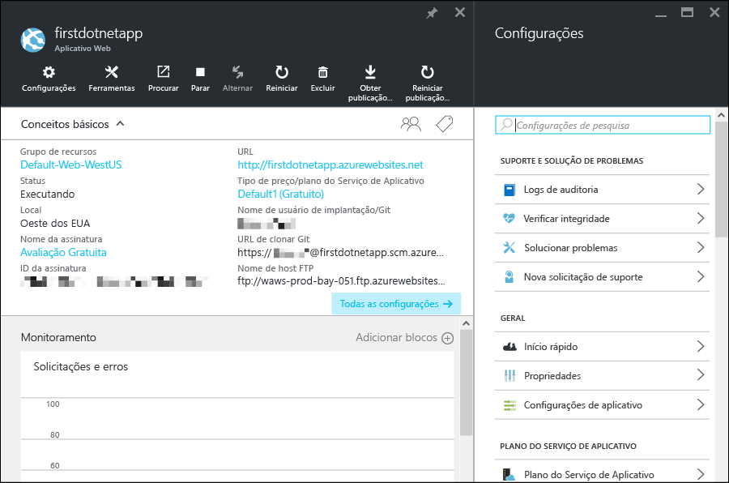

<properties 
	pageTitle="Introdução a aplicativos Web no Serviço de Aplicativo do Azure" 
	description="Veja como é fácil executar o aplicativo Web ao vivo no Serviço de Aplicativo. Inicie o desenvolvimento real em cinco minutos e veja os resultados imediatamente." 
	services="app-service\web"
	documentationCenter=""
	authors="cephalin" 
	manager="wpickett" 
	editor="" 
/>

<tags 
	ms.service="app-service-web" 
	ms.workload="web" 
	ms.tgt_pltfrm="na" 
	ms.devlang="na" 
	ms.topic="hero-article"
	ms.date="03/17/2016" 
	ms.author="cephalin"
/>
	
# Introdução a aplicativos Web no Serviço de Aplicativo do Azure

Este tutorial o ajudará a começar a trabalhar rapidamente com a implantação de aplicativos Web para o [Serviço de Aplicativo do Azure](../app-service/app-service-value-prop-what-is.md). Com pouca ação de sua parte, você vai:

- Implantar um aplicativo Web de exemplo (escolha entre ASP.NET, PHP, Node.js, Java ou Python).
- Ver o aplicativo em execução em segundos.
- Atualizar o aplicativo Web da mesma maneira como faria com confirmações do [Git](http://www.git-scm.com/).

Você também vai conferir o [portal do Azure](https://portal.azure.com) e examinar os recursos disponíveis nele.

## Pré-requisitos

Para concluir este tutorial, você precisará:

- Git. Você pode baixar o binário de instalação [aqui](http://www.git-scm.com/downloads). Você deve ser capaz de executar `git --version` do terminal de linha de comando de sua escolha. 
- Conhecimento básico do Git.
- CLI do Azure. As instruções de instalação estão [aqui](../xplat-cli-install.md). Você deve ser capaz de executar `azure --version` do terminal de linha de comando de sua escolha.
- Uma conta do Microsoft Azure. Se não tiver uma conta, você poderá [inscrever-se para uma avaliação gratuita](/pricing/free-trial/?WT.mc_id=A261C142F) ou [ativar seus benefícios de assinante do Visual Studio](/pricing/member-offers/msdn-benefits-details/?WT.mc_id=A261C142F).

>[AZURE.NOTE] Para ver o Serviço de Aplicativo do Azure em ação antes de se inscrever para uma conta do Azure, vá para [Experimentar o Serviço de Aplicativo](http://go.microsoft.com/fwlink/?LinkId=523751). Lá, você poderá criar imediatamente um aplicativo de curta duração inicial no Serviço de Aplicativo — sem exigência de cartão de crédito e sem compromissos.

## Implantar um aplicativo Web

Vamos implantar um aplicativo Web no Serviço de Aplicativo do Azure.

1. Abra um novo prompt de comando do Windows, shell do Linux ou terminal do OS X, `CD` em um diretório de trabalho e clone o aplicativo de exemplo desta forma:

        git clone <github_sample_url>

    Para *&lt;github\_sample\_url>*, use uma das seguintes URLs, dependendo da estrutura de sua preferência:

    - ASP.NET: [https://github.com/Azure-Samples/app-service-web-dotnet-get-started.git](https://github.com/Azure-Samples/app-service-web-dotnet-get-started.git)
    - PHP (CodeIgniter): [https://github.com/Azure-Samples/app-service-web-php-get-started.git](https://github.com/Azure-Samples/app-service-web-php-get-started.git)
    - Node.js (Express): [https://github.com/Azure-Samples/app-service-web-nodejs-get-started.git](https://github.com/Azure-Samples/app-service-web-nodejs-get-started.git) 
    - Java: [https://github.com/Azure-Samples/app-service-web-java-get-started.git](https://github.com/Azure-Samples/app-service-web-java-get-started.git)
    - Python (Django): [https://github.com/Azure-Samples/app-service-web-python-get-started.git](https://github.com/Azure-Samples/app-service-web-python-get-started.git)

2. `CD` no diretório raiz do seu aplicativo de exemplo. Por exemplo,

        cd app-service-web-dotnet-get-started

3. Faça logon no Azure da seguinte forma:

        azure login
    
    Siga o prompt para continuar o logon em um navegador com uma conta da Microsoft que tenha sua assinatura do Azure.

4. Crie o recurso de aplicativo do Serviço de Aplicativo no Azure com um nome de aplicativo exclusivo com o próximo comando. A URL do aplicativo Web será http://&lt;app_name>.azurewebsites.net.

        azure site create --git <app_name> 
      
    >[AZURE.NOTE] Se nunca tiver configurado credenciais de implantação para sua assinatura do Azure, você será solicitado a criá-las. Essas credenciais, não as credenciais de sua conta do Azure, são usadas pelo Serviço de Aplicativo somente para implantações do Git e logons de FTP.
    
    O aplicativo é criado no Azure agora, e o diretório atual também é inicializado no Git e conectado ao novo aplicativo do Serviço de Aplicativo como um remoto do Git. Você pode navegar para a URL do aplicativo para ver a bela página HTML padrão, mas vamos incluir seu próprio código lá agora.

4. Implante o código de exemplo no novo aplicativo do Serviço de Aplicativo, como você faria com qualquer código com o Git:

        git push azure master 
    
    >[AZURE.NOTE] Você será solicitado a fornecer a senha de implantação. Se for iniciante no Serviço de Aplicativo, forneça a senha de implantação que você acabou de criar, e pronto.
    
    `git push` não apenas coloca o código no Azure, mas também dispara as tarefas de implantação no mecanismo de implantação. Se houver um arquivo package.json (Node.js) ou requirements.txt (Python) na raiz do projeto (repositório) ou um arquivo packages.config no projeto ASP.NET, os scripts de implantação restaurarão os pacotes necessários para você. Você também pode [habilitar a extensão do Composer](web-sites-php-mysql-deploy-use-git.md#composer) para processar automaticamente os arquivos composer.json no aplicativo PHP.

Parabéns, você implantou seu aplicativo no Serviço de Aplicativo do Azure.

## Ver o aplicativo em execução

Para ver o aplicativo em execução no Azure, execute este comando:

    azure site browse <app_name>

Se for mostrada a mensagem de erro: `Site <app_name> does not exist or has no hostnames`, repita o comando em alguns segundos. Alguns aplicativos, como aplicativos Java, levam mais tempo para encapsular a implantação.

## Fazer atualizações no aplicativo

Agora você pode usar o Git para enviar da raiz do projeto (repositório) a qualquer momento e fazer uma atualização no site ativo. Você fazê-lo da mesma forma que quando você implantou o aplicativo no Azure pela primeira vez. Por exemplo, sempre que você desejar enviar novas alterações que testou localmente, bastará executar os seguintes comandos da raiz do projeto (repositório):
    
    git add .
    git commit -m "<your_message>"
    git push azure master

## Outras maneiras de implantar

Há várias maneiras de implantar o aplicativo Web, e a implantação do Git de um repositório local é apenas uma delas. Você pode implantar diretamente do Visual Studio, implantar continuamente do GitHub, sincronizar do DropBox ou do OneDrive, carregar arquivos via FTP etc. Para saber mais sobre opções de implantação, confira [Implantar seu aplicativo no Serviço de Aplicativo do Azure](../app-service-web/web-sites-deploy.md).

## Ver o aplicativo no portal do Azure

Agora, vamos para o portal do Azure para ver o que você criou:

1. Faça logon no [portal do Azure](https://portal.azure.com) com uma conta da Microsoft com sua assinatura do Azure.

2. Na barra à esquerda, clique em **Serviços de Aplicativos**.

3. Clique no aplicativo do Serviço de Aplicativo que você acabou de criar para abrir sua folha no portal. Você verá que a folha **Configurações** também é aberta por padrão, para fins de conveniência.

    

A folha do portal do aplicativo do Serviço de Aplicativo expõe um conjunto avançado de configurações e ferramentas para que você configure, monitore, proteja e solucione problemas do aplicativo. Reserve algum tempo para se familiarizar com essa interface executando algumas tarefas simples:

- interromper o aplicativo
- reiniciar o aplicativo
- clique no link de **Grupo de Recursos** para ver todos os recursos implantados no grupo de recursos
- clique em **Configurações** > **Propriedades** para ver outras informações sobre o aplicativo
- clique em **Ferramentas** para acessar ferramentas úteis para monitoramento e solução de problemas  

## Próximas etapas

Leve o aplicativo implantado para o próximo patamar. Proteja-o com a autenticação. Dimensione-o com base na demanda. Configure alguns alertas de desempenho. Tudo isso com apenas alguns cliques. Confira [Introdução ao Serviço de Aplicativo do Azure - parte 2](app-service-web-get-started-2.md).

Ou explore como criar um aplicativo Web para o Serviço de Aplicativo com uma estrutura de linguagem específica:

- [Criar um aplicativo Web ASP.NET no Serviço de Aplicativo do Azure](web-sites-dotnet-get-started.md)
- [Criar um aplicativo Web do PHP no Serviço de Aplicativo do Azure](web-sites-php-mysql-deploy-use-git.md)
- [Criar um aplicativo Web do Node.js no Serviço de Aplicativo do Azure](web-sites-nodejs-develop-deploy-mac.md)
- [Criar um aplicativo Web do Java no Serviço de Aplicativo do Azure](web-sites-java-get-started.md)
- [Criar um aplicativo Web do Python no Serviço de Aplicativo do Azure](web-sites-python-ptvs-django-mysql.md)

Ou localize mais conteúdo sobre os tipos de aplicativos que você pode criar no Serviço de Aplicativo do Azure, inclusive aplicativos Web, back-ends de aplicativos móveis e aplicativos de API.

- [Criar aplicativos Web](/documentation/learning-paths/appservice-webapps/)
- [Criar aplicativos móveis](/documentation/learning-paths/appservice-mobileapps/)
- [Criar aplicativos de API](../app-service-api/app-service-api-apps-why-best-platform.md)

<!---HONumber=AcomDC_0323_2016-->