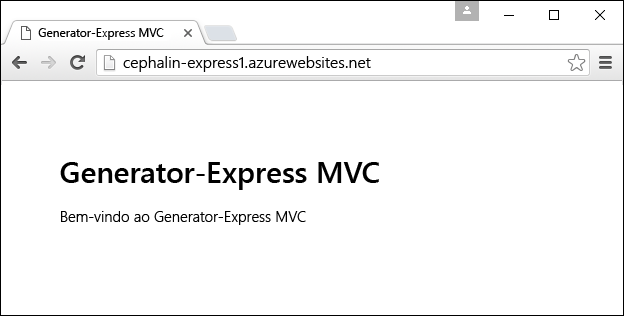
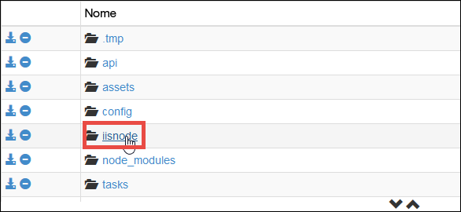
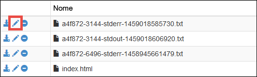
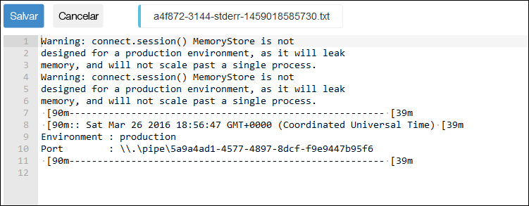

<properties
	pageTitle="Introdução aos aplicativos Web do Node.js no Serviço de Aplicativo do Azure"
	description="Saiba como implantar um aplicativo do Node.js em um aplicativo Web no Serviço de Aplicativo do Azure."
	services="app-service\web"
	documentationCenter="nodejs"
	authors="cephalin"
	manager="wpickett"
	editor=""/>

<tags
	ms.service="app-service-web"
	ms.workload="web"
	ms.tgt_pltfrm="na"
	ms.devlang="nodejs"
	ms.topic="get-started-article"
	ms.date="03/31/2016"
	ms.author="cephalin;robmcm"/>

# Introdução aos aplicativos Web do Node.js no Serviço de Aplicativo do Azure

[AZURE.INCLUDE [guias](../../includes/app-service-web-get-started-nav-tabs.md)]

Este tutorial mostra como criar um aplicativo [Node.js](http://nodejs.org) simples e implantá-lo em um [aplicativo Web](app-service-web-overview.md) no [Serviço de Aplicativo do Azure](../app-service/app-service-value-prop-what-is.md) a partir uma linha de comando, como cmd.exe ou bash. As instruções deste tutorial podem ser seguidas em qualquer sistema operacional que seja capaz de executar o Node.js.

<a name="prereq"/>
## Pré-requisitos

- Node.js. Os binários de instalação estão [aqui](https://nodejs.org/).
- Yoeman. As instruções de instalação estão [aqui](http://yeoman.io/).
- Git. Os binários de instalação estão [aqui](http://www.git-scm.com/downloads).
- CLI do Azure. As instruções de instalação estão [aqui](../xplat-cli-install.md).
- Uma conta do Microsoft Azure. Se você não tiver uma conta, poderá [inscrever-se para uma avaliação gratuita](/pricing/free-trial/?WT.mc_id=A261C142F) ou [ativar seus benefícios de assinante do Visual Studio](/pricing/member-offers/msdn-benefits-details/?WT.mc_id=A261C142F).

## Criar e implantar um aplicativo web simples do Node.js

1. Abra o terminal da linha de comando de sua escolha e instale o [gerador do Express para Yoeman](https://github.com/petecoop/generator-express).

        npm install -g generator-express

2. `CD` para um diretório de trabalho e gere um aplicativo expresso da seguinte forma:

        yo express
        
    Escolha as seguintes opções quando solicitado:

    `? Would you like to create a new directory for your project?` **Sim** `? Enter directory name` **&lt;nome\_aplicativo>** `? Select a version to install:` **MVC** `? Select a view engine to use:` **Jade** `? Select a css preprocessor to use (Sass Requires Ruby):` **Nenhum** `? Select a database to use:` **Nenhum** `? Select a build tool to use:` **Grunt**

3. `CD` para o diretório-raiz do novo aplicativo e inicie-o para verificar se ele é executado no ambiente de desenvolvimento:

        npm start

    No navegador, navegue até [http://localhost:3000](http://localhost:3000) para verificar se você pode ver a home page do Express. Depois de verificar se o aplicativo é executado corretamente, use `Ctrl-C` para interrompê-lo.
    
1. Faça logon no Azure da seguinte forma (é necessária a [CLI do Azure](#prereq) para isso):

        azure login

    Siga o prompt para continuar o logon em um navegador com uma conta da Microsoft que tenha sua assinatura do Azure.

2. Verifique se você ainda está no diretório raiz do aplicativo. Crie o recurso de aplicativo do Serviço de Aplicativo no Azure com um nome de aplicativo exclusivo com o próximo comando. A URL do aplicativo Web é http://&lt;appname>.azurewebsites.net.

        azure site create --git <appname>

    Siga os prompts para selecionar uma região do Azure para a qual implantar. Se nunca tiver configurado credenciais de implantação do Git/FTP para sua assinatura do Azure, você também será solicitado a criá-las.

3. Abra config/config.js e altere a porta de produção para `process.env.port`. O objeto JSON de produção deve ser semelhante a:

        production: {
            root: rootPath,
            app: {
                name: 'express1'
            },
            port: process.env.port,
        }

    Isso permite que o aplicativo Node.js responda a solicitações Web na porta padrão que iisnode escuta.
    
4. Salve as alterações e use o git para implantar o aplicativo no Azure:

        git add .
        git commit -m "<your commit message>"
        git push azure master

    O gerador do Express já fornece um arquivo .gitignore, então, o `git push` não consumirá largura de banda tentando carregar o diretório node\_modules/.

5. Por fim, apenas abra o aplicativo do Azure ativo no navegador:

        azure site browse

    Agora você deve ver o aplicativo Web do Node.js em execução no Serviço de Aplicativo do Azure.
    
    

## Atualizar o aplicativo Web do Node.js

Para fazer atualizações no aplicativo Web Node.js em execução no Serviço de Aplicativo, basta executar `git add`, `git commit` e `git push`, como você fez ao implantá-lo pela primeira vez.
     
## Como o Serviço de Aplicativo implanta o aplicativo Node.js

O Serviço de Aplicativo do Azure usa [iisnode](https://github.com/tjanczuk/iisnode/wiki) para executar os aplicativos Node.js. A CLI do Azure e o mecanismo do Kudu (implantação do Git) trabalham juntos para proporcionar uma experiência simplificada quando você desenvolve e implanta aplicativos do Node.js por meio da linha de comando.

- `azure site create --git` reconhece o padrão comum do Node.js do server.js ou app.js e cria um iisnode.yml no diretório-raiz. Você pode usar esse arquivo para personalizar o iisnode.
- Em `git push azure master`, o Kudu automatiza as seguintes tarefas de implantação:

    - Se package.json estiver na raiz do repositório, execute `npm install --production`.
    - Gere um Web.config para iisnode que aponte para o script de inicialização em package.json (por exemplo, server.js ou app.js).
    - Personalize web.config para preparar o aplicativo para depuração com Node-Inspector.
    
## Usar uma estrutura de Node.js

Se você usa uma estrutura Node.js popular, como [Sails.js](http://sailsjs.org/) ou [MEAN.js](http://meanjs.org/) para desenvolver os aplicativos, pode implantá-los no Serviço de Aplicativo. Estruturas populares do Node.js têm suas peculiaridades específicas, e suas dependências de pacotes são atualizadas continuamente. No entanto, o Serviço de Aplicativo disponibiliza os logs stdout e stderr para você, para que possa saber exatamente o que está acontecendo com o aplicativo e fazer as alterações adequadas. Para obter mais informações, consulte [Obter os logs stdout e stderr do iisnode](#iisnodelog).

Conferir os tutoriais que mostram como trabalhar com uma estrutura específica no Serviço de Aplicativo

- [Implantar um aplicativo Web do Sails.js no Serviço de Aplicativo do Azure](app-service-web-nodejs-sails.md)
- [Criar um aplicativo de chat do Node.js com Socket.IO no Serviço de Aplicativo do Azure](web-sites-nodejs-chat-app-socketio.md)
- [Como usar io.js com Aplicativos Web do Serviço de Aplicativo do Azure](web-sites-nodejs-iojs.md)

## Usar um mecanismo específico do Node.js

No fluxo de trabalho típico, você pode instruir o Serviço de Aplicativo a usar um mecanismo específico do Node.js, como faria normalmente em package.json. Por exemplo:

    "engines": {
        "node": "5.5.0"
    }, 

O mecanismo de implantação do Kudu determina qual mecanismo do Node.js deve ser usado na seguinte ordem:

- Primeiro, examine iisnode.yml para ver se `nodeProcessCommandLine` foi especificado. Em caso afirmativo, use-o.
- Em seguida, examine package.json para ver se `"node": "..."` foi especificado no objeto `engines`. Em caso afirmativo, use-o.
- Escolha uma versão do Node.js padrão por padrão.

<a name="iisnodelog" />
## Obter os logs de stdout e stderr do iisnode

Para ler os logs do iisnode, siga estas etapas:

1. Abra o arquivo iisnode.yml que a CLI do Azure oferece

2. Defina os dois seguintes parâmetros:

        loggingEnabled: true
        logDirectory: iisnode
    
    Juntos, eles instruem iisnode no Serviço de Aplicativo a colocar a saída de stdout e stderror no diretório D:\\home\\site\\wwwroot**iisnode**.

3. Salve as alterações e envie-as ao Azure com os seguintes comandos do Git:

        git add .
        git commit -m "<your commit message>"
        git push azure master
   
   iisnode agora está configurado. As próximas etapas mostram como acessar esses logs.
     
4. No navegador, acesse o console de depuração do Kudu para o aplicativo, que é:

        https://<appname>.scm.azurewebsites.net/DebugConsole 

5. Navegue até D:\\home\\site\\wwwroot\\iisnode

    

6. Clique no ícone **Editar** do log que você deseja ler. Você também poderá clicar em **Baixar** ou **Excluir**, se desejar.

    

    Agora você pode ver o log para ajudá-lo a depurar sua implantação do Serviço de Aplicativo.
    
    

## Depurar o aplicativo com o Node-Inspector

Se usar o Node-Inspector para depurar aplicativos Node.js, você poderá usá-lo para o aplicativo ativo do Serviço de Aplicativo. O Node-Inspector é pré-instalado na instalação do iisnode para o Serviço de Aplicativo. Se você implantar por meio do Git, o web.config gerado automaticamente do Kudu já conterá toda a configuração necessária para habilitar o Node-Inspector.

Para habilitar o Node-Inspector, siga estas etapas:

1. Abra iisnode.yml na raiz do repositório e especifique os seguintes parâmetros: 

        debuggingEnabled: true
        debuggerExtensionDll: iisnode-inspector.dll

3. Salve as alterações e envie-as ao Azure com os seguintes comandos do Git:

        git add .
        git commit -m "<your commit message>"
        git push azure master
   
4. Agora, basta navegar até arquivo de inicialização do aplicativo, conforme especificado pelo script de inicialização no package.json, com a opção /debug adicionada à URL. Por exemplo,

        http://<appname>.azurewebsites.net/server.js/debug
    
    Ou,
    
        http://<appname>.azurewebsites.net/app.js/debug

## Mais recursos

- [Especificar uma versão do Node.js em um aplicativo do Azure](../nodejs-specify-node-version-azure-apps.md)
- [Como depurar um aplicativo Web Node.js no Serviço de Aplicativo do Azure](web-sites-nodejs-debug.md)
- [Usando Módulos no Node.js com aplicativos do Microsoft Azure](../nodejs-use-node-modules-azure-apps.md)
- [Aplicativos Web do Serviço de Aplicativo do Azure: Node.js](http://blogs.msdn.com/b/silverlining/archive/2012/06/14/windows-azure-websites-node-js.aspx)
- [Centro de Desenvolvedores do Node.js](/develop/nodejs/)
- [Introdução a aplicativos Web no Serviço de Aplicativo do Azure](app-service-web-get-started.md)

<!---HONumber=AcomDC_0504_2016-->