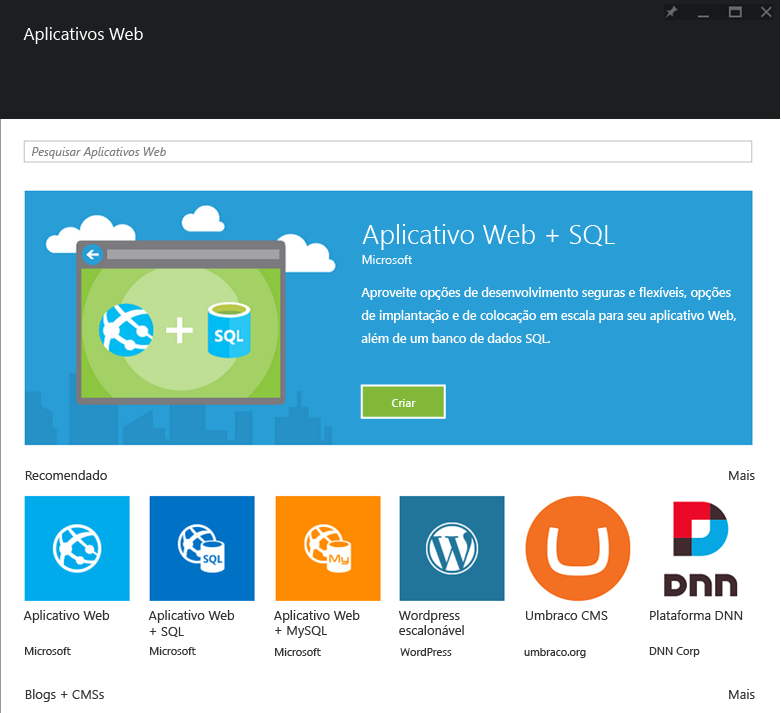

<properties
	pageTitle="Visão geral de aplicativos Web"
	description="Saiba mais sobre os Aplicativos Web do Serviço de Aplicativo"
	services="app-service\web"
	documentationCenter=""
	authors="jaime-espinosa"
	manager="wpickett"
	editor="jimbe"/>

<tags
	ms.service="app-service-web"
	ms.workload="web"
	ms.tgt_pltfrm="na"
	ms.devlang="na"
	ms.topic="get-started-article"
	ms.date="01/09/2016"
	ms.author="jaime.espinosa"/>

#Visão geral de aplicativos Web

O [Serviço de Aplicativo](http://go.microsoft.com/fwlink/?LinkId=529714) é uma plataforma totalmente gerenciada para desenvolvedores profissionais que proporciona um avançado conjunto de recursos para cenários da Web, móveis e de integração. Crie e implante aplicativos Web críticos que são dimensionados de acordo com seus negócios usando o Serviço de Aplicativo do Azure.

Aproveite a capacidade dos [aplicativos Web do Serviço de Aplicativo](http://go.microsoft.com/fwlink/?LinkId=529714) para usar as linguagens e estruturas que você conhece e com as quais conta, implantar seus aplicativos rapidamente para a nuvem do Azure e melhorar continuamente seu código sem precisar mais se preocupar com a infraestrutura.

[AZURE.INCLUDE [compute-table](../../includes/compute-options-table.md)]

## Mais do que apenas sites##

As empresas modernas interagem com seus clientes de formas cada vez mais sofisticadas. Empresas de todos os tipos consideram sua presença corporativa na Web como parte crucial de seus negócios, um dos principais componentes em seu plano de negócios. Para acomodar essa importância, as empresas estão buscando uma plataforma que lhes fornecerá agilidade, segurança e escalabilidade. Além disso, elas precisam da capacidade de vincular aos seus sistemas de negócios existentes, ser capazes de implantar rapidamente um novo código e criar instâncias em todo o mundo. Com o Serviço de Aplicativo do Azure e os aplicativos Web, as organizações podem agradar a seus clientes de forma rápida e econômica.

## Por que aplicativos Web? ##

Os Aplicativos Web do Serviço de Aplicativo do Azure são uma plataforma totalmente gerenciada que o habilita a compilar, implantar e dimensionar aplicativos Web de nível empresarial em segundos. Concentre-se em seu código de aplicativo e deixe que o Azure cuide da infraestrutura para dimensioná-la e executá-la com segurança para você. Os aplicativos Web são:

- **Familiar e Rápido** - use suas habilidades existentes para escrever código em sua linguagem, estrutura e IDE favoritos. Com apenas alguns cliques, adicione controle de versão, atualização, logon único, agente de identidade, armazenamento isolado e monitoramento de desempenho a seus aplicativos Web existentes. Acesse uma Galeria avançada para usar como blocos de construção a fim de acelerar seu desenvolvimento. Experimente produtividade de desenvolvedor incomparável com recursos de ponta como integração contínua, depuração de site ativo e IDE do Visual Studio líder do setor.
- **Nível Empresarial** - os aplicativos Web foram projetados para compilar e hospedar aplicativos críticos seguros. Compile aplicativos de negócios integrados do Active Directory que se conectam com segurança a recursos locais e hospede-os em uma plataforma de nuvem segura em conformidade com PCI, SOC2 e ISO. Ao mesmo tempo, desfrute de SLAs de nível empresarial.
- **Escala Global** - os aplicativos Web foram otimizados para oferecer disponibilidade e dimensionamento automático em uma infraestrutura de data center global. Expanda ou reduza facilmente os aplicativos sob demanda. Com alta disponibilidade fornecida em regiões geográficas diferentes e entre elas. A replicação de dados e a hospedagem de serviços em vários locais são rápidas e fáceis, e basta um clique do mouse para expandir-se para novas regiões e áreas geográficas tão simples.  

## Conceitos de aplicativos Web ##

- **Galeria de Aplicativos Web** - selecione em uma lista crescente de modelos de aplicativos Web existentes. Aproveite o melhor da comunidade de aplicativos OSS com a instalação com um clique de pacotes, como Wordpress, Joomla e Drupal. Inicie seu processo de desenvolvimento de aplicativos da maneira certa aproveitando estruturas como .NET MVC, Django e CakePHP.
- **Ajuste de escala automático** - os aplicativos Web permitem que você ajuste a escala vertical ou horizontalmente com rapidez para lidar com qualquer carga de cliente de entrada. Selecione manualmente o número e tamanho das máquinas virtuais ou configure o dimensionamento automático para ajustar seus servidores com base na carga ou cronograma.
- **Integração contínua** - Configure fluxos de trabalho de implantação e integração contínua com o VSTS, GitHub, TeamCity, Hudson ou BitBucket, permitindo que você compile, teste e implante automaticamente seu aplicativo Web a cada teste de integração ou verificação de código bem-sucedido.
- **Slots de implantação** - implemente a [Implantação de teste][Slots] para verificar seu código em um ambiente de pré-produção que é idêntico a seu aplicativo Web de produção no Serviço de Aplicativo do Azure. Quando estiver satisfeito, lance uma nova versão de seu aplicativo sem tempo de inatividade executando uma operação de permuta. 
- **Testes em produção** - leve as Implantações de Teste para o próximo patamar e execute testes A/B para verificar o novo código com uma fração configurável do tráfego ativo. 
- **Trabalhos Web** - execute qualquer programa ou script em máquinas virtuais de aplicativos Web. Execute trabalhos continuamente ou de acordo com uma agenda e dimensione para execução em várias máquinas virtuais. Use o [SDK WebJobs][Webjobs] do Azure para integrar ao Armazenamento do Azure ou ao Barramento de Serviço.
- **Conexões híbridas** - - Acesse dados locais usando [conexões híbridas](../biztalk-services/integration-hybrid-connection-overview.md) e [VNET](../app-service-web/web-sites-integrate-with-vnet.md).

## Introdução ##
Para começar a usar aplicativos Web, siga o tutorial [Criar um aplicativo Web ASP.NET][create].

Para obter mais informações a respeito da plataforma de Serviço de Aplicativo do Azure, consulte [Serviço de Aplicativo do Azure][appservice].

>[AZURE.NOTE] Se você deseja começar a usar o Serviço de Aplicativo do Azure antes de se inscrever em uma conta do Azure, vá até [Experimentar o Serviço de Aplicativo](http://go.microsoft.com/fwlink/?LinkId=523751), em que você pode criar imediatamente um aplicativo Web inicial de curta duração no Serviço de Aplicativo. Nenhum cartão de crédito é exigido, sem compromissos.

## O que mudou
* Para obter um guia sobre a alteração de Sites para o Serviço de Aplicativo, consulte: [Serviço de Aplicativo do Azure e seu impacto sobre os serviços do Azure existentes](http://go.microsoft.com/fwlink/?LinkId=529714)

[appservice]: ../app-service/app-service-value-prop-what-is.md
[create]: web-sites-dotnet-get-started.md
[Webjobs]: websites-dotnet-webjobs-sdk-get-started.md
[Slots]: web-sites-staged-publishing.md

 

<!---HONumber=AcomDC_0413_2016-->