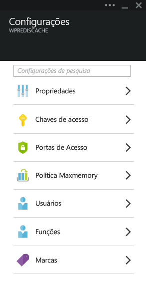
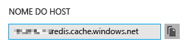
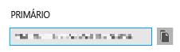
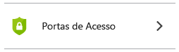
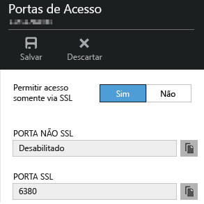
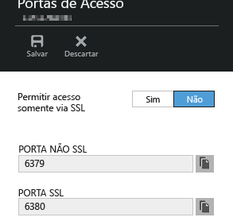

<properties
	pageTitle="Conectar um aplicativo Web no Serviço de Aplicativo do Azure ao Cache Redis por meio do protocolo Memcache | Microsoft Azure"
	description="Conectar um aplicativo Web no Serviço de Aplicativo do Azure ao Cache Redis por meio do protocolo Memcache"
	services="app-service\web"
	documentationCenter="php"
	authors="SyntaxC4"
	manager="wpickett"
	editor="riande"/>

<tags
	ms.service="app-service-web"
	ms.devlang="php"
	ms.topic="get-started-article"
	ms.tgt_pltfrm="windows"
	ms.workload="na"
	ms.date="09/16/2015"
	ms.author="cfowler"/>

# Conectar um aplicativo Web no Serviço de Aplicativo do Azure ao Cache Redis por meio do protocolo Memcache

Neste artigo, você verá como conectar um aplicativo Web do WordPress no [Serviço de Aplicativo do Azure](http://go.microsoft.com/fwlink/?LinkId=529714) ao [Cache Redis do Azure][12] usando o protocolo [Memcache][13]. Se tiver um aplicativo Web existente que usa um servidor Memcached para cache na memória, você poderá migrá-lo para o Serviço de Aplicativo do Azure e usar a solução de cache de terceiros no Microsoft Azure com pouca ou nenhuma alteração no código do aplicativo. Além disso, você pode usar sua experiência com o Memcache para criar aplicativos distribuídos altamente escalonáveis no Serviço de Aplicativo do Azure com o Cache Redis do Azure para cache em memória, usando estruturas de aplicativos populares, como .NET, PHP, Node.js, Java e Python.

Os aplicativos Web do Serviço de Aplicativo habilitam esse cenário de aplicativo com o shim do Memcache de aplicativos Web, que é um servidor Memcached local que atua como um proxy Memcache para armazenar em cache as chamadas ao Cache Redis do Azure. Isso habilita qualquer aplicativo que se comunica usando o protocolo Memcache a armazenar dados em cache com o Cache Redis. Esse shim do Memcache funciona no nível do protocolo; portanto, ele pode ser usado por qualquer aplicativo ou estrutura de aplicativo, desde que se comunique usando o protocolo Memcache.

[AZURE.INCLUDE [app-service-web-to-api-and-mobile](../../includes/app-service-web-to-api-and-mobile.md)]

## Pré-requisitos

O shim do Memcache de aplicativos Web pode ser usado com qualquer aplicativo, desde que se comunique usando o protocolo Memcache. Para este exemplo específico, o aplicativo de referência é um site do WordPress escalonável que pode ser provisionado do Azure Marketplace.

Siga as etapas descritas nestes artigos:

* [Provisionar uma instância do Serviço de Cache Redis do Azure][1]
* [Implantar um site do WordPress escalonável no Azure][0]

Depois que o site do WordPress escalonável for implantado e uma instância do Cache Redis for provisionada, você estará pronto para prosseguir com a habilitação do shim do Memcache em aplicativos Web do Serviço de Aplicativo do Azure.

## Habilitar o shim do Memcache de aplicativos Web

Para configurar o shim do Memcache, você deve criar três configurações de aplicativo. Isso pode ser feito usando diversos métodos, incluindo o [Portal do Azure](http://go.microsoft.com/fwlink/?LinkId=529715), o [Portal antigo][3], os [Cmdlets do PowerShell do Azure][5] ou as [Ferramentas de linha de comando de plataforma cruzada do Azure][5]. Para os fins desta postagem, vou usar o [Portal do Azure][4] para definir as configurações do aplicativo. Os valores a seguir podem ser recuperados da folha **Configurações** de sua instância do Cache Redis.



### Adicionar configurações de aplicativo REDIS\_HOST

A primeira configuração de aplicativo que você precisa criar é **REDIS\_HOST**. Essa configuração define o destino para o qual o shim encaminha as informações de cache. O valor necessário para a configuração de aplicativo REDIS\_HOST pode ser recuperado da folha **Propriedades** de sua instância do Cache Redis.



Defina a chave da configuração de aplicativo como **REDIS\_HOST** e o valor da configuração de aplicativo como o **nome de host** da instância do Cache Redis.


### Adicionar a configuração de aplicativo REDIS\_KEY

A segunda configuração de aplicativo que você precisa criar é **REDIS\_KEY**. Essa configuração fornece o token de autenticação necessário para acessar com segurança a instância do Cache Redis. Você pode recuperar o valor necessário para a configuração de aplicativo REDIS\_KEY na folha **Chaves de acesso** da instância do Cache Redis.



Defina a chave da configuração de aplicativo como **REDIS\_KEY** e o valor da configuração de aplicativo como a **Chave Primária** da instância do Cache Redis.


### Adicionar a configuração de aplicativo MEMCACHESHIM\_REDIS\_ENABLE

A última configuração de aplicativo é usada para habilitar a correção do Memcache em aplicativos Web, que usa REDIS\_HOST e REDIS\_KEY para se conectar ao Cache Redis do Azure e encaminhar as chamadas de cache. Defina a chave da configuração de aplicativo como **MEMCACHESHIM\_REDIS\_ENABLE** e o valor como **true**.


Após adicionar as três (3) configurações de aplicativo, clique em **Salvar**.

## Habilitar a extensão de Memcache para PHP

Para que o aplicativo fale com o protocolo Memcache, é necessário instalar a extensão Memcache para PHP (a estrutura de linguagem para seu site do WordPress).

### Baixar a extensão php\_memcache

Navegue até [PECL][6]. Na categoria de cache, clique em [memcache][7]. Na coluna de downloads, clique no link DLL.


Baixe o link x86 NTS (Non-Thread Safe) para a versão do PHP habilitada nos aplicativos Web. (O padrão é PHP 5.4)


### Habilitar a extensão php\_memcache

Depois de baixar o arquivo, descompacte e carregue **php\_memcache.dll** no diretório **d:\\home\\site\\wwwroot\\bin\\ext\**. Depois que o php\_memcache.dll for carregado no aplicativo Web, você precisará habilitar a extensão no Tempo de Execução do PHP. Para habilitar a extensão Memcache no Portal do Azure, abra a folha **Configurações de Aplicativo do aplicativo Web** e, em seguida, adicione uma nova configuração de aplicativo com a chave**PHP\_EXTENSIONS** e o valor **bin\\ext\\php\_memcache.dll**.


> [AZURE.NOTE]Se o aplicativo Web precisar carregar várias extensões PHP, o valor de PHP\_EXTENSIONS deverá ser uma lista delimitada por vírgulas de caminhos relativos para arquivos DLL.


Ao terminar, clique em **Salvar**.

## Instalar o plug-in do WordPress do Memcache

> [AZURE.NOTE]Você também pode baixar o [Plug-in do cache do objeto Memcached](https://wordpress.org/plugins/memcached/) em WordPress.org.

Na página de plug-ins do WordPress, clique em **Adicionar Novo**.


Na caixa de pesquisa, digite **memcached** e pressione **Enter**.


Localize **Cache de Objeto Memcached** na lista e clique em **Instalar Agora**.


### Habilitar o plug-in do WordPress do Memcache

>[AZURE.NOTE]Siga as instruções neste blog sobre [Como habilitar uma Extensão de Site em Aplicativos Web][8] para instalar o Visual Studio Team Services.

No arquivo `wp-config.php`, adicione o código a seguir acima do comentário de interrupção de edição próximo ao fim do arquivo.

```php
$memcached_servers = array(
	'default' => array('localhost:' . getenv("MEMCACHESHIM_PORT"))
);
```

Depois que esse código for colado, monaco salvará automaticamente o documento.

A próxima etapa é habilitar o plug-in object-cache. Para isso, arraste e solte **object-cache.php** da pasta **wp-content/memcached** para a pasta **wp-content** para habilitar a funcionalidade de cache de objetos do Memcache.


Agora que o arquivo **object-cache.php** está na pasta **wp-content**, o cache de objetos Memcached agora está habilitado.


## Verificando se o plug-in de cache de objetos do Memcache está funcionando

Todas as etapas para habilitar o shim do Memcache de aplicativos Web foram concluídas. Só resta verificar se os dados estão populando sua instância do Cache Redis.

### Habilitar o suporte à porta não SSL no Cache Redis do Azure

>[AZURE.NOTE]Quando este artigo foi escrito, a CLI do Redis não dava suporte à conectividade SSL; portanto, as etapas a seguir são necessárias.

No Portal do Azure, navegue até a instância do Cache Redis que você criou para o aplicativo Web. Quando a folha do cache for aberta, clique no ícone **Configurações**.


Selecione **Portas de Acesso** na lista.



Clique em **Não** para **Permitir acesso somente via SSL**.



Você verá que a porta não SSL agora está definida. Clique em **Salvar**.



### Conectar ao Cache Redis do Azure por meio de redis-cli

>[AZURE.NOTE]Essa etapa pressupõe que o Redis esteja instalado localmente em seu computador de desenvolvimento. [Instale o Redis localmente usando estas instruções][9].

Abra o console de linha de comando de sua escolha e digite o seguinte comando:

```shell
redis-cli –h <hostname-for-redis-cache> –a <primary-key-for-redis-cache> –p 6379
```

Substitua **<hostname-for-redis-cache>** pelo nome de host real xxxxx.redis.cache.windows.net e **<primary-key-for-redis-cache>** pela chave de acesso para o cache e pressione **Enter** Depois que a CLI for conectada à instância do Cache Redis, execute qualquer comando do Redis. Na captura de tela abaixo, optei por listar as chaves.


A chamada para listar as chaves deve retornar um valor. Caso contrário, tente navegar até o aplicativo Web e tente novamente.

## Conclusão

Parabéns! O aplicativo do WordPress agora tem um cache na memória centralizado para ajudar a aumentar a taxa de transferência. Lembre-se: o shim do Memcache de aplicativos Web pode ser usado com qualquer cliente Memcache, independentemente da linguagem de programação ou da estrutura de aplicativo. Para fornecer comentários ou fazer perguntas sobre o shim do Memcache de aplicativos Web, poste nos [Fóruns do MSDN][10] ou no[Stackoverflow][11].

>[AZURE.NOTE]Se você deseja começar a usar o Serviço de Aplicativo do Azure antes de se inscrever em uma conta do Azure, vá até [Experimentar o Serviço de Aplicativo](http://go.microsoft.com/fwlink/?LinkId=523751), em que você pode criar imediatamente um aplicativo Web inicial de curta duração no Serviço de Aplicativo. Nenhum cartão de crédito é exigido, sem compromissos.

## O que mudou
* Para obter um guia sobre a alteração de sites para o Serviço de Aplicativo, consulte: [Serviço de Aplicativo do Azure e seu impacto sobre os serviços do Azure existentes](http://go.microsoft.com/fwlink/?LinkId=529714)
* Para obter um guia sobre a alteração do portal antigo para o novo portal, consulte: [Referência para navegar no portal de visualização](http://go.microsoft.com/fwlink/?LinkId=529715)


[0]: http://bit.ly/1F0m3tw
[1]: http://bit.ly/1t0KxBQ
[2]: http://manage.windowsazure.com
[3]: http://portal.azure.com
[4]: ../powershell-install-configure.md
[5]: /downloads
[6]: http://pecl.php.net
[7]: http://pecl.php.net/package/memcache
[8]: http://blog.syntaxc4.net/post/2015/02/05/how-to-enable-a-site-extension-in-azure-websites.aspx
[9]: http://redis.io/download#installation
[10]: https://social.msdn.microsoft.com/Forums/home?forum=windowsazurewebsitespreview
[11]: http://stackoverflow.com/questions/tagged/azure-web-sites
[12]: /services/cache/
[13]: http://memcached.org

<!---HONumber=Nov15_HO4-->