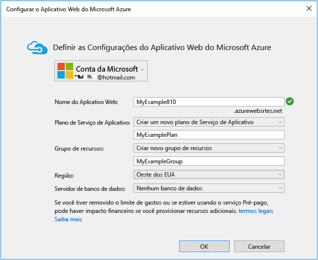
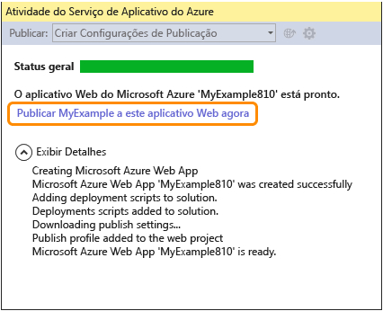
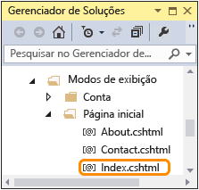
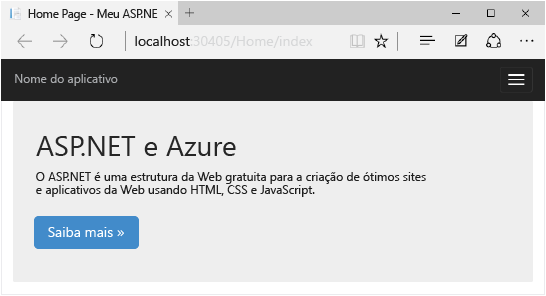

<properties 
	pageTitle="Criar um aplicativo Web ASP.NET no Serviço de Aplicativo do Azure" 
	description="Este tutorial mostra como criar um projeto Web ASP.NET no Visual Studio 2013 e implantá-lo em um aplicativo Web no Serviço de Aplicativo do Azure. Em menos de 15 minutos, você terá um aplicativo em funcionamento na nuvem." 
	services="app-service\web" 
	documentationCenter=".net" 
	authors="tdykstra" 
	manager="wpickett" 
	editor="mollybos"/>

<tags 
	ms.service="app-service-web" 
	ms.workload="web" 
	ms.tgt_pltfrm="na" 
	ms.devlang="dotnet" 
	ms.topic="hero-article" 
	ms.date="03/24/2015" 
	ms.author="tdykstra"/>

# Criar um aplicativo Web ASP.NET no Serviço de Aplicativo do Azure

## Visão geral

Este tutorial mostra como criar um aplicativo Web ASP.NET e implantá-lo em [Aplicativos Web do Serviço de Aplicativo](http://go.microsoft.com/fwlink/?LinkId=529714) usando o Visual Studio 2013 ou o Visual Studio 2013 for Web Express. O tutorial pressupõe que você não tem nenhuma experiência anterior com o Azure ou o ASP.NET. Ao concluir o tutorial, você terá um aplicativo Web simples em funcionamento na nuvem.

Você aprenderá a:

* Como habilitar seu computador para desenvolvimento do Azure ao instalar o SDK do Azure.
* Como criar um projeto Web Visual Studio ASP.NET e implantá-lo em um aplicativo Web do Azure.
* Como fazer uma alteração no projeto Web e a reimplantá-lo.
* Como usar o [Portal do Azure](http://go.microsoft.com/fwlink/?LinkId=529715) para monitorar e gerenciar seu aplicativo Web.

Você de uma conta do Azure para concluir este tutorial:

* Você pode [abrir uma conta do Azure gratuitamente](/pricing/free-trial/?WT.mc_id=A261C142F) – você obtém créditos que pode usar para experimentar serviços do Azure pagos e, mesmo depois que eles são usados, você pode manter a conta e usar serviços gratuitos do Azure, como Aplicativos Web do Serviço de Aplicativo.
* Você pode [ativar benefícios para assinantes do MSDN](/pricing/member-offers/msdn-benefits-details/?WT.mc_id=A261C142F) – todos os meses, sua assinatura do MSDN oferece créditos que podem ser usados para serviços pagos do Azure.</li>

A ilustração a seguir mostra o aplicativo concluído:

##Inscrever-se no Microsoft Azure (vídeo)

Neste vídeo, Scott Hanselman mostra como é fácil inscrever-se para uma avaliação gratuita do Microsoft Azure. (Duração: 1:58)

> [AZURE.VIDEO sign-up-for-microsoft-azure]

[AZURE.INCLUDE [install-sdk-2013-only](../../includes/install-sdk-2013-only.md)]

## Criar um aplicativo Web ASP.NET

A primeira etapa é criar um projeto de aplicativo Web. O Visual Studio criará automaticamente o aplicativo Web do Azure em que você implantará seu projeto mais tarde.

1. Abra o Visual Studio 2013 ou o Visual Studio 2013 Express for Web.

2. No menu **Arquivo**, clique em **Novo Projeto**.

3. Na caixa de diálogo **Novo Projeto**, clique em **C#** > **Web** > **Aplicativo Web ASP.NET**. Se preferir, você pode escolher **Visual Basic**.

3. Verifique se o **.NET Framework 4.5** está selecionado como a estrutura de destino.

4. Desmarque a caixa de seleção **Adicionar Application Insights ao Projeto**.
 
4. Nomeie o aplicativo **MyExample** e clique em **OK**.

	

5. Na caixa de diálogo **Novo Projeto ASP.NET**, selecione o modelo **MVC**. Se prefere trabalhar com Web Forms ASP.NET, você pode selecionar o modelo **Web Forms**.

	[MVC e Web Forms](http://www.asp.net/get-started/websites) são estruturas do ASP.NET para desenvolver aplicativos Web. Para este tutorial, você pode escolher qualquer uma das duas opções; porém, se você escolher Web Forms, você precisará editar *Default.aspx* posteriormente nos pontos em que o tutorial instruir você a editar *Index.cshtml*.

7. Clique em **Alterar Autenticação**.

	

6. Na caixa de diálogo **Alterar Autenticação**, clique em **Sem Autenticação** e clique em **OK**.

	

	O aplicativo de exemplo que você está criando não habilitará os usuários a fazer logon. A seção [Próximas etapas](#next-steps) tem links para um tutorial que implementa a autenticação e a autorização.

5. Na caixa de diálogo **Novo Projeto ASP.NET**, deixe as configurações em **MicrosoftAzure** inalteradas e, por último, clique em **OK**.

	

	As configurações padrão especificam que o Visual Studio crie um aplicativo Web do Azure para seu projeto Web. Na próxima seção do tutorial, você implantará o projeto Web para o aplicativo Web recém-criado.

5. Se você ainda não tiver entrado no Azure, o Visual Studio solicitará a você que o faça. Entre com a ID e a senha da conta que você usa para gerenciar sua assinatura do Azure.
	
	Quando você estiver conectado, a caixa de diálogo **Definir configurações de Aplicativo Web do Microsoft Azure** perguntará quais recursos você deseja criar.

	

3. Na caixa de diálogo **Definir configurações de Aplicativo Web do Microsoft Azure**, mantenha o valor padrão.
 
	Você poderá inserir um **nome de Aplicativo Web** diferente, se preferir, mas o nome deverá ser exclusivo no domínio *azurewebsites.net*. O nome padrão que o Visual Studio fornece é exclusivo.

	O Azure usará esse nome como o prefixo para a URL do aplicativo. A URL completa consistirá nesse nome, mais *.azurewebsites.net* (conforme mostrado ao lado da caixa de texto **Nome do Aplicativo Web**). Por exemplo, se o nome for `MyExample6442`, a URL será `MyExample6442.azurewebsites.net`. A URL precisa ser exclusiva. Se outra pessoa já tiver usado o que você digitou, você verá um ponto de exclamação vermelho à direita em vez de uma marca de verificação verde e precisará inserir outro nome de site.

4. No menu suspenso **Plano de Serviço do Aplicativo**, selecione **Criar novo plano de Serviço de Aplicativo**.

	A seção [Próximas etapas](#next-steps) no fim do tutorial tem links para informações sobre planos de Serviço de Aplicativo.

5. Digite *MyExamplePlan* ou outro nome, se preferir, para o nome do plano.

6. No menu suspenso **Grupo de recursos**, selecione **Criar novo grupo de recursos**.

	A seção [Próximas etapas](#next-steps) tem links para informações sobre grupos de recursos.
 
5. Digite *MyExampleResourceGroup* ou outro nome, se preferir, para o nome do grupo de recursos.

5. Na lista suspensa **Região**, escolha o local mais próximo de você.

	Essa configuração especifica em qual data center do Azure seu aplicativo Web será executado. Para este tutorial, você pode selecionar qualquer região, e isso não resultará em nenhuma diferença perceptível. Porém, para um aplicativo Web de produção, é melhor que seu servidor Web esteja tão próximo quanto possível dos navegadores acessando seu site, para reduzir a [latência](http://www.bing.com/search?q=web%20latency%20introduction&qs=n&form=QBRE&pq=web%20latency%20introduction&sc=1-24&sp=-1&sk=&cvid=eefff99dfc864d25a75a83740f1e0090).

5. Deixe o campo de banco de dados inalterado.

	Para este tutorial, você não está usando um banco de dados. A seção [Próximas etapas](#next-steps) no final do tutorial vincula a um tutorial que mostra como usar um banco de dados.

6. Clique em **OK**.

	

	Em poucos segundos, o Visual Studio cria o projeto Web na pasta especificada e cria o aplicativo Web na região do Azure que você especificou.

	A janela **Gerenciador de Soluções** mostra os arquivos e as pastas no novo projeto.

	

	A janela **Atividade do Serviço de Aplicativo do Azure** mostra que o aplicativo Web foi criado.

	

	Você pode ver o aplicativo Web no Gerenciador de Servidores.

	

## Implantar o aplicativo no Azure

7. Na janela **Atividades do Serviço de Aplicativo do Azure**, clique em **Publicar MyExample nesse aplicativo Web agora**.

	

	Em poucos segundos, o assistente de **Publicar Web** é exibido.

	As configurações das quais do Visual Studio precisa para implantar seu projeto no Azure foram salvas em um *perfil de publicação*. O assistente permite que você revise e altere essas mudanças.

8. Na guia **Conexão** do assistente **Publicar na Web**, clique em **Validar Conexão** para certificar-se de que o Visual Studio pode se conectar ao Azure para implantar o projeto Web.

	

	Quando a conexão tiver sido validada, uma marca de seleção verde será mostrada ao lado do botão **Validar Conexão**.

9. Clique em **Próximo**.

	

10. Na guia **Configurações**, clique em **Avançar**.

	

	Você pode aceitar os valores padrão para **Configuração** e **Opções de Publicação de Arquivos**.

	O menu suspenso **Configuração** permite que você implante uma compilação de Depuração para depuração remota. A seção [Próximas etapas](#next-steps) vincula a um tutorial que mostra como executar o Visual Studio no modo de depuração remotamente.

	Se você expandir **Opções de Publicação de Arquivos**, verá diversas configurações que permitem a você gererenciar cenários que não se aplicam a este tutorial:
 
	* Remova os arquivos adicionais presentes no destino.
	  
		Deletes any files at the server that aren't in your project. You might need this if you were deploying a project to a web app that you had deployed a different project to earlier.

	* Faça a pré-compilação durante a publicação. 
	 
		Can reduce first-request warm up times for large applications.

	* Exclua os arquivos da pasta App_Data. 
	 
		For testing you sometimes have a SQL Server database file in App_Data which you don't want to deploy to production.
	
11. Na guia **visualização**, clique em **Iniciar Visualização**.

	

	A guia exibe uma lista dos arquivos que serão copiados no servidor. A exibição da visualização não é obrigatória para publicar o aplicativo, mas é uma função reconhecidamente útil.

12. Clique em **Publicar**.

	

	O Visual Studio inicia o processo de cópia dos arquivos no servidor do Azure.

	As janelas **Saída** e **Atividade de Publicação da Web** mostram as ações de implantação que foram executadas e relata a conclusão bem-sucedida da implantação.

	

	Após a implantação bem-sucedida, o navegador padrão abre automaticamente a URL do aplicativo Web implantado, e o aplicativo que você criou agora está em execução na nuvem. A URL na barra de endereços do navegador mostra que o aplicativo Web está sendo carregado da Internet.

	

13. Feche o navegador.

## Fazer uma alteração e reimplantar

Nesta seção do tutorial, você altera o título **h1** da home page, executa o projeto localmente no seu computador de desenvolvimento para verificar a alteração e, em seguida, implanta a alteração no Azure.

2. Abra os arquivos *Views/Home/Index.cshtml* ou *.vbhtml* no **Gerenciador de Soluções**, altere o título **h1** de "ASP.NET" para "ASP.NET e Azure" e salve o arquivo. 

	

	

1. Pressione CTRL + F5 para ver o título atualizado executando o aplicativo Web em seu computador local.

	

	A URL `http://localhost` mostra que ele está sendo executado no computador local. Por padrão, ele é executado no IIS Express, que é uma versão simples do IIS desenvolvida para uso durante o desenvolvimento de aplicativos Web.

1. Feche o navegador.

1. No **Gerenciador de Soluções**, clique com o botão direito do mouse no projeto e escolha **Publicar**.

	

	A guia Visualizar do assistente **Publicar Web** é exibida. Se for necessário alterar quaisquer configurações de publicação, você poderá escolher uma guia diferente, mas agora tudo o que você deseja fazer é reimplantar com as mesmas configurações.

2. No assistente **Publicar na Web**, clique em **Publicar**.

	

	O Visual Studio implanta o projeto no Azure e abre o aplicativo Web no navegador padrão.

	

**Dica:** você pode habilitar a barra de ferramentas **Publicação Web com um Clique** para implantação mais rápida. Clique em **Visualizar** > **Barras de ferramentas** e, em seguida, selecione **Publicação Web Com Um Clique**. A barra de ferramentas permite a você selecionar um perfil, clicar em um botão para publicar ou clicar em um botão para abrir o assistente **Publicar Web**.

## Monitore e gerencie o aplicativo Web no Portal de Gerenciamento

O [Portal de Gerenciamento do Azure](/services/management-portal/) é uma interface da Web que o habilita a gerenciar e monitorar seus serviços do Azure, como o aplicativo Web que você acabou de criar. Nesta seção do tutorial, você descobre um pouco do que pode fazer no portal.
  
1. Em seu navegador, vá até [http://portal.azure.com]() e entre com suas credenciais do Azure.

2. Clique em **Procurar > aplicativos Web** e, em seguida, clique no nome de seu aplicativo Web.

	A folha **Aplicativo Web** para seu aplicativo Web exibe uma visão geral de estatísticas de uso e links para funções de gerenciamento de aplicativos Web usadas com frequência.
  
	-->

	Nesse ponto, seu aplicativo Web ainda não teve muito tráfego e pode não mostrar nada no gráfico. Se navegar até o aplicativo, atualizar a página algumas vezes e, em seguida, atualizar a página de portal, você verá que algumas estatísticas serão mostradas.

3. Clique em **Todas as configurações** para ver mais opções para configurar seu aplicativo Web.

	Você verá uma lista dos tipos de configurações.
  
	-->

4. Clique em **Configurações do aplicativo** para ver um exemplo dos tipos de configurações que você pode definir no portal.

	Por exemplo, você pode controlar a versão do .NET usada para o aplicativo Web, habilitar recursos como [WebSockets](/blog/2013/11/14/introduction-to-websockets-on-windows-azure-web-sites/), defina [valores de cadeia de conexão](/blog/2013/07/17/windows-azure-web-sites-how-application-strings-and-connection-strings-work/) e muito mais.

	

Esses são apenas alguns dos recursos do Portal de Gerenciamento. Você pode criar novos aplicativos Web, excluir aplicativos Web existentes, parar e reiniciar aplicativos Web e gerenciar outros tipos de serviços do Azure, como bancos de dados e máquinas virtuais.

>[AZURE.NOTE]Se você deseja começar com o Serviço de Aplicativo do Azure antes de se inscrever em uma conta do Azure, vá até [Experimentar o Serviço de Aplicativo](http://go.microsoft.com/fwlink/?LinkId=523751), em que você pode criar imediatamente um aplicativo Web inicial de curta duração no Serviço de Aplicativo. Nenhum cartão de crédito é exigido; não há compromissos.

## Próximas etapas

Neste tutorial, você viu como criar um aplicativo Web simples e implantá-lo em um aplicativo Web do Azure. Estes são alguns tópicos e recursos relacionados para saber mais sobre eles.

* Outras maneiras de implantar um projeto Web

	Neste tutorial, você viu a maneira mais rápida de criar um aplicativo Web e implantá-lo em uma única operação. Para obter uma visão geral de outras maneiras de implantar, usando o Visual Studio ou [automatizando a implantação](http://www.asp.net/aspnet/overview/developing-apps-with-windows-azure/building-real-world-cloud-apps-with-windows-azure/continuous-integration-and-continuous-delivery) de um [sistema de controle do código-fonte](http://www.asp.net/aspnet/overview/developing-apps-with-windows-azure/building-real-world-cloud-apps-with-windows-azure/source-control), consulte [Como implantar um aplicativo Web do Azure](web-sites-deploy.md).

	O Visual Studio também pode gerar scripts do Windows PowerShell, que permitem a você automatizar a implantação. Para obter mais informações, consulte [Automatizar tudo (Compilando aplicativos de nuvem do mundo real com o Azure) ](http://www.asp.net/aspnet/overview/developing-apps-with-windows-azure/building-real-world-cloud-apps-with-windows-azure/automate-everything).

* Como gerenciar um aplicativo Web no Visual Studio

	Para obter informações sobre funções de gerenciamento de aplicativos Web que você pode executar no **Gerenciador de Servidores**, consulte [Solucionando problemas de aplicativos Web do Azure no Visual Studio](web-sites-dotnet-troubleshoot-visual-studio.md).

* Como solucionar problemas de um aplicativo Web

	O Visual Studio fornece ferramentas que facilitam a exibição dos logs do Azure à medida que são gerados em tempo real. Você também pode executar em modo de depuração remotamente no Azure. Para obter mais informações, consulte [Solucionando problemas de aplicativos Web do Azure no Visual Studio](web-sites-dotnet-troubleshoot-visual-studio.md).

* Como adicionar funcionalidade de banco de dados e autorização

	Para obter um tutorial que mostra como acessar um banco de dados e restringir algumas funções de aplicativo a usuários autorizados, consulte [Implantar um aplicativo ASP.NET MVC seguro com associação, OAuth e Banco de Dados SQL em um aplicativo Web do Azure](/develop/net/tutorials/web-site-with-sql-database/).

* Como adicionar um nome de domínio personalizado e SSL

	Para obter informações sobre como utilizar SSL e seu próprio domínio (por exemplo www.contoso.com, em vez de contoso.azurewebsites.net), consulte os recursos a seguir:

	* [Configurando um nome de domínio personalizado para um Site do Azure](web-sites-custom-domain-name.md). 
	* [Habilitar HTTPS para um site do Azure](web-sites-configure-ssl-certificate.md)

* Como evitar tempo de espera para voltar ao funcionamento após intervalos em ociosidade

	Por padrão, os aplicativos Web serão descarregados se estiverem ociosos durante determinado período de tempo. A primeira solicitação após isso ocorrer precisa aguardar até que o aplicativo Web seja carregado novamente. Para evitar esse tempo de espera, você pode habilitar o recurso AlwaysOn. Para obter mais informações, consulte as opções de configuração do [Como configurar o aplicativo Web](web-sites-configure.md).

* Como adicionar recursos em tempo real como chat

	Se o aplicativo Web incluirá recursos em tempo real (como um serviço de chat, um jogo, um indicador de ações, entre outros), você pode obter o melhor desempenho utilizando o [ASP.NET SignalR](http://www.asp.net/signalr) com o método de transporte [WebSockets](/blog/2013/11/14/introduction-to-websockets-on-windows-azure-web-sites/). Para obter mais informações, consulte [Usando SignalR com aplicativos Web do Azure](http://www.asp.net/signalr/overview/signalr-20/getting-started-with-signalr-20/using-signalr-with-windows-azure-web-sites).

* Como escolher entre o Serviço de Aplicativo, os Serviços de Nuvem e VMs para aplicativos Web

	No Azure, você pode executar aplicativos Web em aplicativos Web do Serviço de Aplicativo, conforme mostrado neste tutorial, ou em Serviços de Nuvem ou Máquinas Virtuais. Para obter mais informações, consulte [Modelos de execução do Azure](/develop/net/fundamentals/compute/) e [Aplicativos Web do Azure, serviços de nuvem e VMs: quando usar o quê?](/manage/services/web-sites/choose-web-app-service/).

* [Como escolher ou criar um plano de Serviço de Aplicativo](../app-service/azure-web-sites-web-hosting-plans-in-depth-overview.md)

* [Como escolher ou criar um grupo de recursos](../azure-preview-portal-using-resource-groups.md)

	  

## O que mudou
* Para obter um guia sobre a alteração de Sites para o Serviço de Aplicativo, consulte: [Serviço de Aplicativo do Azure e seu impacto sobre os serviços do Azure existentes](http://go.microsoft.com/fwlink/?LinkId=529714)
* Para obter um guia sobre a alteração do portal antigo para o novo portal, consulte: [Referência para navegar no portal de visualização](http://go.microsoft.com/fwlink/?LinkId=529715)

<!--HONumber=52-->
 