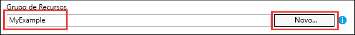

<properties
	pageTitle="Implantar um aplicativo ASP.NET no Serviço de Aplicativo do Azure usando o Visual Studio | Microsoft Azure"
	description="Saiba como implantar um projeto Web do ASP.NET em um novo aplicativo Web no Serviço de Aplicativo do Azure, usando o Visual Studio."
	services="app-service\web"
	documentationCenter=".net"
	authors="tdykstra"
	manager="wpickett"
	editor=""/>

<tags
	ms.service="app-service-web"
	ms.workload="web"
	ms.tgt_pltfrm="na"
	ms.devlang="dotnet"
	ms.topic="get-started-article"
	ms.date="07/22/2016"
	ms.author="rachelap"/>

# Implantar um aplicativo Web ASP.NET no Serviço de Aplicativo do Azure usando o Visual Studio

[AZURE.INCLUDE [guias](../../includes/app-service-web-get-started-nav-tabs.md)]

## Visão geral

Este tutorial mostra como implantar um aplicativo Web ASP .NET no [aplicativo Web do Serviço de Aplicativo do Azure](app-service-web-overview.md) usando o Visual Studio 2015.

O tutorial presume que você seja desenvolvedor ASP.NET sem experiência anterior com o Azure. Após a conclusão, você terá um aplicativo Web simples em funcionamento na nuvem.

O que você aprenderá:

* Como criar um novo aplicativo Web do Serviço de Aplicativo enquanto cria um projeto Web no Visual Studio.
* Como implantar um projeto Web em um aplicativo Web do Serviço de Aplicativo usando o Visual Studio.

O diagrama ilustra o que você faz no tutorial.

Ao final do tutorial, uma seção [Solução de problemas](#troubleshooting) dá ideias sobre o que fazer se algo não funcionar, e a seção [Próximas etapas](#next-steps) fornece links para outros tutoriais com mais detalhes sobre como usar o Serviço de Aplicativo do Azure.

Como este é um tutorial de introdução, o projeto que ele mostra como implantar é um projeto da Web simples que não usa um banco de dados e não realiza autenticação ou autorização. Para obter links para tópicos de implantação mais avançados, consulte [Como implantar um aplicativo Web](web-sites-deploy.md).

Além do tempo necessário para instalar o SDK do Azure para .NET, este tutorial levará cerca de 10 a 15 minutos para ser concluído.

## Pré-requisitos

* O tutorial presume que você já tenha trabalhado com o ASP.NET MVC e com o Visual Studio. Se você precisar de uma introdução, consulte [Guia de Introdução ao ASP.NET MVC 5](http://www.asp.net/mvc/overview/getting-started/introduction/getting-started).

* Você precisa de uma conta do Azure. Você pode [abrir uma conta gratuita do Azure](/pricing/free-trial/?WT.mc_id=A261C142F) ou [Ativar os benefícios de assinante do Visual Studio](/pricing/member-offers/msdn-benefits-details/?WT.mc_id=A261C142F).

	Se você quiser ter uma introdução ao Serviço de Aplicativo do Azure antes de se inscrever em uma conta do Azure, acesse [Experimentar o Serviço de Aplicativo](http://go.microsoft.com/fwlink/?LinkId=523751). Dessa forma você poderá criar um aplicativo de curta duração inicial no Serviço de Aplicativo, sem precisar de cartão de crédito e sem compromissos.

## Configurar o ambiente de desenvolvimento

O tutorial é escrito para o Visual Studio 2015 com o [SDK do Azure para .NET](../dotnet-sdk.md) 2.9 ou posterior.

* [Baixe o SDK mais recente do Azure para Visual Studio 2015 aqui.](http://go.microsoft.com/fwlink/?linkid=518003) O SDK instala o Visual Studio 2015, se você ainda não o tiver instalado.

	>[AZURE.NOTE] Dependendo de quantas dependências de SDK você já tiver no seu computador, a instalação do SDK pode demorar bastante, de vários minutos a meia hora ou mais.

Se você tiver o Visual Studio 2013 e preferir usá-lo, [baixe o SDK do Azure mais recente para o Visual Studio 2013](http://go.microsoft.com/fwlink/?LinkID=324322). Algumas telas podem parecer diferentes das ilustrações.

## Configurar um novo projeto Web

A próxima etapa é criar um projeto Web no Visual Studio e um aplicativo Web no Serviço de Aplicativo do Azure. Nesta seção do tutorial você configura o novo projeto Web.

1. Abra o Visual Studio 2015.

2. Clique em **Arquivo > Novo > Projeto**.

3. Na caixa de diálogo **Novo Projeto**, clique em **Visual C# > Web > Aplicativo Web ASP .NET**.

3. Verifique se o **.NET Framework 4.5.2** está selecionado como a estrutura de destino.

4.  O [Application Insights do Azure](../application-insights/app-insights-overview.md) monitora seu aplicativo Web quanto à sua disponibilidade, desempenho e utilização. A caixa de seleção **Adicionar Application Insights ao Projeto** é selecionada por padrão na primeira vez que você criar um projeto Web depois de instalar o Visual Studio. Desmarque a caixa de seleção se ela tiver selecionada, mas não desejar tentar o Application Insights.

4. Nomeie o aplicativo **MyExample** e clique em **OK**.

	

5. Na caixa de diálogo **Novo Projeto ASP.NET**, selecione o modelo **MVC** e clique em **Alterar Autenticação**.

	Para este tutorial, você implantará um projeto Web ASP.NET MVC. Se você quiser saber como implantar um projeto de API Web do ASP.NET, consulte a seção [Próximas etapas](#next-steps).

	

6. Na caixa de diálogo **Alterar Autenticação**, clique em **Sem Autenticação** e clique em **OK**.

	

	Para este tutorial de introdução, você implantará um aplicativo simples que não realiza o logon do usuário.

5. Na seção **Microsoft Azure** da caixa de diálogo **Novo Projeto ASP.NET**, certifique-se de que **Host na nuvem** está selecionado e que **Serviço de Aplicativo** está selecionado na lista suspensa.

	

	Essas configurações direcionam o Visual Studio para criar um aplicativo Web do Azure para seu projeto Web.

6. Clique em **OK**

## Configurar recursos do Azure para um novo aplicativo Web

Agora você informa ao Visual Studio sobre os recursos do Azure que você deseja criar.

5. Na caixa de diálogo **Criar Serviço de Aplicativo**, clique em **Adicionar uma conta** e entre no Azure com a ID e senha da conta que você usa para gerenciar sua assinatura do Azure.

	

	Se você já entrou anteriormente no mesmo computador, talvez não veja o botão **Adicionar uma conta**. Nesse caso, você pode ignorar esta etapa ou talvez seja necessário digitar novamente suas credenciais.
 
3. Insira um **Nome de Aplicativo Web** que seja exclusivo no domínio *azurewebsites.net*. Por exemplo, você pode denominá-lo MyExample com números à direita para torná-lo exclusivo, como MyExample810. Se um nome de Web padrão for criado para você, ele será exclusivo e você poderá usá-lo.

	Se outra pessoa já tiver usado o nome que inseriu, você verá um ponto de exclamação vermelho à direita em vez de uma marca de verificação verde, e será necessário inserir outro nome de site.

	A URL para seu aplicativo é esse nome mais *. azurewebsites.net*. Por exemplo, se o nome for `MyExample810`, a URL será `myexample810.azurewebsites.net`.

	Você também pode usar um domínio personalizado com um aplicativo Web do Azure. Para saber mais, confira [Configurar um nome de domínio personalizado no Serviço de Aplicativo do Azure](web-sites-custom-domain-name.md).

6. Clique no botão **Novo** ao lado da caixa **Grupo de Recursos** e insira "MyExample" ou outro nome, se preferir.

	

	Um grupo de recursos é uma coleção de recursos do Azure, como aplicativos Web, bancos de dados e VMs. Para um tutorial, é melhor criar um novo grupo de recursos, pois isso facilita a exclusão em uma etapa de quaisquer recursos do Azure criados para o tutorial. Para saber mais, confira [Visão geral do Azure Resource Manager](../resource-group-overview.md).

4. Clique no botão **Novo** ao lado da lista suspensa **Plano do Serviço de Aplicativo**.

	

	A caixa de diálogo **Configurar o Plano do Serviço de Aplicativo** é exibida.

	

	Nas etapas a seguir, você configurará um plano de Serviço de Aplicativo para o novo grupo de recursos. Um plano de Serviço de Aplicativo especifica os recursos de computação em que o aplicativo Web é executado. Por exemplo, se você escolher a camada gratuita, seu aplicativo de API será executado em VMs compartilhadas, enquanto que para algumas camadas pagas, ele é executado em VMs dedicadas. Para saber mais, confira [Visão geral dos planos do Serviço de Aplicativo](../app-service/azure-web-sites-web-hosting-plans-in-depth-overview.md).

5. No diálogo **Configurar Plano de Serviço de Aplicativo**, insira "MyExamplePlan" ou outro nome, se preferir.

5. Na lista suspensa **Local**, escolha o local mais próximo de você.

	Essa configuração especifica em qual datacenter do Azure o aplicativo será executado. Para este tutorial, você pode selecionar qualquer região e isto não fará uma diferença notável. Porém, para um aplicativo de produção, o ideal é que seu servidor esteja o mais próximo possível dos clientes que o acessam, de modo a minimizar a [latência](http://www.bing.com/search?q=web%20latency%20introduction&qs=n&form=QBRE&pq=web%20latency%20introduction&sc=1-24&sp=-1&sk=&cvid=eefff99dfc864d25a75a83740f1e0090).

5. Na lista suspensa **Tamanho**, clique em **Gratuito**.

	Neste tutorial, o tipo de preço gratuito proporcionará um desempenho suficiente.

6. Na caixa de diálogo **Configurar o Plano do Serviço de Aplicativo**, clique em **OK**.

7. Na caixa de diálogo **Criar Serviço de Aplicativo**, clique em **Criar**.

## O Visual Studio cria o projeto e o aplicativo Web

Em pouco tempo, geralmente menos de um minuto, o Visual Studio cria o projeto Web e o aplicativo Web.

A janela **Gerenciador de Soluções** mostra os arquivos e as pastas no novo projeto.

A janela **Atividade do Serviço de Aplicativo do Azure** mostra que o aplicativo Web foi criado.

A janela **Gerenciador de Nuvem** permite a exibição e o gerenciamento de recursos do Azure, incluindo o novo aplicativo Web que você acabou de criar.

	
## Implantar o projeto Web no aplicativo Web do Azure

Nesta seção, você implanta o projeto Web no aplicativo Web.

1. No **Gerenciador de Soluções**, clique com o botão direito do mouse no projeto e escolha **Publicar**.

	

	Em poucos segundos, o assistente de **Publicar Web** é exibido. O assistente abre um *perfil de publicação* com configurações para implantar um projeto Web para o novo aplicativo Web.

	O perfil de publicação inclui um nome de usuário e senha para a implantação. Essas credenciais foram geradas para você, e não é necessário inseri-las. A senha é criptografada em um arquivo oculto específico do usuário na pasta `Properties\PublishProfiles`.
 
8. Na guia **Conexão** do assistente de **Publicar Web**, clique em **Avançar**.

	

	Em seguida vem a guia **Configurações**. Aqui, você pode alterar a configuração de compilação para implantar uma compilação de depuração para [depuração remota](../app-service-web/web-sites-dotnet-troubleshoot-visual-studio.md#remotedebug). A guia também oferece várias [Opções de Publicação do Arquivo](https://msdn.microsoft.com/library/dd465337.aspx#Anchor_2).

10. Na guia **Configurações**, clique em **Avançar**.

	

	A guia **Visualizar** é a próxima. Aqui, você tem a oportunidade de ver quais arquivos serão copiados do seu projeto para o aplicativo de API. Quando você estiver implantando um projeto para um aplicativo de API no qual já tenha implantado antes, somente os arquivos alterados serão copiados. Para ver uma lista do que será copiado, você pode clicar no botão **Iniciar Visualização**.

11. Na guia **Visualização**, clique em **Publicar**.

	

	Quando você clica em **Publicar**, o Visual Studio inicia o processo de cópia dos arquivos no servidor do Azure. Isso pode levar alguns minutos.

	As janelas **Saída** e **Atividade do Serviço de Aplicativo do Azure** mostram as ações de implantação que foram executadas e relatam a conclusão bem-sucedida da implantação.

	

	Após a implantação bem-sucedida, o navegador padrão abre automaticamente a URL do aplicativo Web implantado, e o aplicativo que você criou agora está em execução na nuvem. A URL na barra de endereços do navegador mostra que o aplicativo Web está sendo carregado da Internet.

	

	> [AZURE.TIP] Você pode habilitar a barra de ferramentas **Publicação Web com um Clique** para uma implantação rápida. Clique em **Exibir > Barras de Ferramentas** e, em seguida, selecione **Publicação Web com Um Clique**. Você pode usar a barra de ferramentas para selecionar um perfil, clicar em um botão para publicar ou clicar em um botão para abrir o assistente **Publicar Web**. 

## Solucionar problemas

Se encontrar um problema ao percorrer este tutorial, verifique se você está usando a versão mais recente do SDK do Azure para .NET. A maneira mais fácil de fazer isso é [baixar o SDK do Azure para Visual Studio 2015](http://go.microsoft.com/fwlink/?linkid=518003). Se você tiver a versão atual instalada, o Web Platform Installer avisará que nenhuma instalação é necessária.

Se você estiver em uma rede corporativa e estiver tentando implantar no Serviço de Aplicativo do Azure por meio de um firewall, verifique se as portas 443 e 8172 estão abertas para implantação na Web. Se não for possível abrir essas portas, confira a seção Próximas etapas a seguir para obter outras opções de implantação.

Quando seu aplicativo Web do ASP.NET estiver em execução no Serviço de Aplicativo do Azure, procure saber mais sobre os recursos do Visual Studio que simplificam a solução de problemas. Para saber mais sobre o registro em log, a depuração remota e muito mais, confira [Solução de problemas de aplicativos Web do Azure no Visual Studio](web-sites-dotnet-troubleshoot-visual-studio.md).

## Próximas etapas

Neste tutorial, você viu como criar um aplicativo Web simples e implantá-lo em um aplicativo Web do Azure. Aqui estão alguns recursos e tópicos relacionados para aprender mais sobre o Serviço de Aplicativo do Azure:

* Monitore e gerencie o aplicativo Web no [Portal do Azure](https://portal.azure.com/)

	Para saber mais, consulte [uma visão geral do Portal do Azure](/services/management-portal/) e [Configurar aplicativos Web no Serviço de Aplicativo do Azure](web-sites-configure.md).

* Implantar um projeto Web existente em um novo aplicativo Web usando o Visual Studio

	Clique com o botão direito no projeto no **Gerenciador de Soluções** e clique em **Publicar**. Escolha **Serviço de Aplicativo do Microsoft Azure** como destino de publicação e clique em **Novo**. Assim, as caixas de diálogo serão as mesmas que você viu neste tutorial.

* Implantar um projeto Web a partir do controle de código-fonte

	Para saber mais sobre [como automatizar a implantação](http://www.asp.net/aspnet/overview/developing-apps-with-windows-azure/building-real-world-cloud-apps-with-windows-azure/continuous-integration-and-continuous-delivery) de um [sistema de controle do código-fonte](http://www.asp.net/aspnet/overview/developing-apps-with-windows-azure/building-real-world-cloud-apps-with-windows-azure/source-control), confira [Introdução aos aplicativos Web no Serviço de Aplicativo do Azure](app-service-web-get-started.md) e [Como implantar um aplicativo Web do Azure](web-sites-deploy.md).

* Implantar uma API da Web do ASP.NET em um aplicativo de API no Serviço de Aplicativo do Azure

	Você viu como criar uma instância do Serviço de Aplicativo do Azure que é destinada principalmente para hospedar um site. O Serviço de Aplicativo também oferece recursos para hospedagem de APIs da Web, como suporte a CORS e suporte a metadados de API para geração de código do cliente. Você pode usar os recursos da API em um aplicativo Web, mas se você quiser principalmente hospedar uma API em uma instância do Serviço de Aplicativo, um **aplicativo de API** seria a melhor opção. Para saber mais, confira [Introdução aos Aplicativos de API e ao ASP.NET no Serviço de Aplicativo do Azure](../app-service-api/app-service-api-dotnet-get-started.md).

* Adicionar um nome de domínio personalizado e SSL

	Para obter informações sobre como utilizar SSL e seu próprio domínio (por exemplo www.contoso.com, em vez de contoso.azurewebsites.net), consulte os recursos a seguir:

	* [Configurar um nome de domínio personalizado no Serviço de Aplicativo do Azure](web-sites-custom-domain-name.md)
	* [Habilitar HTTPS para um site do Azure](web-sites-configure-ssl-certificate.md)

* Exclua o grupo de recursos que contém seu aplicativo Web, e todos os recursos do Azure relacionados, quando terminar de usá-los.

	Para obter informações sobre como trabalhar com os grupos de recursos no portal do Azure, consulte [Implantar recursos com modelos do Gerenciador de Recursos e o portal do Azure](../resource-group-template-deploy-portal.md).

*	Para obter mais exemplos de criação de um aplicativo Web ASP.NET no Serviço de Aplicativo, confira [Create and deploy an ASP.NET web app in Azure App Service (Criar e implantar um aplicativo Web ASP.NET no Serviço de Aplicativo do Azure)](https://github.com/Microsoft/HealthClinic.biz/wiki/Create-and-deploy-an-ASP.NET-web-app-in-Azure-App-Service) e [Create and deploy a mobile app in Azure App Service (Criar e implantar um aplicativo móvel no Serviço de Aplicativo do Azure)](https://github.com/Microsoft/HealthClinic.biz/wiki/Create-and-deploy-a-mobile-app-in-Azure-App-Service) na [demonstração](https://blogs.msdn.microsoft.com/visualstudio/2015/12/08/connectdemos-2015-healthclinic-biz/) da [HealthClinic.biz](https://github.com/Microsoft/HealthClinic.biz) 2015 Connect. Para ver mais guias de início rápido da demonstração do HealthClinic.biz, consulte [Azure Developer Tools Quickstarts (Guias de início rápido das ferramentas de desenvolvedor do Azure)](https://github.com/Microsoft/HealthClinic.biz/wiki/Azure-Developer-Tools-Quickstarts).

<!---HONumber=AcomDC_0803_2016-->