<properties
	pageTitle="Criar um aplicativo Web usando o Visual Studio | Microsoft Azure"
	description="Saiba como criar um projeto Web do ASP.NET no Visual Studio e implantá-lo em um aplicativo Web no Serviço de Aplicativo do Azure."
	services="app-service\web"
	documentationCenter=".net"
	authors="tdykstra"
	manager="wpickett"
	editor=""/>

<tags
	ms.service="app-service-web"
	ms.workload="web"
	ms.tgt_pltfrm="na"
	ms.devlang="dotnet"
	ms.topic="hero-article"
	ms.date="03/02/2016"
	ms.author="tdykstra"/>

# Criar um aplicativo Web ASP.NET no Serviço de Aplicativo do Azure usando o Visual Studio

> [AZURE.SELECTOR]
- [.Net](web-sites-dotnet-get-started.md)
- [Node.js](web-sites-nodejs-develop-deploy-mac.md)
- [Java](web-sites-java-get-started.md)
- [PHP - Git](web-sites-php-mysql-deploy-use-git.md)
- [PHP - FTP](web-sites-php-mysql-deploy-use-ftp.md)
- [Python](web-sites-python-ptvs-django-mysql.md)

## Visão geral

Este tutorial mostra como implantar um aplicativo Web ASP .NET no [aplicativo Web do Serviço de Aplicativo do Azure](app-service-web-overview.md) usando o Visual Studio 2015. O tutorial presume que você seja desenvolvedor ASP.NET sem experiência anterior no uso do Azure. Ao concluir o tutorial, você terá um aplicativo Web simples em funcionamento na nuvem.

A ilustração a seguir mostra o aplicativo concluído:

O que você aprenderá:

* Como criar um novo aplicativo Web do Serviço de Aplicativo enquanto cria um projeto Web no Visual Studio.
* Como implantar um projeto Web em um aplicativo Web do Serviço de Aplicativo usando o Visual Studio.
* Como usar o [Portal do Azure](/features/azure-portal/) para monitorar e gerenciar seu aplicativo Web.

Ao final do tutorial, a seção [Solução de problemas](#troubleshooting) dá ideias sobre o que fazer se algo não funcionar, e a seção [Próximas etapas](#next-steps) fornece links para outros tutoriais com mais detalhes sobre como usar o Serviço de Aplicativo do Azure.

> [AZURE.NOTE] Ajude-nos a dar forma ao escopo e à abordagem deste tutorial -- se houver outros tópicos que você gostaria que abordássemos aqui em um tutorial de introdução, deixe um [Comentário do Disqus](#comments) ao final do tutorial.

[AZURE.INCLUDE [prereqs](../../includes/app-service-web-dotnet-get-started-prereqs.md)]

## Criar um projeto Web e um aplicativo Web no Serviço de Aplicativo do Azure

A primeira etapa é criar um projeto Web no Visual Studio e um aplicativo Web no serviço de aplicativo do Azure. Quando isso for feito, você implantará o projeto no aplicativo Web para disponibilizá-lo na Internet.

O diagrama ilustra o que você está fazendo nas etapas de criação e implantação.

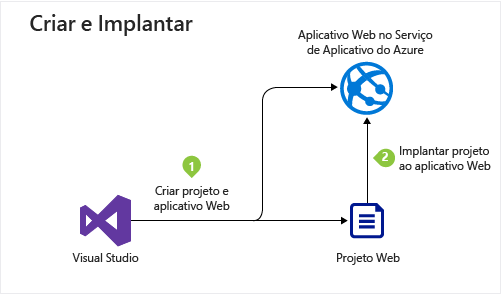

1. Abra o Visual Studio 2015.

2. Clique em **Arquivo > Novo > Projeto**.

3. Na caixa de diálogo **Novo Projeto**, clique em **Visual C# > Web > Aplicativo Web ASP .NET**. (Se preferir, você pode escolher **Visual Basic**.)

3. Verifique se o **.NET Framework 4.5.2** está selecionado como a estrutura de destino.

4.  O [Application Insights do Azure](../application-insights/app-insights-overview.md) monitora seu aplicativo Web quanto à sua disponibilidade, desempenho e utilização. A caixa de seleção **Adicionar Application Insights ao Projeto** é selecionada por padrão na primeira vez que você criar um projeto Web depois de instalar o Visual Studio. Desmarque a caixa de seleção se ela tiver selecionada, mas não desejar tentar o Application Insights.

4. Dê ao aplicativo o nome **MyExample**.

5. Clique em **OK**.

	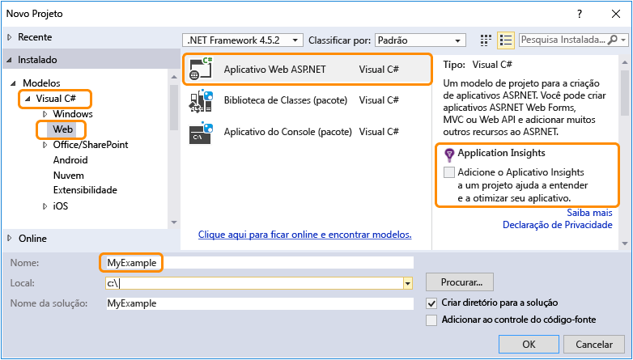

5. Na caixa de diálogo **Novo Projeto ASP.NET**, selecione o modelo **MVC**.

7. Clique em **Alterar Autenticação**.

	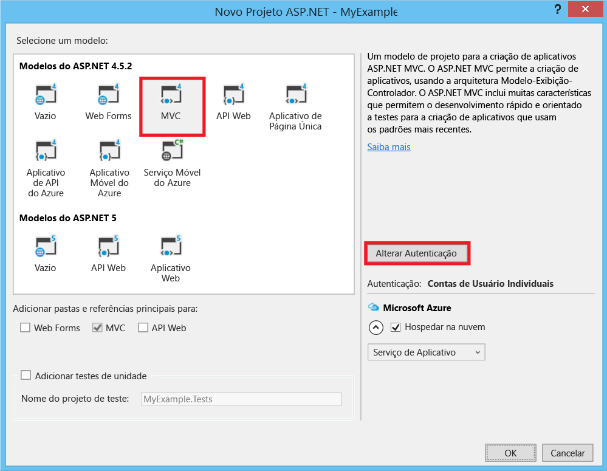

6. Na caixa de diálogo **Alterar Autenticação**, clique em **Sem Autenticação** e clique em **OK**.

	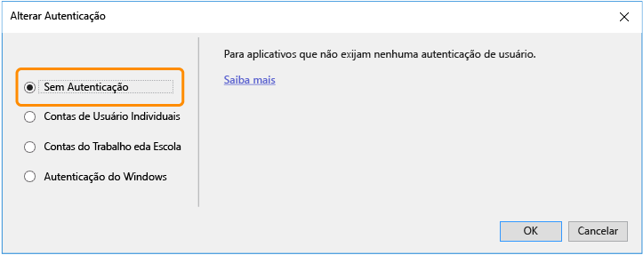

	O aplicativo que você está criando para esse tutorial é um simples que não oferece suporte a logon do usuário.

5. Na seção **Microsoft Azure** da caixa de diálogo **Novo Projeto ASP.NET**, certifique-se de que **Host na nuvem** está selecionado e que **Serviço de Aplicativo** está selecionado na lista suspensa.

	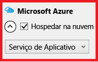

	Essas configurações direcionam o Visual Studio para criar um aplicativo Web do Azure para seu projeto Web.

6. Clique em **OK**.

5. Se você ainda não tiver entrado no Azure, o Visual Studio solicitará a você que o faça. Entre com a ID e a senha da conta que você usa para gerenciar sua assinatura do Azure.

	Quando você estiver conectado, a caixa de diálogo **Criar Serviço de Aplicativo** perguntará quais recursos você deseja criar.

	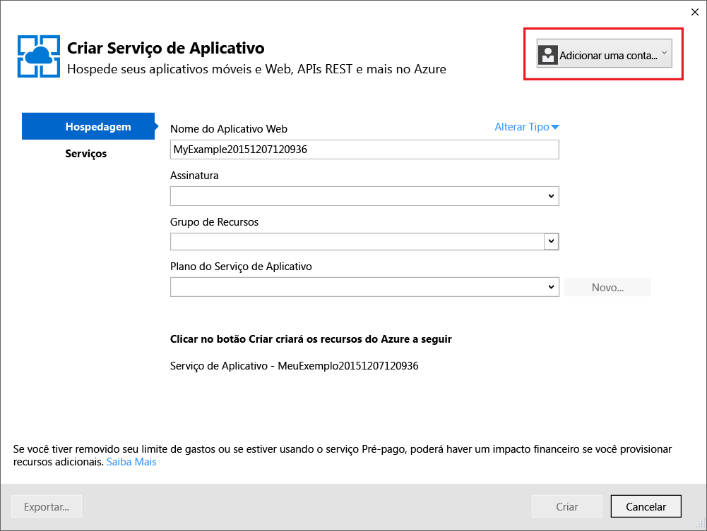

3. Na caixa de diálogo **Criar Serviço de Aplicativo**, insira um **Nome de Aplicativo Web** que seja exclusivo no domínio *azurewebsites.net*. Por exemplo, você pode denominá-lo MyExample com números à direita para torná-lo exclusivo, como MyExample810. Se um nome de Web padrão for criado para você, ele será exclusivo e você poderá usá-lo.

	Se outra pessoa já tiver usado o nome que inseriu, você verá um ponto de exclamação vermelho à direita em vez de uma marca de verificação verde, e será necessário inserir outro nome de site.

	A URL de seu aplicativo é esse nome mais *.azurewebsites.net* (conforme mostrado ao lado da caixa de texto **Nome do Aplicativo Web**). Por exemplo, se o nome for `MyExample810`, a URL será `myexample810.azurewebsites.net`.

	A seção [Próximas etapas](#next-steps) tem um link para um tutorial que explica como usar seu próprio domínio personalizado com um aplicativo Web do Azure.

6. Próximo à caixa **Grupo de Recursos**, clique em **Novo** e insira "MyExample" ou outro nome, se preferir.

	Essa caixa de combinação permite que você selecione um grupo de recursos existente ou crie um novo digitando um nome diferente de qualquer grupo de recursos existente na assinatura.

	Um grupo de recursos é uma coleção de recursos do Azure, como aplicativos Web, bancos de dados e VMs. Para um tutorial, é melhor criar um novo grupo de recursos, pois isso facilita a exclusão em uma etapa de quaisquer recursos do Azure criados para o tutorial. Para saber mais, confira [Visão geral do Azure Resource Manager](../resource-group-overview.md).

4. Clique no botão **Novo** ao lado da lista suspensa **Plano do Serviço de Aplicativo**.

	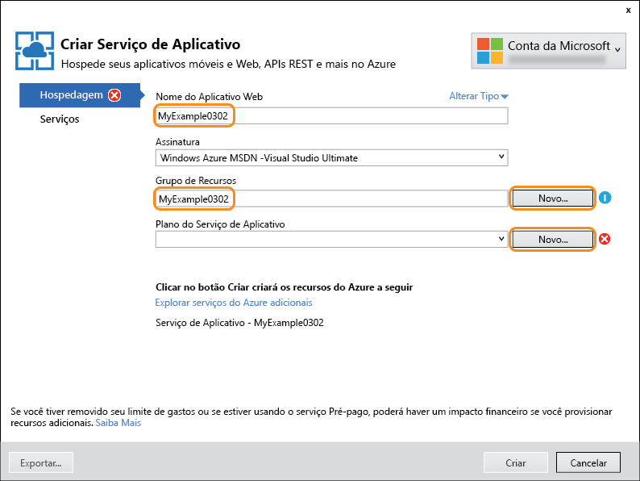

	A captura de tela mostra valores de exemplo para **Nome de Aplicativo Web**, **Assinatura** e **Grupo de Recursos** – os valores serão diferentes.

	Nas etapas a seguir, você criará um plano de Serviço de Aplicativo para o novo grupo de recursos. Um plano de Serviço de Aplicativo especifica os recursos de computação em que o aplicativo Web é executado. Por exemplo, se você escolher a camada gratuita, seu aplicativo de API será executado em VMs compartilhadas, enquanto que para algumas camadas pagas, ele é executado em VMs dedicadas. Para saber mais, confira [Visão geral dos planos do Serviço de Aplicativo](../app-service/azure-web-sites-web-hosting-plans-in-depth-overview.md).

5. No diálogo **Configurar Plano de Serviço de Aplicativo**, insira "MyExamplePlan" ou outro nome, se preferir.

5. Na lista suspensa **Local**, escolha o local mais próximo de você.

	Essa configuração especifica em qual datacenter do Azure o aplicativo será executado. Para este tutorial, você pode selecionar qualquer região e isto não fará uma diferença notável. Porém, para um aplicativo de produção, o ideal é que seu servidor esteja o mais próximo possível dos clientes que o acessam, de modo a minimizar a [latência](http://www.bing.com/search?q=web%20latency%20introduction&qs=n&form=QBRE&pq=web%20latency%20introduction&sc=1-24&sp=-1&sk=&cvid=eefff99dfc864d25a75a83740f1e0090).

5. Na lista suspensa **Tamanho**, clique em **Gratuito**.

	Neste tutorial, o tipo de preço gratuito permitirá o desempenho suficiente.

6. Na caixa de diálogo **Configurar o Plano do Serviço de Aplicativo**, clique em **OK**.

	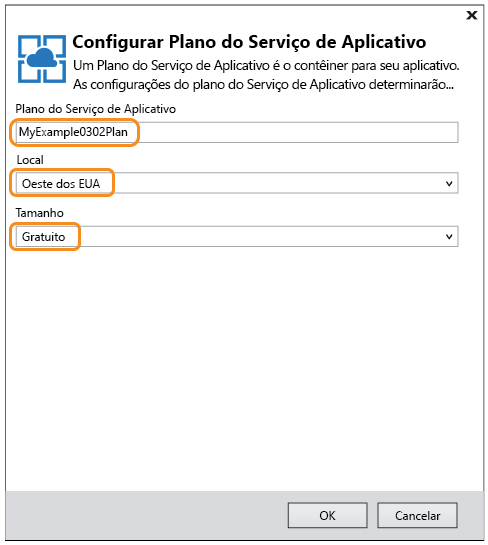

7. Na caixa de diálogo **Criar Serviço de Aplicativo**, clique em **Criar**.

	

	Em pouco tempo, geralmente menos de um minuto, o Visual Studio cria o projeto Web e o aplicativo Web.

	A janela **Gerenciador de Soluções** mostra os arquivos e as pastas no novo projeto.

	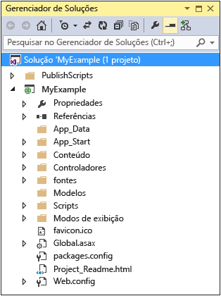

	A janela **Atividade do Serviço de Aplicativo do Azure** mostra que o aplicativo Web foi criado.

	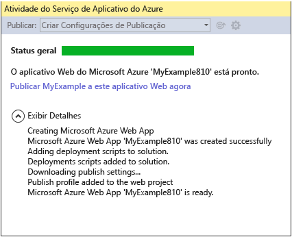

	Você pode ver o aplicativo Web na janela **Cloud Explorer** do Visual Studio.

	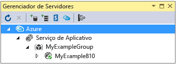
	
	Essa janela permite exibir e gerenciar uma vasta gama de recursos do Azure. A captura de tela mostra apenas aplicativos Web, mas você verá mais tipos de recursos na janela **Cloud Explorer**. Clique com o botão direito do mouse em um recurso como o aplicativo Web para ver as opções disponíveis para gerenciá-lo.

## Implantar o projeto Web no aplicativo Web do Azure

Nesta seção, você implanta o projeto Web no aplicativo Web, conforme ilustrado na etapa 2 do diagrama.

1. No **Gerenciador de Soluções**, clique com o botão direito do mouse no projeto e escolha **Publicar**.

	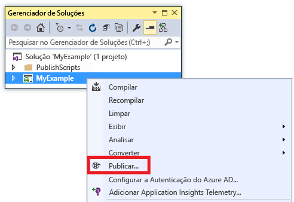

	Em poucos segundos, o assistente de **Publicar Web** é exibido. O assistente abre um *perfil de publicação* com configurações para implantar um projeto Web para o novo aplicativo Web. Se desejar implantar um aplicativo Web diferente, você pode clicar na guia **Perfil** para criar um perfil diferente. Para este tutorial, aceite as configurações que implantam o aplicativo Web criado anteriormente.

	O perfil de publicação inclui um nome de usuário e senha para a implantação. Essas credenciais foram geradas para você, e não é preciso inseri-las nem alterá-las. A senha é criptografada em um arquivo oculto específico do usuário na pasta `Properties\PublishProfiles`.

8. Na guia **Conexão** do assistente de **Publicar Web**, clique em **Avançar**.

	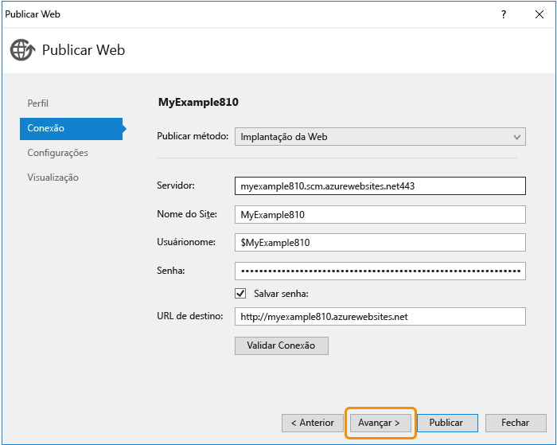

	A próxima é a guia **Configurações**. Aqui, você pode alterar a guia de configuração de compilação para implantar uma compilação de depuração para [depuração remota](../app-service-web/web-sites-dotnet-troubleshoot-visual-studio.md#remotedebug). A guia também oferece várias **Opções de Publicação do Arquivo**:

	* Remover os arquivos adicionais no destino
	* Pré-compilar durante a publicação
	* Excluir arquivos da pasta App\_Data

	Para este tutorial, você não precisará de qualquer uma delas. Para obter explicações detalhadas sobre o que elas fazem, confira [Como implantar um projeto Web usando a publicação com um clique no Visual Studio](https://msdn.microsoft.com/library/dd465337.aspx).

10. Na guia **Configurações**, clique em **Avançar**.

	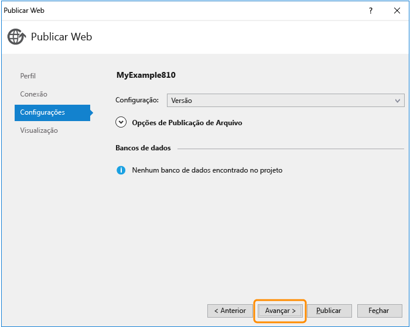

	A guia **Visualizar** é a próxima. Aqui, você tem a oportunidade de ver quais arquivos serão copiados do seu projeto para o aplicativo de API. Quando você estiver implantando um projeto para um aplicativo de API no qual já tenha implantado antes, somente os arquivos alterados serão copiados. Para ver uma lista do que será copiado, você pode clicar no botão **Iniciar Visualização**.

11. Na guia **Visualização**, clique em **Publicar**.

	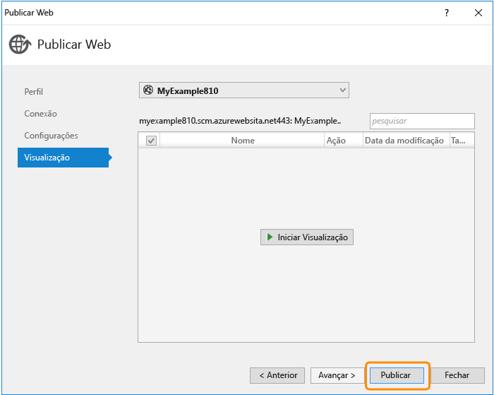

	Quando você clica em **Publicar**, o Visual Studio inicia o processo de cópia dos arquivos no servidor do Azure. Isso pode levar alguns minutos.

	As janelas **Saída** e **Atividade do Serviço de Aplicativo do Azure** mostram as ações de implantação que foram executadas e relatam a conclusão bem-sucedida da implantação.

	

	Após a implantação bem-sucedida, o navegador padrão abre automaticamente a URL do aplicativo Web implantado, e o aplicativo que você criou agora está em execução na nuvem. A URL na barra de endereços do navegador mostra que o aplicativo Web está sendo carregado da Internet.

	

> [AZURE.TIP] Você pode habilitar a barra de ferramentas **Publicação Web com um Clique** para uma implantação rápida. Clique em **Exibir > Barras de Ferramentas** e, em seguida, selecione **Publicação Web com Um Clique**. Você pode usar a barra de ferramentas para selecionar um perfil, clicar em um botão para publicar ou clicar em um botão para abrir o assistente **Publicar Web**. 

##  Monitorar e gerenciar o aplicativo Web no Portal do Azure

O [Portal do Azure](/services/management-portal/) é uma interface da Web que você pode usar para gerenciar e monitorar seus serviços do Azure, como o aplicativo Web que acabou de criar. Nesta seção do tutorial, você descobre um pouco do que pode fazer no portal.

1. No navegador, acesse [https://portal.azure.com](https://portal.azure.com) e entre com as credenciais que você usa para gerenciar sua conta do Azure.

2. Clique em **Serviços de Aplicativos** e clique no nome do seu aplicativo Web.

	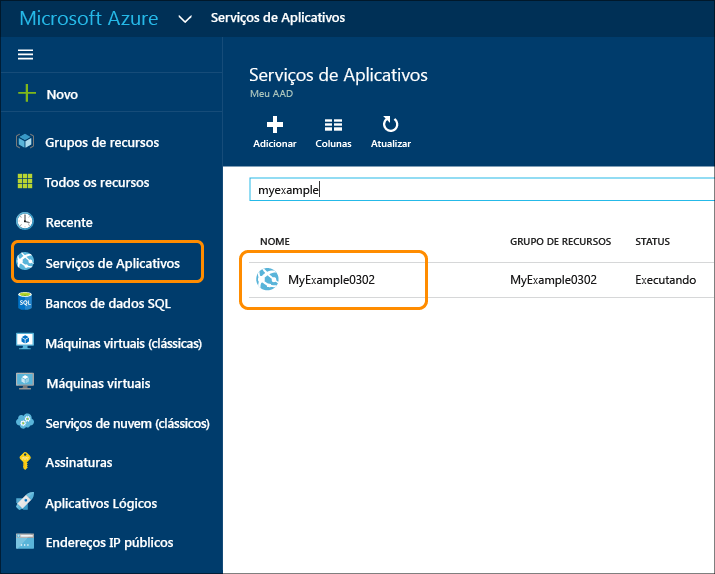

	A folha **Aplicativo Web** exibe uma visão geral das configurações e estatísticas de uso de seu aplicativo Web. (As janelas abertas à direita do portal são chamadas de *folhas*.)

	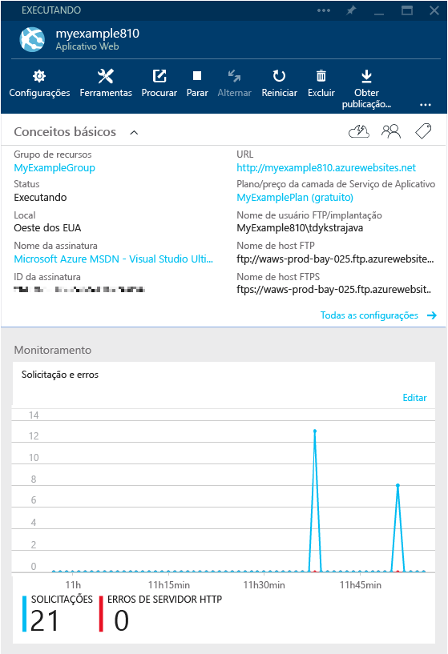

	Seu aplicativo Web não teve muito tráfego ainda e talvez não mostre nada no gráfico. Se navegar até o aplicativo, atualizar a página algumas vezes e, em seguida, atualizar a página de portal, você verá que algumas estatísticas serão mostradas.

3. A folha **Configurações** mostra mais opções para configurar o aplicativo Web.

	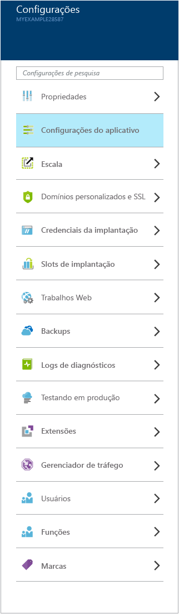

	Observe o link **Credenciais de implantação** na seção **Publicação**. É nesse local que você pode criar um nome de usuário e uma senha personalizados para a implantação. Clique no botão **Salvar** na parte superior da folha para enviar a alteração. Se criar um novo nome de usuário e senha, você precisará inserir os mesmos valores na guia **Conexão** do assistente **Publicar Web** no projeto Web.
	
	A captura de tela é apenas uma visão parcial da folha **Configurações**. Há mais seções nessa folha do que é mostrado.

4. Clique em **Configurações do aplicativo** na seção **Geral** da folha **Configurações** para ver um exemplo dos tipos de configurações que você pode definir no Portal.

	Por exemplo, você pode controlar a versão do .NET usada para o aplicativo Web, habilitar recursos como [WebSockets](/blog/2013/11/14/introduction-to-websockets-on-windows-azure-web-sites/) e definir [valores de cadeia de conexão](/blog/2013/07/17/windows-azure-web-sites-how-application-strings-and-connection-strings-work/).

	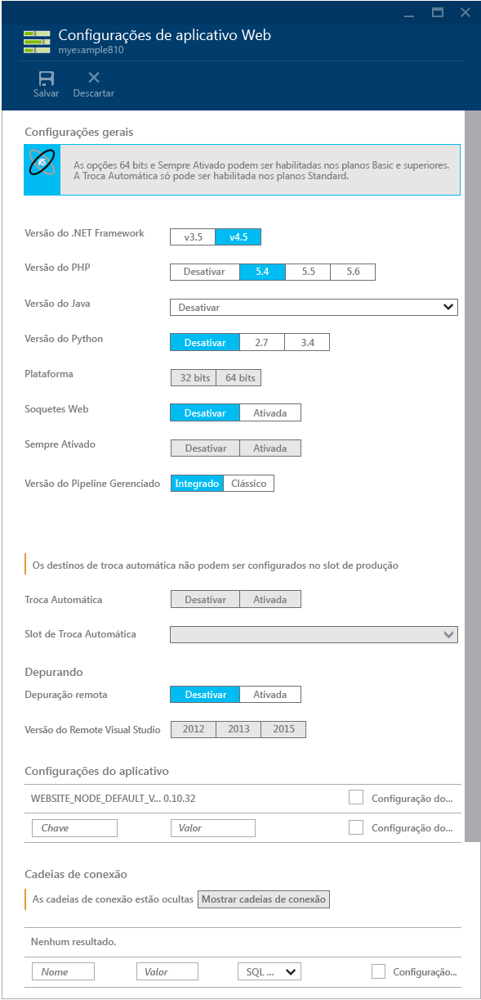

Esses são apenas alguns dos recursos do Portal. Você pode criar novos aplicativos Web, excluir aplicativos Web existentes, parar e reiniciar aplicativos Web e gerenciar outros tipos de serviços do Azure, como bancos de dados e máquinas virtuais.

## Excluir o aplicativo Web do Azure

Quando não precisar mais do aplicativo Web que criou para este tutorial, você poderá excluí-lo.

Uma maneira fácil de excluir o aplicativo Web é clicar no botão **Excluir** na parte superior da folha **Aplicativo Web** no Portal do Azure. Uma maneira mais adequada é excluir o grupo de recursos que você criou para conter o aplicativo Web. Para este tutorial, o grupo de recursos contém apenas o aplicativo Web, mas normalmente um grupo de recursos contém uma coleção de recursos relacionados. Por exemplo, o aplicativo Web pode usar um banco de dados ou uma conta de armazenamento do Azure que não são mais necessários quando você exclui o aplicativo Web. Quando você exclui um grupo de recursos, tudo o que ele contém é excluído. Para excluir um grupo de recursos usando o Portal do Azure, execute as etapas a seguir.

1. Acesse a home page do [portal do Azure](https://portal.azure.com).

2. Clique em **Grupos de Recursos**.

3. Na lista de grupos de recursos, clique no grupo de recursos que você deseja excluir.

	Quando a folha **Grupo de Recursos** for exibida, incluirá uma lista dos recursos que contém.

4. Na folha **Grupo de Recursos**, clique em **Excluir**.

	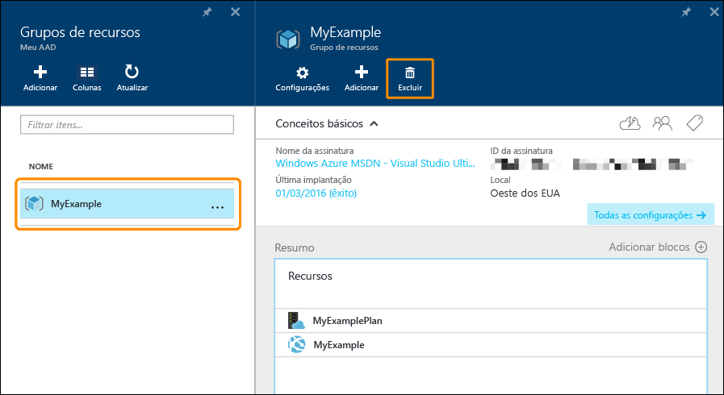

## Solucionar problemas

Se encontrar um problema ao percorrer este tutorial, verifique se você está usando a versão mais recente do SDK do Azure para .NET. A maneira mais fácil de fazer isso é [baixar o SDK do Azure para Visual Studio 2015](http://go.microsoft.com/fwlink/?linkid=518003). Se você tiver a versão atual instalada, o Web Platform Installer avisará que nenhuma instalação é necessária.

Se você estiver em uma rede corporativa e estiver tentando implantar no Serviço de Aplicativo do Azure por meio de um firewall, verifique se as portas 443 e 8172 estão abertas para implantação na Web. Se não for possível abrir essas portas, confira a seção Próximas etapas a seguir para obter outras opções de implantação.

Quando seu aplicativo Web do ASP.NET estiver em execução no Serviço de Aplicativo do Azure, procure saber mais sobre os recursos do Visual Studio que simplificam a solução de problemas. Para saber mais sobre o registro em log, a depuração remota e muito mais, confira [Solução de problemas de aplicativos Web do Azure no Visual Studio](web-sites-dotnet-troubleshoot-visual-studio.md).

## Próximas etapas

Neste tutorial, você viu como criar um aplicativo Web simples e implantá-lo em um aplicativo Web do Azure. Aqui estão alguns recursos e tópicos relacionados para aprender mais sobre o Serviço de Aplicativo do Azure:

* Como implantar um projeto Web existente em um novo aplicativo Web

	Para iniciar o processo de implantação de um projeto Web existente, clique com o botão direito do mouse no projeto no **Gerenciador de Soluções** e clique em **Publicar**. Escolha **Serviço de Aplicativo do Microsoft Azure** como destino de publicação. Em seguida, escolha um aplicativo Web do Azure existente como destino ou clique em **Novo** para criar um novo. Se você clicar em **Novo** para criar um novo, o processo será o mesmo que foi visto neste tutorial.

* Outras maneiras de criar aplicativos Web

	Você também pode criar aplicativos Web usando o [Portal do Azure](https://portal.azure.com/), os [cmdlets do Azure para o Windows PowerShell](../powershell-install-configure.md) ou a [interface de linha de comando de plataforma cruzada](../xplat-cli.md).

* Como criar aplicativos de API

	Você viu como criar uma instância do Serviço de Aplicativo do Azure que é destinada principalmente para hospedar um site. Essas instâncias são chamadas de aplicativos Web. Serviço de Aplicativo também tem recursos projetados para facilitar o desenvolvimento, teste e hospedagem de APIs. Instâncias do Serviço de Aplicativo voltadas principalmente para hospedar APIs são chamadas de aplicativos de API. Para saber mais, confira [Introdução aos Aplicativos de API e ao ASP.NET no Serviço de Aplicativo do Azure](../app-service-api/app-service-api-dotnet-get-started.md).

* Outras maneiras de implantar um projeto Web

	Para saber mais sobre outras maneiras de implantar projetos Web em aplicativos Web, usando o Visual Studio ou [automatizando a implantação](http://www.asp.net/aspnet/overview/developing-apps-with-windows-azure/building-real-world-cloud-apps-with-windows-azure/continuous-integration-and-continuous-delivery) de um [sistema de controle do código-fonte](http://www.asp.net/aspnet/overview/developing-apps-with-windows-azure/building-real-world-cloud-apps-with-windows-azure/source-control), confira [Como implantar um aplicativo Web do Azure](web-sites-deploy.md).

* Como adicionar um nome de domínio personalizado e SSL

	Para obter informações sobre como utilizar SSL e seu próprio domínio (por exemplo www.contoso.com, em vez de contoso.azurewebsites.net), consulte os recursos a seguir:

	* [Configurar um nome de domínio personalizado no Serviço de Aplicativo do Azure](web-sites-custom-domain-name.md)
	* [Habilitar HTTPS para um site do Azure](web-sites-configure-ssl-certificate.md)

* Como adicionar recursos em tempo real como chat

	Para recursos em tempo real, como um serviço de chat, um jogo ou cotações da bolsa, você pode obter o melhor desempenho utilizando [ASP.NET SignalR](http://www.asp.net/signalr) com o método de transporte [WebSockets](/blog/2013/11/14/introduction-to-websockets-on-windows-azure-web-sites/). Para obter mais informações, consulte [Usando SignalR com aplicativos Web do Azure](http://www.asp.net/signalr/overview/signalr-20/getting-started-with-signalr-20/using-signalr-with-windows-azure-web-sites).

* Como escolher entre o Serviço de Aplicativo, os Serviços de Nuvem e as Máquinas Virtuais do Azure para aplicativos Web

	No Azure, você pode executar aplicativos Web em aplicativos Web do Serviço de Aplicativo, conforme mostrado neste tutorial, em Serviços de Nuvem ou Máquinas Virtuais. Para saber mais, confira [Aplicativos Web do Azure, serviços de nuvem e VMs: qual deles usar e quando](/manage/services/web-sites/choose-web-app-service/).

<!---HONumber=AcomDC_0323_2016-->