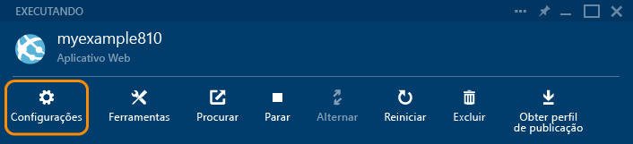

<properties
	pageTitle="Criar um aplicativo Web ASP.NET no Serviço de Aplicativo do Azure | Microsoft Azure"
	description="Este tutorial mostra como criar um projeto Web ASP.NET no Visual Studio 2013 e implantá-lo em um aplicativo Web no Serviço de Aplicativo do Azure."
	services="app-service\web"
	documentationCenter=".net"
	authors="tdykstra"
	manager="wpickett"
	editor="jimbe"/>

<tags
	ms.service="app-service-web"
	ms.workload="web"
	ms.tgt_pltfrm="na"
	ms.devlang="dotnet"
	ms.topic="hero-article"
	ms.date="08/10/2015"
	ms.author="tdykstra"/>

# Criar um aplicativo Web ASP.NET no Serviço de Aplicativo do Azure

> [AZURE.SELECTOR]
- [.Net](web-sites-dotnet-get-started.md)
- [Node.js](web-sites-nodejs-develop-deploy-mac.md)
- [Java](web-sites-java-get-started.md)
- [PHP - Git](web-sites-php-mysql-deploy-use-git.md)
- [PHP - FTP](web-sites-php-mysql-deploy-use-ftp.md)
- [Python](web-sites-python-ptvs-django-mysql.md)

## Visão geral

Este tutorial mostra como criar um aplicativo Web ASP.NET e implantá-lo no [aplicativo Web do Serviço de Aplicativo do Azure](app-service-web-overview.md) usando o Visual Studio 2015 ou o Visual Studio 2013. O tutorial presume que você não tem experiência anterior com o uso do Azure ou do ASP.NET. Ao concluir o tutorial, você terá um aplicativo Web simples em funcionamento na nuvem.

A ilustração a seguir mostra o aplicativo concluído:

O que você aprenderá:

* Como preparar seu computador para desenvolvimento do Azure ao instalar o [SDK do Azure para .NET](../dotnet-sdk/).
* Como configurar o Visual Studio para criar um novo aplicativo Web do Serviço de Aplicativo enquanto ele cria um projeto Web.
* Como implantar um projeto Web em um aplicativo Web do Serviço de Aplicativo usando o Visual Studio.
* Como usar o [Portal do Azure](/overview/preview-portal/) para monitorar e gerenciar seu aplicativo Web.

Este tutorial não ensina a escrever código para personalizar o aplicativo Web. Para ver um tutorial mais avançado que mostra como começar a trabalhar com um banco de dados e autenticar usuários, consulte [Implantar um aplicativo MVC ASP.NET seguro com associação, OAuth e Banco de Dados SQL em um aplicativo Web do Azure](/develop/net/tutorials/web-site-with-sql-database/).

##Inscrever-se no Microsoft Azure

Você precisa de uma conta do Azure para concluir este tutorial. Você pode:

* [Abrir uma conta do Azure gratuitamente](/pricing/free-trial/?WT.mc_id=A261C142F). Obtenha créditos que pode usar para testar os serviços pagos do Azure. Mesmo depois que os créditos são usados, você pode manter a conta e usar os serviços e recursos do Azure gratuitos, como o recurso de aplicativos Web do Serviço de Aplicativo do Azure.
* [Ativar os benefícios de assinante do MSDN](/pricing/member-offers/msdn-benefits-details/?WT.mc_id=A261C142F). - todos os meses, sua assinatura do MSDN lhe oferece créditos que podem ser usados para serviços pagos do Azure.

> [AZURE.NOTE]Se você deseja começar com o Serviço de Aplicativo do Azure antes de inscrever-se em uma conta do Azure, vá para [Experimentar o Serviço de Aplicativo](http://go.microsoft.com/fwlink/?LinkId=523751). Lá, você poderá criar imediatamente um aplicativo Web de curta duração inicial no Serviço de Aplicativo – sem exigência de cartão de crédito e sem compromissos.

Neste vídeo, Scott Hanselman mostra como é fácil inscrever-se para uma avaliação gratuita do Microsoft Azure. (Duração: 1:58)

> [AZURE.VIDEO sign-up-for-microsoft-azure]

[AZURE.INCLUDE [install-sdk-2015-2013](../../includes/install-sdk-2015-2013.md)]

## Criar um projeto e um aplicativo Web

A primeira etapa é criar um projeto Web no Visual Studio e um aplicativo Web no serviço de aplicativo do Azure. Quando isso for feito, você implantará o projeto para o aplicativo Web para disponibilizá-lo na Internet.

O diagrama ilustra o que você está fazendo nas etapas de criação e implantação.

1. Abra o Visual Studio 2015 ou Visual Studio 2013.

	Se você usar o Visual Studio 2013, as telas serão um pouco diferentes das capturas de tela, mas os procedimentos são essencialmente os mesmos.

2. No menu **Arquivo**, clique em **Novo > Projeto**.

3. Na caixa de diálogo **Novo Projeto**, clique em **C# > Web > Aplicativo Web ASP.NET**. Se preferir, você pode escolher **Visual Basic**.

3. Verifique se o **.NET Framework 4.5.2** está selecionado como a estrutura de destino.

4.  O [Application Insights do Azure](app-insights-overview.md) monitora seu aplicativo Web quanto à sua disponibilidade, desempenho e utilização. Desmarque a caixa de seleção **Adicionar Application Insights ao projeto** se você não quiser experimentá-lo.

4. Nomeie o aplicativo **MyExample**.

5. Clique em **OK**.

	

5. Na caixa de diálogo **Novo Projeto ASP.NET**, selecione o modelo **MVC**.

	O [MVC](http://www.asp.net/mvc) é uma estrutura ASP.NET para o desenvolvimento de aplicativos Web.

7. Clique em **Alterar Autenticação**.

	

6. Na caixa de diálogo **Alterar Autenticação**, clique em **Sem Autenticação** e clique em **OK**.

	

	O aplicativo de exemplo que você está criando não habilitará os usuários a fazer logon. A seção [Próximas etapas](#next-steps) tem links para um tutorial que implementa a autenticação e a autorização.

5. Na caixa de diálogo **Novo Projeto ASP.NET**, deixe as configurações em **Microsoft Azure** inalteradas e clique em **OK**.

	

	As configurações padrão especificam que o Visual Studio crie um aplicativo Web do Azure para seu projeto Web. Na próxima seção do tutorial, você implantará o projeto Web para o aplicativo Web recém-criado.

5. Se você ainda não tiver entrado no Azure, o Visual Studio solicitará a você que o faça. Entre com a ID e a senha da conta que você usa para gerenciar sua assinatura do Azure.

	Quando você estiver conectado, a caixa de diálogo **Definir configurações de Aplicativo Web do Microsoft Azure** perguntará quais recursos você deseja criar.

	

3. Na caixa de diálogo **Definir as configurações de aplicativo Web do Microsoft Azure**, digite um **nome do aplicativo Web** que seja exclusivo no domínio *azurewebsites.net*. Por exemplo, você pode denominá-lo MyExample com números à direita para torná-lo exclusivo, como MyExample810. Se um nome de Web padrão for criado para você, ele será exclusivo e você poderá usá-lo.

	Se outra pessoa já tiver usado o nome que inseriu, você verá um ponto de exclamação vermelho à direita em vez de uma marca de verificação verde e precisará inserir outro nome de site.

	O Azure usará esse nome como o prefixo para a URL do aplicativo. A URL completa consistirá nesse nome, mais *.azurewebsites.net* (conforme mostrado ao lado da caixa de texto **Nome do Aplicativo Web**). Por exemplo, se o nome for `MyExample810`, a URL será `MyExample810.azurewebsites.net`. A URL precisa ser exclusiva.

4. No menu suspenso **Plano de Serviço do Aplicativo**, selecione **Criar novo plano de Serviço de Aplicativo**.

	A seção [Próximas etapas](#next-steps) tem links para informações sobre planos de Serviço de Aplicativo.

5. Digite **MyExamplePlan** ou outro nome, se preferir, para o nome do plano.

6. No menu suspenso **Grupo de recursos**, selecione **Criar novo grupo de recursos**.

	A seção [Próximas etapas](#next-steps) tem links para informações sobre grupos de recursos.

5. Digite **MyExampleGroup** ou outro nome, se preferir, para o nome do grupo de recursos.

5. Na lista suspensa **Região**, escolha o local mais próximo de você.

	Essa configuração especifica em qual datacenter do Azure seu aplicativo Web será executado. Para este tutorial, você pode selecionar qualquer região e isto não fará uma diferença notável. Para um aplicativo Web de produção, você quer seu servidor Web esteja tão próximo quanto possível dos navegadores acessando seu site, para reduzir a [latência](http://www.bing.com/search?q=web%20latency%20introduction&qs=n&form=QBRE&pq=web%20latency%20introduction&sc=1-24&sp=-1&sk=&cvid=eefff99dfc864d25a75a83740f1e0090).

5. Deixe o campo de banco de dados inalterado.

	Para este tutorial, você não está usando um banco de dados. A seção [Próximas etapas](#next-steps) leva a um tutorial que mostra como usar um banco de dados.

6. Clique em **OK**.

	

	Em poucos segundos, o Visual Studio cria o projeto Web na pasta especificada e cria o aplicativo Web na região do Azure que você especificou.

	A janela **Gerenciador de Soluções** mostra os arquivos e as pastas no novo projeto.

	

	A janela **Atividade do Serviço de Aplicativo do Azure** mostra que o aplicativo Web foi criado.

	

	Você pode ver o aplicativo Web no **Gerenciador de Servidores**.

	

## Implantar o projeto para o aplicativo Web

Nesta seção, você implanta projeto Web para o aplicativo Web, como ilustrado na etapa 2 do diagrama.

1. No **Gerenciador de Soluções**, clique com o botão direito do mouse no projeto e escolha **Publicar**.

	

	Em poucos segundos, o assistente de **Publicar Web** é exibido. O assistente abre um *perfil de publicação* que tem configurações para implantar um projeto Web para o novo aplicativo Web. Se desejar implantar um aplicativo Web diferente, você pode clicar na guia **Perfil** para criar um perfil diferente. Para este tutorial, você aceitará as configurações que implantam o aplicativo Web que você criou anteriormente.

8. Na guia **Conexão** do assistente **Publicar Web**, clique em **Avançar**.

	

10. Na guia **Configurações**, clique em **Avançar**.

	Você pode aceitar os valores padrão para **Configuração** e **Opções de Publicação de Arquivos**.

	Você pode usar o menu suspenso **Configuração** para implantar uma compilação de Depuração para depuração remota. A seção [Próximas etapas](#next-steps) vincula a um tutorial que mostra como executar o Visual Studio no modo de depuração remotamente.

	

11. Na guia **Visualização**, clique em **Publicar**.

	Se você quiser ver quais arquivos serão copiados para o Azure, clique em **Iniciar Visualização** antes de clicar em **Publicar**.

	

	Quando você clica em **Publicar**, o Visual Studio inicia o processo de cópia dos arquivos no servidor do Azure.

	As janelas **Saída** e **Atividade do Serviço de Aplicativo do Azure** mostram as ações de implantação que foram executadas e relatam a conclusão bem-sucedida da implantação.

	

	Após a implantação bem-sucedida, o navegador padrão abre automaticamente a URL do aplicativo Web implantado, e o aplicativo que você criou agora está em execução na nuvem. A URL na barra de endereços do navegador mostra que o aplicativo Web está sendo carregado da Internet.

	

13. Feche o navegador.

**Dica:** você pode habilitar a barra de ferramentas **Publicação Web com um Clique** para uma implantação ainda mais rápida. Clique em **Exibir > Barras de Ferramentas** e, em seguida, selecione **Publicação Web com Um Clique**. Você pode usar a barra de ferramentas para selecionar um perfil, clique em um botão para publicar ou clique em um botão para abrir o assistente **Publicar Web**.

## Monitore e gerencie o aplicativo Web no Portal do Azure

O [Portal do Azure](/services/management-portal/) é uma interface da Web que você pode usar para gerenciar e monitorar seus serviços do Azure, como o aplicativo Web que acabou de criar. Nesta seção do tutorial, você descobre um pouco do que pode fazer no portal.

1. Em seu navegador, vá até [https://portal.azure.com](https://portal.azure.com) e entre com suas credenciais do Azure.

2. Clique em **Aplicativos Web** e, em seguida, clique no nome do seu aplicativo Web.

	A folha **Aplicativo Web** exibe uma visão geral das configurações e estatísticas de uso de seu aplicativo Web.

	

	Nesse ponto, seu aplicativo Web ainda não teve muito tráfego e pode não mostrar nada no gráfico. Se navegar até o aplicativo, atualizar a página algumas vezes e, em seguida, atualizar a página de portal, você verá que algumas estatísticas serão mostradas.

3. Clique em **Configurações** para ver mais opções para configurar seu aplicativo Web.

	

	Você verá uma lista dos tipos de configurações.

	

4. Clique em **Configurações do aplicativo** para ver um exemplo dos tipos de configurações que você pode definir no portal.

	Por exemplo, você pode controlar a versão do .NET usada para o aplicativo Web, habilitar recursos como [WebSockets](/blog/2013/11/14/introduction-to-websockets-on-windows-azure-web-sites/) e definir [valores de cadeia de conexão](/blog/2013/07/17/windows-azure-web-sites-how-application-strings-and-connection-strings-work/).

	

Esses são apenas alguns dos recursos do portal. Você pode criar novos aplicativos Web, excluir aplicativos Web existentes, parar e reiniciar aplicativos Web e gerenciar outros tipos de serviços do Azure, como bancos de dados e máquinas virtuais.

## Próximas etapas

Neste tutorial, você viu como criar um aplicativo Web simples e implantá-lo em um aplicativo Web do Azure. Aqui estão alguns recursos e tópicos relacionados para aprender mais sobre aplicativos Web no Serviço de Aplicativo do Azure:

* Como adicionar funcionalidade de banco de dados e autorização

	Para obter um tutorial que mostra como acessar um banco de dados e restringir algumas funções de aplicativo a usuários autorizados, consulte [Implantar um aplicativo ASP.NET MVC seguro com associação, OAuth e Banco de Dados SQL em um aplicativo Web do Azure](/develop/net/tutorials/web-site-with-sql-database/).

* Outras maneiras de implantar um projeto Web

	Para obter informações sobre outras maneiras de implantar projetos em aplicativos Web, usando o Visual Studio ou [automatizando a implantação](http://www.asp.net/aspnet/overview/developing-apps-with-windows-azure/building-real-world-cloud-apps-with-windows-azure/continuous-integration-and-continuous-delivery) de um [sistema de controle do código-fonte](http://www.asp.net/aspnet/overview/developing-apps-with-windows-azure/building-real-world-cloud-apps-with-windows-azure/source-control), consulte [Como implantar um aplicativo Web do Azure](web-sites-deploy.md).

	O Visual Studio também pode gerar scripts do Windows PowerShell, que permitem a você automatizar a implantação. Para obter mais informações, consulte [Automatizar tudo (Compilando aplicativos de nuvem do mundo real com o Azure) ](http://www.asp.net/aspnet/overview/developing-apps-with-windows-azure/building-real-world-cloud-apps-with-windows-azure/automate-everything).

* Como solucionar problemas de um aplicativo Web

	O Visual Studio fornece ferramentas que facilitam a exibição dos logs do Azure à medida que são gerados em tempo real. Você também pode executar em modo de depuração remotamente no Azure. Para obter mais informações, consulte [Solucionando problemas de aplicativos Web do Azure no Visual Studio](web-sites-dotnet-troubleshoot-visual-studio.md).

* Como adicionar um nome de domínio personalizado e SSL

	Para obter informações sobre como utilizar SSL e seu próprio domínio (por exemplo www.contoso.com, em vez de contoso.azurewebsites.net), consulte os recursos a seguir:

	* [Configurar um nome de domínio personalizado no Serviço de Aplicativo do Azure](web-sites-custom-domain-name.md)
	* [Habilitar HTTPS para um site do Azure](web-sites-configure-ssl-certificate.md)

* Como adicionar recursos em tempo real como chat

	Se o aplicativo Web incluirá recursos em tempo real (como um serviço de chat, um jogo, um indicador de ações, entre outros), você pode obter o melhor desempenho utilizando o [ASP.NET SignalR](http://www.asp.net/signalr) com o método de transporte [WebSockets](/blog/2013/11/14/introduction-to-websockets-on-windows-azure-web-sites/). Para obter mais informações, consulte [Usando SignalR com aplicativos Web do Azure](http://www.asp.net/signalr/overview/signalr-20/getting-started-with-signalr-20/using-signalr-with-windows-azure-web-sites).

* Como escolher entre o Serviço de Aplicativo, os Serviços de Nuvem e as Máquinas Virtuais do Azure para aplicativos Web

	No Azure, você pode executar aplicativos Web em aplicativos Web do Serviço de Aplicativo, conforme mostrado neste tutorial, em Serviços de Nuvem ou Máquinas Virtuais. Para obter mais informações, confira [Aplicativos Web do Azure, serviços de nuvem e VMs: quando usar cada um?](/manage/services/web-sites/choose-web-app-service/).

* [Como escolher ou criar um plano de Serviço de Aplicativo](../app-service/azure-web-sites-web-hosting-plans-in-depth-overview.md)

* [Como escolher ou criar um grupo de recursos](../azure-preview-portal-using-resource-groups.md)

## O que mudou
* Para ver um guia sobre a alteração de Sites para o Serviço de Aplicativo, confira: [Serviço de Aplicativo do Azure e os serviços existentes do Azure](http://go.microsoft.com/fwlink/?LinkId=529714).
* Para obter um guia sobre a alteração do portal do Azure para o portal de visualização, consulte [Referência para navegar no portal do Azure](http://go.microsoft.com/fwlink/?LinkId=529715).

<!---HONumber=Oct15_HO1-->