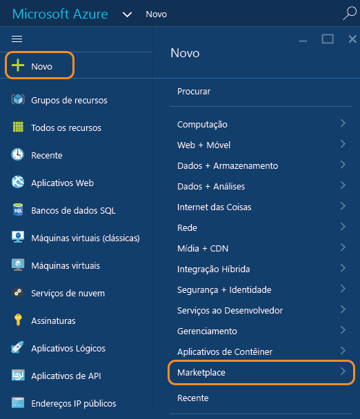
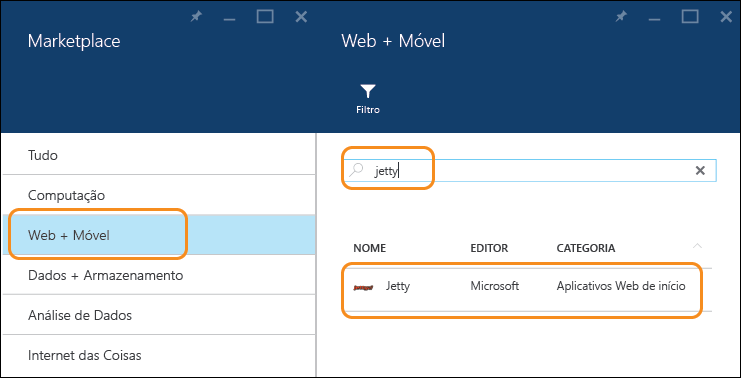
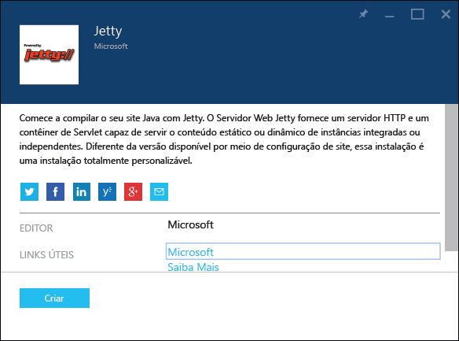
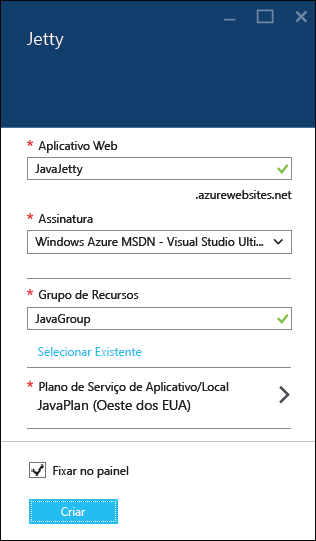
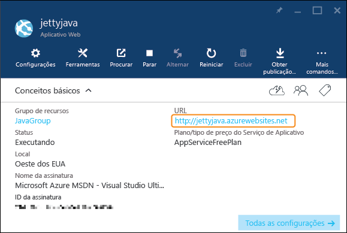

<properties
	pageTitle="Criar um aplicativo Web Java no Serviço de Aplicativo do Azure | Microsoft Azure"
	description="Este tutorial mostra como implantar um aplicativo Web do Java no Serviço de Aplicativo do Azure."
	services="app-service\web"
	documentationCenter="java"
	authors="rmcmurray"
	manager="wpickett"
	editor="jimbe"/>
<tags
	ms.service="app-service-web"
	ms.workload="web"
	ms.tgt_pltfrm="na"
	ms.devlang="Java"
	ms.topic="hero-article"
	ms.date="08/31/2015"
	ms.author="robmcm"/>

# Criar um aplicativo Web do Java no Serviço de Aplicativo do Azure

> [AZURE.SELECTOR]
- [.Net](web-sites-dotnet-get-started.md)
- [Node.js](web-sites-nodejs-develop-deploy-mac.md)
- [Java](web-sites-java-get-started.md)
- [PHP - Git](web-sites-php-mysql-deploy-use-git.md)
- [PHP - FTP](web-sites-php-mysql-deploy-use-ftp.md)
- [Python](web-sites-python-ptvs-django-mysql.md)

Este tutorial mostra como criar um [Aplicativo Web no Serviço de Aplicativo do Azure](http://go.microsoft.com/fwlink/?LinkId=529714) usando o portal de visualização do Azure. Você pode escolher um modelo de aplicativo Web no Azure Marketplace ou criar um aplicativo Web genérico e configurá-lo manualmente para Java.

Se você não quiser usar nenhuma dessas técnicas, por exemplo, se você desejar personalizar seu contêiner de aplicativos, consulte [Carregar um aplicativo Web Java personalizado no Azure](web-sites-java-custom-upload.md).

> [AZURE.NOTE]Para concluir este tutorial, você precisa de uma conta do Microsoft Azure. Se não tiver uma conta, você poderá [ativar os benefícios de assinante MSDN][] ou [inscrever-se para uma avaliação gratuita][].
>
> Se você quiser ter uma introdução ao Serviço de Aplicativo do Azure antes de se inscrever em uma conta do Azure, vá para [Experimentar o Serviço de Aplicativo][]. Lá, você poderá criar imediatamente um aplicativo Web de curta duração inicial no Serviço de Aplicativo – sem exigência de cartão de crédito e sem compromissos.

## Escolha um modelo de aplicativo Web do Azure Marketplace

Esta seção mostra como usar o Azure Marketplace para criar um aplicativo Web Java.

1. Entre no [Portal de visualização do Azure](https://portal.azure.com/).

2. Clique em **Novo > Marketplace**.

	

5. Clique em **Web + Móvel**.

	Talvez seja necessário rolar para a esquerda para ver a folha **Marketplace**, onde você pode selecionar **Web + Móvel**.

6. Na caixa de texto de pesquisa, insira o nome de um servidor de aplicativos Java, como o **Apache Tomcat** ou o **Jetty** e pressione Enter.

4. Nos resultados da pesquisa, clique no servidor de aplicativos Java.

	

5. Na primeira folha **Apache Tomcat** ou **Jetty**, clique em **Criar**.

	

4. Na próxima folha **Apache Tomcat** ou **Jetty**, insira um nome para o aplicativo Web na caixa **Aplicativo Web**.

	Esse nome deve ser exclusivo no domínio azurewebsites.net porque a URL do aplicativo Web será {nome}.azurewebsites.net. Se o nome inserido não for exclusivo, um ponto de exclamação vermelho aparecerá na caixa de texto.

5. Selecione um **Grupo de Recursos** ou crie um novo.

	Para saber mais sobre grupos de recursos, confira [Usando o Portal de Visualização do Azure para gerenciar os recursos do Azure](../resource-group-portal.md).

5. Selecione um **Plano/Local do Serviço de Aplicativo** ou crie um novo.

	Para saber mais sobre os planos do Serviço de Aplicativo, confira [Visão geral dos planos do Serviço de Aplicativo do Azure](../azure-web-sites-web-hosting-plans-in-depth-overview.md)

6. Clique em **Criar**.

	

	Em pouco tempo, normalmente menos de um minuto, o Azure termina de criar o novo aplicativo Web.

7. Clique em **Aplicativos Web > {seu novo aplicativo Web}**.

8. Clique na **URL** para navegar até o novo site.

	

	Se você tiver escolhido o Tomcat, verá uma página semelhante ao exemplo a seguir.

	

	Se você tiver escolhido o Jetty, verá uma página semelhante ao exemplo a seguir.

	

Agora que você criou o aplicativo Web com um contêiner de aplicativos, confira a seção [Próximas etapas](#next-steps) para obter informações sobre como carregar seu aplicativo no aplicativo Web.

## Criar um aplicativo Web e configurá-lo manualmente para Java

Esta seção mostra como criar um aplicativo Web e configurá-lo manualmente para Java.

1. Entre no [Portal de visualização do Azure](https://portal.azure.com/).

2. Clique em **Novo > Web + Móvel**.

6. Clique em **Aplicativo Web**.

4. Insira um nome para o aplicativo Web na caixa **Aplicativo Web**.

	Esse nome deve ser exclusivo no domínio azurewebsites.net porque a URL do aplicativo Web será {nome}.azurewebsites.net. Se o nome inserido não for exclusivo, um ponto de exclamação vermelho aparecerá na caixa de texto.

5. Selecione um **Grupo de Recursos** ou crie um novo.

	Para saber mais sobre grupos de recursos, confira [Usando o Portal de Visualização do Azure para gerenciar os recursos do Azure](../resource-group-portal.md).

5. Selecione um **Plano/Local do Serviço de Aplicativo** ou crie um novo.

	Para saber mais sobre os planos do Serviço de Aplicativo, confira [Visão geral dos planos do Serviço de Aplicativo do Azure](../azure-web-sites-web-hosting-plans-in-depth-overview.md)

6. Clique em **Criar**.
 
11. Quando o aplicativo Web tiver sido criado, clique em **Aplicativos Web > {seu aplicativo Web}**.
 
13. Na folha **Aplicativo Web**, clique em **Configurações**.

12. Clique em **Configurações do aplicativo**.

13. Clique na **Versão Java** desejada.

14. Selecione o **Contêiner da Web** desejado.

15. Clique em **Salvar**.

	Em poucos instantes, o aplicativo Web se tornará baseado em Java.

7. Clique em **Aplicativos Web > {seu novo aplicativo Web}**.

8. Clique na **URL** para navegar até o novo site.

	A página da Web confirma que você criou um aplicativo Web baseado em Java.

## Próximas etapas

Neste ponto, você tem um servidor de aplicativos Java em execução em seu aplicativo Web no Serviço de Aplicativo do Azure. Para adicionar seu próprio código ao aplicativo Web, confira [Adicionar um aplicativo ou uma página da Web ao seu aplicativo Web Java](web-sites-java-add-app.md).

Para saber mais sobre o desenvolvimento de aplicativos Java no Azure, confira o [Centro de Desenvolvedores do Java](/develop/java/).

<!-- External Links -->
[ativar os benefícios de assinante MSDN]: http://go.microsoft.com/fwlink/?LinkId=623901
[inscrever-se para uma avaliação gratuita]: http://go.microsoft.com/fwlink/?LinkId=623901

[Experimentar o Serviço de Aplicativo]: http://go.microsoft.com/fwlink/?LinkId=523751

<!---HONumber=Oct15_HO4-->