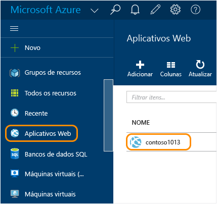
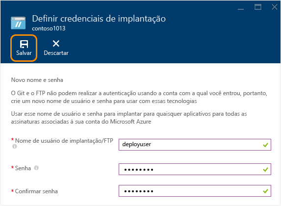
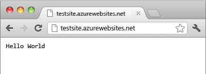

<properties
	pageTitle="Criar um aplicativo Web Node.js no Serviço de Aplicativo do Azure | Microsoft Azure"
	description="Saiba como implantar um aplicativo do Node.js em um aplicativo Web no Serviço de Aplicativo do Azure."
	services="app-service\web"
	documentationCenter="nodejs"
	authors="rmcmurray"
	manager="wpickett"
	editor=""/>

<tags
	ms.service="app-service-web"
	ms.workload="web"
	ms.tgt_pltfrm="na"
	ms.devlang="nodejs"
	ms.topic="hero-article"
	ms.date="11/20/2015"
	ms.author="robmcm"/>

# Criar um aplicativo Web do Node.js no Serviço de Aplicativo do Azure

> [AZURE.SELECTOR]
- [.Net](web-sites-dotnet-get-started.md)
- [Node.js](web-sites-nodejs-develop-deploy-mac.md)
- [Java](web-sites-java-get-started.md)
- [PHP - Git](web-sites-php-mysql-deploy-use-git.md)
- [PHP - FTP](web-sites-php-mysql-deploy-use-ftp.md)
- [Python](web-sites-python-ptvs-django-mysql.md)

Este tutorial mostra como criar um aplicativo [Node.js](http://nodejs.org) simples e implantá-lo em um [aplicativo Web](app-service-web-overview.md) no [Serviço de Aplicativo do Azure](../app-service/app-service-value-prop-what-is.md) usando [Git](http://git-scm.com). As instruções deste tutorial podem ser seguidas em qualquer sistema operacional que seja capaz de executar o Node.js.

O que você aprenderá:

* Como criar um aplicativo Web no Serviço de Aplicativo do Azure usando o Portal do Azure.
* Como implantar um aplicativo do Node.js para o aplicativo Web por push no repositório do Git do aplicativo Web.

O aplicativo concluído grava uma cadeia de caracteres curta "hello world" no navegador.

![Navegador exibindo a mensagem "Hello World".][helloworld-completed]

Para obter tutoriais e código de exemplo com aplicativos mais complexos do Node.js, ou para outros tópicos sobre como usar o Node.js no Azure, consulte o [Centro de desenvolvedores do Node.js](/develop/nodejs/).

> [AZURE.NOTE]Para concluir este tutorial, você precisa de uma conta do Microsoft Azure. Se não tiver uma conta, você poderá [ativar os benefícios de assinante do Visual Studio](/pt-BR/pricing/member-offers/msdn-benefits-details/?WT.mc_id=A261C142F) ou [inscrever-se em uma avaliação gratuita](/pt-BR/pricing/free-trial/?WT.mc_id=A261C142F).
>
> Se você quiser ter uma introdução ao Serviço de Aplicativo do Azure antes de se inscrever em uma conta do Azure, vá para [Experimentar o Serviço de Aplicativo](http://go.microsoft.com/fwlink/?LinkId=523751). Lá, você poderá criar imediatamente um aplicativo Web de curta duração inicial no Serviço de Aplicativo – sem exigência de cartão de crédito e sem compromissos.

##Criar um aplicativo Web e habilitar a publicação Git

Siga estas etapas para criar um aplicativo Web no Serviço de Aplicativo do Azure e habilitar a publicação no Git.

[O Git](http://git-scm.com/) é um sistema de controle de versão distribuído que você pode usar para implantar seu Site do Azure. Você armazenará o código que você escreve para seu aplicativo Web em um repositório Git local e você implantará seu código no Azure enviando-o por push para um repositório remoto. Esse método de implantação é um recurso de aplicativos Web do Serviço de Aplicativo.

1. Entre no [Portal do Azure](https://portal.azure.com).

2. Clique no ícone **+ NOVO** no canto superior esquerdo do Portal do Azure.

3. Clique em **Web + Celular** e em **Aplicativo Web**.

    ![][portal-quick-create]

4. Digite um nome para o aplicativo Web na caixa **aplicativo Web**.

	Esse nome deve ser exclusivo no domínio azurewebsites.net porque a URL do aplicativo Web será {nome}.azurewebsites.net. Se o nome inserido não for exclusivo, um ponto de exclamação vermelho aparecerá na caixa de texto.

5. Selecione uma **Assinatura**.

6. Selecione um **Grupo de Recursos** ou crie um novo.

	Para saber mais sobre grupos de recursos, confira [Usando o Portal do Azure para gerenciar os recursos do Azure](../resource-group-portal.md).

7. Selecione um **Plano/Local do Serviço de Aplicativo** ou crie um novo.

	Para saber mais sobre os planos do Serviço de Aplicativo, confira [Visão geral dos planos do Serviço de Aplicativo do Azure](../azure-web-sites-web-hosting-plans-in-depth-overview.md)

8. Clique em **Criar**.
   
    ![][portal-quick-create2]

	Em pouco tempo, normalmente menos de um minuto, o Azure termina de criar o novo aplicativo Web.

9. Clique em **Aplicativos Web > {seu novo aplicativo Web}**.

	

10. Na folha **Aplicativo Web**, clique na parte **Implantação**.

	![][deployment-part]

11. Na folha **Implantação Contínua**, clique em **Escolher Fonte**

12. Clique em **Repositório Git Local** e clique em **OK**.

	![][setup-git-publishing]

13. Configure credenciais de implantação, se você ainda não fez isso.

	a. Na folha do aplicativo Web, clique em **Configurações > Credenciais de implantação**.

	![][deployment-credentials]
 
	b. Digite um nome de usuário e senha.
	
	

14. Na folha do aplicativo Web, clique em **Configurações** e clique em **Propriedades**.
 
	Para publicar, você enviará por push para um repositório Git remoto. A URL do repositório está listada em **URL do GIT**. Você a usará mais adiante neste tutorial.

	![][git-url]

##Criar e testar o aplicativo localmente

Nesta seção, você criará um arquivo **server.js** que contém uma versão ligeiramente modificada do exemplo 'Olá Mundo' de [nodejs.org]. O código adiciona process.env.PORT como a porta de escuta ao executar em um aplicativo Web do Azure.

1. Crie um diretório chamado *helloworld*.

2. Use um editor de texto para criar um novo arquivo chamado **server.js** no diretório *helloworld*.

2. Copie o código a seguir para o arquivo **server.js** e salve o arquivo:

        var http = require('http')
        var port = process.env.PORT || 1337;
        http.createServer(function(req, res) {
          res.writeHead(200, { 'Content-Type': 'text/plain' });
          res.end('Hello World\n');
        }).listen(port);

3. Abra a linha de comando e use o seguinte comando para iniciar o aplicativo Web localmente.

        node server.js

4. Abra o navegador e acesse http://localhost:1337.

	Será exibida uma página da Web que exibe "Hello World", conforme mostrado na captura de tela a seguir.

    ![Navegador exibindo a mensagem "Hello World".][helloworld-localhost]

##Publicar seu aplicativo

1. Instale o Git, se você ainda não fez isso.

	Para obter instruções de instalação para sua plataforma, confira a [Página de download do Git](http://git-scm.com/download).

1. Na linha de comando, mude para o diretório **helloworld** e insira o comando a seguir para inicializar um repositório Git local.

		git init

2. Use os comandos a seguir para adicionar arquivos ao repositório:

		git add .
		git commit -m "initial commit"

3. Adicione um comando remoto Git para enviar atualizações por push ao aplicativo Web criado anteriormente usando este comando:

		git remote add azure [URL for remote repository]

4. Envie as alterações por push ao Azure usando o seguinte comando:

		git push azure master

	Será solicitada a senha que você criou anteriormente. A saída deverá ser semelhante ao seguinte exemplo:

		Counting objects: 3, done.
		Delta compression using up to 8 threads.
		Compressing objects: 100% (2/2), done.
		Writing objects: 100% (3/3), 374 bytes, done.
		Total 3 (delta 0), reused 0 (delta 0)
		remote: New deployment received.
		remote: Updating branch 'master'.
		remote: Preparing deployment for commit id '5ebbe250c9'.
		remote: Preparing files for deployment.
		remote: Deploying Web.config to enable Node.js activation.
		remote: Deployment successful.
		To https://user@testsite.scm.azurewebsites.net/testsite.git
		 * [new branch]      master -> master

5. Para exibir seu aplicativo, clique no botão **Procurar**, na parte **Aplicativo Web** no portal do Azure.

	

	

##Publicar alterações em seu aplicativo

1. Abra o arquivo **Server.js** em um editor de texto e altere 'Hello World\\n' para 'Hello Azure\\n'. 

2. Salve o arquivo.

2. Na linha de comando, mude para o diretório **helloworld** e execute os seguintes comandos:

		git add .
		git commit -m "changing to hello azure"
		git push azure master

	Você será solicitado a fornecer a senha novamente.

3. Atualize a janela do navegador em que você navegou para a URL do aplicativo Web.

	![Página da web exibindo 'Hello Azure'][helloworld-completed]

## Reverter uma implantação

Na folha do **aplicativo Web**, você pode clicar em **Configurações > Implantação Contínua** para ver o histórico de implantação na folha **Implantações**. Se precisar reverter para uma implantação anterior, você poderá selecioná-la e clicar em **Reimplantar** na folha **Detalhes de Implantação**.

##Próximas etapas

Você implantou um aplicativo do Node.js para um aplicativo Web no Serviço de Aplicativo do Azure. Para saber mais sobre como os aplicativos Web do Aplicativo de Serviço executam aplicativos do Node.js, confira [Aplicativos Web do Serviço de Aplicativo do Azure: Node.js](http://blogs.msdn.com/b/silverlining/archive/2012/06/14/windows-azure-websites-node-js.aspx) e [Especificando uma versão do Node.js em um aplicativo do Azure](../nodejs-specify-node-version-azure-apps.md).

O Node.js fornece um rico ecossistema de módulos que podem ser usadas por seus aplicativos. Para saber como os Aplicativos Web funcionam com módulos, confira [Usando módulos do Node.js com aplicativos do Azure](../nodejs-use-node-modules-azure-apps.md).

Se você tiver problemas com seu aplicativo depois de implantá-lo no Azure, confira [Como depurar um aplicativo Web Node.js no Serviço de Aplicativo do Azure](web-sites-nodejs-debug.md) para saber mais sobre como diagnosticar o problema.

Este artigo usa o Portal do Azure para criar um aplicativo Web. Você também pode usar a [Interface de linha de comando do Azure](../xplat-cli-install.md) ou o [Azure PowerShell](../install-configure-powershell.md) para executar as mesmas operações.

Para saber mais sobre como desenvolver aplicativos do Node.js no Azure, confira o [Centro de desenvolvedores do Node.js](/develop/nodejs/).

[helloworld-completed]: ./media/web-sites-nodejs-develop-deploy-mac/helloazure.png
[helloworld-localhost]: ./media/web-sites-nodejs-develop-deploy-mac/helloworldlocal.png
[portal-quick-create]: ./media/web-sites-nodejs-develop-deploy-mac/create-quick-website.png
[portal-quick-create2]: ./media/web-sites-nodejs-develop-deploy-mac/create-quick-website2.png
[setup-git-publishing]: ./media/web-sites-nodejs-develop-deploy-mac/setup_git_publishing.png
[go-to-dashboard]: ./media/web-sites-nodejs-develop-deploy-mac/go_to_dashboard.png
[deployment-part]: ./media/web-sites-nodejs-develop-deploy-mac/deployment-part.png
[deployment-credentials]: ./media/web-sites-nodejs-develop-deploy-mac/deployment-credentials.png
[git-url]: ./media/web-sites-nodejs-develop-deploy-mac/git-url.png

<!---HONumber=AcomDC_1217_2015-->