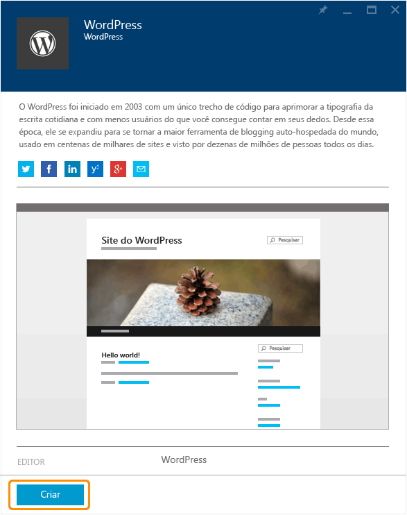
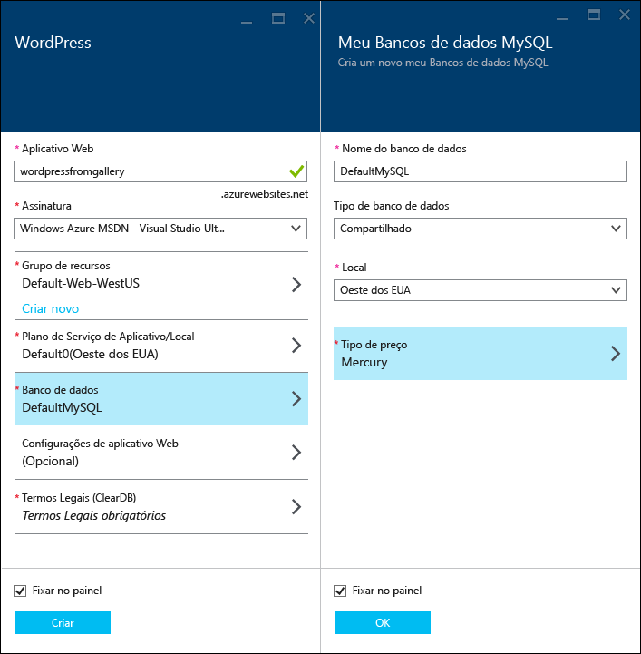
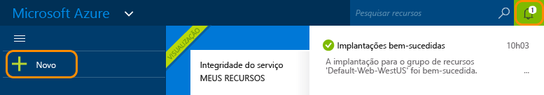
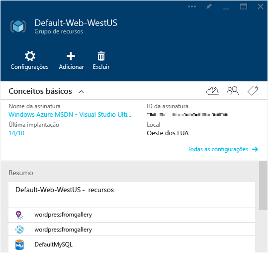

<properties
	pageTitle="Criar um aplicativo Web do WordPress no Serviço de Aplicativo do Azure | Microsoft Azure"
	description="Saiba como criar um novo aplicativo Web do Azure para um blog do WordPress usando o Portal do Azure."
	services="app-service\web"
	documentationCenter="php"
	authors="rmcmurray"
	manager="wpickett"
	editor=""/>

<tags
	ms.service="app-service-web"
	ms.workload="na"
	ms.tgt_pltfrm="na"
	ms.devlang="PHP"
	ms.topic="hero-article"
	ms.date="04/08/2016"
	ms.author="robmcm"/>

# Criar um aplicativo Web do WordPress no Serviço de Aplicativo do Azure

[AZURE.INCLUDE [guias](../../includes/app-service-web-get-started-nav-tabs.md)]

Este tutorial mostra como implantar um site de blog do WordPress no Azure Marketplace.

Ao concluir o tutorial, você terá seu próprio site de blog do WordPress ativo e em execução na nuvem.

O que você aprenderá:

* Como localizar um modelo de aplicativo no Azure Marketplace.
* Como criar um aplicativo Web no Serviço de Aplicativo do Azure com base no modelo.
* Como definir configurações do Serviço de Aplicativo do Azure para o novo aplicativo Web e o banco de dados.

O Azure Marketplace disponibiliza uma ampla gama de aplicativos Web populares desenvolvidos pela Microsoft, por outras empresas e por iniciativas de software livre. Os aplicativos Web são criados em uma grande variedade de estruturas populares, como [PHP](/develop/nodejs/) neste exemplo do WordPress, [.NET](/develop/net/), [Node.js](/develop/nodejs/), [Java](/develop/java/) e [Python](/develop/python/), para citar alguns exemplos. Para criar um aplicativo Web do Azure Marketplace, o único software necessário será o navegador que você usa para o [Portal do Azure](https://portal.azure.com/).

O site do WordPress implantado neste tutorial usa o MySQL para o banco de dados. Se, em vez disso, você quiser usar o Banco de Dados SQL para o banco de dados, consulte [Project Nami](http://projectnami.org/). O **Project Nami** também está disponível por meio do Marketplace.

> [AZURE.NOTE]
Para concluir este tutorial, você precisa de uma conta do Microsoft Azure. Se não tiver uma conta, você poderá [ativar os benefícios de assinante do Visual Studio](/pricing/member-offers/msdn-benefits-details/?WT.mc_id=A261C142F) ou [inscrever-se em uma avaliação gratuita](/pt-BR/pricing/free-trial/?WT.mc_id=A261C142F).
>
> Se você quiser ter uma introdução ao Serviço de Aplicativo do Azure antes de se inscrever em uma conta do Azure, vá para [Experimentar o Serviço de Aplicativo](http://go.microsoft.com/fwlink/?LinkId=523751). Lá, você poderá criar imediatamente um aplicativo Web de curta duração inicial no Serviço de Aplicativo – sem exigência de cartão de crédito e sem compromissos.

## Selecionar WordPress e configurar o Serviço de Aplicativo do Azure

1. Faça logon no [Portal do Azure](https://portal.azure.com/).

2. Clique em **Novo**.
	
    ![Criar Novo][5]
	
3. Procure **WordPress** e clique em **WordPress**. Se você desejar usar o Banco de Dados SQL em vez de MySQL, procure **Project Nami**.

	![WordPress da lista][7]
	
5. Depois de ler a descrição do aplicativo WordPress, clique em **Criar**.

	

4. Digite um nome para o aplicativo Web na caixa **aplicativo Web**.

	Esse nome deve ser exclusivo no domínio azurewebsites.net porque a URL do aplicativo Web será {nome}.azurewebsites.net. Se o nome inserido não for exclusivo, um ponto de exclamação vermelho aparecerá na caixa de texto.

8. Se você tiver mais de uma assinatura, escolha a que deseja usar.

5. Selecione um **grupo de recursos** ou crie um novo.

	Para saber mais sobre grupos de recursos, confira [Usando o Portal do Azure para gerenciar os recursos do Azure](../resource-group-portal.md).

5. Selecione um **Plano/Local do Serviço de Aplicativo** ou crie um novo.

	Para obter mais informações sobre planos de serviço de aplicativo, consulte [Visão geral de planos de serviço de aplicativo do Azure](../azure-web-sites-web-hosting-plans-in-depth-overview.md)

7. Clique em **Banco de Dados** e, em seguida, na folha **Novo Banco de Dados MySQL**, forneça os valores necessários para configurar o banco de dados MySQL.

	a. Digite um novo nome ou mantenha o nome padrão.

	b. Deixe o **Tipo de Banco de Dados** definido como **Compartilhado**.

	c. Escolha o mesmo local que o que você escolheu para o aplicativo Web.

	d. Escolha uma camada de preços. Para este tutorial, Mercury (gratuito, com conexões e espaço em disco mínimos permitidos ) é adequado.

8. Na folha **Novo Banco de Dados MySQL**, clique em **OK**.

8. Na folha **WordPress**, aceite os termos legais e, em seguida, clique em **Criar**.

	

	O Serviço de Aplicativo do Azure cria o aplicativo Web, geralmente em menos de um minuto. Você pode observar o progresso clicando no ícone de sino na parte superior da página do portal.

	

## Inicie e gerencie seu aplicativo Web do WordPress
	
7. Quando a criação de aplicativos Web for concluída, navegue no Portal do Azure para o grupo de recursos no qual você criou o aplicativo e você poderá ver o aplicativo Web e o banco de dados.

	O recurso adicional com o ícone de lâmpada é o [Application Insights](/services/application-insights/), que fornece serviços de monitoramento para seu aplicativo Web.

1. Na folha **Grupo de recursos**, clique na linha de aplicativo Web.

	

2. Na folha do aplicativo Web, clique em **Procurar**.

    ![URL do site][browse]

3. Na página de **Boas-vindas** do WordPress, insira as informações de configuração exigidas pelo WordPress e, em seguida, clique em **Instalar WordPress**.

	

4. Faça logon usando as credenciais que você criou na página de **Boas-vindas**.

5. A página de Painel do site é aberta.

	

## Próximas etapas

Você aprendeu como criar e implantar um aplicativo Web PHP por meio da galeria. Para obter mais informações sobre como usar o PHP no Azure, consulte o [Centro de desenvolvedores do PHP](/develop/php/).

Para obter mais informações sobre como trabalhar com aplicativos Web do Serviço de Aplicativo, consulte os links no lado esquerdo da página (para janelas de navegador amplas) ou na parte superior da página (para janelas de navegador estreitas).

## O que mudou
* Para obter um guia sobre a alteração dos Sites para o Serviço de Aplicativo, consulte [Serviço de Aplicativo do Azure e seu impacto sobre os serviços do Azure existentes](http://go.microsoft.com/fwlink/?LinkId=529714).

[5]: ./media/web-sites-php-web-site-gallery/startmarketplace.png
[7]: ./media/web-sites-php-web-site-gallery/search-web-app.png
[browse]: ./media/web-sites-php-web-site-gallery/browse-web.png

<!---HONumber=AcomDC_0504_2016-->