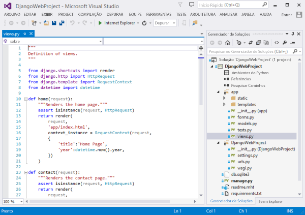
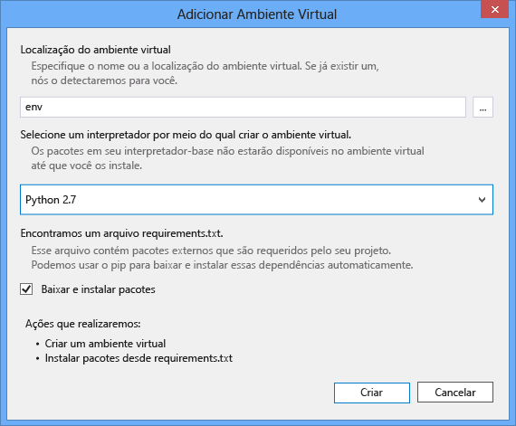
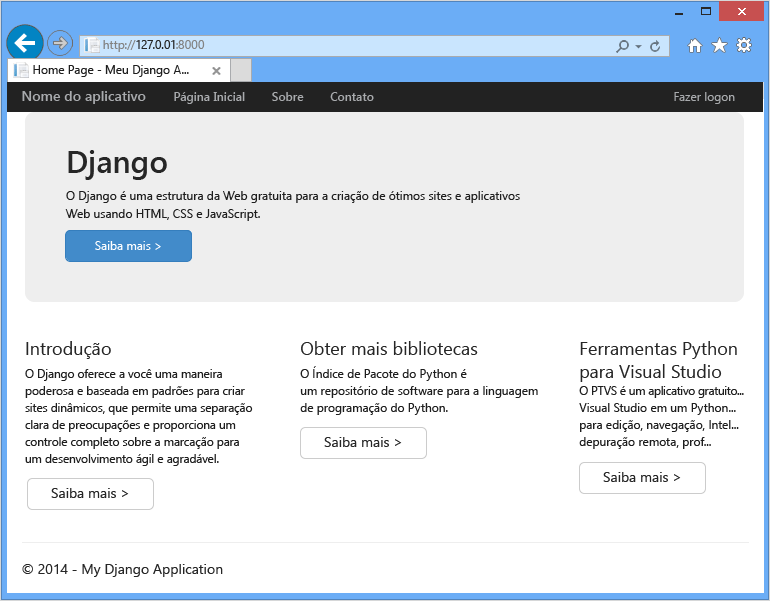
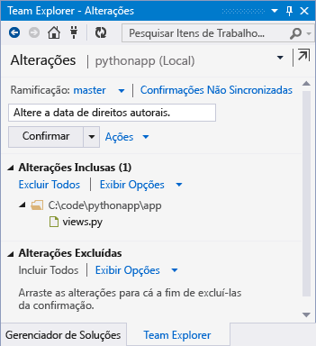
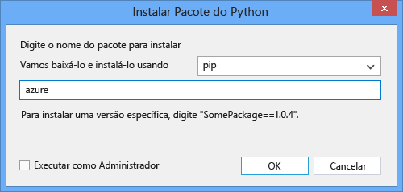
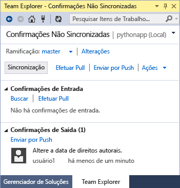

<properties
	pageTitle="Criando aplicativos Web com Django no Azure"
	description="Um tutorial que apresenta a execução de um aplicativo Web do Python em aplicativos Web do Serviço de Aplicativo do Azure."
	services="app-service\web"
	documentationCenter="python"
	authors="huguesv"
	manager="wpickett"
	editor=""/>

<tags
	ms.service="app-service-web"
	ms.workload="web"
	ms.tgt_pltfrm="na"
	ms.devlang="python"
	ms.topic="hero-article" 
	ms.date="04/15/2015"
	ms.author="huguesv"/>

# Criando aplicativos Web com Django no Azure

Este tutorial descreve como começar a execução de Python em [Aplicativos Web do Serviço de Aplicativo do Azure](http://go.microsoft.com/fwlink/?LinkId=529714). Os Aplicativos Web fornecem hospedagem gratuita limitada e implantação rápida, além permitirem a você usar o Python! Conforme o aplicativo cresce, você pode alternar para hospedagem paga e também integrar-se com todos os outros serviços do Azure.

Você criará um aplicativo usando a estrutura da Web Django (consulte versões alternativas deste tutorial para [Flask](web-sites-python-create-deploy-flask-app.md) e [Bottle](web-sites-python-create-deploy-bottle-app.md)). Você criará o aplicativo Web no Azure Marketplace, configurará a implantação do Git e clonará o repositório localmente. Em seguida, você executará o aplicativo localmente, fazer alterações, confirmá-las e enviá-las por push para o Azure. O tutorial mostra como fazer isso por meio do Windows ou Mac/Linux.

[AZURE.INCLUDE [create-account-and-websites-note](../../includes/create-account-and-websites-note.md)]

>[AZURE.NOTE]Se você deseja começar com o Serviço de Aplicativo do Azure antes de se inscrever em uma conta do Azure, acesse [Experimentar o Serviço de Aplicativo](http://go.microsoft.com/fwlink/?LinkId=523751), em que você pode criar imediatamente um aplicativo Web inicial de curta duração no Serviço de Aplicativo. Nenhum cartão de crédito é exigido, sem compromissos.

## Pré-requisitos

- Windows, Mac ou Linux
- Python 2.7 ou 3.4
- setuptools, pip, virtualenv (somente Python 2.7)
- Git
- [Python Tools 2.1 para Visual Studio](optional)

**Observação**: atualmente não há suporte à a publicação do TFS em projetos de Python.

### Windows

Se você ainda não tiver o Python 2.7 ou 3.4 instalado (32 bits), recomendamos instalar o [SDK do Azure para Python 2.7] ou [SDK do Azure para Python 3.4] usando o Web Platform Installer. Isso instala a versão de 32 bits do Python, setuptools, pip, virtualenv, etc (Python de 32 bits é o que está instalado nos computadores host do Azure). Como alternativa, você pode obter o Python por meio de [python.org].

Para Git, recomendamos [Git para Windows] ou [GitHub para Windows]. Se você usar o Visual Studio, você pode usar o suporte integrado a Git.

Também recomendamos a instalação do [Python Tools 2.1 para Visual Studio]. Isso é opcional, mas se você tiver o [Visual Studio], incluindo o Visual Studio Community 2013 ou o Visual Studio Express 2013 para Web gratuitos, isso lhe dará um excelente IDE (ambiente de desenvolvimento integrado) do Python.

### Mac/Linux

Você deve ter o Python e Git já instalados, mas certifique-se de ter uma das versões 2.7 ou 3.4 do Python.

## Criação de aplicativos Web no Portal

A primeira etapa na criação de seu aplicativo é criar o aplicativo Web por meio do [Portal do Azure](https://portal.azure.com).

1. Faça logon no Portal do Azure e clique no botão **Novo** no canto inferior esquerdo.
2. Clique em **Web + Móvel** > **Azure Marketplace** > **Aplicativos Web**.
3. Na caixa de pesquisa, digite "python".
4. Nos resultados da pesquisa, selecione **Django** e clique em **Criar**.
5. Configure o novo aplicativo Django, como a criação de um novo plano de Serviço de Aplicativo e um novo grupo de recursos para ele. Em seguida, clique em **Criar**.
6. Configure a publicação de Git para seu aplicativo Web recém-criado seguindo as instruções em [Implantação contínua usando GIT no Serviço de Aplicativo do Azure](web-sites-publish-source-control.md).

## Visão geral do aplicativo

### Conteúdos do repositório Git

Eis aqui uma visão geral dos arquivos que você encontrará no repositório Git inicial, o qual iremos clonar na próxima seção.

    \app__init__.py
    \app\forms.py
    \app\models.py
    \app\tests.py
    \app\views.py
    \app\static\content\
    \app\static\fonts\
    \app\static\scripts\
    \app\templates\about.html
    \app\templates\contact.html
    \app\templates\index.html
    \app\templates\layout.html
    \app\templates\login.html
    \app\templates\loginpartial.html
    \DjangoWebProject__init__.py
    \DjangoWebProject\settings.py
    \DjangoWebProject\urls.py
    \DjangoWebProject\wsgi.py

Fontes principais para o aplicativo. Consiste em 3 páginas (índice, sobre, contato) com um layout mestre. Scripts e conteúdo estático incluem bootstrap, jquery, modernizr e respond.

    \manage.py

Gerenciamento local e suporte ao servidor de desenvolvimento. Use isto para executar o aplicativo localmente, sincronizar o banco de dados, etc.

    \db.sqlite3

Banco de dados padrão. Inclui as tabelas necessárias para que o aplicativo seja executado, mas não contém nenhum usuário (sincronize o banco de dados para criar um usuário).

    \DjangoWebProject.pyproj
    \DjangoWebProject.sln

Arquivos de projeto para uso com [Python Tools para Visual Studio](http://pytools.codeplex.com).

    \ptvs_virtualenv_proxy.py

Proxy de IIS para ambientes virtuais e suporte à depuração remota de PTVS.

    \requirements.txt

Pacotes externos requeridos por este aplicativo. O script de implantação fará a instalação por pip dos pacotes listados nesse arquivo.

    \web.2.7.config
    \web.3.4.config

Arquivos de configuração do IIS. O script de implantação usará o web.x.y.config apropriado e o copiará como web.config.

### Arquivos opcionais - personalizando a implantação

[AZURE.INCLUDE [web-sites-python-customizing-deployment](../../includes/web-sites-python-customizing-deployment.md)]

### Arquivos opcionais - tempo de execução do Python

[AZURE.INCLUDE [web-sites-python-customizing-runtime](../../includes/web-sites-python-customizing-runtime.md)]

### Arquivos adicionais no servidor

Alguns arquivos existem no servidor, mas não são adicionados ao repositório git. Eles são criados pelo script de implantação.

    \web.config

Arquivo de configuração do IIS. Criado por meio de web.x.y.config em toda implantação.

    \env\

Ambiente virtual do Python. Criado durante a implantação, se ainda não existir um ambiente virtual compatível no aplicativo Web. Pacotes listados em requirements.txt são instalados por pip, mas o pip ignorará a instalação se os pacotes já estiverem instalados.

As próximas três seções descrevem como prosseguir com o desenvolvimento de aplicativo Web em três ambientes diferentes:

- Windows, com Python Tools para Visual Studio
- Windows, com linha de comando
- Mac/Linux, com linha de comando

## Desenvolvimento de aplicativo Web - Windows - Python Tools para Visual Studio

### Clonar o repositório

Primeiro, clone o repositório usando a URL fornecida no Portal do Azure. Para obter mais informações, consulte [Implantação contínua usando GIT no Serviço de Aplicativo do Azure](web-sites-publish-source-control.md).

Abra o arquivo da solução (.sln) que está incluído na raiz do repositório.

### Criar um ambiente virtual

Agora vamos criar um ambiente virtual para desenvolvimento local. Clique com o botão direito do mouse em **Ambientes Python** e selecione **Adicionar ambiente virtual...**.

- Verifique se o nome do ambiente é `env`.

- Selecione o interpretador de base. Use a mesma versão do Python selecionada para seu aplicativo Web (em runtime.txt ou na folha **Configurações do Aplicativo** de seu aplicativo Web no Portal do Azure).

- Verifique se a opção para baixar e instalar pacotes está marcada.

Clique em **Criar**. Isso criará o ambiente virtual e instalar dependências listadas em requirements.txt.

### Criar um superusuário

O banco de dados que acompanha o aplicativo não tem nenhum superusuário definido. Para usar a funcionalidade de entrar no aplicativo, ou então a interface de administrador do Django (se você decidir habilitá-la), você precisará criar um superusuário.

Execute isso na linha de comando da sua pasta de projeto:

    env\scripts\python manage.py createsuperuser

Siga os prompts para definir o nome de usuário, senha, etc.

### Executar usando o servidor de desenvolvimento

Pressione F5 para iniciar a depuração e o navegador da Web abrirá automaticamente na página sendo executada localmente.

Você pode definir pontos de interrupção nas fontes, usar as janelas de observação etc. Consulte a [Documentação do PTVS] para obter mais informações sobre os vários recursos.

### Fazer alterações

Agora você pode experimentar, fazendo alterações às fontes e/ou modelos de aplicativos.

Após ter testado as alterações, confirme-as no repositório do Git:

### Instalar mais pacotes

Seu aplicativo pode ter dependências além de Python e Django.

Você pode instalar pacotes adicionais usando pip. Para instalar um pacote, clique no ambiente virtual e selecione **Instalar pacote Python**.

Por exemplo, para instalar o SDK do Azure para Python, que fornece acesso ao armazenamento do Azure, ao barramento de serviço e a outros serviços do Azure, digite `azure`:

Clique com o botão direito do mouse em no ambiente virtual e selecione **Gerar requirements.txt** para atualizar requirements.txt.

Em seguida, confirme as alterações a requirements.txt no repositório Git.

### Implantar no Azure

Para disparar uma implantação, clique em **Sincronização** ou **Push**. A opção Sincronização faz um envio por push e a extração.

A primeira implantação levará algum tempo, pois isso criará um ambiente virtual, pacotes de instalação, etc.

O Visual Studio não mostra o progresso da implantação. Se você quiser revisar a saída, consulte a seção sobre [Solução de problemas - Implantação](#troubleshooting-deployment).

Navegue até a URL do Azure para exibir suas alterações.

## Desenvolvimento de aplicativos Web - Windows - linha de comando

### Clonar o repositório

Primeiro, clone o repositório usando a URL fornecida no Portal do Azure e adicione o repositório do Azure como um remoto. Para obter mais informações, consulte [Implantação contínua usando GIT no Serviço de Aplicativo do Azure](web-sites-publish-source-control.md).

    git clone <repo-url>
    cd <repo-folder>
    git remote add azure <repo-url>

### Criar um ambiente virtual

Criaremos um novo ambiente virtual para fins de desenvolvimento (não o adicione ao repositório). Ambientes virtuais em Python não são relocáveis, portanto, todo desenvolvedor trabalhando no aplicativo criará seu próprio ambiente virtual localmente.

Use a mesma versão do Python selecionada para seu aplicativo Web (em runtime.txt ou na folha Configurações do Aplicativo de seu aplicativo Web no Portal do Azure).

Para o Python 2.7:

    c:\python27\python.exe -m virtualenv env

Para o Python 3.4:

    c:\python34\python.exe -m venv env

Instale quaisquer pacotes externos exigidos pelo seu aplicativo. Você pode usar o arquivo requirements.txt na raiz do repositório para instalar os pacotes no seu ambiente virtual:

    env\scripts\pip install -r requirements.txt

### Criar um superusuário

O banco de dados que acompanha o aplicativo não tem nenhum superusuário definido. Para usar a funcionalidade de entrar no aplicativo, ou então a interface de administrador do Django (se você decidir habilitá-la), você precisará criar um superusuário.

Execute isso na linha de comando da sua pasta de projeto:

    env\scripts\python manage.py createsuperuser

Siga os prompts para definir o nome de usuário, senha, etc.

### Executar usando o servidor de desenvolvimento

Você pode iniciar o aplicativo em um servidor de desenvolvimento com o seguinte comando:

    env\scripts\python manage.py runserver

O console exibirá a URL e a porta que o servidor escuta:

Em seguida, abra o navegador da Web para essa URL.

### Fazer alterações

Agora você pode experimentar, fazendo alterações às fontes e/ou modelos de aplicativos.

Após ter testado as alterações, confirme-as no repositório do Git:

    git add <modified-file>
    git commit -m "<commit-comment>"

### Instalar mais pacotes

Seu aplicativo pode ter dependências além de Python e Django.

Você pode instalar pacotes adicionais usando pip. Por exemplo, para instalar o SDK do Azure para Python, que fornece acesso ao armazenamento do Azure, ao barramento de serviço e a outros serviços do Azure, digite:

    env\scripts\pip install azure

Certifique-se de atualizar requirements.txt:

    env\scripts\pip freeze > requirements.txt

Confirme as alterações:

    git add requirements.txt
    git commit -m "Added azure package"

### Implantar no Azure

Para disparar uma implantação, envie as alterações por push para o Azure:

    git push azure master

Você verá a saída do script de implantação, incluindo a criação do ambiente virtual, instalação de pacotes, criação do web.config.

Navegue até a URL do Azure para exibir suas alterações.

## Desenvolvimento de aplicativos Web - Mac/Linux - linha de comando

### Clonar o repositório

Primeiro, clone o repositório usando a URL fornecida no Portal do Azure e adicione o repositório do Azure como um remoto. Para obter mais informações, consulte [Implantação contínua usando GIT no Serviço de Aplicativo do Azure](web-sites-publish-source-control.md).

    git clone <repo-url>
    cd <repo-folder>
    git remote add azure <repo-url>

### Criar um ambiente virtual

Criaremos um novo ambiente virtual para fins de desenvolvimento (não o adicione ao repositório). Ambientes virtuais em Python não são relocáveis, portanto, todo desenvolvedor trabalhando no aplicativo criará seu próprio ambiente virtual localmente.

Use a mesma versão do Python selecionada para seu aplicativo Web (em runtime.txt ou na folha Configurações do Aplicativo de seu aplicativo Web no Portal do Azure).

Para o Python 2.7:

    python -m virtualenv env

Para o Python 3.4:

    python -m venv env

Instale quaisquer pacotes externos exigidos pelo seu aplicativo. Você pode usar o arquivo requirements.txt na raiz do repositório para instalar os pacotes no seu ambiente virtual:

    env/bin/pip install -r requirements.txt

### Criar um superusuário

O banco de dados que acompanha o aplicativo não tem nenhum superusuário definido. Para usar a funcionalidade de entrar no aplicativo, ou então a interface de administrador do Django (se você decidir habilitá-la), você precisará criar um superusuário.

Execute isso na linha de comando da sua pasta de projeto:

    env/bin/python manage.py createsuperuser

Siga os prompts para definir o nome de usuário, senha, etc.

### Executar usando o servidor de desenvolvimento

Você pode iniciar o aplicativo em um servidor de desenvolvimento com o seguinte comando:

    env/bin/python manage.py runserver

O console exibirá a URL e a porta que o servidor escuta:

Em seguida, abra o navegador da Web para essa URL.

### Fazer alterações

Agora você pode experimentar, fazendo alterações às fontes e/ou modelos de aplicativos.

Após ter testado as alterações, confirme-as no repositório do Git:

    git add <modified-file>
    git commit -m "<commit-comment>"

### Instalar mais pacotes

Seu aplicativo pode ter dependências além de Python e Django.

Você pode instalar pacotes adicionais usando pip. Por exemplo, para instalar o SDK do Azure para Python, que fornece acesso ao armazenamento do Azure, ao barramento de serviço e a outros serviços do Azure, digite:

    env/bin/pip install azure

Certifique-se de atualizar requirements.txt:

    env/bin/pip freeze > requirements.txt

Confirme as alterações:

    git add requirements.txt
    git commit -m "Added azure package"

### Implantar no Azure

Para disparar uma implantação, envie as alterações por push para o Azure:

    git push azure master

Você verá a saída do script de implantação, incluindo a criação do ambiente virtual, instalação de pacotes, criação do web.config.

Navegue até a URL do Azure para exibir suas alterações.

## Solução de problemas - Instalação de pacotes

[AZURE.INCLUDE [web-sites-python-troubleshooting-package-installation](../../includes/web-sites-python-troubleshooting-package-installation.md)]

## Solução de problemas - Ambiente virtual

[AZURE.INCLUDE [web-sites-python-troubleshooting-virtual-environment](../../includes/web-sites-python-troubleshooting-virtual-environment.md)]

## Solução de problemas - Arquivos estáticos

O Django tem o conceito de coletar arquivos estáticos. Isso retira todos os arquivos estáticos de seu local original e copia-os para uma única pasta. Para este aplicativo, eles são copiados para `/static`.

Isso é feito porque arquivos estáticos podem vir de 'aplicativos' do Django diferentes. Por exemplo, os arquivos estáticos das interfaces de admin do Django estão localizados em uma subpasta de biblioteca do Django no ambiente virtual. Arquivos estáticos definidos por esse aplicativo estão localizados em `/app/static`. Já que usa mais 'aplicativos' do Django, você terá arquivos estáticos localizados em múltiplos locais.

Ao executar o aplicativo no modo de depuração, o aplicativo serve os arquivos estáticos desde seu local original.

Ao executar o aplicativo no modo de liberação, o aplicativo **não** servirá os arquivos estáticos. Servir os arquivos é responsabilidade do servidor Web. Para este aplicativo, o IIS servirá os arquivos estáticos por meio de `/static`.

A coleta de arquivos estáticos é feita automaticamente como parte do script de implantação, limpando arquivos coletados anteriormente. Isso significa que a coleta ocorre em cada implantação, desacelerando um pouco o processo de implantação; todavia, garante que os arquivos obsoletos não estarão disponíveis, evitando um problema de segurança em potencial.

Se você quiser ignorar a coleção de arquivos estáticos para seu aplicativo Django:

    \.skipDjango

Em seguida, você precisará fazer a coleta manualmente no computador local:

    env\scripts\python manage.py collectstatic

Em seguida, remova a pasta `\static` de `.gitignore` e adicione-a ao repositório Git.

## Solução de problemas - Configurações

Várias configurações para o aplicativo podem ser alteradas em `DjangoWebProject/settings.py`.

Para conveniência do desenvolvedor, o modo de depuração está habilitado. Um bom efeito colateral disso é que você poderá ver as imagens e outros conteúdos estáticos quando em execução localmente, sem precisar coletar arquivos estáticos.

Para desabilitar o modo de depuração:

    DEBUG = False

Quando a depuração é desabilitada, o valor de `ALLOWED_HOSTS` precisa ser atualizado para incluir o nome de host do Azure. Por exemplo:

    ALLOWED_HOSTS = (
        'pythonapp.azurewebsites.net',
    )

ou para habilitar qualquer um:

    ALLOWED_HOSTS = (
        '*',
    )

Na prática, talvez você queira fazer algo mais complexo para lidar com a alternância entre os modos de depuração e liberação, e obter o nome do host.

Você pode definir variáveis de ambiente por meio da página **CONFIGURAR** do portal do Azure, na seção **configurações do aplicativo**. Isso pode ser útil para definir valores que você não deseja que apareçam nas fontes (cadeias de conexão, senhas etc.), ou que você deseja definir de maneira diferente entre o Azure e o computador local. Em `settings.py`, você pode consultar as variáveis de ambiente usando `os.getenv`.

## Usando um banco de dados

O banco de dados incluído com o aplicativo é um banco de dados sqlite. Isso é um banco de dados padrão útil e conveniente no uso para o desenvolvimento, pois ele não exige praticamente nenhuma configuração. O banco de dados é armazenado no arquivo db.sqlite3, na pasta do projeto.

O Azure fornece serviços de banco de dados que são fáceis de usar em um aplicativo Django. Tutoriais para uso de [Banco de dados SQL] e [MySQL] por meio de um aplicativo Django mostram as etapas necessárias para criar o serviço de banco de dados e alterar as configurações de banco de dados em `DjangoWebProject/settings.py`, além das bibliotecas necessárias para a instalação.

É claro que, se você preferir gerenciar seus próprios servidores de banco de dados, você pode fazer isso usando máquinas virtuais em Windows ou Linux em execução no Azure.

## Interface de administração do Django

Depois que você começar a criar seus modelos, você desejará preencher o banco de dados com alguns dados. Uma maneira fácil de adicionar e editar o conteúdo de modo interativo é usar a interface de administração do Django.

O código para a interface do administrador é comentado nas fontes de aplicativo, mas é claramente marcado para que você possa habilitá-lo com facilidade (procure por 'admin').

Depois que ele estiver habilitado, sincronize o banco de dados, execute o aplicativo e navegue até `/admin`.

## Próximas etapas

Siga esses links para saber mais sobre o Django e Python Tools para o Visual Studio:

- [Documentação do Django]
- [Ferramentas Python para documentação do Visual Studio]

Para obter informações sobre como usar o MySQL e banco de dados SQL:

- [Django e banco de dados SQL no Azure com ferramentas Python 2.1 para Visual Studio]
- [Django e MySQL no Azure com ferramentas 2.1 do Python para Visual Studio]

## O que mudou
* Para obter um guia sobre a alteração de Sites para o Serviço de Aplicativo, consulte: [Serviço de Aplicativo do Azure e seu impacto sobre os serviços do Azure existentes](http://go.microsoft.com/fwlink/?LinkId=529714)
* Para obter um guia sobre a alteração do portal antigo para o novo portal, confira: [Referência para navegar no portal de visualização](http://go.microsoft.com/fwlink/?LinkId=529715)

<!--Link references-->
[Django e MySQL no Azure com ferramentas 2.1 do Python para Visual Studio]: web-sites-python-ptvs-django-mysql.md
[Django e banco de dados SQL no Azure com ferramentas Python 2.1 para Visual Studio]: web-sites-python-ptvs-django-sql.md
[Banco de dados SQL]: web-sites-python-ptvs-django-sql.md
[MySQL]: web-sites-python-ptvs-django-mysql.md

<!--External Link references-->
[SDK do Azure para Python 2.7]: http://go.microsoft.com/fwlink/?linkid=254281
[SDK do Azure para Python 3.4]: http://go.microsoft.com/fwlink/?linkid=516990
[python.org]: http://www.python.org/
[Git para Windows]: http://msysgit.github.io/
[GitHub para Windows]: https://windows.github.com/
[Python Tools for Visual Studio]: http://aka.ms/ptvs
[Python Tools 2.1 para Visual Studio]: http://go.microsoft.com/fwlink/?LinkId=517189
[Visual Studio]: http://www.visualstudio.com/
[Documentação do PTVS]: http://pytools.codeplex.com/documentation
[Ferramentas Python para documentação do Visual Studio]: http://pytools.codeplex.com/documentation
[Documentação do Django]: https://www.djangoproject.com/
 

<!---HONumber=July15_HO3-->