<properties 
	pageTitle="Django e MySQL no Azure com Ferramentas Python 2.2 para Visual Studio" 
	description="Aprenda a usar o Python Tools para Visual Studio para criar um aplicativo Django que armazena dados em uma instância do banco de dados MySQL e o implanta em Aplicativos Web do Serviço de Aplicativo do Azure." 
	services="app-service\web" 
	documentationCenter="python" 
	authors="huguesv" 
	manager="wpickett" 
	editor=""/>

<tags 
	ms.service="app-service-web" 
	ms.workload="web" 
	ms.tgt_pltfrm="na" 
	ms.devlang="python" 
	ms.topic="get-started-article" 
	ms.date="11/17/2015"
	ms.author="huvalo"/>

# Django e MySQL no Azure com Ferramentas Python 2.2 para Visual Studio 

> [AZURE.SELECTOR]
- [.Net](web-sites-dotnet-get-started.md)
- [Node.js](web-sites-nodejs-develop-deploy-mac.md)
- [Java](web-sites-java-get-started.md)
- [PHP - Git](web-sites-php-mysql-deploy-use-git.md)
- [PHP - FTP](web-sites-php-mysql-deploy-use-ftp.md)
- [Python](web-sites-python-ptvs-django-mysql.md)

Neste tutorial, usaremos o [Python Tools para Visual Studio] para criar um aplicativo Web de votação simples, usando um dos modelos de exemplo de PTVS. Este tutorial também está disponível como um [vídeo](https://www.youtube.com/watch?v=oKCApIrS0Lo).

Aprenderemos a usar um serviço MySQL hospedado no Azure, configurar o aplicativo para usar o MySQL e publicar o aplicativo web para os [Aplicativos Web do Serviço de Aplicativo do Azure](http://go.microsoft.com/fwlink/?LinkId=529714).

Confira o [Python Developer Center] para obter mais artigos que abrangem o desenvolvimento de Aplicativos Web do Serviço de Aplicativo do Azure com PTVS usando estruturas da Web Bottle, Flask e Django, com serviços MongoDB, Azure Table Storage, MySQL e banco de dados SQL. Embora este artigo se concentre no Serviço de Aplicativo, as etapas são semelhantes ao desenvolvimento de [Serviços de Nuvem do Azure].

## Pré-requisitos

 - Visual Studio 2013 ou 2015
 - [Ferramentas Python 2.2 para Visual Studio]
 - [VSIX de amostra de Ferramentas Python 2.2 para Visual Studio]
 - [Azure Ferramentas SDK para VS 2013] ou [Azure Ferramentas SDK para VS 2015]
 - [Python 2.7 de 32 bits]

[AZURE.INCLUDE [create-account-and-websites-note](../../includes/create-account-and-websites-note.md)]

>[AZURE.NOTE]Se você deseja começar com o Serviço de Aplicativo do Azure antes de se inscrever em uma conta do Azure, acesse [Experimentar o Serviço de Aplicativo](http://go.microsoft.com/fwlink/?LinkId=523751), em que você pode criar imediatamente um aplicativo Web inicial de curta duração no Serviço de Aplicativo. Não é necessário nenhum cartão de crédito; não há compromissos.

## Criar o projeto

Nesta seção, criaremos um projeto Visual Studio usando um modelo de amostra. Criaremos um ambiente virtual e instalaremos pacotes necessários. Criaremos um banco de dados local usando sqlite. Em seguida, executaremos o aplicativo localmente.

1.  No Visual Studio, selecione **Arquivo**, **Novo Projeto**.

1.  Os modelos de projeto dos exemplos VSIX do PTVS estão disponíveis em **Python**, **Exemplos**. Selecione **Projeto Web Django de Votações** e clique em OK para criar o projeto.

  	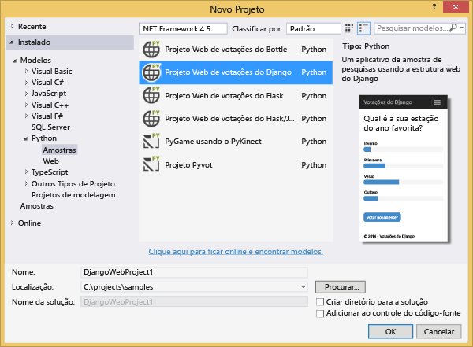

1.  Você será solicitado a instalar pacotes externos. Selecione **Instalar em um ambiente virtual**.

  	

1.  Selecione **Python 2.7** como o interpretador de base.

  	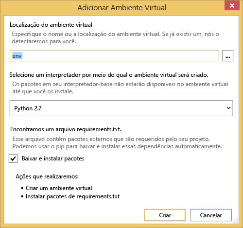

1.  Clique com o botão direito do mouse no nó do projeto e selecione **Python**, **Banco de dados de Sincronização do Django**.

  	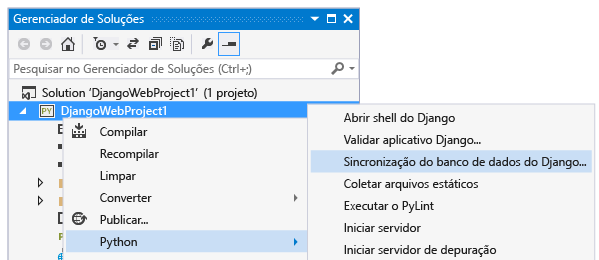

1.  Isso abrirá um Console de Gerenciamento Django. Siga os prompts para criar um usuário.

    Isso criará um banco de dados sqlite na pasta do projeto.

  	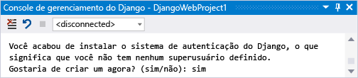

1.  Confirme se o aplicativo funciona pressionando <kbd>F5</kbd>.

1.  Clique em **Fazer logon** na barra de navegação na parte superior.

  	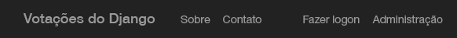

1.  Insira as credenciais para o usuário que você criou quando sincronizou o banco de dados.

  	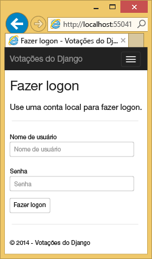

1.  Clique em **Criar Votações de Exemplo**.

  	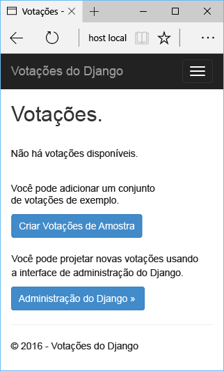

1.  Clique em uma pesquisa e vote.

  	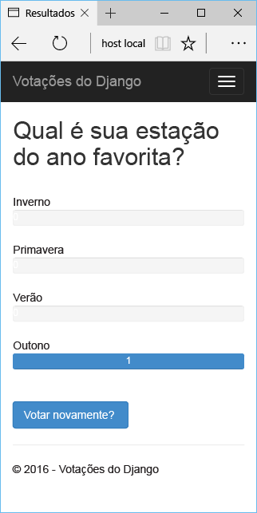

## Criar um banco de dados MySQL

Para banco de dados, vamos criar um banco de dados ClearDB MySQL hospedado no Azure.

Como alternativa, você pode criar sua própria máquina virtual em execução no Azure, em seguida, instalar e administrar o MySQL por conta própria.

Você pode criar um banco de dados com um plano grátis seguindo estas etapas.

1.  Faça logon no [Portal do Azure](https://portal.azure.com/).

1.  Na parte superior do painel de navegação, clique em **NOVO**. Em seguida, clique em **Dados + Armazenamento** > **Banco de Dados MySQL**.

  

1.  Digite "**mysql**" na caixa de pesquisa, então clique em **Banco de Dados MySQL** e clique em **Criar**. -->
  	<!-- 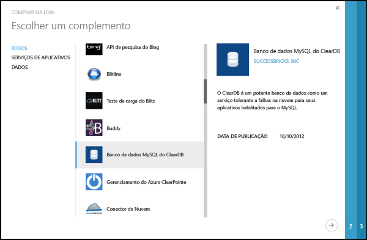 -->

1.  Configure o novo banco de dados MySQL, criando um novo grupo de recursos e selecione o local apropriado para o mesmo.

  	<!-- 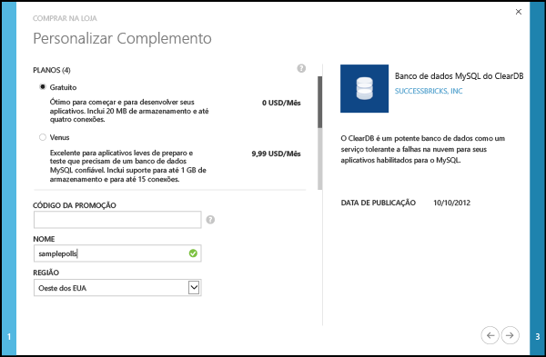 -->

1.  Depois de criar o banco de dados MySQL, clique em **Propriedades** na folha do banco de dados.
2.  É possível usar o botão de cópia para colocar o valor de **CADEIA DE CONEXÃO** na área de transferência.

## Configurar o projeto

Nesta seção, configuraremos nosso aplicativo Web para usar o banco de dados MySQL que acabamos de criar. Também instalaremos pacotes adicionais Python necessários para usar bancos de dados MySQL com Django. Em seguida, vamos executar o aplicativo Web localmente.

1.  No Visual Studio, abra **settings.py**, na pasta *ProjectName*. Cole temporariamente a cadeia de conexão obtida no editor. A cadeia de conexão está neste formato:

        Database=<NAME>;Data Source=<HOST>;User Id=<USER>;Password=<PASSWORD>

    Altere o **MECANISMO** do banco de dados padrão para usar MySQL e defina os valores para **NOME**, **USUÁRIO**, **SENHA** e **HOST** de **CADEIA DE CONEXÃO**.

        DATABASES = {
            'default': {
                'ENGINE': 'django.db.backends.mysql',
                'NAME': '<Database>',
                'USER': '<User Id>',
                'PASSWORD': '<Password>',
                'HOST': '<Data Source>',
                'PORT': '',
            }
        }

1.  No Gerenciador de Soluções, em **Ambientes Python**, clique com o botão direito do mouse no ambiente virtual e selecione **Instalar Pacote Python**.

1. Instale o pacote `mysql-python` usando **easy\_install**.

  	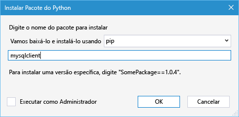

1.  Clique com o botão direito do mouse no nó do projeto e selecione **Python**, **Banco de dados de Sincronização do Django**.

    Isso criará as tabelas de banco de dados MySQL que criamos na seção anterior. Siga os prompts para criar um usuário, que não tem de corresponder ao usuário no banco de dados sqlite criado na primeira seção.

  	

1.  Execute o aplicativo com `F5`. As votações criadas com **Criar Votações de Exemplo** e os dados enviados por voto serão serializados no banco de dados MySQL.

## Publicar aplicativo Web para Serviço de Aplicativo do Azure

O SDK .NET do Azure fornece uma forma fácil de implantar seu aplicativo Web no Serviço de Aplicativo do Azure.

1.  No **Gerenciador de Soluções**, clique com o botão direito do mouse no nó do projeto e selecione **Publicar**.

  	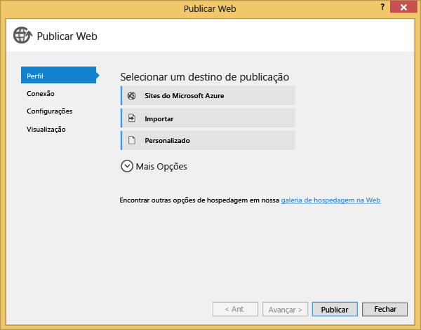

1.  Clique em **Aplicativos Web do Microsoft Azure**.

1.  Clique em **Novo** para criar um novo aplicativo Web.

1.  Preencha os campos a seguir e clique em **Criar**.
	-	**Nome do aplicativo Web**
	-	**Plano do Serviço de Aplicativo**
	-	**Grupo de recursos**
	-	**Região**
	-	Deixe **Servidor de banco de dados** definido como **Nenhum banco de dados**

  	<!-- 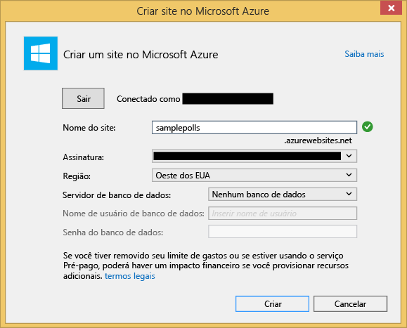 -->

1.  Aceite todos os outros padrões e clique em **Publicar**.

1.  Seu navegador da Web será aberto automaticamente para o aplicativo Web publicado. Você deve ver o aplicativo Web funcionando conforme o esperado, usando o banco de dados **MySQL** hospedado no Azure.

    Parabéns!

  	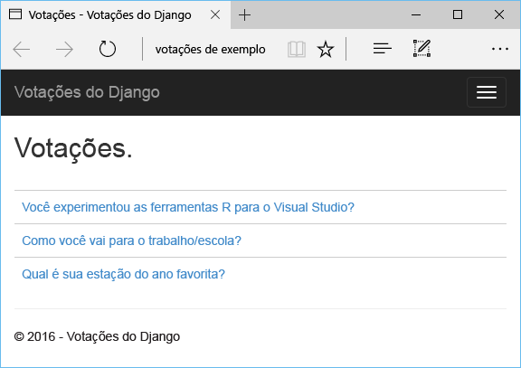

## Próximas etapas

Siga estas etapas para aprender mais sobre o Python Tools para Visual Studio, Django e MySQL.

- [Ferramentas Python para documentação do Visual Studio]
  - [Projetos da Web]
  - [Projetos do serviço de nuvem]
  - [Depuração remota no Microsoft Azure]
- [Documentação do Django]
- [MySQL]

Para saber mais, confira o [Centro de Desenvolvedores do Python](/develop/python/).

## O que mudou
* Para obter um guia sobre a alteração de Sites para o Serviço de Aplicativo, consulte: [Serviço de Aplicativo do Azure e seu impacto sobre os serviços do Azure existentes](http://go.microsoft.com/fwlink/?LinkId=529714)

<!--Link references-->
[Python Developer Center]: /develop/python/
[Serviços de Nuvem do Azure]: ../cloud-services-python-ptvs.md

<!--External Link references-->
[Azure Portal]: https://portal.azure.com
[Python Tools para Visual Studio]: http://aka.ms/ptvs
[Ferramentas Python 2.2 para Visual Studio]: http://go.microsoft.com/fwlink/?LinkID=624025
[VSIX de amostra de Ferramentas Python 2.2 para Visual Studio]: http://go.microsoft.com/fwlink/?LinkID=624025
[Azure Ferramentas SDK para VS 2013]: http://go.microsoft.com/fwlink/?LinkId=323510
[Azure Ferramentas SDK para VS 2015]: http://go.microsoft.com/fwlink/?LinkId=518003
[Python 2.7 de 32 bits]: http://go.microsoft.com/fwlink/?LinkId=517190
[Ferramentas Python para documentação do Visual Studio]: http://aka.ms/ptvsdocs
[Depuração remota no Microsoft Azure]: http://go.microsoft.com/fwlink/?LinkId=624026
[Projetos da Web]: http://go.microsoft.com/fwlink/?LinkId=624027
[Projetos do serviço de nuvem]: http://go.microsoft.com/fwlink/?LinkId=624028
[Documentação do Django]: https://www.djangoproject.com/
[MySQL]: http://www.mysql.com/
 

<!---HONumber=AcomDC_1203_2015-->