# <a name="create-a-net-webjob-in-azure-app-service"></a>Criar um Trabalho Web do .NET no Serviço de Aplicativo do Azure
Este tutorial mostra como escrever código para um aplicativo ASP.NET MVC 5 multicamadas simples que usa [SDK do WebJobs](websites-dotnet-webjobs-sdk.md).

[!INCLUDE [app-service-web-webjobs-corenote](../../includes/app-service-web-webjobs-corenote.md)]

A finalidade do [SDK do WebJobs](websites-webjobs-resources.md) é simplificar o código escrito para tarefas comuns que um WebJob pode executar, como o processamento de imagens, o processamento de filas, a agregação de RSS, a manutenção de arquivos e o envio de emails. O SDK do WebJobs tem recursos internos para trabalhar com o Armazenamento do Azure e o Barramento de Serviço, para o agendamento de tarefas e o tratamento de erros e de muitos outros cenários comuns. Além disso, ele foi projetado para ser extensível e há um [repositório de software livre para extensões](https://github.com/Azure/azure-webjobs-sdk-extensions/wiki/Binding-Extensions-Overview).

O aplicativo de exemplo é um boletim informativo de anúncio. Os usuários podem carregar imagens para anúncios, e um processo de back-end converte as imagens em miniaturas. A página de lista de anúncios mostra as miniaturas e a página de detalhes do anúncio mostra a imagem em tamanho normal. Esta é uma captura de tela:

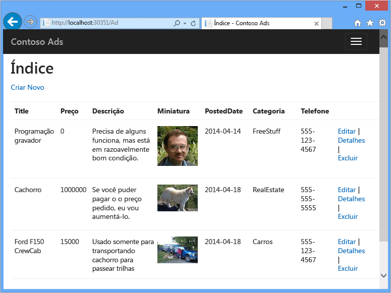

Este aplicativo de exemplo funciona com [filas do Azure](http://www.asp.net/aspnet/overview/developing-apps-with-windows-azure/building-real-world-cloud-apps-with-windows-azure/queue-centric-work-pattern) e [blobs do Azure](http://www.asp.net/aspnet/overview/developing-apps-with-windows-azure/building-real-world-cloud-apps-with-windows-azure/unstructured-blob-storage). O tutorial mostra como implantar o aplicativo no [Serviço de Aplicativo do Azure](http://go.microsoft.com/fwlink/?LinkId=529714) e no [Banco de Dados SQL do Azure](http://msdn.microsoft.com/library/azure/ee336279).

## <a id="prerequisites"></a>Pré-requisitos
O tutorial pressupõe que você saiba como trabalhar com projetos [ASP.NET MVC 5](http://www.asp.net/mvc/tutorials/mvc-5/introduction/getting-started) no Visual Studio.

O tutorial foi gravado originalmente para Visual Studio 2013, mas pode ser usado com versões posteriores do Visual Studio. Se você estiver usando o Visual Studio 2015 ou 2017, anote isso antes de executar o aplicativo localmente, você precisa alterar a parte `Data Source` da cadeia de conexão LocalDB do SQL Server nos arquivos Web.config e App.config de `Data Source=(localdb)\v11.0` para `Data Source=(LocalDb)\MSSQLLocalDB`.

> [!NOTE]
> <a name="note"></a>Para concluir este tutorial, você precisa ter uma conta do Azure:
>
> * Você pode [abrir uma conta do Azure gratuitamente](https://azure.microsoft.com/pricing/free-trial/?WT.mc_id=A261C142F): você obtém créditos que podem ser usados para experimentar serviços pagos do Azure e, mesmo após eles serem utilizados, é possível manter a conta e utilizar os serviços gratuitos do Azure, como os Sites. Seu cartão de crédito nunca será cobrado, a menos que você altere explicitamente suas configurações, solicitando esse tipo de cobrança.
> * É possível [ativar os benefícios do Azure mensais para assinantes do Visual Studio](https://azure.microsoft.com/pricing/member-offers/msdn-benefits-details/?WT.mc_id=A261C142F): sua assinatura concede créditos todos os meses que podem ser usados para experimentar serviços pagos do Azure.
>
> Se você deseja começar a usar o Serviço de Aplicativo do Azure antes de se inscrever em uma conta do Azure, vá até [Experimentar o Serviço de Aplicativo](https://azure.microsoft.com/try/app-service/), em que você pode criar imediatamente um aplicativo Web inicial de curta duração no Serviço de Aplicativo. Nenhum cartão de crédito é exigido, sem compromissos.
>
>

## <a id="learn"></a>O que você vai aprender
O tutorial mostra como executar as seguintes tarefas:

* Como habilitar seu computador para o desenvolvimento do Azure ao instalar o SDK do Azure (somente para usuários do Visual Studio 2013 e 2015).
* Criar um projeto Aplicativo do Console implantado automaticamente como um Trabalho Web do Azure ao implantar o projeto Web associado.
* Testar um back-end do SDK de Trabalhos Web localmente no computador de desenvolvimento.
* Publica um aplicativo com um back-end de Trabalhos Web para um aplicativo da Web no Serviço de Aplicativo.
* Carregar arquivos e armazená-los no serviço Azure Blob.
* Usar o SDK de Trabalhos Web do Azure para trabalhar com filas e blobs do Armazenamento do Azure.

## <a id="contosoads"></a>Arquitetura do aplicativo
O aplicativo de exemplo usa o [padrão de trabalho centrado em fila](http://www.asp.net/aspnet/overview/developing-apps-with-windows-azure/building-real-world-cloud-apps-with-windows-azure/queue-centric-work-pattern) para descarregar o trabalho com uso intensivo da CPU de criar miniaturas para um processo back-end.

O aplicativo armazena anúncios em um banco de dados SQL usando Entity Framework Code First para criar as tabelas e acessar os dados. Para cada anúncio, o banco de dados armazena duas URLs: uma para a imagem em tamanho total e outra para a miniatura.

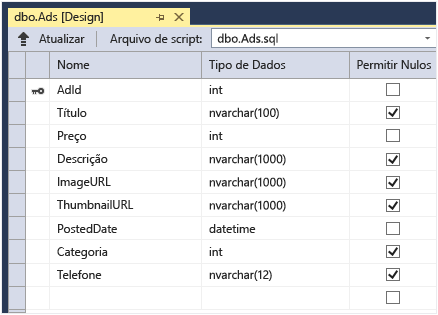

Quando um usuário carrega uma imagem, o aplicativo Web armazena a imagem em um [Blob do Azure](http://www.asp.net/aspnet/overview/developing-apps-with-windows-azure/building-real-world-cloud-apps-with-windows-azure/unstructured-blob-storage)e armazena as informações do anúncio no banco de dados, com uma URL que aponta para o blob. Ao mesmo tempo, ele grava uma mensagem em uma fila do Azure. Em um processo back-end em execução como um Trabalho Web do Azure, o SDK de Trabalhos Web sonda a fila a procura de novas mensagens. Quando uma nova mensagem é exibida, o Trabalho Web cria uma miniatura dessa imagem e atualiza o campo do banco de dados da URL de miniatura desse anúncio. Veja a seguir este diagrama que mostra como as partes de um aplicativo interagem:


[!INCLUDE [install-sdk](../../includes/install-sdk-2017-2015-2013.md)]  
As instruções do tutorial aplicam-se ao SDK do Azure para .NET 2.7.1 ou posterior.

## <a id="storage"></a>Criar uma conta do Armazenamento do Azure
Uma conta de armazenamento do Azure fornece os recursos para dados de blob e fila de armazenamento na nuvem. Ela também é usada pelo SDK de WebJobs para armazenar dados de registro no painel.

Em um aplicativo real, você normalmente cria contas à parte para dados de aplicativo em comparação com dados de registro em log e separa contas para dados de teste em comparação com dados de produção. Neste tutorial você usará apenas uma conta.

1. Abra a janela **Gerenciador de Servidores** no Visual Studio.
2. Clique com o botão direito do mouse no nó do **Azure** e clique em **Conectar à Assinatura do Microsoft Azure...**.
   
   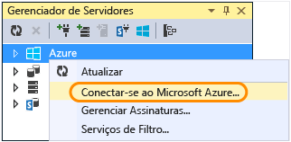

3. Entre utilizando suas credenciais do Azure.
4. Clique com botão direito do mouse em **Armazenamento** sob o nó do Azure e, em seguida, clique em **Criar conta de armazenamento**.
   
   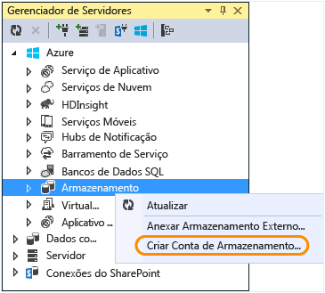
   
5. Na caixa de diálogo **Criar conta de armazenamento** , digite um nome para a conta de armazenamento.

    O nome deve ser exclusivo (nenhuma outra conta de armazenamento do Azure pode ter o mesmo nome). Se o nome digitado já estiver sendo utilizado, você terá a oportunidade de alterá-lo.

    A URL para acessar sua conta de armazenamento será *{nome}*.core.windows.net.
6. Defina a lista suspensa de **região ou grupo de afinidade** para a região mais próxima de você.

    Essa configuração especifica qual datacenter do Azure hospedará a conta de armazenamento. Para este tutorial, sua escolha não fará uma diferença notável. No entanto, para um aplicativo Web de produção, convém que seu servidor Web e sua conta de armazenamento estejam na mesma região para minimizar a latência e os encargos de saída dos dados. O datacenter do aplicativo Web (que você criará posteriormente) deve estar tão próximo quanto possível dos navegadores acessando o aplicativo Web, para minimizar a latência.
7. Defina a lista suspensa **Replicação** para **Localmente redundante**.

    Quando a replicação geográfica está habilitada para uma conta de armazenamento, o conteúdo armazenado é replicado para um datacenter secundário para habilitar o failover para essa localidade no caso de ocorrer um grande desastre no local principal. A replicação geográfica pode incorrer em custos adicionais. Para contas de teste e desenvolvimento, geralmente, você não deseja pagar pela replicação geográfica. Para saber mais, confira [Criar, gerenciar ou excluir uma conta de armazenamento](../storage/storage-create-storage-account.md).
8. Clique em **Criar**.

    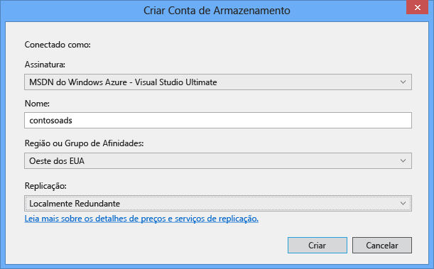

## <a id="download"></a>Baixar o aplicativo
1. Baixar e descompactar a [solução concluída](http://code.msdn.microsoft.com/Simple-Azure-Website-with-b4391eeb).
2. Inicie o Visual Studio.
3. No menu **Arquivo**, escolha **Abrir > Projeto/Solução**, navegue até onde você baixou a solução e abra o arquivo de solução.
4. Pressione CTRL+SHIFT+B para criar a solução.

    Por padrão, o Visual Studio restaura automaticamente o conteúdo do pacote NuGet, que não foi incluído no arquivo *.zip* . Se os pacotes não forem restaurados, instale-os manualmente acessando a caixa de diálogo **Gerenciar Pacotes NuGet para Solução** e clicando no botão **Restaurar** na parte superior direita.
5. No **Gerenciador de Soluções**, verifique se **ContosoAdsWeb** está selecionado como o projeto inicial.

## <a id="configurestorage"></a>Configurar o aplicativo para usar a conta de armazenamento
1. Abra o arquivo *Web.config* do aplicativo no projeto ContosoAdsWeb.

    O arquivo contém uma cadeia de conexão SQL e uma cadeia de conexão de armazenamento do Azure para trabalhar com blobs e filas.

    A cadeia de conexão SQL aponta para um banco de dados [SQL Server Express LocalDB](http://msdn.microsoft.com/library/hh510202.aspx) .

    A cadeia de conexão de armazenamento é um exemplo que tem espaços reservados para a chave de acesso e para o nome da conta de armazenamento. Isso será substituído com uma cadeia de conexão que tem o nome e a chave da sua conta de armazenamento.  

    ```
    <connectionStrings>
        <add name="ContosoAdsContext" connectionString="Data Source=(localdb)\v11.0; Initial Catalog=ContosoAds; Integrated Security=True; MultipleActiveResultSets=True;" providerName="System.Data.SqlClient" />
        <add name="AzureWebJobsStorage" connectionString="DefaultEndpointsProtocol=https;AccountName=[accountname];AccountKey=[accesskey]"/>
    </connectionStrings>
    ```
    A cadeia de conexão de armazenamento se chama AzureWebJobsStorage porque esse é o nome usado pelo SDK de Trabalhos Web por padrão. O mesmo nome é usado aqui, de modo que você só precisa definir um valor de cadeia de conexão no ambiente do Azure.
2. No **Gerenciador de Servidores**, clique com botão direito do mouse na sua conta de armazenamento sob o nó de **Armazenamento** e, em seguida, clique em **Propriedades**.

    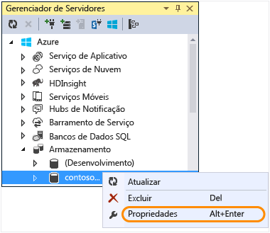
3. Na janela **Propriedades**, clique em **Chaves de Conta de Armazenamento** e, em seguida, clique no botão de reticências.

    
4. Copie a **Cadeia de conexão**.

    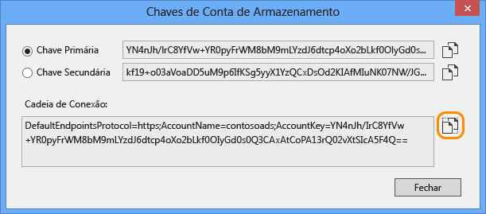
5. Substitua a cadeia de caracteres de conexão de armazenamento no arquivo *Web.config* com a cadeia de conexão que você copiou anteriormente. Certifique-se de selecionar tudo dentro das aspas, mas não inclua as aspas antes de colar.
6. Abra o arquivo *App.config* no projeto ContosoAdsWebJob.

    Esse arquivo tem duas cadeias de conexão de armazenamento: uma para dados do aplicativo e outra para registro em log. Você pode usar contas de armazenamento separadas para dados de aplicativo e registro em log, além de usar [várias contas de armazenamento para dados](https://github.com/Azure/azure-webjobs-sdk/blob/master/test/Microsoft.Azure.WebJobs.Host.EndToEndTests/MultipleStorageAccountsEndToEndTests.cs). Neste tutorial, você usará uma única conta de armazenamento. As cadeias de conexão têm espaços reservados para as chaves da conta de armazenamento.

    ```
    <configuration>
        <connectionStrings>
            <add name="AzureWebJobsDashboard" connectionString="DefaultEndpointsProtocol=https;AccountName=[accountname];AccountKey=[accesskey]"/>
            <add name="AzureWebJobsStorage" connectionString="DefaultEndpointsProtocol=https;AccountName=[accountname];AccountKey=[accesskey]"/>
            <add name="ContosoAdsContext" connectionString="Data Source=(localdb)\v11.0; Initial Catalog=ContosoAds; Integrated Security=True; MultipleActiveResultSets=True;"/>
    </connectionStrings>
        <startup>
            <supportedRuntime version="v4.0" sku=".NETFramework,Version=v4.5" />
    </startup>
    </configuration>

    ```

    Por padrão, o SDK de Trabalhos Web procura cadeias de conexão chamadas AzureWebJobsStorage e AzureWebJobsDashboard. Como alternativa, é possível [armazenar a cadeia de conexão, por mais que você queira passá-la explicitamente para o `JobHost` objeto](websites-dotnet-webjobs-sdk-storage-queues-how-to.md#config).
7. Substitua ambas as cadeias de caracteres de conexão de armazenamento com a cadeia de conexão que você copiou anteriormente.
8. Salve suas alterações.

## <a id="run"></a>Executar o aplicativo localmente
1. Para iniciar o front-end Web do aplicativo, pressione CTRL+F5.

    O navegador padrão é aberto na home page. (O projeto Web é executado porque você o tornou o projeto inicial.)

    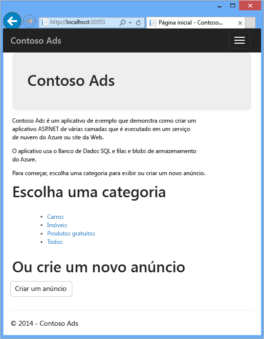
2. Para iniciar o back-end do Trabalho Web do aplicativo, clique com o botão direito do mouse no projeto ContosoAdsWebJob em **Gerenciador de Soluções** e clique em **Depurar** > **Iniciar nova instância**.

    Uma janela do aplicativo de console é aberta e exibe mensagens de log que indica que o objeto JobHost do SDK de Trabalhos Web iniciou a execução.

    
3. No navegador, clique em **Criar um anúncio**.
4. Insira alguns dados de teste e selecione uma imagem para fazer upload e depois clique em **Criar**.

    

    O aplicativo vai para a Página de índice, mas não mostra uma miniatura do anúncio novo porque o processamento ainda não aconteceu.

    Enquanto isso, depois de esperar um pouco, uma mensagem de registro em log na janela do aplicativo de console mostra que uma mensagem da fila foi recebida e processada.

    
5. Depois de ver as mensagens de registro em log na janela do aplicativo de console, atualize a página Índice para ver a miniatura.

    
6. Clique em **Detalhes** do anúncio para ver a imagem em tamanho total.

    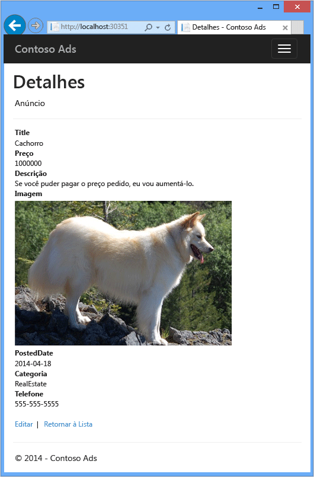

Você esteve executando o aplicativo no computador local, e ele estava usando um banco de dados do SQL Server localizado no computador, mas funcionando com filas e blobs na nuvem. Na seção a seguir, você vai executar o aplicativo na nuvem usando um banco de dados de nuvem, bem como blobs e filas da nuvem.  

## <a id="runincloud"></a>Executar o aplicativo na nuvem
Você seguirá as etapas abaixo para executar o aplicativo na nuvem:

* Implantar em aplicativos Web. O Visual Studio cria automaticamente um novo aplicativo Web no Serviço de Aplicativo e uma instância do Banco de Dados SQL.
* Configure o aplicativo Web para usar o banco de dados SQL do Azure e a conta de armazenamento.

Depois de criar alguns anúncios ainda em execução na nuvem, você exibirá o painel do SDK de Trabalhos Web para ver os recursos de monitoramento sofisticados que ele tem a oferecer.

### <a name="deploy-to-web-apps"></a>Implantar em aplicativos Web

1. Feche o navegador e a janela do aplicativo de console.
2. Siga as etapas na seção [Publicar no Azure com o Banco de Dados SQL](https://docs.microsoft.com/azure/app-service-web/app-service-web-tutorial-dotnet-sqldatabase#publish-to-azure-with-sql-database).
3. Depois de concluir as etapas de implantação, continue com as tarefas restantes neste artigo.

### <a name="configure-the-web-app-to-use-your-azure-sql-database-and-storage-account"></a>Configure o aplicativo Web para usar o banco de dados SQL do Azure e a conta de armazenamento
Trata-se de uma melhor prática de segurança [evitar colocar informações confidenciais como cadeias de conexão em arquivos armazenados em repositórios de código-fonte](http://www.asp.net/aspnet/overview/developing-apps-with-windows-azure/building-real-world-cloud-apps-with-windows-azure/source-control#secrets). O Azure fornece uma maneira de fazer isso: é possível definir a cadeia de conexão e outros valores de configuração no ambiente do Azure e as APIs de configuração do ASP.NET separam automaticamente esses valores quando o aplicativo é executado no Azure. Você pode definir esses valores no Azure usando o **Gerenciador de Servidores**, o Portal do Azure, o Windows PowerShell ou a interface de linha de comando entre plataformas. Para saber mais, veja [Como funcionam as cadeias de caracteres de aplicativos e de conexão](https://azure.microsoft.com/blog/2013/07/17/windows-azure-web-sites-how-application-strings-and-connection-strings-work/).

Nesta seção, você usa o **Gerenciador de Servidores** para definir os valores da cadeia de conexão no Azure.

1. No **Gerenciador de Servidores**, clique com o botão direito do mouse no aplicativo Web em **Azure > Serviço de Aplicativo > {seu grupo de recursos}** e clique em **Exibir Configurações**.

    A janela **Aplicativo Web do Azure** é aberta na guia **Configuração**.
2. Altere o nome da cadeia de conexão DefaultConnection para o nome que você escolheu quando configurou o banco de dados SQL no artigo [Publicar no Azure com o Banco de Dados SQL](https://docs.microsoft.com/azure/app-service-web/app-service-web-tutorial-dotnet-sqldatabase#publish-to-azure-with-sql-database).

    O Azure criou essa cadeia de conexão automaticamente quando você criou o aplicativo Web com um banco de dados associado. Assim, ele já tem o valor da cadeia de conexão certo. Você está apenas alterando o nome para aquilo que o código está procurando.
3. Adicione duas novas cadeias de conexão, chamadas AzureWebJobsStorage e AzureWebJobsDashboard. Defina o tipo de banco de dados como **Personalizado** e defina o valor da cadeia de conexão com o mesmo valor usado anteriormente por você para os arquivos *Web.config* e *App.config*. (Certifique-se de incluir toda a cadeia de conexão, não apenas a chave de acesso, e não inclua as aspas.)

    Essas cadeias de conexão são usadas pelo SDK de Trabalhos Web, uma para dados do aplicativo e outra para registro em log. Como visto anteriormente, a cadeia de dados do aplicativo também é usada pelo código front-end da Web.
4. Clique em **Salvar**.

    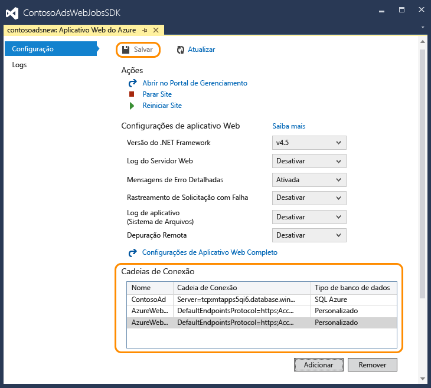
5. No **Gerenciador de Servidores**, clique com o botão direito do mouse no aplicativo Web e clique em **Parar**.
6. Depois que o aplicativo Web é interrompido, clique nele novamente com o botão direito do mouse e, em seguida, clique em **Iniciar**.

   O Trabalho Web é iniciado automaticamente na publicação, mas para quando você faz uma alteração na configuração. Para reiniciá-lo você pode reiniciar o aplicativo Web ou reiniciar o Trabalho Web no [Portal do Azure](http://go.microsoft.com/fwlink/?LinkId=529715). Normalmente é recomendável reiniciar o aplicativo Web depois de uma alteração na configuração.
7. Atualize a janela do navegador com a URL do aplicativo Web em sua barra de endereço.

    A home page é exibida.
8. Crie um anúncio, como você fez ao [executar o aplicativo localmente](https://docs.microsoft.com/azure/app-service-web/websites-dotnet-webjobs-sdk-get-started#a-idrunarun-the-application-locally).

   A página Índice é exibida, inicialmente, sem uma miniatura.
9. A miniatura será exibida alguns segundos após a atualização da página.

   Se a miniatura não aparecer, você terá que aguardar um minuto para que o Trabalho Web seja reiniciado. Se, depois de algum tempo, você ainda não estiver vendo a miniatura quando a página for atualizada, o Trabalho Web pode não ter sido iniciado automaticamente. Nesse caso, vá para a folha **Serviços de aplicativos** no [portal do Azure](https://portal.azure.com/), localize seu aplicativo Web e, em seguida, clique em **Iniciar**.

### <a name="view-the-webjobs-sdk-dashboard"></a>Veja o painel SDK de Trabalhos Web
1. No [portal do Azure](https://portal.azure.com/), selecione a **folha de Serviços de aplicativo**, localize seu aplicativo Web e selecione **WebJobs**.
3. Selecione a guia **Logs**.

    

    Uma nova guia do navegador é aberta no painel do SDK de Trabalhos Web. O painel mostra que o Trabalho Web está em execução e exibe uma lista de funções no seu código, disparadas pelo SDK de Trabalhos Web.
4. Clique em uma das funções para ver detalhes sobre a execução.

    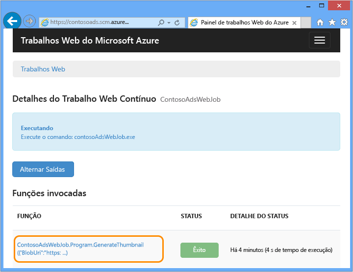

    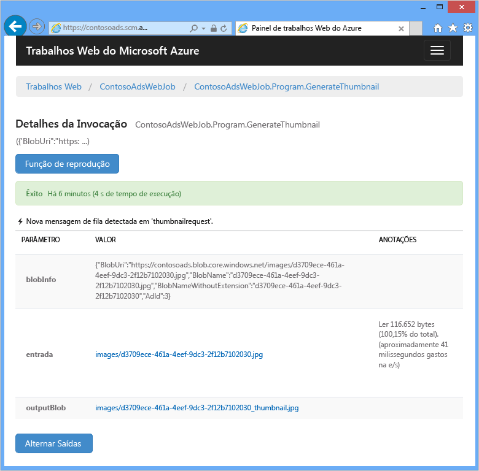

    O botão **Função de Repetição** , nesta página, faz a estrutura do SDK de Trabalhos Web chamar a função novamente e dá uma chance de primeiro alterar os dados passados para a função.

> [!NOTE]
> Quando tiver terminado o teste, considere a exclusão do aplicativo Web, da conta de armazenamento e da sua instância do Banco de Dados SQL. O aplicativo Web é gratuito, mas a instância do Banco de Dados e da conta de armazenamento SQL acumulam encargos (embora mínimos, devido ao tamanho reduzido). Além disso, se deixar o aplicativo Web em execução, qualquer pessoa que encontrar a URL poderá criar e exibir anúncios. 
>
>

### <a name="delete-your-web-app"></a>Excluir seu aplicativo Web
No portal, vá para a folha **Serviços de aplicativos**, localize e selecione o aplicativo Web e, em seguida, clique em **Excluir**. Se apenas deseja evitar que outros acessem temporariamente o aplicativo Web, em vez disso, clique em **Parar** . Nesse caso, os encargos continuarão acumulando para o Banco de Dados SQL e a conta de armazenamento.

### <a name="delete-your-storage-account"></a>Excluir conta de armazenamento
Para excluir sua conta de armazenamento, consulte [Excluir uma conta de armazenamento](https://docs.microsoft.com/azure/storage/storage-create-storage-account#delete-a-storage-account). 

### <a name="delete-your-database"></a>Excluir banco de dados
Para excluir o banco de dados SQL, consulte a documentação [API de REST do Banco de Dados SQL do Azure](https://docs.microsoft.com/rest/api/sql/).

## <a id="create"></a>Criar o aplicativo do zero
Nesta seção, você executará as seguintes tarefas:

* Criar uma solução do Visual Studio com um projeto Web.
* Adicionar um projeto de biblioteca de classes para a camada de acesso a dados é compartilhado entre o front-end e o back-end.
* Adicionar um projeto Aplicativo do Console para um back-end com a implantação de Trabalhos Web habilitada.
* Adicionar pacotes NuGet.
* Definir referências de projeto.
* Copiar o código do aplicativo e os arquivos de configuração do aplicativo baixado, com o qual você trabalhou na seção anterior do tutorial.
* Examinar as partes do código que funcionam com blobs e filas do Azure e o SDK de Trabalhos Web.

### <a name="create-a-visual-studio-solution-with-a-web-project-and-class-library-project"></a>Criar uma solução do Visual Studio com um projeto Web e um projeto de biblioteca de classes
1. No Visual Studio, escolha **Arquivo** > **Novo** > **Projeto**.
2. Na caixa de diálogo **Novo Projeto**, escolha **Visual C#** > **Web** > **Aplicativo Web ASP .NET**.
3. Nomeie o projeto como ContosoAdsWeb, nomeie a solução como ContosoAdsWebJobsSDK (altere o nome da solução caso esteja colocando-a na mesma pasta da solução baixada) e clique em **OK**.

    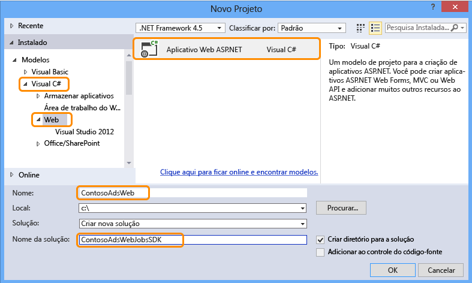
4. Na caixa de diálogo **Novo Aplicativo Web ASP.NET**, escolha o modelo MVC e selecione **Alterar Autenticação**.

    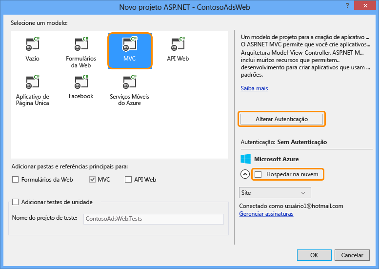
5. Na caixa de diálogo **Alterar Autenticação**, escolha **Sem Autenticação** e clique em **OK**.

    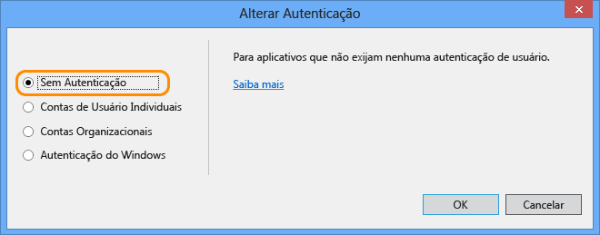
6. Na caixa de diálogo **Novo Aplicativo Web ASP.NET**, clique em **OK**.

    O Visual Studio cria a solução e o projeto Web.
7. No **Gerenciador de Soluções**, clique com o botão direito do mouse na solução (e não no projeto) e escolha **Adicionar** > **Novo Projeto**.
8. Na caixa de diálogo **Adicionar Novo Projeto**, escolha o modelo **Visual C#** > **Área de Trabalho Clássica do Windows** > **Biblioteca de Classes (.NET Framework)**.  
9. Nomeie o projeto *ContosoAdsCommon*, e depois clique em **OK**.

    Esse projeto conterá o contexto do Entity Framework e o modelo de dados que o front-end e o back-end usarão. Como alternativa, você pode definir as classes relacionadas ao EF no projeto Web e referenciar esse projeto pelo projeto Trabalho Web. Assim porém, o projeto WebJob teria uma referência desnecessária a assemblies da Web.

### <a name="add-a-console-application-project-that-has-webjobs-deployment-enabled"></a>Adicionar um projeto de Aplicativo do Console com a implantação de Trabalhos Web habilitada
1. Clique com o botão direito do mouse no projeto Web (e não na solução ou no projeto da biblioteca de classes) e em **Adicionar** > **Novo Projeto de Trabalho Web do Azure**.

    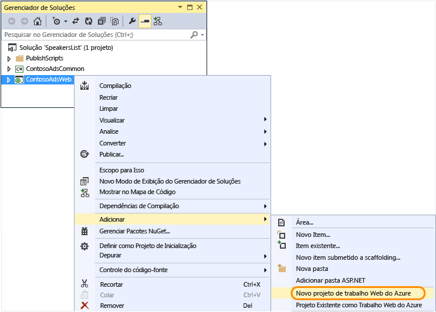
2. Na caixa de diálogo **Adicionar Trabalho Web do Azure**, insira ContosoAdsWebJob tanto como **Nome do projeto** quanto como **Nome do Trabalho Web**. Deixe o **Modo de execução do Trabalho Web** definido como **Executar Continuamente**.
3. Clique em **OK**.

   O Visual Studio cria um aplicativo de console configurado para ser implantado como um Trabalho Web sempre que você implantar o projeto Web. Para isso, ele realizou as seguintes tarefas após a criação do projeto:

   * Adicionou um arquivo *webjob-publish-settings.json* na pasta Propriedades do projeto Trabalho Web.
   * Adicionou um arquivo *webjobs-list.json* na pasta Propriedades do projeto Web.
   * Instalou o pacote Microsoft.Web.WebJobs.Publish NuGet no projeto Trabalho Web.

   Para saber mais sobre essas alterações, consulte [Como implantar WebJobs usando o Visual Studio](websites-dotnet-deploy-webjobs.md).

### <a name="add-nuget-packages"></a>Adicionar pacotes NuGet
O modelo do novo projeto para um projeto de trabalho Web instala automaticamente o pacote NuGet do SDK de Trabalhos Web [Microsoft.Azure.WebJobs](http://www.nuget.org/packages/Microsoft.Azure.WebJobs) e suas dependências.

Uma das dependências do SDK de Trabalhos Web que é instalada automaticamente no projeto do Trabalho Web é o Azure Storage Client Library (SCL). No entanto, é necessário adicioná-lo ao projeto da web para trabalhar com blobs e filas.

1. Abra a caixa de diálogo **Gerenciar pacotes NuGet** para a solução.
2. No painel à esquerda, selecione **Pacotes instalados**.
3. Encontre o pacote *Armazenamento do Azure* e clique em **Gerenciar**.
4. Na caixa **Projetos Selecionados**, marque a caixa de seleção **ContosoAdsWeb** e clique em **OK**.

    Todos os três projetos usam o Entity Framework para trabalhar com dados no Banco de Dados SQL.
5. No painel esquerdo, selecione **Online**.
6. Encontre o pacote NuGet do *EntityFramework* e instale-o em todos os três projetos.

### <a name="set-project-references"></a>Definir referências de projeto
Os projetos Web e WebJob funcionarão com o banco de dados SQL e, portanto, ambos precisam de uma referência para o projeto ContosoAdsCommon.

1. No projeto ContosoAdsWeb, defina uma referência para o projeto ContosoAdsCommon. (Clique com o botão direito do mouse no projeto ContosoAdsWeb e clique em **Adicionar** > **Referência**. 
2. Na caixa de diálogo **Gerenciador de Referências**, selecione **Projetos** > **Solução** > **ContosoAdsCommon** e clique em **OK**.)
   
    O projeto Trabalho Web precisa de referências para trabalhar com imagens e acessar cadeias de conexão.

4. No projeto ContosoAdsWebJob, defina uma referência como `System.Drawing` e `System.Configuration`.

### <a name="add-code-and-configuration-files"></a>Adicionar código e arquivos de configuração
Este tutorial não mostra como [criar controladores e exibições MVC usando scaffolding](http://www.asp.net/mvc/tutorials/mvc-5/introduction/getting-started), como [escrever código do Entity Framework que funciona com bancos de dados do SQL Server](http://www.asp.net/mvc/tutorials/getting-started-with-ef-using-mvc) ou [as noções básicas da programação assíncrona no ASP.NET 4.5](http://www.asp.net/aspnet/overview/developing-apps-with-windows-azure/building-real-world-cloud-apps-with-windows-azure/web-development-best-practices#async). Assim, tudo o que resta a fazer é copiar o código e os arquivos de configuração da solução baixada para a nova solução. Depois que você fizer isso, as seções a seguir mostrarão e explicarão as principais partes do código.

Para adicionar arquivos a um projeto ou a uma pasta, clique com o botão direito do mouse no projeto ou na pasta e clique em **Adicionar** > **Item Existente**. Selecione os arquivos que deseja e clique em **Adicionar**. Se receber uma solicitação para confirmar se deseja substituir os arquivos existentes, clique em **Sim**.

1. No projeto ContosoAdsCommon, exclua o arquivo *Class1.cs* e adicione em seu lugar os arquivos a seguir do projeto baixado.

   * *Ad.cs*
   * *ContosoAdscontext.cs*
   * *BlobInformation.cs*
2. No projeto ContosoAdsWeb, adicione os seguintes arquivos do projeto baixado.

   * *Web.config*
   * *Global.asax.cs*  
   * Na pasta *Controllers*: *AdController.cs*
   * Na pasta *Views\Shared*: arquivo *_Layout.cshtml*
   * Na pasta *Views\Home*: *Index.cshtml*
   * Na pasta *Views\Ad* (crie a pasta primeiro): cinco arquivos *.cshtml*
3. No projeto ContosoAdsWebJob, adicione os seguintes arquivos do projeto baixado.

   * *App.config* (altere o filtro do tipo de arquivo para **Todos os Arquivos**)
   * *Program.cs*
   * *Functions.cs*

Agora é possível compilar, executar e implantar o aplicativo conforme instruído anteriormente no tutorial. Porém, antes de fazer isso, interrompa o Trabalho Web em execução no primeiro aplicativo Web em que você o implantou. Do contrário, esse Trabalho Web processará as mensagens da fila criadas localmente ou pelo aplicativo em execução no novo aplicativo Web, porque todas estão usando a mesma conta de armazenamento.

## <a id="code"></a>Examinar o código do aplicativo
As seções a seguir explicam o código relacionado ao trabalho com os blobs e as filas do SDK de Trabalhos Web e do Armazenamento do Azure.

> [!NOTE]
> Para o código específico do SDK do WebJobs, vá para as seções [Program.cs e Functions.cs](#programcs) .
>
>

### <a name="contosoadscommon---adcs"></a>ContosoAdsCommon - Ad.cs
O arquivo Ad.cs file define uma enumeração para categorias de anúncios e uma classe de entidade POCO para as informações de anúncios.

        public enum Category
        {
            Cars,
            [Display(Name="Real Estate")]
            RealEstate,
            [Display(Name = "Free Stuff")]
            FreeStuff
        }

        public class Ad
        {
            public int AdId { get; set; }

            [StringLength(100)]
            public string Title { get; set; }

            public int Price { get; set; }

            [StringLength(1000)]
            [DataType(DataType.MultilineText)]
            public string Description { get; set; }

            [StringLength(1000)]
            [DisplayName("Full-size Image")]
            public string ImageURL { get; set; }

            [StringLength(1000)]
            [DisplayName("Thumbnail")]
            public string ThumbnailURL { get; set; }

            [DataType(DataType.Date)]
            [DisplayFormat(DataFormatString = "{0:yyyy-MM-dd}", ApplyFormatInEditMode = true)]
            public DateTime PostedDate { get; set; }

            public Category? Category { get; set; }
            [StringLength(12)]
            public string Phone { get; set; }
        }

### <a name="contosoadscommon---contosoadscontextcs"></a>ContosoAdsCommon - ContosoAdsContext.cs
A classe ContosoAdsContext especifica que a classe Ad é usada em uma coleção DbSet, em que Entity Framework é armazenado em um banco de dados SQL.

        public class ContosoAdsContext : DbContext
        {
            public ContosoAdsContext() : base("name=ContosoAdsContext")
            {
            }
            public ContosoAdsContext(string connString)
                : base(connString)
            {
            }
            public System.Data.Entity.DbSet<Ad> Ads { get; set; }
        }

A classe possui dois construtores. O primeiro é usado pelo projeto Web e especifica o nome de uma cadeia de conexão armazenada no arquivo Web.config ou no ambiente de tempo de execução do Azure. O segundo construtor habilita você a transmitir a cadeia de conexão real. Ela é necessária para o projeto WebJob, uma vez que este não possui um arquivo Web.config. Foi mostrado anteriormente onde essa cadeia de conexão foi armazenada, e você verá mais adiante como o código recupera a cadeia de conexão quando ele cria uma instância de classe DbContext.

### <a name="contosoadscommon---blobinformationcs"></a>ContosoAdsCommon - BlobInformation.cs
A classe `BlobInformation` é usada para armazenar informações sobre um blob de imagem em uma mensagem da fila.

        public class BlobInformation
        {
            public Uri BlobUri { get; set; }

            public string BlobName
            {
                get
                {
                    return BlobUri.Segments[BlobUri.Segments.Length - 1];
                }
            }
            public string BlobNameWithoutExtension
            {
                get
                {
                    return Path.GetFileNameWithoutExtension(BlobName);
                }
            }
            public int AdId { get; set; }
        }


### <a name="contosoadsweb---globalasaxcs"></a>ContosoAdsWeb - Global.asax.cs
O código que é chamado do método `Application_Start` criará um contêiner de blob *images* e uma fila *images*, se ainda não existirem. Isso garante que, sempre que você começar a usar uma nova conta de armazenamento, o contêiner do blob e a fila obrigatórios serão criados automaticamente.

O código obtém acesso à conta de armazenamento usando a cadeia de conexão de armazenamento do arquivo *Web.config* ou do ambiente de execução do Azure.

        var storageAccount = CloudStorageAccount.Parse
            (ConfigurationManager.ConnectionStrings["AzureWebJobsStorage"].ToString());

Em seguida, ele obtém uma referência para o contêiner do blob de *imagens* , cria o contêiner se ele ainda não existe e define permissões de acesso no novo contêiner. Por padrão, os novos contêineres permitem que somente clientes com credenciais da conta de armazenamento acessem os blobs. O aplicativo Web precisa que os blobs para o público para poder exibir imagens usando URLs que apontam para os blobs de imagem.

        var blobClient = storageAccount.CreateCloudBlobClient();
        var imagesBlobContainer = blobClient.GetContainerReference("images");
        if (imagesBlobContainer.CreateIfNotExists())
        {
            imagesBlobContainer.SetPermissions(
                new BlobContainerPermissions
                {
                    PublicAccess = BlobContainerPublicAccessType.Blob
                });
        }

Um código semelhante obtém uma referência para a fila *thumbnailrequest* e cria uma nova fila. Nesse caso, nenhuma alteração de permissão é necessária.

        CloudQueueClient queueClient = storageAccount.CreateCloudQueueClient();
        var imagesQueue = queueClient.GetQueueReference("thumbnailrequest");
        imagesQueue.CreateIfNotExists();

### <a name="contosoadsweb---layoutcshtml"></a>ContosoAdsWeb - _Layout.cshtml
O arquivo *_Layout.cshtml* define o nome do aplicativo no cabeçalho e no rodapé e cria uma entrada de menu "Ads".

### <a name="contosoadsweb---viewshomeindexcshtml"></a>ContosoAdsWeb - Views\Home\Index.cshtml
O arquivo *Views\Home\Index.cshtml* exibe links de categoria na home page. Os links passam o valor inteiro da enumeração `Category` em uma variável querystring para a página Índice de anúncio.

        <li>@Html.ActionLink("Cars", "Index", "Ad", new { category = (int)Category.Cars }, null)</li>
        <li>@Html.ActionLink("Real estate", "Index", "Ad", new { category = (int)Category.RealEstate }, null)</li>
        <li>@Html.ActionLink("Free stuff", "Index", "Ad", new { category = (int)Category.FreeStuff }, null)</li>
        <li>@Html.ActionLink("All", "Index", "Ad", null, null)</li>

### <a name="contosoadsweb---adcontrollercs"></a>ContosoAdsWeb - AdController.cs
No arquivo *AdController.cs*, o construtor chama o método `InitializeStorage` para criar os objetos da Biblioteca do Cliente do Armazenamento do Azure que fornecem uma API para trabalhar com blobs e filas.

Em seguida, o código obtém uma referência para o contêiner do blob de *imagens* como visto anteriormente em *Global.asax.cs*. Enquanto faz isso, ele define uma [política de repetição](http://www.asp.net/aspnet/overview/developing-apps-with-windows-azure/building-real-world-cloud-apps-with-windows-azure/transient-fault-handling) padrão apropriada para um aplicativo Web. A política de recuperação de retirada exponencial padrão pode fazer com que o aplicativo Web pare de responder por mais de um minuto em tentativas repetidas de uma falha transitória. A política de recuperação especificada aqui aguarda três segundos após cada tentativa, até três tentativas.

        var blobClient = storageAccount.CreateCloudBlobClient();
        blobClient.DefaultRequestOptions.RetryPolicy = new LinearRetry(TimeSpan.FromSeconds(3), 3);
        imagesBlobContainer = blobClient.GetContainerReference("images");

Código similar obtém uma referência para a fila de *imagens* .

        CloudQueueClient queueClient = storageAccount.CreateCloudQueueClient();
        queueClient.DefaultRequestOptions.RetryPolicy = new LinearRetry(TimeSpan.FromSeconds(3), 3);
        imagesQueue = queueClient.GetQueueReference("blobnamerequest");

A maior parte do código do controlador é típica para trabalhar com um modelo de dados do Entity Framework usando uma classe DbContext. Uma exceção é o método HttpPost `Create` , que atualiza um arquivo e o salva no armazenamento do blob. O associador de modelo fornece um objeto [HttpPostedFileBase](http://msdn.microsoft.com/library/system.web.httppostedfilebase.aspx) para o método.

        [HttpPost]
        [ValidateAntiForgeryToken]
        public async Task<ActionResult> Create(
            [Bind(Include = "Title,Price,Description,Category,Phone")] Ad ad,
            HttpPostedFileBase imageFile)

Se o usuário selecionou um arquivo para carregamento, o código carrega o arquivo, salva o arquivo em um blob e atualiza o registro do banco de dados do anúncio com uma URL que aponta para o blob.

        if (imageFile != null && imageFile.ContentLength != 0)
        {
            blob = await UploadAndSaveBlobAsync(imageFile);
            ad.ImageURL = blob.Uri.ToString();
        }

O código que não é carregado está no método `UploadAndSaveBlobAsync` . Ele cria um nome de GUID para o blob, carrega e salva o arquivo e retorna uma referência para o blob salvo.

        private async Task<CloudBlockBlob> UploadAndSaveBlobAsync(HttpPostedFileBase imageFile)
        {
            string blobName = Guid.NewGuid().ToString() + Path.GetExtension(imageFile.FileName);
            CloudBlockBlob imageBlob = imagesBlobContainer.GetBlockBlobReference(blobName);
            using (var fileStream = imageFile.InputStream)
            {
                await imageBlob.UploadFromStreamAsync(fileStream);
            }
            return imageBlob;
        }

Depois de carregar um blob e atualizar o banco de dados, o método HttpPost `Create` criará uma mensagem da fila para informar o processo back-end que uma imagem está pronta para conversão em miniatura.

        BlobInformation blobInfo = new BlobInformation() { AdId = ad.AdId, BlobUri = new Uri(ad.ImageURL) };
        var queueMessage = new CloudQueueMessage(JsonConvert.SerializeObject(blobInfo));
        await thumbnailRequestQueue.AddMessageAsync(queueMessage);

O código do método HttpPost `Edit` é parecido, exceto pelo fato de que se o usuário selecionar um novo arquivo de imagem, qualquer blob já existente para esse anúncio deverá ser excluído.

        if (imageFile != null && imageFile.ContentLength != 0)
        {
            await DeleteAdBlobsAsync(ad);
            imageBlob = await UploadAndSaveBlobAsync(imageFile);
            ad.ImageURL = imageBlob.Uri.ToString();
        }

Este é o código que exclui os blobs quando você exclui um anúncio:

        private async Task DeleteAdBlobsAsync(Ad ad)
        {
            if (!string.IsNullOrWhiteSpace(ad.ImageURL))
            {
                Uri blobUri = new Uri(ad.ImageURL);
                await DeleteAdBlobAsync(blobUri);
            }
            if (!string.IsNullOrWhiteSpace(ad.ThumbnailURL))
            {
                Uri blobUri = new Uri(ad.ThumbnailURL);
                await DeleteAdBlobAsync(blobUri);
            }
        }
        private static async Task DeleteAdBlobAsync(Uri blobUri)
        {
            string blobName = blobUri.Segments[blobUri.Segments.Length - 1];
            CloudBlockBlob blobToDelete = imagesBlobContainer.GetBlockBlobReference(blobName);
            await blobToDelete.DeleteAsync();
        }

### <a name="contosoadsweb---viewsadindexcshtml-and-detailscshtml"></a>ContosoAdsWeb - Views\Ad\Index.cshtml e Details.cshtml
O arquivo *Index.cshtml* exibe miniaturas com os outros dados de anúncio:

        

O arquivo *Details.cshtml* exibe a imagem em tamanho real:

        

### <a name="contosoadsweb---viewsadcreatecshtml-and-editcshtml"></a>ContosoAdsWeb - Views\Ad\Create.cshtml e Edit.cshtml
Os arquivos *Create.cshtml* e *Edit.cshtml* especificam a codificação de formulário que habilita o controlador a obter o objeto `HttpPostedFileBase`.

        @using (Html.BeginForm("Create", "Ad", FormMethod.Post, new { enctype = "multipart/form-data" }))

Um elemento `<input>` informa o navegador para fornecer uma caixa de diálogo de seleção de arquivo.

        <input type="file" name="imageFile" accept="image/*" class="form-control fileupload" />

### <a id="programcs"></a>ContosoAdsWebJob - Program.cs
Quando o Trabalho Web é iniciado, o método `Main` chama o método `JobHost.RunAndBlock` do SDK dos Trabalhos Web para iniciar a execução de funções disparadas no thread atual.

        static void Main(string[] args)
        {
            JobHost host = new JobHost();
            host.RunAndBlock();
        }

### <a id="generatethumbnail"></a>ContosoAdsWebJob - Functions.cs - método GenerateThumbnail
O SDK de Trabalhos Web chama esse método quando uma mensagem da fila é recebida. O método cria uma miniatura e coloca a URL da miniatura no banco de dados.

        public static void GenerateThumbnail(
        [QueueTrigger("thumbnailrequest")] BlobInformation blobInfo,
        [Blob("images/{BlobName}", FileAccess.Read)] Stream input,
        [Blob("images/{BlobNameWithoutExtension}_thumbnail.jpg")] CloudBlockBlob outputBlob)
        {
            using (Stream output = outputBlob.OpenWrite())
            {
                ConvertImageToThumbnailJPG(input, output);
                outputBlob.Properties.ContentType = "image/jpeg";
            }

            // Entity Framework context class is not thread-safe, so it must
            // be instantiated and disposed within the function.
            using (ContosoAdsContext db = new ContosoAdsContext())
            {
                var id = blobInfo.AdId;
                Ad ad = db.Ads.Find(id);
                if (ad == null)
                {
                    throw new Exception(String.Format("AdId {0} not found, can't create thumbnail", id.ToString()));
                }
                ad.ThumbnailURL = outputBlob.Uri.ToString();
                db.SaveChanges();
            }
        }

* O atributo `QueueTrigger` direciona o SDK de Trabalhos Web para chamar esse método quando uma nova mensagem é recebida na fila thumbnailrequest.

        [QueueTrigger("thumbnailrequest")] BlobInformation blobInfo,

    O objeto `BlobInformation` na mensagem da fila é desserializado automaticamente no parâmetro `blobInfo`. Quando o método é concluído, a mensagem da fila é excluída. Se o método falhar antes da conclusão, a mensagem da fila não será excluída. Depois de uma concessão de 10 minutos, a mensagem será liberada para ser novamente retirada e processada. Essa sequência não será repetida indefinidamente se uma mensagem sempre causar uma exceção. Depois de 5 tentativas malsucedidas de processar uma mensagem, a mensagem será movida para uma fila chamada {queuename}-poison. O número máximo de tentativas é configurável.
* Os dois atributos `Blob` fornecem objetos vinculados a blobs: um para o blob de imagem existente e outro para um novo blob de miniatura que o método cria.

        [Blob("images/{BlobName}", FileAccess.Read)] Stream input,
        [Blob("images/{BlobNameWithoutExtension}_thumbnail.jpg")] CloudBlockBlob outputBlob)

    Os nomes dos blobs vêm de propriedades do objeto `BlobInformation` recebidas na mensagem da fila (`BlobName` e `BlobNameWithoutExtension`). Para obter toda a funcionalidade da SCL, é possível usar a classe `CloudBlockBlob` para trabalhar com blobs. Se quiser reutilizar código escrito para funcionar com objetos  `Stream`, você pode usar a classe `Stream`.

Para saber mais sobre como escrever funções que usam atributos SDK de Trabalhos Web, confira os recursos a seguir:

* [Como usar o armazenamento de fila do Azure com o SDK de Trabalhos Web](websites-dotnet-webjobs-sdk-storage-queues-how-to.md)
* [Como usar o armazenamento de blob do Azure com o SDK de Trabalhos Web](websites-dotnet-webjobs-sdk-storage-blobs-how-to.md)
* [Como usar o armazenamento de tabela do Azure com o SDK de Trabalhos Web](websites-dotnet-webjobs-sdk-storage-tables-how-to.md)
* [Como usar o barramento de serviço do Azure com o SDK WebJobs](websites-dotnet-webjobs-sdk-service-bus.md)

> [!NOTE]
> * Se seu aplicativo Web for executado em várias VMs, diversos Trabalhos Web estarão em execução simultaneamente e, em alguns cenários, isso pode resultar nos mesmos dados processados várias vezes. Isso não será um problema se você usar os gatilhos internos de fila, de blob e de Barramento de Serviço. O SDK garante que suas funções serão processadas apenas uma vez para cada mensagem ou blob.
> * Para obter informações sobre como implementar o desligamento normal, consulte [Desligamento Normal](websites-dotnet-webjobs-sdk-storage-queues-how-to.md#graceful).
> * O código no método `ConvertImageToThumbnailJPG` (não mostrado) usa classes no namespace `System.Drawing` por uma questão de simplicidade. Entretanto, as classes nesse namespace foram projetadas para uso nos formulários do Windows. Elas não têm suporte para uso em um serviço Windows ou ASP.NET. Para obter mais informações sobre opções de processamento de imagem, consulte [Geração dinâmica de imagem](http://www.hanselman.com/blog/BackToBasicsDynamicImageGenerationASPNETControllersRoutingIHttpHandlersAndRunAllManagedModulesForAllRequests.aspx) e [Visão aprofundada de redimensionamento de imagens](http://www.hanselminutes.com/313/deep-inside-image-resizing-and-scaling-with-aspnet-and-iis-with-imageresizingnet-author-na).
>
>

## <a name="next-steps"></a>Próximas etapas
Neste tutorial, você viu um aplicativo multicamadas simples que usa o SDK de Trabalhos Web no processamento back-end. Esta seção oferece algumas sugestões para saber mais sobre os aplicativos ASP.NET com várias camadas e Trabalhos Web.

### <a name="missing-features"></a>Recursos ausentes
O aplicativo foi mantido simples para um tutorial de introdução. Em um aplicativo do mundo real, você poderia implementar [injeção de dependência](http://www.asp.net/mvc/tutorials/hands-on-labs/aspnet-mvc-4-dependency-injection) e os [padrões de unidade de trabalho e repositório](http://www.asp.net/mvc/tutorials/getting-started-with-ef-using-mvc/advanced-entity-framework-scenarios-for-an-mvc-web-application#repo), usar [uma interface para o log](http://www.asp.net/aspnet/overview/developing-apps-with-windows-azure/building-real-world-cloud-apps-with-windows-azure/monitoring-and-telemetry#log), usar [Migrações Iniciais de Código de EF](http://www.asp.net/mvc/tutorials/getting-started-with-ef-using-mvc/migrations-and-deployment-with-the-entity-framework-in-an-asp-net-mvc-application) para gerenciar alterações no modelo de dados e usar [Resiliência de Conexão de EF](http://www.asp.net/mvc/tutorials/getting-started-with-ef-using-mvc/connection-resiliency-and-command-interception-with-the-entity-framework-in-an-asp-net-mvc-application) para gerenciar erros de rede transitórios.

### <a name="scaling-webjobs"></a>Dimensionamento de trabalhos
Trabalhos Web são executados no contexto de um aplicativo Web e não são escalonáveis separadamente. Por exemplo, se tiver uma instância de aplicativo Web Padrão, você só pode ter uma instância do processo em segundo plano em execução e ela está usando parte dos recursos do servidor (CPU, memória etc.) que, de outra forma, estariam disponíveis para atender ao conteúdo da Web.

Se o tráfego variar de acordo com a hora do dia ou o dia da semana e se for possível esperar o processamento back-end necessário, você pode agendar os Trabalhos Web para serem executados nos horários de menos tráfego. Se a carga ainda for muito alta para a solução, você poderá executar o back-end como um trabalho Web em um aplicativo Web separado, dedicado para essa finalidade. Em seguida, você pode dimensionar seu aplicativo Web de back-end independentemente do seu aplicativo Web de front-end.

Para saber mais, veja [Dimensionando WebJobs](websites-webjobs-resources.md#scale).

### <a name="avoiding-web-app-timeout-shut-downs"></a>Evitando desligamentos de tempo limite de aplicativo Web
Para garantir que seus WebJobs estejam sempre em execução, e em todas as instâncias de seu aplicativo Web, será preciso habilitar o recurso [AlwaysOn](http://weblogs.asp.net/scottgu/archive/2014/01/16/windows-azure-staging-publishing-support-for-web-sites-monitoring-improvements-hyper-v-recovery-manager-ga-and-pci-compliance.aspx) .

### <a name="using-the-webjobs-sdk-outside-of-webjobs"></a>Usando o SDK de Trabalhos Web fora de Trabalhos Web
Um programa que usa o SDK de Trabalhos Web não precisa ser executado no Azure em um Trabalho Web. Ele pode ser executado localmente e também pode ser executado em outros ambientes, como em uma função de trabalho do serviço de nuvem ou um serviço Windows. No entanto, só é possível acessar o painel do SDK de Trabalhos Web por meio de um aplicativo Web do Azure. Para usar o painel, será preciso conectar o aplicativo Web à conta de armazenamento que você está usando definindo a cadeia de conexão AzureWebJobsDashboard na guia **Configurar** do portal clássico. Em seguida, você pode chegar ao Painel usando a seguinte URL:

https://{NomeDoAplicativoWeb}.scm.azurewebsites.net/azurejobs/#/functions

Para obter mais informações, consulte [Obtendo um painel para desenvolvimento local com o SDK de Trabalhos Web](http://blogs.msdn.com/b/jmstall/archive/2014/01/27/getting-a-dashboard-for-local-development-with-the-webjobs-sdk.aspx), mas observe que ele mostra um nome da cadeia de conexão antigo.

### <a name="more-webjobs-documentation"></a>Mais documentação de Trabalhos Web
Para sabe r mais, consulte [Recursos de documentação de WebJobs do Azure](http://go.microsoft.com/fwlink/?LinkId=390226).

