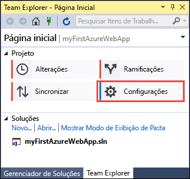

# <a name="create-an-aspnet-core-web-app-in-azure"></a>Criar um aplicativo Web ASP.NET Core no Azure

> [!NOTE]
> Este artigo implanta um aplicativo no Serviço de Aplicativo no Windows. Para implantar o Serviço de Aplicativo em _Linux_, consulte [Criar um aplicativo Web .NET Core no Serviço de Aplicativo em Linux](./containers/quickstart-dotnetcore.md).
>
> Caso esteja procurando por etapas para um aplicativo ASP.NET Framework, consulte [Criar um aplicativo Web do ASP.NET Framework no Azure](app-service-web-get-started-dotnet-framework.md). 
>

Os [aplicativos Web do Azure](app-service-web-overview.md) fornecem um serviço de hospedagem na Web altamente escalonável,com aplicação automática de patches.  Este guia de início rápido mostra como implantar seu primeiro aplicativo Web ASP.NET Core em aplicativos Web do Azure. Quando terminar, você terá um grupo de recursos que consiste em um plano do Serviço de Aplicativo e um aplicativo Web do Azure com um aplicativo Web implantado.

[!INCLUDE [quickstarts-free-trial-note](../../includes/quickstarts-free-trial-note.md)]

## <a name="prerequisites"></a>pré-requisitos

Para concluir este tutorial:

* Instale o <a href="https://www.visualstudio.com/downloads/" target="_blank">Visual Studio 2017</a> com as cargas de trabalho a seguir:
    - **Desenvolvimento Web e do ASP.NET**
    - **Desenvolvimento do Azure**

    

## <a name="create-an-aspnet-core-web-app"></a>Criar um aplicativo Web ASP.NET Core

No Visual Studio, crie um projeto selecionando **Arquivo > Novo > Projeto**. 

Na caixa de diálogo **Novo Projeto**, selecione **Visual C# > Web > Aplicativo Web ASP.NET Core**.

Nomeie o aplicativo _myFirstAzureWebApp_, selecione **Criar novo repositório Git** e depois **OK**.
   


Você pode implantar qualquer tipo de aplicativo Web ASP.NET Core no Azure. Para o início rápido, selecione o modelo **Aplicativo Web** e verifique se a autenticação está definida como **Sem Autenticação**.
      
Selecione **OK**.


Após a criação do projeto do ASP.NET Core, a página de boas-vindas do ASP.NET Core será exibida, fornecendo vários links para recursos que ajudarão você a começar. 


No menu, selecione **Depurar > Iniciar sem depuração** para executar o aplicativo Web localmente.


[!INCLUDE [cloud-shell-try-it.md](../../includes/cloud-shell-try-it.md)]

[!INCLUDE [Configure deployment user](../../includes/configure-deployment-user.md)] 

[!INCLUDE [Create resource group](../../includes/app-service-web-create-resource-group.md)] 

[!INCLUDE [Create app service plan](../../includes/app-service-web-create-app-service-plan.md)] 

[!INCLUDE [Create web app](../../includes/app-service-web-create-web-app.md)] 


## <a name="push-to-azure-from-visual-studio"></a>Efetuar push ao Azure a partir do Visual Studio

De volta ao Visual Studio, no menu **Exibição**, clique em **Team Explorer**. O **Team Explorer** é exibido.

Na exibição **Página inicial**, clique em **Configurações** > **Configurações do Repositório**.



Na seção **Remotos** das **Configurações do Repositório**, selecione **Adicionar**. A caixa de diálogo **Adicionar Remoto** é exibida.

Defina o campo **Nome** como _Azure_, depois defina o campo **Buscar** com a URL que você salvou em [Criar um aplicativo Web](#create-a-web-app). Clique em **Salvar**.


Essa configuração é equivalente ao comando `git remote add Azure <URL>` do Git.

Clique no botão **Página inicial** na parte superior.

Selecione **Configurações** > **Configurações Globais**. Confirme se o nome e o endereço de email estão definidos. Selecione **Atualizar** se necessário.

O Visual Studio já confirmou todos os arquivos no repositório Git quando ele criou o projeto. Tudo o que você precisa fazer agora é efetuar push dos arquivos para o Azure.

Clique no botão **Página inicial** na parte superior. Selecione **Sincronizar** > **Ações** > **Abrir o Prompt de Comando**. 

Insira o comando a seguir na janela de comando, além da senha de implantação quando solicitado:

```
git push Azure master
```

Esse comando pode demorar um pouco para ser executado. Na execução, ele exibe informações semelhantes ao seguinte exemplo:

```
Counting objects: 4, done.
Delta compression using up to 8 threads.
Compressing objects: 100% (4/4), done.
Writing objects: 100% (4/4), 349 bytes | 349.00 KiB/s, done.
Total 4 (delta 3), reused 0 (delta 0)
remote: Updating branch 'master'.
remote: Updating submodules.
remote: Preparing deployment for commit id '9e20345e9c'.
remote: Generating deployment script.
remote: Project file path: .\myFirstAzureWebApp\myFirstAzureWebApp.csproj
remote: Solution file path: .\myFirstAzureWebApp.sln
remote: Generated deployment script files
remote: Running deployment command...
remote: Handling ASP.NET Core Web Application deployment.
remote:   Restoring packages for D:\home\site\repository\myFirstAzureWebApp\myFirstAzureWebApp.csproj...
remote:   Restoring packages for D:\home\site\repository\myFirstAzureWebApp\myFirstAzureWebApp.csproj...
...
remote: Finished successfully.
remote: Running post deployment command(s)...
remote: Deployment successful.
To https://<app_name>.scm.azurewebsites.net/<app_name>.git
 * [new branch]      master -> master
```

## <a name="browse-to-the-app"></a>Navegar até o aplicativo

Em um navegador, navegue até a URL do aplicativo Web do Azure: `http://<app_name>.azurewebsites.net`.

A página está sendo executada como um aplicativo Web do Serviço de Aplicativo do Azure.


Parabéns, seu aplicativo Web ASP.NET Core está em execução no Serviço de Aplicativo do Azure.

## <a name="update-the-app-and-redeploy"></a>Atualizar o aplicativo e reimplantar

No **Gerenciador de Soluções**, abra _Pages/Index.cshtml_.

Encontre o rótulo HTML `<div id="myCarousel" class="carousel slide" data-ride="carousel" data-interval="6000">` próximo à parte superior e substitua o elemento inteiro pelo seguinte código:

```HTML
<div class="jumbotron">
    <h1>ASP.NET in Azure!</h1>
    <p class="lead">This is a simple app that we’ve built that demonstrates how to deploy a .NET app to Azure App Service.</p>
</div>
```

No **Gerenciador de Soluções**, clique com botão direito do mouse em _Pages/Index.cshtml_ e clique em **Confirmar**. Digite uma mensagem de confirmação para a alteração e clique em **Confirmar Tudo**.

De volta à janela do prompt de comando, efetue push das alterações de código para o Azure.

```bash
git push Azure master
```

Quando a implantação for concluída, navegue até `http://<app_name>.azurewebsites.net` novamente.


## <a name="manage-the-azure-web-app"></a>Gestão do aplicativo web do Azure

Acesse o <a href="https://portal.azure.com" target="_blank">portal do Azure</a> para gerenciar o aplicativo Web.

No menu à esquerda, selecione **Serviços de Aplicativos** e, em seguida, selecione o nome do seu aplicativo Web do Azure.


A página Visão Geral do seu aplicativo Web é exibida. Aqui você pode executar tarefas básicas de gerenciamento como procurar, parar, iniciar, reiniciar e excluir. 


O menu à esquerda fornece páginas diferentes para configurar seu aplicativo. 

[!INCLUDE [Clean-up section](../../includes/clean-up-section-portal.md)]

## <a name="next-steps"></a>Próximas etapas

> [!div class="nextstepaction"]
> [ASP.NET Core com o Banco de Dados SQL](app-service-web-tutorial-dotnetcore-sqldb.md)
