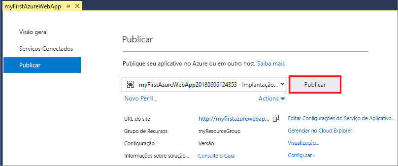

# <a name="create-an-aspnet-core-web-app-in-azure"></a>Criar um aplicativo Web ASP.NET Core no Azure

> [!NOTE]
> Este artigo implanta um aplicativo no Serviço de Aplicativo no Windows. Para implantar o Serviço de Aplicativo em _Linux_, consulte [Criar um aplicativo Web .NET Core no Serviço de Aplicativo em Linux](./containers/quickstart-dotnetcore.md). 
>

Os [aplicativos Web do Azure](app-service-web-overview.md) fornecem um serviço de hospedagem na Web altamente escalonável,com aplicação automática de patches.  Este guia de início rápido mostra como implantar seu primeiro aplicativo Web ASP.NET Core em aplicativos Web do Azure. Quando terminar, você terá um grupo de recursos que consiste em um plano do Serviço de Aplicativo e um aplicativo Web do Azure com um aplicativo Web implantado.


[!INCLUDE [quickstarts-free-trial-note](../../includes/quickstarts-free-trial-note.md)]

## <a name="prerequisites"></a>Pré-requisitos

Para concluir este tutorial, instale o <a href="https://www.visualstudio.com/downloads/" target="_blank">Visual Studio 2017</a> com a carga de trabalho do **ASP.NET e de desenvolvimento para a Web**.

Se você já instalou o Visual Studio 2017:

- Instale as atualizações mais recentes no Visual Studio, clicando em **Ajuda** > **Verificar Atualizações**.
- Adicione a carga de trabalho clicando em **Ferramentas** > **Obter Ferramentas e Recursos**.

## <a name="create-an-aspnet-core-web-app"></a>Criar um aplicativo Web ASP.NET Core

No Visual Studio, crie um projeto selecionando **Arquivo > Novo > Projeto**. 

Na caixa de diálogo **Novo Projeto**, selecione **Visual C# > Web > Aplicativo Web ASP.NET Core**.

Nomeie o aplicativo como _myFirstAzureWebApp_ e clique em **OK**.
   


Você pode implantar qualquer tipo de aplicativo Web ASP.NET Core no Azure. Para este início rápido, selecione o modelo **Aplicativo Web** e verifique se a autenticação está definida para **Sem Autenticação** e nenhuma outra opção está selecionada.
      
Selecione **OK**.


No menu, selecione **Depurar > Iniciar sem depuração** para executar o aplicativo Web localmente.


## <a name="launch-the-publish-wizard"></a>Iniciar assistente de publicação

No **Gerenciador de Soluções**, clique com o botão direito do mouse no projeto **myFirstAzureWebApp** e selecione **Publicar**.


O assistente de publicação é iniciado automaticamente. Selecione **Serviço de Aplicativo** > **Publicar** para abrir a caixa de diálogo **Criar Serviço de Aplicativo**.


## <a name="sign-in-to-azure"></a>Entrar no Azure

Na caixa de diálogo **Criar Serviço de Aplicativo**, clique em **Adicionar uma conta** e faça logon em sua assinatura do Azure. Se você já estiver conectado, selecione a conta que deseja na lista suspensa.

> [!NOTE]
> Se você já estiver conectado, não selecione **Criar** ainda.
>
   


## <a name="create-a-resource-group"></a>Criar um grupo de recursos

[!INCLUDE [resource group intro text](../../includes/resource-group.md)]

Ao lado de **Grupo de recursos**, selecione **Novo**.

Nomeie o grupo de recursos **myResourceGroup** e selecione **Ok**.

## <a name="create-an-app-service-plan"></a>Criar um plano de Serviço de Aplicativo

[!INCLUDE [app-service-plan](../../includes/app-service-plan.md)]

Ao lado de **Plano de Hospedagem**, selecione **Novo**. 

Na caixa de diálogo **Configurar Plano de Hospedagem**, use as configurações na tabela de acordo com a captura de tela.


| Configuração | Valor sugerido | DESCRIÇÃO |
|-|-|-|
|Plano do Serviço de Aplicativo| myAppServicePlan | O nome do plano do Serviço de Aplicativo. |
| Local padrão | Europa Ocidental | O datacenter onde o aplicativo Web está hospedado. |
| Tamanho | Grátis | O [Tipo de preço](https://azure.microsoft.com/pricing/details/app-service/?ref=microsoft.com&utm_source=microsoft.com&utm_medium=docs&utm_campaign=visualstudio) determina os recursos de hospedagem. |

Selecione **OK**.

## <a name="create-and-publish-the-web-app"></a>Publicar e publicar o aplicativo Web

Em **Nome do Aplicativo**, digite um nome exclusivo do aplicativo (os caracteres válidos são `a-z`, `0-9` e `-`) ou aceite o nome exclusivo gerado automaticamente. A URL do aplicativo Web é `http://<app_name>.azurewebsites.net`, em que `<app_name>` é o nome do aplicativo.

Clique em **Criar** para começar a criar os recursos do Azure.


Após a conclusão do assistente, ele publicará o aplicativo Web ASP.NET Core no Azure e, em seguida, iniciará o aplicativo no navegador padrão.


O nome do aplicativo especificado na [etapa para criar e publicar](#create-and-publish-the-web-app) é usado como o prefixo de URL no formato `http://<app_name>.azurewebsites.net`.

Parabéns, seu aplicativo Web ASP.NET Core está em execução no Serviço de Aplicativo do Azure.

## <a name="update-the-app-and-redeploy"></a>Atualizar o aplicativo e reimplantar

No **Gerenciador de Soluções**, abra _Pages/Index.cshtml_.

Substitua as duas marcas `<div>` pelo código a seguir:

```HTML
<div class="jumbotron">
    <h1>ASP.NET in Azure!</h1>
    <p class="lead">This is a simple app that we’ve built that demonstrates how to deploy a .NET app to Azure App Service.</p>
</div>
```

Para implantar novamente no Azure, clique com o botão direito do mouse no projeto **myFirstAzureWebApp**, no **Gerenciador de Soluções** e selecione **Publicar**.

Na página de resumo da publicação, selecione **Publicar**.


Quando a publicação está concluída, o Visual Studio inicia um navegador para a URL do aplicativo Web.


## <a name="manage-the-azure-web-app"></a>Gestão do aplicativo web do Azure

Acesse o <a href="https://portal.azure.com" target="_blank">portal do Azure</a> para gerenciar o aplicativo Web.

No menu à esquerda, selecione **Serviços de Aplicativos** e, em seguida, selecione o nome do seu aplicativo Web do Azure.


A página Visão Geral do seu aplicativo Web é exibida. Aqui você pode executar tarefas básicas de gerenciamento como procurar, parar, iniciar, reiniciar e excluir. 


O menu à esquerda fornece páginas diferentes para configurar seu aplicativo. 

[!INCLUDE [Clean-up section](../../includes/clean-up-section-portal.md)]

## <a name="next-steps"></a>Próximas etapas

> [!div class="nextstepaction"]
> [ASP.NET Core com o Banco de Dados SQL](app-service-web-tutorial-dotnetcore-sqldb.md)
