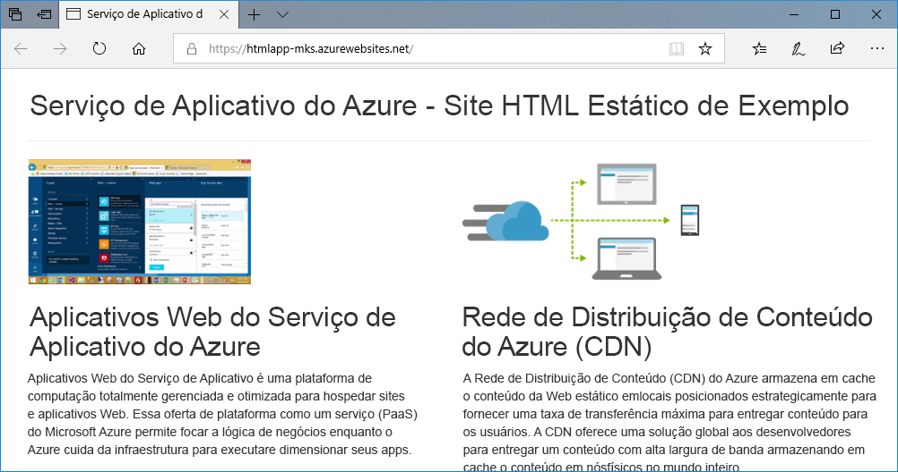
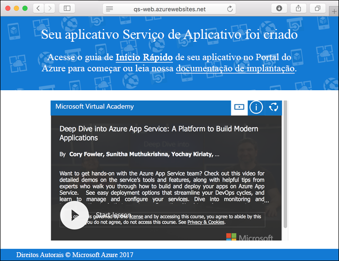
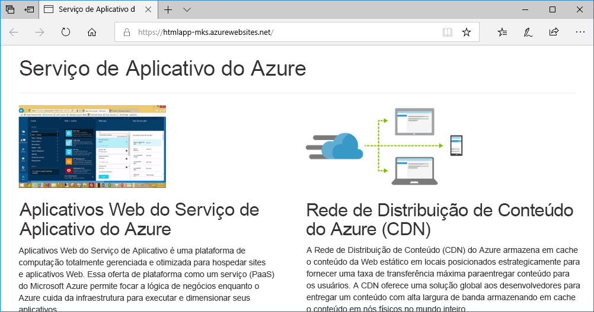
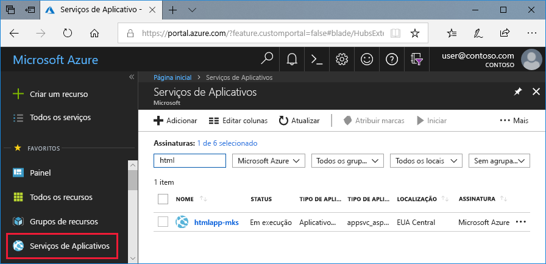
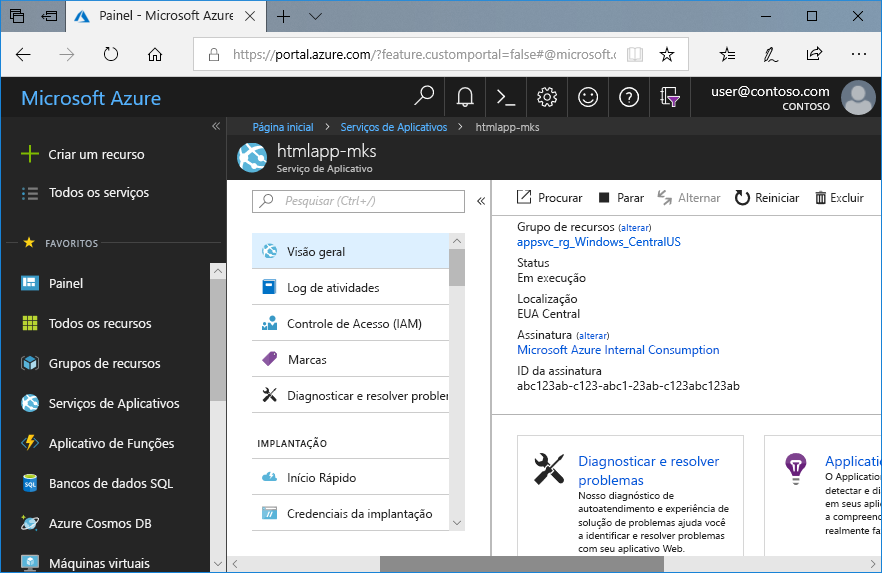

# <a name="create-a-static-html-web-app-in-azure"></a>Criar um aplicativo Web HTML estático no Azure

Os [aplicativos Web do Azure](app-service-web-overview.md) fornecem um serviço de hospedagem na Web altamente escalonável,com aplicação automática de patches.  Este guia de início rápido mostra como implantar um site HTML+CSS básico para Aplicativos Web do Azure. Crie o aplicativo Web usando a [CLI do Azure](https://docs.microsoft.com/cli/azure/get-started-with-azure-cli) e use o Git para implantar o conteúdo HTML de exemplo para o aplicativo Web.



Você pode seguir as etapas abaixo usando um computador Mac, Windows ou Linux. A conclusão das etapas demora cerca de cinco minutos assim que os pré-requisitos são instalados.

[!INCLUDE [quickstarts-free-trial-note](../../includes/quickstarts-free-trial-note.md)]

## <a name="prerequisites"></a>pré-requisitos

Para concluir este guia de início rápido:

- <a href="https://git-scm.com/" target="_blank">Instalar o Git</a>

## <a name="download-the-sample"></a>Baixar o exemplo

Em uma janela de terminal, execute o comando a seguir para clonar o repositório de aplicativo de exemplo para o computador local.

```bash
git clone https://github.com/Azure-Samples/html-docs-hello-world.git
```

Altere para o diretório que contém o código de exemplo.

```bash
cd html-docs-hello-world
```

## <a name="view-the-html"></a>Exibir o HTML

Navegue para o diretório que contém o HTML de exemplo. Abra o arquivo *index.html* em seu navegador.


[!INCLUDE [cloud-shell-try-it.md](../../includes/cloud-shell-try-it.md)]

[!INCLUDE [Configure deployment user](../../includes/configure-deployment-user.md)] 

[!INCLUDE [Create resource group](../../includes/app-service-web-create-resource-group.md)] 

[!INCLUDE [Create app service plan](../../includes/app-service-web-create-app-service-plan.md)] 

[!INCLUDE [Create web app](../../includes/app-service-web-create-web-app.md)] 



[!INCLUDE [Push to Azure](../../includes/app-service-web-git-push-to-azure.md)] 

```bash
Counting objects: 13, done.
Delta compression using up to 4 threads.
Compressing objects: 100% (11/11), done.
Writing objects: 100% (13/13), 2.07 KiB | 0 bytes/s, done.
Total 13 (delta 2), reused 0 (delta 0)
remote: Updating branch 'master'.
remote: Updating submodules.
remote: Preparing deployment for commit id 'cc39b1e4cb'.
remote: Generating deployment script.
remote: Generating deployment script for Web Site
remote: Generated deployment script files
remote: Running deployment command...
remote: Handling Basic Web Site deployment.
remote: KuduSync.NET from: 'D:\home\site\repository' to: 'D:\home\site\wwwroot'
remote: Deleting file: 'hostingstart.html'
remote: Copying file: '.gitignore'
remote: Copying file: 'LICENSE'
remote: Copying file: 'README.md'
remote: Finished successfully.
remote: Running post deployment command(s)...
remote: Deployment successful.
To https://<app_name>.scm.azurewebsites.net/<app_name>.git
 * [new branch]      master -> master
```

## <a name="browse-to-the-app"></a>Navegar até o aplicativo

Em um navegador, acesse a URL do aplicativo Web do Azure: `http://<app_name>.azurewebsites.net`.

A página está sendo executada como um aplicativo Web do Serviço de Aplicativo do Azure.


**Parabéns!** Você implantou seu primeiro aplicativo HTML no Serviço de Aplicativo.

## <a name="update-and-redeploy-the-app"></a>Atualizar o aplicativo e reimplantar

Abra o arquivo *index.html* em um editor de texto e faça uma alteração na marcação. Por exemplo, altere o cabeçalho H1 de "Serviço de Aplicativo do Azure – Site HTML estático de exemplo" para simplesmente "Serviço de Aplicativo do Azure'.

Na janela do terminal local, confirme suas alterações no Git e então envie por push as alterações do código para o Azure.

```bash
git commit -am "updated HTML"
git push azure master
```

Depois que a implantação for concluída, atualize seu navegador para ver as alterações.



## <a name="manage-your-new-azure-web-app"></a>Gerenciar seu novo aplicativo Web do Azure

Vá para o <a href="https://portal.azure.com" target="_blank">portal do Azure</a> para gerenciar o aplicativo Web que você criou.

No menu à esquerda, clique em **Serviços de Aplicativos** e então clique no nome do seu aplicativo Web do Azure.



A página Visão Geral do seu aplicativo Web é exibida. Aqui você pode executar tarefas básicas de gerenciamento como procurar, parar, iniciar, reiniciar e excluir. 



O menu à esquerda fornece páginas diferentes para configurar seu aplicativo. 

[!INCLUDE [cli-samples-clean-up](../../includes/cli-samples-clean-up.md)]

## <a name="next-steps"></a>Próximas etapas

> [!div class="nextstepaction"]
> [Mapear domínio personalizado](app-service-web-tutorial-custom-domain.md)
