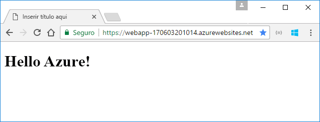
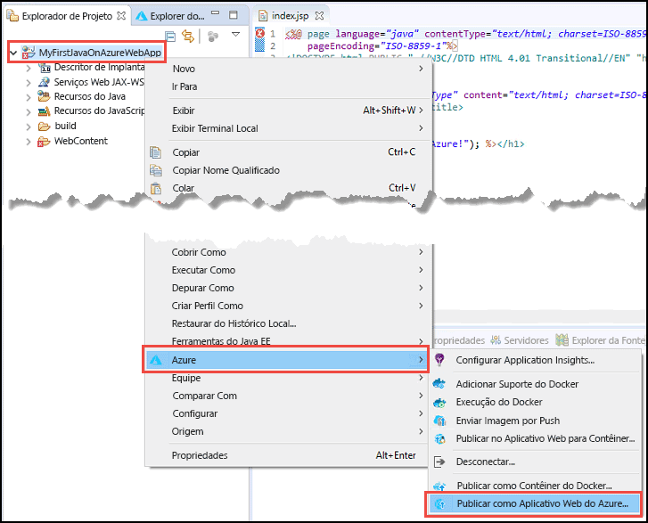
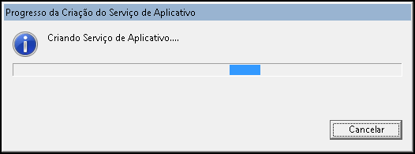
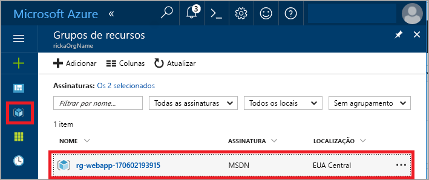
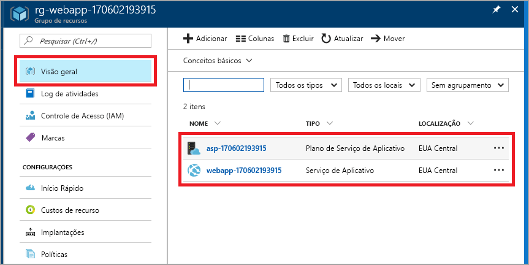
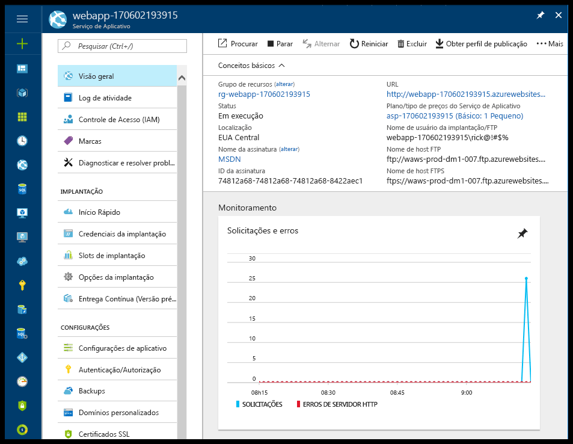

# <a name="create-your-first-java-web-app-in-azure"></a>Criar seu primeiro aplicativo Web Java no Azure

Os [aplicativos Web](app-service-web-overview.md) do Azure fornecem um serviço de hospedagem na Web altamente escalonável,com aplicação automática de patches. Este guia de início rápido mostra como implantar um aplicativo Web Java no Serviço de Aplicativo usando o [IDE do Eclipse para desenvolvedores Java EE](http://www.eclipse.org/).

Após a conclusão deste guia de início rápido, seu aplicativo será semelhante à ilustração a seguir quando exibido em um navegador da Web:



## <a name="prerequisites"></a>Pré-requisitos

Para concluir este guia de início rápido, instale:

* O<a href="http://www.eclipse.org/downloads/" target="_blank">Eclipse IDE para desenvolvedores de Java EE</a> gratuito. Este guia de início rápido usa Eclipse Neon.
* O <a href="/java/azure/eclipse/azure-toolkit-for-eclipse-installation" target="_blank">Kit de Ferramentas do Azure para Eclipse</a>.

[!INCLUDE [quickstarts-free-trial-note](../../includes/quickstarts-free-trial-note.md)]

## <a name="create-a-dynamic-web-project-in-eclipse"></a>Criar um projeto Web dinâmico no Eclipse

No Eclipse, selecione **Arquivo** > **Novo** > **Projeto Web Dinâmico**.

Na caixa de diálogo **Novo projeto Web dinâmico**, nomeie o projeto como **MyFirstJavaOnAzureWebApp** e selecione **Concluir**.
   


### <a name="add-a-jsp-page"></a>Adicionar uma página JSP

Se o Explorador de projeto não for exibido, restaure-o.


No Explorador de projeto, expanda o projeto **MyFirstJavaOnAzureWebApp**.
Clique com o botão direito do mouse em **WebContent**e selecione **Novo** > **Arquivo JSP**.


Na caixa de diálogo **Novo Arquivo JSP**:

* Nomeie o arquivo **index.jsp**.
* Selecione **Concluir**.

  

No arquivo index.jsp, substitua o elemento `<body></body>` pela seguinte marcação:

```jsp
<body>
<h1><% out.println("Hello Azure!"); %></h1>
</body>
```

Salve as alterações.

## <a name="publish-the-web-app-to-azure"></a>Publicar aplicativo Web no Azure

No Explorador de Projeto, clique com o botão direito do mouse e selecione **Azure** > **Publicar como aplicativo Web do Azure**.



Na caixa de diálogo **Entrar no Azure**, mantenha a opção **Interativo** e selecione **Entrar**.

Siga as instruções de entrada.

### <a name="deploy-web-app-dialog-box"></a>Caixa de diálogo Implantar Aplicativo Web

Depois de entrar na sua conta do Azure, a caixa de diálogo **Implantar aplicativo Web** é exibida.

Selecione **Criar**.


### <a name="create-app-service-dialog-box"></a>Criar a caixa de diálogo Serviço de Aplicativo

A caixa de diálogo **Criar Serviço de Aplicativo** é exibida com valores padrão. O número **170602185241** mostrado na imagem a seguir é diferente na caixa de diálogo.


Na caixa de diálogo **Criar Serviço de Aplicativo**:

* Mantenha o nome gerado para o aplicativo Web. Esse nome deve ser exclusivo no Azure. O nome faz parte do endereço URL do aplicativo Web. Por exemplo: se o nome do aplicativo Web é **MyJavaWebApp**, a URL é *myjavawebapp.azurewebsites.net*.
* Mantenha o contêiner da Web padrão.
* Selecione uma assinatura do Azure.
* Na guia **Plano do serviço de aplicativo**:

  * **Criar novo**: mantenha o padrão, que é o nome do plano do Serviço de Aplicativo.
  * **Local**: selecione **Europa Ocidental** ou um local perto de você.
  * **Tipo de preço**: selecione a opção gratuita. Para os recursos, consulte [Preços do Serviço de Aplicativo](https://azure.microsoft.com/pricing/details/app-service/?ref=microsoft.com&utm_source=microsoft.com&utm_medium=docs&utm_campaign=visualstudio).

   

[!INCLUDE [app-service-plan](../../includes/app-service-plan.md)]

### <a name="resource-group-tab"></a>Guia Grupo de recursos

Selecione a guia **Grupo de recursos**. Mantenha o valor padrão gerado para o grupo de recursos.


[!INCLUDE [resource-group](../../includes/resource-group.md)]

Selecione **Criar**.

<!--
### The JDK tab

Select the **JDK** tab. Keep the default, and then select **Create**.


-->

O Kit de ferramentas do Azure cria o aplicativo Web e exibe uma caixa de diálogo de progresso.



### <a name="deploy-web-app-dialog-box"></a>Caixa de diálogo Implantar Aplicativo Web

Na caixa de diálogo **Implantar aplicativo Web**, selecione **Implantar na raiz**. Se você tiver um serviço de aplicativo em *wingtiptoys.azurewebsites.net* e não puder implantar na raiz, o aplicativo Web chamado **MyFirstJavaOnAzureWebApp** será implantado em *wingtiptoys.azurewebsites.net/MyFirstJavaOnAzureWebApp*.


A caixa de diálogo mostra o Azure, o JDK e as seleções de contêiner da Web.

Selecione **Implantar** para publicar o aplicativo Web no Azure.

Quando a publicação for concluída, selecione o link **Publicado** na caixa de diálogo **Log de atividades do Azure**.


Parabéns! Você implantou o aplicativo Web no Azure com êxito. 


## <a name="update-the-web-app"></a>Atualizar o aplicativo Web

Altere o código JSP de exemplo para uma mensagem diferente.

```jsp
<body>
<h1><% out.println("Hello again Azure!"); %></h1>
</body>
```

Salve as alterações.

No Explorador de Projeto, clique com o botão direito do mouse e selecione **Azure** > **Publicar como aplicativo Web do Azure**.

A caixa de diálogo **Implantar aplicativo Web** é exibida e mostra o serviço de aplicativo criado anteriormente. 

> [!NOTE] 
> Selecione **Implantar na raiz** cada vez que você publicar. 
> 

Selecione o aplicativo Web e selecione **Implantar** para publicar as alterações.

Quando o link **Publicando** aparecer, selecione-o para navegar até o aplicativo Web e ver as alterações.

## <a name="manage-the-web-app"></a>Gerenciar o aplicativo Web

Vá para o <a href="https://portal.azure.com" target="_blank">portal do Azure</a> a fim de ver o aplicativo Web que você criou.

Selecione **Grupos de recursos** no painel esquerdo.



Selecione a guia Grupo de recursos. A página mostra os recursos que você criou neste guia de início rápido.



Selecione o aplicativo Web (**webapp-170602193915** na imagem anterior).

A página **Visão geral** será exibida. Esta página fornece uma visão de como está seu aplicativo. Aqui você pode executar tarefas básicas de gerenciamento como procurar, parar, iniciar, reiniciar e excluir. As guias no lado esquerdo da página mostram as configuração diferentes que você pode abrir. 



[!INCLUDE [clean-up-section-portal-web-app](../../includes/clean-up-section-portal-web-app.md)]

## <a name="next-steps"></a>Próximas etapas

> [!div class="nextstepaction"]
> [Mapear domínio personalizado](app-service-web-tutorial-custom-domain.md)
