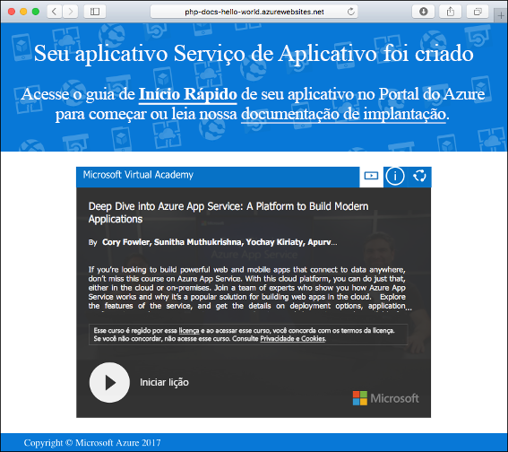
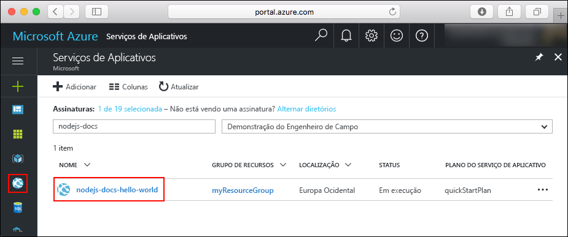
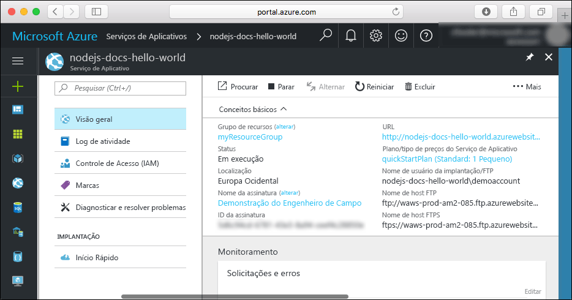

# <a name="create-a-nodejs-web-app-in-azure"></a>Criar um aplicativo Web do Node.js no Azure

Os [aplicativos Web do Azure](app-service-web-overview.md) fornecem um serviço de hospedagem na Web altamente escalonável,com aplicação automática de patches.  Este guia de início rápido mostra como implantar um aplicativo Node.js em Aplicativos Web do Azure. Crie o aplicativo Web usando a [CLI do Azure](https://docs.microsoft.com/cli/azure/get-started-with-azure-cli) e use o Git para implantar o código Node.js de exemplo para o aplicativo Web.


Você pode seguir as etapas abaixo usando um computador Mac, Windows ou Linux. A conclusão das etapas demora cerca de cinco minutos assim que os pré-requisitos são instalados.   

> [!VIDEO https://channel9.msdn.com/Shows/Azure-for-Node-Developers/Create-a-Nodejs-app-in-Azure-Quickstart/player]   


## <a name="prerequisites"></a>Pré-requisitos

Para concluir este guia de início rápido:

* [Instalar o Git](https://git-scm.com/)
* [Instalar o Node.js e o NPM](https://nodejs.org/)

[!INCLUDE [quickstarts-free-trial-note](../../includes/quickstarts-free-trial-note.md)]

## <a name="download-the-sample"></a>Baixar o exemplo

Em uma janela de terminal, execute o comando a seguir para clonar o repositório de aplicativo de exemplo para o computador local.

```bash
git clone https://github.com/Azure-Samples/nodejs-docs-hello-world
```

Você pode usar essa janela de terminal para executar todos os comandos neste guia de início rápido.

Altere para o diretório que contém o código de exemplo.

```bash
cd nodejs-docs-hello-world
```

## <a name="run-the-app-locally"></a>Executar o aplicativo localmente

Execute o aplicativo localmente abrindo uma janela do terminal e usando o script `npm start` para iniciar o servidor HTTP interno do Node.js.

```bash
npm start
```

Abra um navegador da Web e navegue até o aplicativo de exemplo em `http://localhost:1337`.

Você vê a mensagem **Olá, Mundo** no aplicativo de exemplo exibido na página.


Na janela do terminal, pressione **Ctrl+C** para sair do servidor Web.

[!INCLUDE [cloud-shell-try-it.md](../../includes/cloud-shell-try-it.md)]

[!INCLUDE [Configure deployment user](../../includes/configure-deployment-user.md)] 

[!INCLUDE [Create resource group](../../includes/app-service-web-create-resource-group.md)] 

[!INCLUDE [Create app service plan](../../includes/app-service-web-create-app-service-plan.md)] 

[!INCLUDE [Create web app](../../includes/app-service-web-create-web-app.md)] 



Você criou um novo aplicativo Web vazio no Azure.

[!INCLUDE [Configure local git](../../includes/app-service-web-configure-local-git.md)] 

[!INCLUDE [Push to Azure](../../includes/app-service-web-git-push-to-azure.md)] 

```bash
Counting objects: 23, done.
Delta compression using up to 4 threads.
Compressing objects: 100% (21/21), done.
Writing objects: 100% (23/23), 3.71 KiB | 0 bytes/s, done.
Total 23 (delta 8), reused 7 (delta 1)
remote: Updating branch 'master'.
remote: Updating submodules.
remote: Preparing deployment for commit id 'bf114df591'.
remote: Generating deployment script.
remote: Generating deployment script for node.js Web Site
remote: Generated deployment script files
remote: Running deployment command...
remote: Handling node.js deployment.
remote: Kudu sync from: '/home/site/repository' to: '/home/site/wwwroot'
remote: Copying file: '.gitignore'
remote: Copying file: 'LICENSE'
remote: Copying file: 'README.md'
remote: Copying file: 'index.js'
remote: Copying file: 'package.json'
remote: Copying file: 'process.json'
remote: Deleting file: 'hostingstart.html'
remote: Ignoring: .git
remote: Using start-up script index.js from package.json.
remote: Node.js versions available on the platform are: 4.4.7, 4.5.0, 6.2.2, 6.6.0, 6.9.1.
remote: Selected node.js version 6.9.1. Use package.json file to choose a different version.
remote: Selected npm version 3.10.8
remote: Finished successfully.
remote: Running post deployment command(s)...
remote: Deployment successful.
To https://<app_name>.scm.azurewebsites.net:443/<app_name>.git
 * [new branch]      master -> master
```

## <a name="browse-to-the-app"></a>Navegar até o aplicativo

Navegue até o aplicativo implantado usando o navegador da Web.

```bash
http://<app_name>.azurewebsites.net
```

O código de exemplo do Node.js está em execução em um aplicativo Web do Serviço de Aplicativo do Azure.


**Parabéns!** Você implantou seu primeiro aplicativo do Node.js no Serviço de Aplicativo.

## <a name="update-and-redeploy-the-code"></a>Atualizar e reimplantar o código

Usando um editor de texto, abra o arquivo `index.js` no aplicativo do Node.js e faça uma pequena alteração no texto dentro da chamada para `response.end`:

```nodejs
response.end("Hello Azure!");
```

Confirme suas alterações no Git e, em seguida, envie as alterações de código por push para o Azure.

```bash
git commit -am "updated output"
git push azure master
```

Depois que a implantação for concluída, mude de volta para a janela do navegador aberta na etapa **Navegar até o aplicativo** e clique em Atualizar.


## <a name="manage-your-new-azure-web-app"></a>Gerenciar seu novo aplicativo Web do Azure

Vá para o <a href="https://portal.azure.com" target="_blank">portal do Azure</a> para gerenciar o aplicativo Web que você criou.

No menu à esquerda, clique em **Serviços de Aplicativos** e então clique no nome do seu aplicativo Web do Azure.



A página Visão Geral do seu aplicativo Web é exibida. Aqui você pode executar tarefas básicas de gerenciamento como procurar, parar, iniciar, reiniciar e excluir. 



O menu à esquerda fornece páginas diferentes para configurar seu aplicativo. 

[!INCLUDE [cli-samples-clean-up](../../includes/cli-samples-clean-up.md)]

## <a name="next-steps"></a>Próximas etapas

> [!div class="nextstepaction"]
> [Node.js com o MongoDB](app-service-web-tutorial-nodejs-mongodb-app.md)
