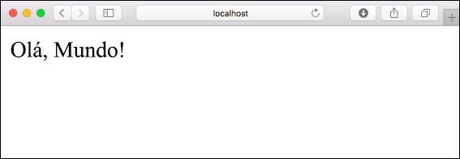
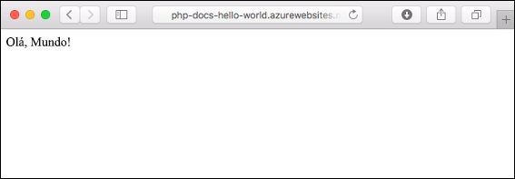
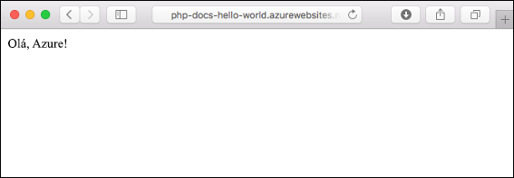
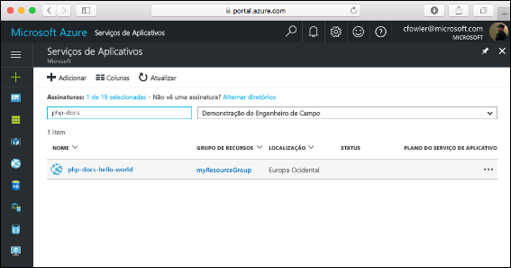
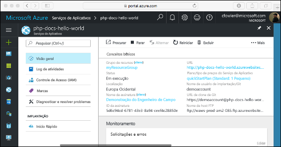

# <a name="create-a-php-web-app-in-azure"></a>Criar um aplicativo Web do PHP no Azure

> [!NOTE]
> Este artigo implanta um aplicativo no Serviço de Aplicativo no Windows. Para implantar o Serviço de Aplicativo em _Linux_, consulte [Criar um aplicativo Web PHP no Serviço de Aplicativo em Linux](./containers/quickstart-php.md).
>

Os [aplicativos Web do Azure](app-service-web-overview.md) fornecem um serviço de hospedagem na Web altamente escalonável,com aplicação automática de patches.  Este tutorial de início rápido mostra como implantar um aplicativo PHP em Aplicativos Web do Azure. Crie o aplicativo Web usando a [CLI do Azure](https://docs.microsoft.com/cli/azure/get-started-with-azure-cli) no Cloud Shell e use um [arquivo zip](app-service-deploy-zip.md) para implantar o código PHP de exemplo para o aplicativo Web.

![Aplicativo de exemplo em execução no Azure]](media/app-service-web-get-started-php/hello-world-in-browser.png)

Você pode seguir as etapas aqui usando um computador Mac, Windows ou Linux. A conclusão das etapas demora cerca de cinco minutos assim que os pré-requisitos são instalados.

## <a name="prerequisites"></a>pré-requisitos

Para concluir este guia de início rápido:

* <a href="https://php.net" target="_blank">Instalar o PHP</a>

[!INCLUDE [quickstarts-free-trial-note](../../includes/quickstarts-free-trial-note.md)]

## <a name="download-the-sample-locally"></a>Baixar o exemplo localmente

Baixe o projeto de exemplo do PHP de [https://github.com/Azure-Samples/php-docs-hello-world/archive/master.zip](https://github.com/Azure-Samples/php-docs-hello-world/archive/master.zip) e extraia o arquivo zip.

Em uma janela de terminal, navegue até o diretório raiz do projeto de exemplo do PHP (aquele que contém _index.php_).

## <a name="run-the-app-locally"></a>Executar o aplicativo localmente

Execute o aplicativo localmente abrindo uma janela do terminal e usando o comando `php` para iniciar o servidor interno da Web do PHP.

```bash
php -S localhost:8080
```

Abra um navegador da Web e navegue até o aplicativo de exemplo em `http://localhost:8080`.

Você verá o **Olá, Mundo!** mensagem do aplicativo de exemplo exibida na página.



Na janela do terminal, pressione **Ctrl+C** para sair do servidor Web.

[!INCLUDE [Create ZIP file](../../includes/app-service-web-create-zip.md)]

[!INCLUDE [cloud-shell-try-it.md](../../includes/cloud-shell-try-it.md)]

[!INCLUDE [Upload zip file](../../includes/app-service-web-upload-zip.md)]

[!INCLUDE [Create resource group](../../includes/app-service-web-create-resource-group.md)]

[!INCLUDE [Create app service plan](../../includes/app-service-web-create-app-service-plan.md)]

## <a name="create-a-web-app"></a>Criar um aplicativo Web

No Cloud Shell, crie um aplicativo Web no plano do `myAppServicePlan`Serviço de Aplicativo do com o comando [az webapp list-runtimes](/cli/azure/webapp?view=azure-cli-latest#az_webapp_create). 

No exemplo a seguir, substitua `<app_name>` por um nome do aplicativo exclusivo globalmente (os caracteres válidos são `a-z`, `0-9` e `-`). A execução é predefinida para `PHP|7.0`. Para ver todos os tempos de execução com suporte, execute [az webapp list-runtimes](/cli/azure/webapp?view=azure-cli-latest#az_webapp_list_runtimes). 

```azurecli-interactive
az webapp create --resource-group myResourceGroup --plan myAppServicePlan --name <app_name> --runtime "PHP|7.0"
```

Quando o aplicativo Web for criado, a CLI do Azure mostrará um resultado semelhante ao seguinte exemplo:

```json
{
  "availabilityState": "Normal",
  "clientAffinityEnabled": true,
  "clientCertEnabled": false,
  "cloningInfo": null,
  "containerSize": 0,
  "dailyMemoryTimeQuota": 0,
  "defaultHostName": "<app_name>.azurewebsites.net",
  "enabled": true,
  < JSON data removed for brevity. >
}
```

Navegue até o aplicativo Web recém-criado. Substitua _&lt;nome do aplicativo>_ por um nome exclusivo do aplicativo.

```bash
http://<app name>.azurewebsites.net
```


[!INCLUDE [Deploy uploaded ZIP file](../../includes/app-service-web-deploy-zip.md)]

## <a name="browse-to-the-app"></a>Navegar até o aplicativo

Navegue até o aplicativo implantado usando o navegador da Web.

```bash
http://<app_name>.azurewebsites.net
```

O código de exemplo do PHP está em execução em um aplicativo Web do Serviço de Aplicativo do Azure.



**Parabéns!** Você implantou seu primeiro aplicativo PHP no Serviço de Aplicativo.

## <a name="update-locally-and-redeploy-the-code"></a>Atualizar localmente e reimplantar o código

Usando um editor de texto local, abra o arquivo `index.php` no aplicativo do PHP e faça uma pequena alteração no texto dentro da cadeia de caracteres para `echo`:

```php
echo "Hello Azure!";
```

Na janela do terminal local, navegue até o diretório raiz do aplicativo e crie um novo arquivo zip para o projeto atualizado.

```
# Bash
zip -r myUpdatedAppFiles.zip .

# PowerShell
Compress-Archive -Path * -DestinationPath myUpdatedAppFiles.zip
``` 

Carregue esse novo arquivo zip no Cloud Shell, usando as mesmas etapas em [Carregar o arquivo zip](#upload-the-zip-file).

Em seguida, no Cloud Shell, implante novamente o arquivo zip carregado.

```azurecli-interactive
az webapp deployment source config-zip --resource-group myResouceGroup --name <app_name> --src clouddrive/myUpdatedAppFiles.zip
```

Mude para a janela do navegador aberta na etapa **Navegar até o aplicativo** e atualize a página.



## <a name="manage-your-new-azure-web-app"></a>Gerenciar seu novo aplicativo Web do Azure

Vá para o <a href="https://portal.azure.com" target="_blank">portal do Azure</a> para gerenciar o aplicativo Web que você criou.

No menu à esquerda, clique em **Serviços de Aplicativos** e então clique no nome do seu aplicativo Web do Azure.



A página Visão Geral do seu aplicativo Web é exibida. Aqui você pode executar tarefas básicas de gerenciamento como procurar, parar, iniciar, reiniciar e excluir.



O menu à esquerda fornece páginas diferentes para configurar seu aplicativo. 

[!INCLUDE [cli-samples-clean-up](../../includes/cli-samples-clean-up.md)]

## <a name="next-steps"></a>Próximas etapas

> [!div class="nextstepaction"]
> [PHP com MySQL](app-service-web-tutorial-php-mysql.md)
