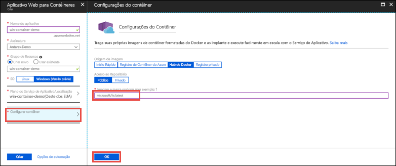

# <a name="run-a-custom-windows-container-in-azure-preview"></a>Executar um contêiner personalizado do Windows no Azure (Versão prévia)

[O Serviço de Aplicativo do Azure](app-service-web-overview.md) fornece pilhas de aplicativos predefinidos em Windows, como ASP.NET ou Node.js, em execução no IIS. O ambiente do Windows pré-configurado impede o acesso administrativo, as instalações de software, as alterações do cache global e outras funções pelo sistema operacional (confira [Funcionalidade do sistema operacional no Serviço de Aplicativo do Azure](web-sites-available-operating-system-functionality.md)). Se o aplicativo exigir mais acesso que o permitido pelo ambiente pré-configurado, você pode implantar um contêiner personalizado do Windows como alternativa. Este início rápido mostra como implantar uma imagem personalizada do IIS para o Serviço de Aplicativo do Azure no [Hub do Docker](https://hub.docker.com/).


## <a name="sign-in-to-azure"></a>Entrar no Azure

Entre no Portal do Azure em https://portal.azure.com.

## <a name="create-a-windows-container-app"></a>Criar um aplicativo de contêiner do Windows

1. Escolha **Criar um recurso** no canto superior esquerdo do portal do Azure.

2. Na caixa de pesquisa acima da lista de recursos do Azure Marketplace, pesquise e selecione **Aplicativo Web para Contêineres**.

3. Forneça um nome de aplicativo, como *mywebapp*, aceite os padrões para criar um novo grupo de recursos e clique em **Windows (Versão prévia)** na caixa **SO**.

    

4. Crie um Plano do Serviço de Aplicativo, clicando em **Plano do Serviço de Aplicativo/Localização** > **Criar novo**. Nomeie o novo plano, aceite os padrões e clique em **OK**.

    

5. Clique em **Configurar contêiner**, digite _microsoft/iis:latest_ em **Imagem e marca opcional**e clique em **OK**.

    

    Neste artigo, você usa a imagem do Hub do Docker [microsoft/iis:latest](https://hub.docker.com/r/microsoft/iis/) pública. Se você tiver uma imagem personalizada em outro lugar para seu aplicativo Web, como no [Registro de Contêiner do Azure](/azure/container-registry/) ou em outro repositório privado, configure-a aqui.

6. Clique em **Criar** e espere o Azure criar os recursos necessários.

## <a name="browse-to-the-container-app"></a>Navegar até o aplicativo de contêiner

Quando a operação do Azure for concluída, uma caixa de notificação será exibida.


1. Clique em **Ir para o recurso**.

2. Na página do aplicativo, clique no link em **URL**.

Uma nova página do navegador é aberta na seguinte página:


Aguarde alguns minutos e tente novamente até chegar a página de boas-vinda do IIS:


**Parabéns!** Você está executando seu primeiro contêiner personalizado do Windows no Serviço de Aplicativo do Azure.

## <a name="see-container-start-up-logs"></a>Conferir logs de inicialização do contêiner

Pode levar algum tempo para o contêiner do Windows ser carregado. Para ver o progresso, navegue até a URL a seguir, substituindo *\<app_name>* pelo nome do aplicativo.
```
https://<app_name>.scm.azurewebsites.net/api/logstream
```

Os logs transmitidos têm esta aparência:

```
2018-07-27T12:03:11  Welcome, you are now connected to log-streaming service.
27/07/2018 12:04:10.978 INFO - Site: win-container-demo - Start container succeeded. Container: facbf6cb214de86e58557a6d073396f640bbe2fdec88f8368695c8d1331fc94b
27/07/2018 12:04:16.767 INFO - Site: win-container-demo - Container start complete
27/07/2018 12:05:05.017 INFO - Site: win-container-demo - Container start complete
27/07/2018 12:05:05.020 INFO - Site: win-container-demo - Container started successfully
```

## <a name="use-a-different-docker-image"></a>Usar uma imagem do Docker diferente

Você pode usar uma imagem personalizada do Docker diferente para executar seu aplicativo. No entanto, você deverá escolher a melhor [imagem pai](https://docs.docker.com/develop/develop-images/baseimages/) para a estrutura desejada: 

- Para implantar aplicativos do .NET Framework, use uma imagem pai com base na versão do [LTSC (Canal de Manutenção em Longo Prazo)](https://docs.microsoft.com/windows-server/get-started/semi-annual-channel-overview#long-term-servicing-channel-ltsc) do Windows Server Core 2016. 
- Para implantar aplicativos do .NET Core, use uma imagem pai com base na versão do [LTSC (Canal de Manutenção em Longo Prazo)](https://docs.microsoft.com/windows-server/get-started/semi-annual-channel-overview#long-term-servicing-channel-ltsc) do Windows Server Nano 2016. 

Leva algum tempo para baixar uma imagem pai durante a inicialização do aplicativo. No entanto, você pode reduzir o tempo de inicialização usando uma das seguintes imagens pai já armazenadas em cache no Serviço de Aplicativo do Azure:

- [microsoft/iis](https://hub.docker.com/r/microsoft/iis/):windowsservercore-ltsc2016, latest
- [microsoft/iis](https://hub.docker.com/r/microsoft/iis/):nanoserver-sac2016
- [microsoft/aspnet](https://hub.docker.com/r/microsoft/aspnet/):4.7.2-windowsservercore-ltsc2016, 4.7.2, latest
- [microsoft/dotnet](https://hub.docker.com/r/microsoft/dotnet/):2.1-aspnetcore-runtime
- [microsoft/dotnet](https://hub.docker.com/r/microsoft/dotnet/):2.1-sdk
