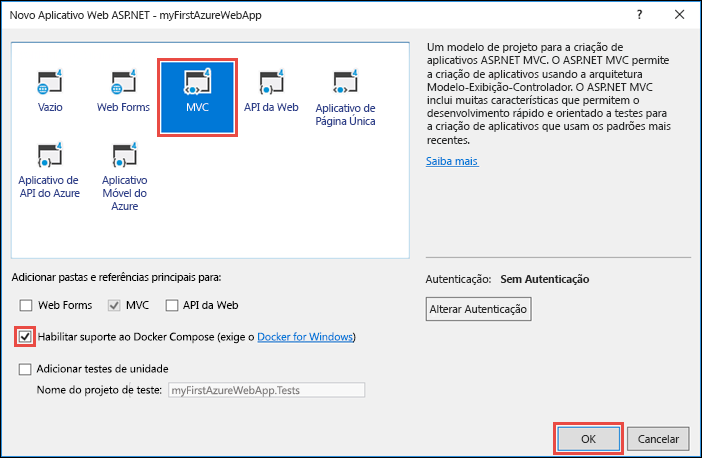
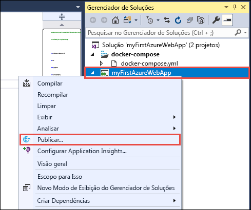
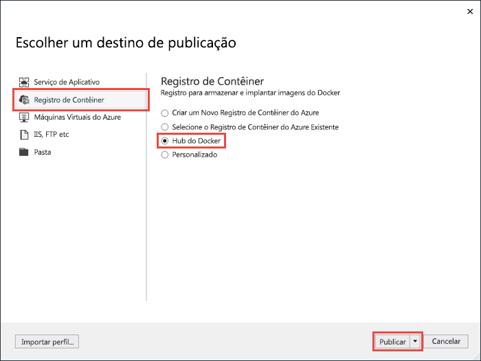
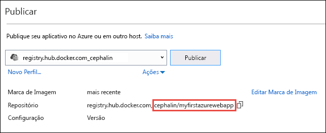
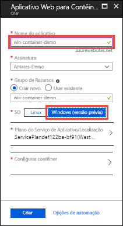
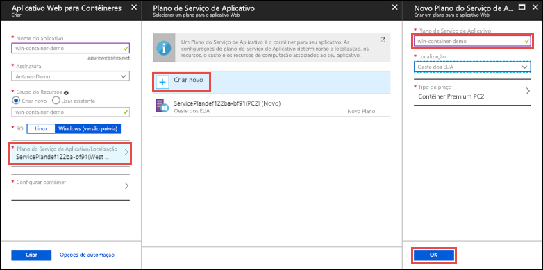
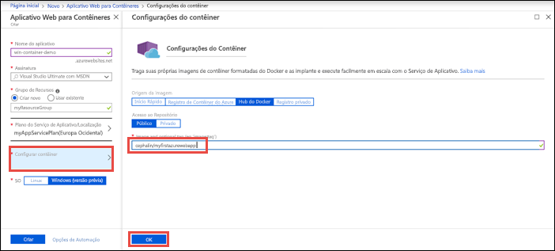
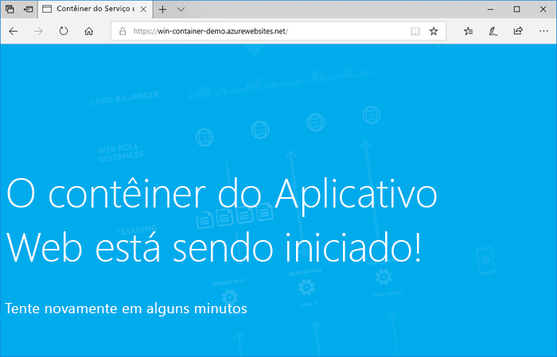
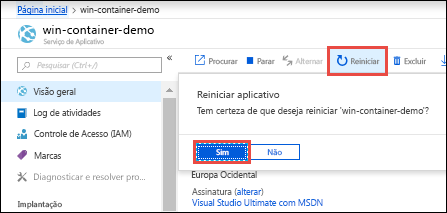

# <a name="run-a-custom-windows-container-in-azure-preview"></a>Executar um contêiner personalizado do Windows no Azure (Versão prévia)

[O Serviço de Aplicativo do Azure](overview.md) fornece pilhas de aplicativos predefinidos em Windows, como ASP.NET ou Node.js, em execução no IIS. O ambiente do Windows pré-configurado impede o acesso administrativo, as instalações de software, as alterações do cache global e outras funções pelo sistema operacional (confira [Funcionalidade do sistema operacional no Serviço de Aplicativo do Azure](operating-system-functionality.md)). Se o aplicativo exigir mais acesso que o permitido pelo ambiente pré-configurado, você pode implantar um contêiner personalizado do Windows como alternativa. Este início rápido mostra como implantar um aplicativo ASP.NET em uma imagem do Windows para o [Hub do Docker](https://hub.docker.com/) do Visual Studio e executá-lo em um contêiner personalizado no Serviço de Aplicativo do Azure.


## <a name="prerequisites"></a>Pré-requisitos

Para concluir este tutorial:

- <a href="https://hub.docker.com/" target="_blank">Inscrever-se em uma conta do Hub do Docker</a>
- <a href="https://docs.docker.com/docker-for-windows/install/" target="_blank">Instalar o Docker for Windows</a>.
- <a href="https://docs.microsoft.com/virtualization/windowscontainers/quick-start/quick-start-windows-10#2-switch-to-windows-containers" target="_blank">Mudar o Docker para executar contêineres do Windows</a>.
- <a href="https://www.visualstudio.com/downloads/" target="_blank">Instale o Visual Studio 2017</a> com as cargas de trabalho de **desenvolvimento do ASP.NET e para a Web** e de **desenvolvimento do Azure**. Se você já tiver instalado o Visual Studio 2017:
    - Instale as atualizações mais recentes no Visual Studio clicando em **Ajuda** > **Verificar se há atualizações**.
    - Adicione as cargas de trabalho no Visual Studio clicando em **Ferramentas** > **Obter Ferramentas e Recursos**.

## <a name="create-an-aspnet-web-app"></a>Criar um aplicativo Web ASP .NET

No Visual Studio, crie um projeto selecionando **Arquivo > Novo > Projeto**. 

Na caixa de diálogo **Novo Projeto**, clique em **Visual C# > Web > Aplicativo Web ASP.NET (.NET Framework)**.

Nomeie o aplicativo como _myFirstAzureWebApp_ e clique em **OK**.
   


Você pode implantar qualquer tipo de aplicativo Web ASP.NET no Azure. Para este início rapido, selecione o modelo **MVC** e verifique se a autenticação está definida para **Sem Autenticação**.

Selecione **Habilitar suporte do Docker Compose**.

Selecione **OK**.



Se o arquivo _Dockerfile_ não for aberto automaticamente, abra-o no **Gerenciador de Soluções**.

Você precisa usar uma [imagem pai com suporte](#use-a-different-parent-image). Altere a imagem pai, substituindo a linha `FROM` pelo código a seguir e salve o arquivo:

```Dockerfile
FROM microsoft/aspnet:4.7.1
```

No menu, selecione **Depurar > Iniciar sem depuração** para executar o aplicativo Web localmente.


## <a name="publish-to-docker-hub"></a>Publicar no Docker Hub

No **Gerenciador de Soluções**, clique com o botão direito do mouse no projeto **myFirstAzureWebApp** e selecione **Publicar**.



O assistente de publicação é iniciado automaticamente. Selecione **Registro de Contêiner** > **Docker Hub** > **Publicar**.



Forneça suas credenciais da conta do Docker Hub e clique em **Salvar**. 

Aguarde até que a implantação seja concluída. A página **Publicar** agora mostra o nome do repositório que você usará mais tarde no Serviço de Aplicativo.



Copie esse nome de repositório para uso posterior.

## <a name="sign-in-to-azure"></a>Entrar no Azure

Entre no Portal do Azure em https://portal.azure.com.

## <a name="create-a-windows-container-app"></a>Criar um aplicativo de contêiner do Windows

1. Escolha **Criar um recurso** no canto superior esquerdo do portal do Azure.

2. Na caixa de pesquisa acima da lista de recursos do Azure Marketplace, pesquise e selecione **Aplicativo Web para Contêineres**.

3. Forneça um nome de aplicativo, como *win-container-demo*, aceite os padrões para criar um grupo de recursos e, em seguida, clique em **Windows (versão prévia)** na caixa **Sistema operacional**.

    

4. Crie um Plano do Serviço de Aplicativo, clicando em **Plano do Serviço de Aplicativo/Localização** > **Criar novo**. Nomeie o novo plano, aceite os padrões e clique em **OK**.

    

5. Clique em **Configurar contêiner**. Na **Marca de imagem e opcional**, use o nome do repositório que você copiou em [Publicar no Docker Hub](#publish-to-docker-hub) e, em seguida, clique em **OK**.

    

    Se você tiver uma imagem personalizada em outro lugar para seu aplicativo Web, como no [Registro de Contêiner do Azure](/azure/container-registry/) ou em outro repositório privado, configure-a aqui.

6. Clique em **Criar** e espere o Azure criar os recursos necessários.

## <a name="browse-to-the-container-app"></a>Navegar até o aplicativo de contêiner

Quando a operação do Azure for concluída, uma caixa de notificação será exibida.


1. Clique em **Ir para o recurso**.

2. Na página do aplicativo, clique no link em **URL**.

Uma nova página do navegador é aberta na seguinte página:



Aguarde alguns minutos e tente novamente, até chegar à home page padrão do ASP.NET:


**Parabéns!** Você está executando seu primeiro contêiner personalizado do Windows no Serviço de Aplicativo do Azure.

## <a name="see-container-start-up-logs"></a>Conferir logs de inicialização do contêiner

Pode levar algum tempo para o contêiner do Windows ser carregado. Para ver o progresso, navegue até a URL a seguir, substituindo *\<app_name>* pelo nome do aplicativo.
```
https://<app_name>.scm.azurewebsites.net/api/logstream
```

Os logs transmitidos têm esta aparência:

```
2018-07-27T12:03:11  Welcome, you are now connected to log-streaming service.
27/07/2018 12:04:10.978 INFO - Site: win-container-demo - Start container succeeded. Container: facbf6cb214de86e58557a6d073396f640bbe2fdec88f8368695c8d1331fc94b
27/07/2018 12:04:16.767 INFO - Site: win-container-demo - Container start complete
27/07/2018 12:05:05.017 INFO - Site: win-container-demo - Container start complete
27/07/2018 12:05:05.020 INFO - Site: win-container-demo - Container started successfully
```

## <a name="update-locally-and-redeploy"></a>Atualizar localmente e reimplantar

No **Gerenciador de Soluções**, abra _Views\Home\Index.cshtml_.

Encontre o rótulo HTML `<div class="jumbotron">` próximo à parte superior e substitua o elemento inteiro pelo seguinte código:

```HTML
<div class="jumbotron">
    <h1>ASP.NET in Azure!</h1>
    <p class="lead">This is a simple app that we’ve built that demonstrates how to deploy a .NET app to Azure App Service.</p>
</div>
```

Para implantar novamente no Azure, clique com o botão direito do mouse no projeto **myFirstAzureWebApp**, no **Gerenciador de Soluções** e selecione **Publicar**.

Na página de publicação, selecione **Publicar** e aguarde até que a publicação seja concluída.

Para informar ao Serviço de Aplicativo que ele deve obter a nova imagem do Docker Hub, reinicie o aplicativo. Na página do aplicativo no portal, clique em **Reiniciar** > **Sim**.



[Navegue até o aplicativo de contêiner](#browse-to-the-container-app) novamente. Conforme você atualiza a página da Web, o aplicativo é revertido para a página "Iniciando" no início e, em seguida, exibe a página da Web atualizada novamente após alguns minutos.


## <a name="use-a-different-parent-image"></a>Usar uma imagem pai diferente

Você pode usar uma imagem personalizada do Docker diferente para executar seu aplicativo. No entanto, você deverá escolher a melhor [imagem pai](https://docs.docker.com/develop/develop-images/baseimages/) para a estrutura desejada: 

- Para implantar aplicativos do .NET Framework, use uma imagem pai com base na versão do [LTSC (Canal de Manutenção em Longo Prazo)](https://docs.microsoft.com/windows-server/get-started/semi-annual-channel-overview#long-term-servicing-channel-ltsc) do Windows Server Core 2016. 
- Para implantar aplicativos do .NET Core, use uma imagem pai com base na versão do [LTSC (Canal de Manutenção em Longo Prazo)](https://docs.microsoft.com/windows-server/get-started/semi-annual-channel-overview#long-term-servicing-channel-ltsc) do Windows Server Nano 2016. 

Leva algum tempo para baixar uma imagem pai durante a inicialização do aplicativo. No entanto, você pode reduzir o tempo de inicialização usando uma das seguintes imagens pai já armazenadas em cache no Serviço de Aplicativo do Azure:

- [microsoft/iis](https://hub.docker.com/r/microsoft/iis/):windowsservercore-ltsc2016, latest
- [microsoft/iis](https://hub.docker.com/r/microsoft/iis/):nanoserver-sac2016
- [microsoft/aspnet](https://hub.docker.com/r/microsoft/aspnet/):4.7.2-windowsservercore-ltsc2016, 4.7.2, latest
- [microsoft/dotnet](https://hub.docker.com/r/microsoft/dotnet/):2.1-aspnetcore-runtime
- [microsoft/dotnet](https://hub.docker.com/r/microsoft/dotnet/):2.1-sdk

## <a name="next-steps"></a>Próximas etapas

> [!div class="nextstepaction"]
> [Migrar para o contêiner do Windows no Azure](app-service-web-tutorial-windows-containers-custom-fonts.md)
