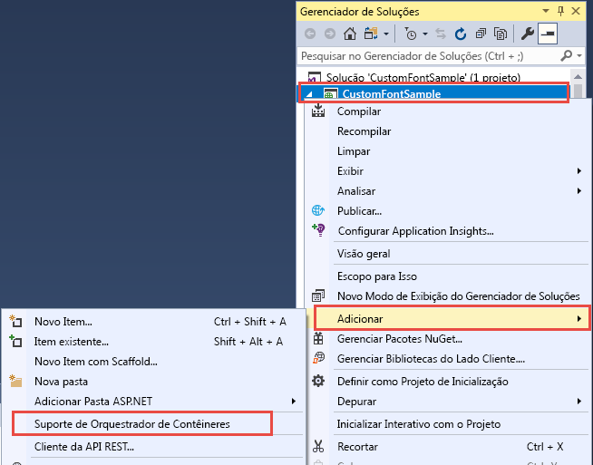
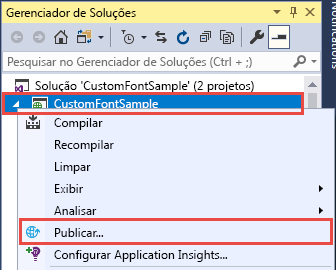
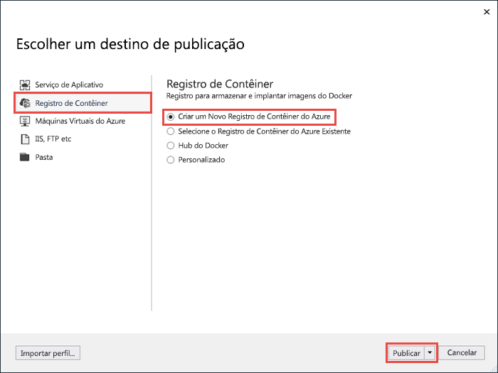
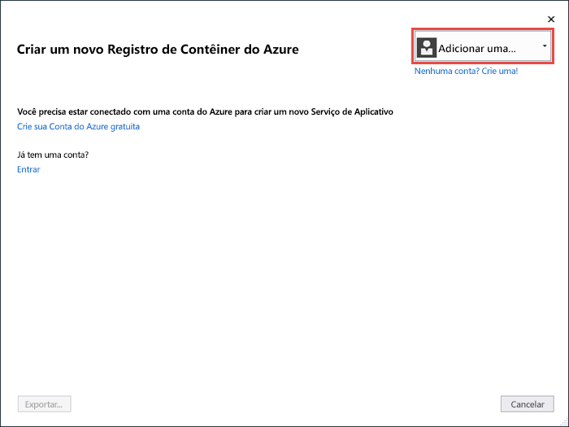
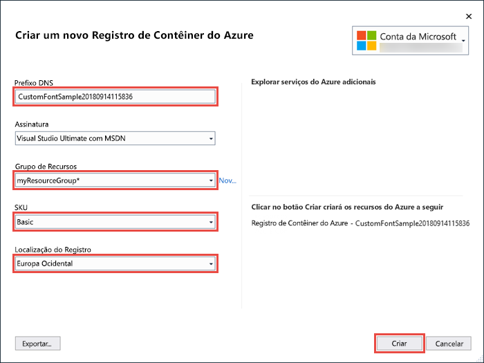
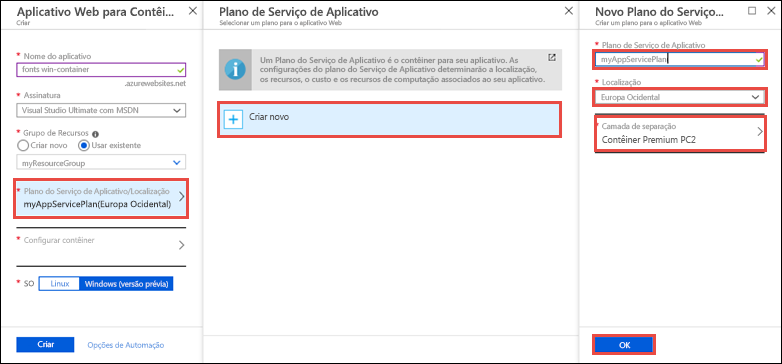
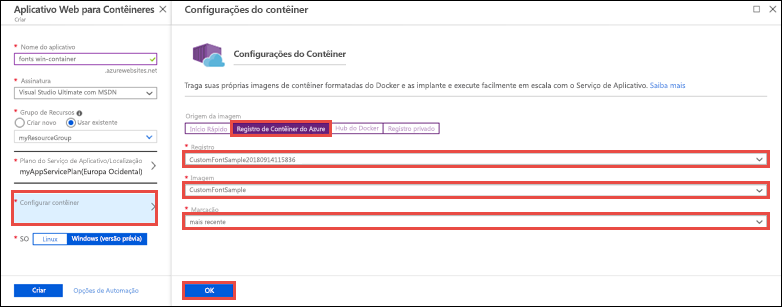

# <a name="migrate-an-aspnet-app-to-azure-app-service-using-a-windows-container-preview"></a>Migrar um aplicativo ASP.NET para o Serviço de Aplicativo do Azure usando um contêiner do Windows (versão prévia)

[O Serviço de Aplicativo do Azure](overview.md) fornece pilhas de aplicativos predefinidos em Windows, como ASP.NET ou Node.js, em execução no IIS. O ambiente do Windows pré-configurado impede o acesso administrativo, as instalações de software, as alterações do cache global e outras funções pelo sistema operacional (confira [Funcionalidade do sistema operacional no Serviço de Aplicativo do Azure](operating-system-functionality.md)). No entanto, usar um contêiner do Windows personalizado no Serviço de Aplicativo permite que você faça alterações no sistema operacional que seu aplicativo precisa, portanto, é fácil migrar aplicativos locais que exigem configurações de software e sistema operacional personalizadas. Este tutorial demonstra como migrar para o Serviço de Aplicativo um aplicativo ASP.NET que usa fontes personalizadas instaladas na biblioteca de fontes do Windows. Implante uma imagem do Windows configurada de forma personalizada do Visual Studio para o [Registro de Contêiner do Azure](https://docs.microsoft.com/azure/container-registry/) e, em seguida, execute-o no Serviço de Aplicativo.


## <a name="prerequisites"></a>Pré-requisitos

Para concluir este tutorial:

- <a href="https://hub.docker.com/" target="_blank">Inscrever-se em uma conta do Hub do Docker</a>
- <a href="https://docs.docker.com/docker-for-windows/install/" target="_blank">Instalar o Docker for Windows</a>.
- <a href="https://docs.microsoft.com/virtualization/windowscontainers/quick-start/quick-start-windows-10" target="_blank">Mudar o Docker para executar contêineres do Windows</a>.
- <a href="https://www.visualstudio.com/downloads/" target="_blank">Instale o Visual Studio 2017</a> com as cargas de trabalho de **desenvolvimento do ASP.NET e para a Web** e de **desenvolvimento do Azure**. Se você já tiver instalado o Visual Studio 2017:
    - Instale as atualizações mais recentes no Visual Studio clicando em **Ajuda** > **Verificar se há atualizações**.
    - Adicione as cargas de trabalho no Visual Studio clicando em **Ferramentas** > **Obter Ferramentas e Recursos**.

## <a name="set-up-the-app-locally"></a>Configure o aplicativo localmente

### <a name="download-the-sample"></a>Baixar o exemplo

Nesta etapa, você deve configurar o projeto local do .NET.

- [Baixar o projeto de exemplo](https://github.com/Azure-Samples/custom-font-win-container/archive/master.zip).
- Extraia (descompacte) o arquivo *custom-font-win-container.zip*.

O projeto de exemplo contém um aplicativo ASP.NET simples que usa uma fonte personalizada que está instalada na biblioteca de fontes do Windows. Não é necessário instalar fontes, mas é um exemplo de um aplicativo que está integrado com o sistema operacional subjacente. Para migrar esse aplicativo para o Serviço de Aplicativo, você refaz a arquitetura do código para remover a integração ou migra o código no estado em que se encontra em um contêiner personalizado do Windows.

### <a name="install-the-font"></a>Instalar a fonte

No Windows Explorer, navegue até _custom-font-win-container-master/CustomFontSample_, clique com o botão direito do mouse _FrederickatheGreat-Regular.ttf_ e selecione **Instalar**.

Essa fonte está publicamente disponível no [Google Fonts](https://fonts.google.com/specimen/Fredericka+the+Great).

### <a name="run-the-app"></a>Execute o aplicativo

Abra o arquivo *custom-font-win-container/CustomFontSample.sln* no Visual Studio. 

Tipo `Ctrl+F5` para executar o aplicativo sem depuração. O aplicativo é exibido no navegador padrão. 


Como ele usa uma fonte instalada, o aplicativo não pode ser executado na área restrita do Serviço de Aplicativo. No entanto, você pode implantá-lo usando um contêiner do Windows em vez disso, pois é possível instalar a fonte no contêiner do Windows.

### <a name="configure-windows-container"></a>Configurar o contêiner do Windows

No Gerenciador de Soluções, clique com o botão direito do mouse no projeto **CustomFontSample** e selecione **Adicionar** > **Suporte de orquestração de contêiner**.



Selecione **Docker Compose** > **OK**.

Seu projeto agora está configurado para ser executado em um contêiner do Windows. Um _Dockerfile_ é adicionado ao projeto **CustomFontSample** e um projeto **docker-compose** é adicionado à solução. 

No Gerenciador de Soluções, abra **Dockerfile**.

Você precisa usar uma [imagem pai com suporte](app-service-web-get-started-windows-container.md#use-a-different-parent-image). Altere a imagem pai substituindo a linha `FROM` pelo código a seguir:

```Dockerfile
FROM mcr.microsoft.com/dotnet/framework/aspnet:4.7.2-windowsservercore-ltsc2019
```

No final do arquivo, adicione a seguinte linha e salve o arquivo:

```Dockerfile
RUN ${source:-obj/Docker/publish/InstallFont.ps1}
```

Você pode encontrar _InstallFont.ps1_ no projeto **CustomFontSample**. É um script simples que instala a fonte. Você pode encontrar uma versão mais complexa do script no [Script Center](https://gallery.technet.microsoft.com/scriptcenter/fb742f92-e594-4d0c-8b79-27564c575133).

## <a name="publish-to-azure-container-registry"></a>Publicar no Registro de Contêiner do Azure

O [Registro de Contêiner do Azure](https://docs.microsoft.com/azure/container-registry/) pode armazenar suas imagens para implantações de contêiner. É possível configurar o Serviço de Aplicativo para usar imagens hospedadas no Registro de Contêiner do Azure.

### <a name="open-publish-wizard"></a>Abrir o assistente de publicação

No Gerenciador de Soluções, clique com o botão direito do mouse no projeto **CustomFontSample** e selecione **Publicar**.



### <a name="create-registry-and-publish"></a>Criar registro e publicar

No assistente de publicação, selecione **Registro de Contêiner** > **Criar novo Registro de Contêiner do Azure** > **Publicar**.



### <a name="sign-in-with-azure-account"></a>Entre com a conta do Azure

Na caixa de diálogo **Criar novo Registro de Contêiner do Azure**, selecione **Adicionar uma conta** e entre com sua assinatura do Azure. Se você já estiver conectado, selecione a conta que contém a assinatura desejada na lista suspensa.



### <a name="configure-the-registry"></a>Configurar o registro

Configure o novo registro de contêiner com base nos valores sugeridos na tabela a seguir. Ao terminar, clique em **Criar**.

| Configuração  | Valor sugerido | Para obter mais informações |
| ----------------- | ------------ | ----|
|**Prefixo DNS**| Mantenha o nome de registro gerado ou altere-o para outro nome exclusivo. |  |
|**Grupo de recursos**| Clique em **Novo**, digite **myResourceGroup** e clique em **OK**. |  |
|**SKU**| Basic | [Tipos de preço](https://azure.microsoft.com/pricing/details/container-registry/)|
|**Localização do Registro**| Europa Ocidental | |



Uma janela de terminal é aberta e exibe o progresso da implantação de imagem. Aguarde até que a implantação seja concluída.

## <a name="sign-in-to-azure"></a>Entrar no Azure

Entre no Portal do Azure em https://portal.azure.com.

## <a name="create-a-web-app"></a>Criar um aplicativo Web

No menu à esquerda, selecione **Criar um recurso** > **Web** > **Aplicativo Web para Contêineres**.

### <a name="configure-the-new-web-app"></a>Configurar o novo aplicativo Web

Na interface de criação, defina as configurações de acordo com a tabela a seguir:

| Configuração  | Valor sugerido | Para obter mais informações |
| ----------------- | ------------ | ----|
|**Nome do aplicativo**| Digite um nome exclusivo. | A URL do aplicativo Web é `http://<app_name>.azurewebsites.net`, em que `<app_name>` é o nome do aplicativo. |
|**Grupo de recursos**| Selecione **Usar existente** e digite **myResourceGroup**. |  |
|**SO**| Windows (Versão prévia) | |

### <a name="configure-app-service-plan"></a>Configurar o Plano do Serviço de Aplicativo

Clique em **Plano do Serviço de Aplicativo/Local** > **Criar novo**. Nomeie o novo plano, selecione **Europa Ocidental** como o local e clique em **OK**.



### <a name="configure-container"></a>Configurar o contêiner

Clique em **Configurar contêiner** > **Registro de Contêiner do Azure**. Selecione o registro, a imagem e a marca que você criou anteriormente em [Publicar no Registro de Contêiner do Azure](#publish-to-azure-container-registry) e clique em **OK**.



### <a name="complete-app-creation"></a>Concluir a criação do aplicativo

Clique em **Criar** e espere o Azure criar os recursos necessários.

## <a name="browse-to-the-web-app"></a>Navegue até o aplicativo Web

Quando a operação do Azure for concluída, uma caixa de notificação será exibida.


1. Clique em **Ir para o recurso**.

2. Na página do aplicativo, clique no link em **URL**.

Uma nova página do navegador é aberta na seguinte página:


Aguarde alguns minutos e tente novamente até acessar a home page com a linda fonte esperada:


**Parabéns!** Você migrou um aplicativo ASP.NET para o Serviço de Aplicativo do Azure em um contêiner do Windows.

## <a name="see-container-start-up-logs"></a>Conferir logs de inicialização do contêiner

Pode levar algum tempo para o contêiner do Windows ser carregado. Para ver o progresso, navegue até a URL a seguir, substituindo *\<app_name>* pelo nome do aplicativo.
```
https://<app_name>.scm.azurewebsites.net/api/logstream
```

Os logs transmitidos têm esta aparência:

```
14/09/2018 23:16:19.889 INFO - Site: fonts-win-container - Creating container for image: customfontsample20180914115836.azurecr.io/customfontsample:latest.
14/09/2018 23:16:19.928 INFO - Site: fonts-win-container - Create container for image: customfontsample20180914115836.azurecr.io/customfontsample:latest succeeded. Container Id 329ecfedbe370f1d99857da7352a7633366b878607994ff1334461e44e6f5418
14/09/2018 23:17:23.405 INFO - Site: fonts-win-container - Start container succeeded. Container: 329ecfedbe370f1d99857da7352a7633366b878607994ff1334461e44e6f5418
14/09/2018 23:17:28.637 INFO - Site: fonts-win-container - Container ready
14/09/2018 23:17:28.637 INFO - Site: fonts-win-container - Configuring container
14/09/2018 23:18:03.823 INFO - Site: fonts-win-container - Container ready
14/09/2018 23:18:03.823 INFO - Site: fonts-win-container - Container start-up and configuration completed successfully
```

