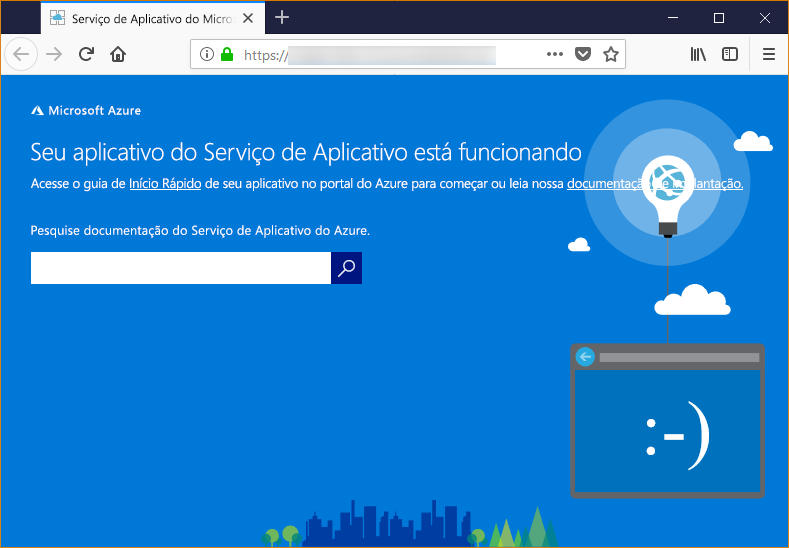

# <a name="configure-your-python-app-for-azure-app-service"></a>Configurar seu aplicativo Python para o Serviço de Aplicativo do Azure
Este artigo descreve como o [Serviço de Aplicativo do Azure](app-service-linux-intro.md) executa aplicativos Python e como você pode personalizar o comportamento do Serviço de Aplicativo quando necessário. Aplicativos Python precisam ser implantados com todos os módulos [pip](https://pypi.org/project/pip/) exigidos. O mecanismo de implantação do Serviço de Aplicativo (Kudu) ativa um ambiente virtual e executa `pip install -r requirements.txt` para você quando você implanta um [repositório Git](../deploy-local-git.md) ou um [pacote Zip](../deploy-zip.md) com processos de build ativados.

> [!NOTE]
> [Python no Windows do Serviço de Aplicativo](https://docs.microsoft.com/visualstudio/python/managing-python-on-azure-app-service) foi preterido e não é recomendado para uso.
>

## <a name="show-python-version"></a>Mostrar versão do Python

Para mostrar a versão atual do Python, execute o seguinte comando no [Cloud Shell](https://shell.azure.com):

```azurecli-interactive
az webapp config show --resource-group <resource_group_name> --name <app_name> --query linuxFxVersion
```

Para mostrar todas as versões do Python com suporte, execute o seguinte comando no [Cloud Shell](https://shell.azure.com):

```azurecli-interactive
az webapp list-runtimes --linux | grep PYTHON
```

Você pode executar uma versão sem suporte do Python criando sua própria imagem de contêiner em vez disso. Para obter mais informações, confira [Usar uma imagem do Docker personalizada](tutorial-custom-docker-image.md).

## <a name="set-python-version"></a>Definir versão do Python

Execute o seguinte comando do [Cloud Shell](https://shell.azure.com) para definir a versão do Python como 3.7:

```azurecli-interactive
az webapp config set --resource-group <group_name> --name <app_name> --linux-fx-version "PYTHON|3.7"
```

## <a name="container-characteristics"></a>Características do contêiner

Os aplicativos Python implantados no Serviço de Aplicativo no Linux são executados dentro de um contêiner do Docker definido no repositório do GitHub, [Python 3.6](https://github.com/Azure-App-Service/python/tree/master/3.6.6) ou [Python 3.7](https://github.com/Azure-App-Service/python/tree/master/3.7.0).
Esse contêiner tem as seguintes características:

- Aplicativos são executados usando o [Gunicorn WSGI HTTP Server](https://gunicorn.org/) com os argumentos adicionais `--bind=0.0.0.0 --timeout 600`.
- Por padrão, a imagem base inclui a estrutura Web do Flask, mas o contêiner dá suporte a outras estruturas em conformidade com WSGI e compatíveis com Python 3.7, como Django.
- Para instalar pacotes adicionais, como o Django, crie um arquivo [*Requirements.txt*](https://pip.pypa.io/en/stable/user_guide/#requirements-files) na raiz do seu projeto usando `pip freeze > requirements.txt`. Em seguida, publique seu projeto de Serviço de Aplicativo usando a implantação do Git, que executa automaticamente `pip install -r requirements.txt` no contêiner para instalar as dependências do seu aplicativo.

## <a name="container-startup-process"></a>Processo de inicialização do contêiner

Durante a inicialização, o Serviço de Aplicativo no contêiner do Linux executa as seguintes etapas:

1. Use um [comando de inicialização personalizada](#customize-startup-command) se fornecido.
2. Verifique a existência de um [aplicativo Django](#django-app) e inicie Gunicorn para ele se detectado.
3. Verifique a existência de um [aplicativo Flask](#flask-app) e inicie Gunicorn para ele se detectado.
4. Se nenhum outro aplicativo for encontrado, inicie um aplicativo padrão criado no contêiner.

As seções a seguir fornecem detalhes adicionais para cada opção.

### <a name="django-app"></a>Aplicativo do Django

Para aplicativos Django, o Serviço de Aplicativo procura um arquivo chamado `wsgi.py` dentro de seu código do aplicativo e, em seguida, executa Gunicorn usando o seguinte comando:

```bash
# <module> is the path to the folder that contains wsgi.py
gunicorn --bind=0.0.0.0 --timeout 600 <module>.wsgi
```

Se desejar ter um controle mais específico sobre o comando de inicialização, use um comando de inicialização personalizado e substitua `<module>` pelo nome do módulo que contém *wsgi.py*.

### <a name="flask-app"></a>Aplicativo do Flask

Para Flask, o Serviço de Aplicativo procura um arquivo chamado *application.py* ou *app.py* e inicia Gunicorn da seguinte maneira:

```bash
# If application.py
gunicorn --bind=0.0.0.0 --timeout 600 application:app
# If app.py
gunicorn --bind=0.0.0.0 --timeout 600 app:app
```

Se o módulo principal do aplicativo estiver contido em um arquivo diferente, use um nome diferente para o objeto de aplicativo. Caso você deseje fornecer argumentos adicionais a Gunicorn, use um comando de inicialização personalizado.

### <a name="default-behavior"></a>Comportamento padrão

Se o Serviço de Aplicativo não encontrar um aplicativo Flask, um aplicativo Django ou um comando personalizado, ele executará um aplicativo padrão somente leitura, localizado na pasta _opt/defaultsite_. O aplicativo padrão será exibido da seguinte maneira:



## <a name="customize-startup-command"></a>Personalizar o comando de inicialização

Você pode controlar o comportamento de inicialização do contêiner fornecendo um comando de inicialização Gunicorn personalizado. Por exemplo, se você tiver um aplicativo Flask cujo módulo principal seja *hello.py* e o objeto de aplicativo nesse arquivo tenha o nome `myapp`, o comando será assim:

```bash
gunicorn --bind=0.0.0.0 --timeout 600 hello:myapp
```

Se seu módulo principal estiver em uma subpasta, como `website`, especifique a pasta com o `--chdir` argumento:

```bash
gunicorn --bind=0.0.0.0 --timeout 600 --chdir website hello:myapp
```

Você também pode adicionar quaisquer argumentos adicionais para o Gunicorn ao comando, como `--workers=4`. Para obter mais informações, veja [Como executar o Gunicorn](https://docs.gunicorn.org/en/stable/run.html) (docs.gunicorn.org).

Para usar um servidor não Gunicorn, como [aiohttp](https://aiohttp.readthedocs.io/en/stable/web_quickstart.html), você pode executar:

```bash
python3.7 -m aiohttp.web -H localhost -P 8080 package.module:init_func
```

Para fornecer um comando personalizado, siga estas etapas:

1. Navegue até a página [Configurações do aplicativo](../web-sites-configure.md?toc=%2fazure%2fapp-service%2fcontainers%2ftoc.json) no portal do Azure.
1. Nas configurações de **Tempo de execução**, defina a opção **Pilha** como **Python 3.7** e digite o comando diretamente no campo **Arquivo de Inicialização**.
Como alternativa, salve o comando em um arquivo de texto na raiz do seu projeto usando um nome como *startup.txt* (ou qualquer nome que desejar). Em seguida, implante esse arquivo para o Serviço de Aplicativo e especifique o nome do arquivo no campo **Arquivo de Inicialização** em vez disso. Essa opção permite que você gerencie o comando em seu repositório de código-fonte, em vez de por meio do portal do Azure.
1. Clique em **Salvar**. O Serviço de Aplicativo é reiniciado automaticamente e, depois de alguns segundos, você deverá ver o comando de inicialização personalizado aplicado.

> [!Note]
> O Serviço de Aplicativo ignora todos os erros que ocorrem ao processar um arquivo de comando personalizado, então ele continua seu processo de inicialização procurando aplicativos Django e Flask. Se você não vir o comportamento esperado, verifique se o arquivo de inicialização está implantado no Serviço de Aplicativo e se ele não contém erros.

## <a name="access-environment-variables"></a>Acessar variáveis de ambiente

No Serviço de Aplicativo, você pode definir as configurações do aplicativo fora do código de aplicativo (veja [Definir variáveis de ambiente](../web-sites-configure.md)). Em seguida, pode acessá-las usando o padrão [os.environ](https://docs.python.org/3/library/os.html#os.environ) básico. Por exemplo, para acessar uma configuração de aplicativo chamada `WEBSITE_SITE_NAME`, use o seguinte código:

```python
os.environ['WEBSITE_SITE_NAME']
```

## <a name="detect-https-session"></a>Detectar sessão HTTPS

No Serviço de Aplicativo, a [Terminação SSL](https://wikipedia.org/wiki/TLS_termination_proxy) ocorre nos balanceadores de carga de rede de modo que todas as solicitações HTTPS cheguem ao seu aplicativo como solicitações HTTP não criptografadas. Se a lógica de aplicativo precisar verificar se as solicitações do usuário estão criptografadas ou não, inspecione o cabeçalho `X-Forwarded-Proto`.

```python
if 'X-Forwarded-Proto' in request.headers and request.headers['X-Forwarded-Proto'] == 'https':
# Do something when HTTPS is used
```

Estrutura Web populares permitem que você acesse informações do `X-Forwarded-*` no seu padrão de aplicativo básico. Em [CodeIgniter](https://codeigniter.com/), o [is_https()](https://github.com/bcit-ci/CodeIgniter/blob/master/system/core/Common.php#L338-L365) verifica o valor de `X_FORWARDED_PROTO` por padrão.

## <a name="troubleshooting"></a>solução de problemas

- **Você pode ver o aplicativo padrão depois de implantar seu próprio código de aplicativo.** O aplicativo padrão é exibido porque você não implantou o código do aplicativo no Serviço de Aplicativo ou o Serviço de Aplicativo falhou ao localizar o código do aplicativo e executou o aplicativo padrão em vez disso.
- Reinicie o Serviço de Aplicativo, aguarde de 15 a 20 segundos e verifique o aplicativo novamente.
- Verifique se você está usando o Serviço de Aplicativo para Linux em vez de uma instância baseada em Windows. Na CLI do Azure, execute o comando `az webapp show --resource-group <resource_group_name> --name <app_service_name> --query kind`, substituindo `<resource_group_name>` e `<app_service_name>` adequadamente. Você deve ver `app,linux` como saída; caso contrário, recrie o Serviço de Aplicativo e escolha o Linux.
- Use SSH ou o console do Kudu para se conectar diretamente ao Serviço de Aplicativo e verificar se há arquivos em *site/wwwroot*. Se os arquivos não existirem, examine seu processo de implantação e reimplante o aplicativo.
- Se os arquivos existem, o Serviço de Aplicativo não pôde identificar o arquivo de inicialização específica. Verifique se seu aplicativo está estruturado como o Serviço de Aplicativo espera para [Django](#django-app) ou [Flask](#flask-app) ou use um comando de inicialização personalizado.
- **Você verá a mensagem "Serviço Não Disponível" no navegador.** O navegador atingiu o tempo limite aguardando uma resposta do Serviço de Aplicativo, o que indica que o Serviço de Aplicativo iniciou o servidor Gunicorn, mas os argumentos que especificam o código do aplicativo estão incorretos.
- Atualize o navegador, especialmente se você estiver usando os tipos de preço mais baixos no seu plano de Serviço de Aplicativo. O aplicativo pode levar mais tempo para ser iniciado ao usar camadas gratuitas, por exemplo, e se tornar responsivo novamente depois que você atualizar o navegador.
- Verifique se seu aplicativo está estruturado como o Serviço de Aplicativo espera para [Django](#django-app) ou [Flask](#flask-app), ou use um [comando de inicialização personalizados](#customize-startup-command).
- Use SSH ou o Console do Kudu para se conectar ao Serviço de Aplicativo, então examine os logs de diagnóstico armazenados na pasta *LogFiles*. Para obter mais informações sobre registro em log, veja [Habilitar o registro em log de diagnóstico para aplicativos Web no Serviço de Aplicativo do Azure](../troubleshoot-diagnostic-logs.md).
