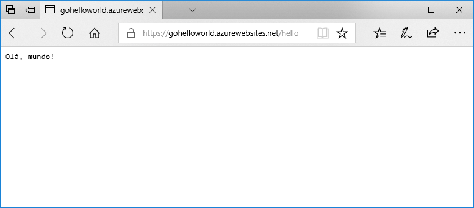

# <a name="run-a-custom-linux-container-in-azure-app-service"></a>Executar um contêiner personalizado do Linux no Serviço de Aplicativo do Azure

[O Serviço de Aplicativo do Linux](app-service-linux-intro.md) fornece pilhas de aplicativos predefinidos em Linux com suporte para linguagens como .NET, PHP, Node.js e outros. Também é possível usar uma imagem personalizada do Docker para executar seu aplicativo Web em uma pilha de aplicativos que ainda não foi definida no Azure. Este guia de início rápido mostra como criar um aplicativo Web e implantar uma imagem do Go a partir do Hub do Docker. Crie o aplicativo Web usando a [CLI do Azure](https://docs.microsoft.com/cli/azure/get-started-with-azure-cli).



[!INCLUDE [quickstarts-free-trial-note](../../../includes/quickstarts-free-trial-note.md)]

[!INCLUDE [cloud-shell-try-it.md](../../../includes/cloud-shell-try-it.md)]

[!INCLUDE [Create resource group](../../../includes/app-service-web-create-resource-group-linux.md)]

[!INCLUDE [Create app service plan](../../../includes/app-service-web-create-app-service-plan-linux.md)]

## <a name="create-a-web-app"></a>Criar um aplicativo Web

Crie um [aplicativo Web](../overview.md) no plano do Serviço de Aplicativo do `myAppServicePlan` com o comando [az webapp create](/cli/azure/webapp?view=azure-cli-latest#az-webapp-create). Não se esqueça de substituir `<app name>` por um nome globalmente exclusivo do aplicativo.

```azurecli-interactive
az webapp create --resource-group myResourceGroup --plan myAppServicePlan --name <app name> --deployment-container-image-name microsoft/azure-appservices-go-quickstart
```

No comando anterior, `--deployment-container-image-name` aponta para a imagem pública do Hub do Docker [microsoft/azure-appservices-go-quickstart](https://hub.docker.com/r/microsoft/azure-appservices-go-quickstart/).

Quando o aplicativo Web for criado, a CLI do Azure mostrará um resultado semelhante ao seguinte exemplo:

```json
{
  "availabilityState": "Normal",
  "clientAffinityEnabled": true,
  "clientCertEnabled": false,
  "cloningInfo": null,
  "containerSize": 0,
  "dailyMemoryTimeQuota": 0,
  "defaultHostName": "<app name>.azurewebsites.net",
  "deploymentLocalGitUrl": "https://<username>@<app name>.scm.azurewebsites.net/<app name>.git",
  "enabled": true,
  < JSON data removed for brevity. >
}
```

## <a name="browse-to-the-app"></a>Navegar até o aplicativo

```bash
http://<app_name>.azurewebsites.net/hello
```


**Parabéns!** Você implantou uma imagem personalizada do Docker executando um aplicativo Go no Aplicativo Web para Contêineres.

[!INCLUDE [Clean-up section](../../../includes/cli-script-clean-up.md)]

## <a name="next-steps"></a>Próximas etapas

> [!div class="nextstepaction"]
> [Tutorial: Implantação por meio de um repositório de contêiner particular](tutorial-custom-docker-image.md)

> [!div class="nextstepaction"]
> [Configurar um contêiner personalizado](configure-custom-container.md)

> [!div class="nextstepaction"]
> [Tutorial: Aplicativo WordPress cm vários contêineres](tutorial-multi-container-app.md)
