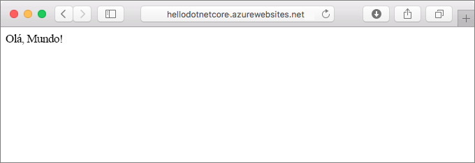
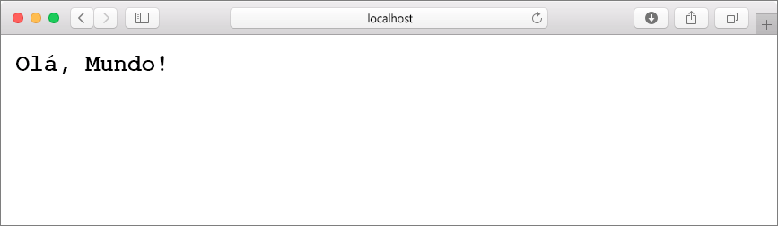
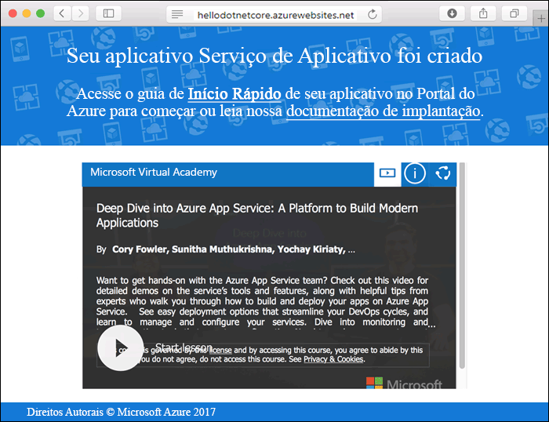
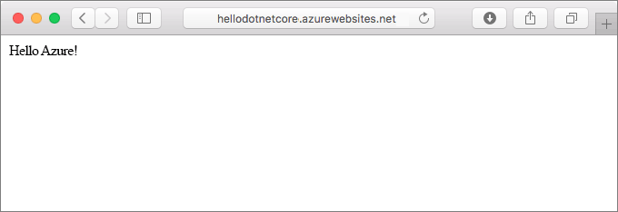
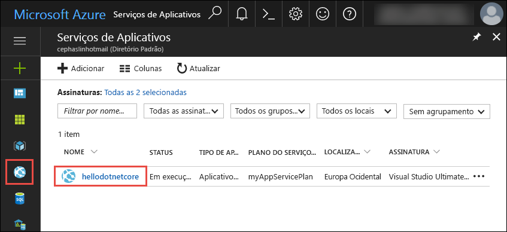
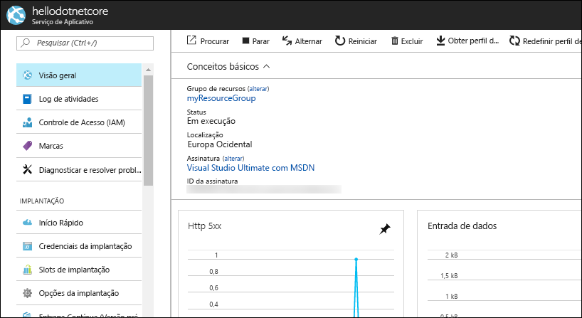

# <a name="create-a-net-core-web-app-in-a-linux-container-in-azure"></a>Criar um aplicativo Web .NET Core em um contêiner do Linux no Azure

O [Aplicativo Web para Contêineres](app-service-linux-intro.md) fornecem um serviço de hospedagem na Web altamente escalonável e com aplicação de patch automática no sistema operacional Linux. Este guia de início rápido mostra como criar um aplicativo [.NET Core](https://docs.microsoft.com/aspnet/core/) no Aplicativo Web para Contêineres do Azure. Crie o aplicativo Web usando a [CLI do Azure](https://docs.microsoft.com/cli/azure/get-started-with-azure-cli) e use o Git para implantar o código .NET Core no aplicativo Web.



Você pode seguir as etapas abaixo usando um computador Mac, Windows ou Linux. 

## <a name="prerequisites"></a>Pré-requisitos

Para concluir este guia de início rápido:

* [Instalar o Git](https://git-scm.com/)
* [Instalar o SDK do .NET Core](https://www.microsoft.com/net/download/core)

[!INCLUDE [quickstarts-free-trial-note](../../../includes/quickstarts-free-trial-note.md)]

## <a name="create-the-app-locally"></a>Criar o aplicativo localmente ##

Em uma janela de terminal no computador, crie um diretório chamado `hellodotnetcore` e altere o diretório atual para ele. 

```bash
md hellodotnetcore
cd hellodotnetcore
``` 

Crie um novo aplicativo Web .NET Core.

```bash
dotnet new web
``` 

## <a name="run-the-app-locally"></a>Executar o aplicativo localmente

Restaure os pacotes NuGet e execute o aplicativo.

```bash
dotnet restore
dotnet run
```

Abra um navegador da Web e navegue até o aplicativo em `http://localhost:5000`.

Você vê a mensagem **Olá, Mundo** no aplicativo de exemplo exibido na página.



Na janela do terminal, pressione **Ctrl+C** para sair do servidor Web. Inicialize um repositório Git para o projeto .NET Core.

```bash
git init
git add .
git commit -m "first commit"
```

[!INCLUDE [cloud-shell-try-it.md](../../../includes/cloud-shell-try-it.md)]

[!INCLUDE [Configure deployment user](../../../includes/configure-deployment-user.md)] 

[!INCLUDE [Create resource group](../../../includes/app-service-web-create-resource-group.md)] 

[!INCLUDE [Create app service plan](../../../includes/app-service-web-create-app-service-plan-linux.md)] 

## <a name="create-a-web-app"></a>Criar um aplicativo Web

Crie um [aplicativo Web](../app-service-web-overview.md) no plano do Serviço de Aplicativo do `myAppServicePlan` com o comando [az webapp create](/cli/azure/webapp#create). Não se esqueça de substituir `<app name>` por um nome exclusivo do aplicativo.

O tempo de execução no comando a seguir é definido como `DOTNETCORE|1.1`. Para ver todos os tempos de execução com suporte, execute [az webapp list-runtimes](/cli/azure/webapp#list-runtimes).

```azurecli-interactive
az webapp create --resource-group myResourceGroup --plan myAppServicePlan --name <app name> --runtime "DOTNETCORE|1.1" --deployment-local-git
```

[!INCLUDE [Create web app](../../../includes/app-service-web-create-web-app-result.md)] 



Você criou um novo aplicativo Web vazio em um contêiner do Linux com a implantação do Git habilitada.

[!INCLUDE [Push to Azure](../../../includes/app-service-web-git-push-to-azure.md)] 

```bash
Counting objects: 22, done.
Delta compression using up to 8 threads.
Compressing objects: 100% (18/18), done.
Writing objects: 100% (22/22), 51.21 KiB | 3.94 MiB/s, done.
Total 22 (delta 1), reused 0 (delta 0)
remote: Updating branch 'master'.
remote: Updating submodules.
remote: Preparing deployment for commit id '741f16d1db'.
remote: Generating deployment script.
remote: Project file path: ./hellodotnetcore.csproj
remote: Generated deployment script files
remote: Running deployment command...
remote: Handling ASP.NET Core Web Application deployment.
remote: ...............................................................................................
remote:   Restoring packages for /home/site/repository/hellodotnetcore.csproj...
remote: ....................................
remote:   Installing System.Xml.XPath 4.0.1.
remote:   Installing System.Diagnostics.Tracing 4.1.0.
remote:   Installing System.Threading.Tasks.Extensions 4.0.0.
remote:   Installing System.Reflection.Emit.ILGeneration 4.0.1.
remote:   ...
remote: Finished successfully.
remote: Running post deployment command(s)...
remote: Deployment successful.
To https://cephalin-dotnetcore.scm.azurewebsites.net/cephalin-dotnetcore.git
 * [new branch]      master -> master
```

## <a name="browse-to-the-app"></a>Navegar até o aplicativo

Navegue até o aplicativo implantado usando o navegador da Web.

```bash
http://<app_name>.azurewebsites.net
```

O código de exemplo do Node.js está em execução em um aplicativo Web do Serviço de Aplicativo do Azure.


**Parabéns!** Você implantou seu primeiro aplicativo do Node.js no Serviço de Aplicativo.

## <a name="update-and-redeploy-the-code"></a>Atualizar e reimplantar o código

No diretório local, abra o arquivo _Startup.cs_. Faça uma pequena alteração no texto na chamada do método `context.Response.WriteAsync`:

```csharp
await context.Response.WriteAsync("Hello Azure!");
```

Confirme suas alterações no Git e, em seguida, envie as alterações de código por push para o Azure.

```bash
git commit -am "updated output"
git push azure master
```

Depois que a implantação for concluída, mude de volta para a janela do navegador aberta na etapa **Navegar até o aplicativo** e clique em Atualizar.



## <a name="manage-your-new-azure-web-app"></a>Gerenciar seu novo aplicativo Web do Azure

Vá para o <a href="https://portal.azure.com" target="_blank">portal do Azure</a> para gerenciar o aplicativo Web que você criou.

No menu à esquerda, clique em **Serviços de Aplicativos** e então clique no nome do seu aplicativo Web do Azure.



A página Visão Geral do seu aplicativo Web é exibida. Aqui você pode executar tarefas básicas de gerenciamento como procurar, parar, iniciar, reiniciar e excluir. 



O menu à esquerda fornece páginas diferentes para configurar seu aplicativo. 

[!INCLUDE [cli-samples-clean-up](../../../includes/cli-samples-clean-up.md)]

## <a name="next-steps"></a>Próximas etapas

> [!div class="nextstepaction"]
> [Criar um aplicativo Web .NET Core e do Banco de Dados SQL no Aplicativo Web para Contêineres do Azure](tutorial-dotnetcore-sqldb-app.md)
