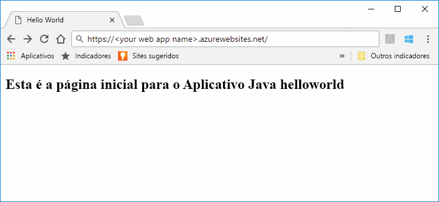
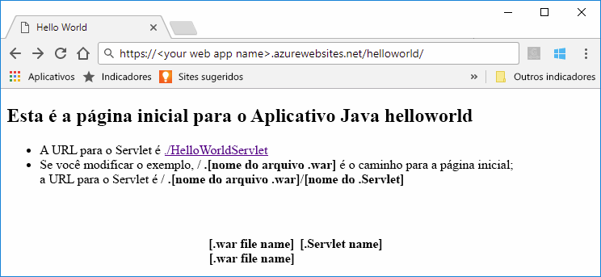

# <a name="quickstart-create-a-java-web-app-in-app-service-on-linux"></a>Início Rápido: criar um aplicativo Web Java no Serviço de Aplicativo do Azure no Linux

O Serviço de Aplicativo no Linux atualmente fornece um recurso de versão prévia para dar suporte a aplicativos Web em Java. Analise os [Termos de uso complementares para versões prévias do Microsoft Azure](https://azure.microsoft.com/support/legal/preview-supplemental-terms/) para saber mais sobre versões prévias. 

O [Serviço de Aplicativo no Linux](app-service-linux-intro.md) fornece um serviço de hospedagem na Web altamente escalonável e com aplicação automática de patches usando o sistema operacional Linux. Este início rápido mostra como usar a [CLI do Azure](https://docs.microsoft.com/cli/azure/get-started-with-azure-cli) com o [Plug-in do Maven para aplicativos Web do Azure (Versão prévia)](https://github.com/Microsoft/azure-maven-plugins/tree/develop/azure-webapp-maven-plugin) para implantar um aplicativo Web Java com uma imagem Linux interna.



[A implantação de aplicativos Web Java em um contêiner do Linux na nuvem usando o Kit de Ferramentas do Azure para IntelliJ](https://docs.microsoft.com/java/azure/intellij/azure-toolkit-for-intellij-hello-world-web-app-linux) é uma abordagem alternativa para implantar o aplicativo Java em seu próprio contêiner.

[!INCLUDE [quickstarts-free-trial-note](../../../includes/quickstarts-free-trial-note.md)]


## <a name="prerequisites"></a>pré-requisitos

Para concluir este guia de início rápido: 

* [CLI do Azure 2.0 ou posterior](https://docs.microsoft.com/cli/azure/install-azure-cli?view=azure-cli-latest) instalada localmente.
* [Apache Maven](http://maven.apache.org/).


## <a name="create-a-java-app"></a>Criar um aplicativo Java

Execute o comando abaixo usando o Maven para criar um novo aplicativo Web *helloworld*:  

    mvn archetype:generate -DgroupId=example.demo -DartifactId=helloworld -DarchetypeArtifactId=maven-archetype-webapp

Altere para o novo diretório *helloworld* do projeto e compile todos os módulos usando o seguinte comando:

    mvn verify

O comando verificará e criará todos os módulos, incluindo o arquivo *helloworld.war* no subdiretório *helloworld/de destino*.


## <a name="deploying-the-java-app-to-app-service-on-linux"></a>Implantando o aplicativo Java no Serviço de Aplicativo no Linux

Há várias opções de implantação para implantar seus aplicativos Web Java no Serviço de Aplicativo no Linux. Estas opções incluem:

* [Implantar usando plug-in do Maven para aplicativos Web do Azure](https://github.com/Microsoft/azure-maven-plugins/tree/develop/azure-webapp-maven-plugin)
* [Implantar usando ZIP ou WAR](https://docs.microsoft.com/azure/app-service/app-service-deploy-zip)
* [Implantar usando FTP](https://docs.microsoft.com/azure/app-service/app-service-deploy-ftp)

Neste início rápido, você usará o plug-in do Maven para aplicativos Web do Azure. Ele tem vantagens, por ser fácil de usar a partir do Maven, e cria os recursos do Azure necessários (grupo de recursos, plano do serviço de aplicativo e aplicativo web).

### <a name="deploy-with-maven"></a>Implantar com Maven

Para implantar o Maven, adicione a seguinte definição de plug-in no elemento `<build>`do arquivo *pom.xml*:

```xml
    <plugins>
      <plugin>
        <groupId>com.microsoft.azure</groupId> 
        <artifactId>azure-webapp-maven-plugin</artifactId> 
        <version>1.2.0</version>
        <configuration> 
          <resourceGroup>YOUR_RESOURCE_GROUP</resourceGroup> 
          <appName>YOUR_WEB_APP</appName> 
          <linuxRuntime>tomcat 9.0-jre8</linuxRuntime>
          <deploymentType>ftp</deploymentType> 
          <resources> 
              <resource> 
                  <directory>${project.basedir}/target</directory> 
                  <targetPath>webapps</targetPath> 
                  <includes> 
                      <include>*.war</include> 
                  </includes> 
                  <excludes> 
                      <exclude>*.xml</exclude> 
                  </excludes> 
              </resource> 
          </resources> 
        </configuration>
      </plugin>
    </plugins>
```    

Atualize os seguintes espaços reservados na configuração do plug-in:

| Placeholder | DESCRIÇÃO |
| ----------- | ----------- |
| `YOUR_RESOURCE_GROUP` | Nome do novo grupo de recursos no qual criar o aplicativo Web. Ao colocar todos os recursos para um aplicativo em um grupo, você pode gerenciá-los juntos. Por exemplo, excluir o grupo de recursos excluiria todos os recursos associados ao aplicativo. Atualize esse valor com um novo nome de grupo de recursos exclusivo, por exemplo, *TestResources*. Você usará esse nome de grupo de recursos para limpar todos os recursos do Azure em uma seção posterior. |
| `YOUR_WEB_APP` | O nome do aplicativo será parte do nome do host do aplicativo Web quando implantado no Azure (SEU_APLICATIVO_WEB.azurewebsites.net). Atualize esse valor com um nome exclusivo para o novo aplicativo Web do Azure que irá hospedar seu aplicativo Java, por exemplo, *contoso*. |

O elemento `linuxRuntime` da configuração controla qual imagem do Linux interna é usada em seu aplicativo. Todas as pilhas de tempo de execução com suporte podem ser encontradas [neste link](https://github.com/Microsoft/azure-maven-plugins/tree/develop/azure-webapp-maven-plugin#runtime-stacks). 


> [!NOTE] 
> Neste artigo, só estamos trabalhando com arquivos WAR. No entanto, o plug-in oferece suporte a aplicativos da Web JAR, utilizando a seguinte definição de plug-in dentro do elemento `<build>` de um arquivo *pom.xml*:
>
>```xml
>    <plugins>
>      <plugin>
>        <groupId>com.microsoft.azure</groupId> 
>        <artifactId>azure-webapp-maven-plugin</artifactId> 
>        <version>1.2.0</version>
>        <configuration> 
>          <resourceGroup>YOUR_RESOURCE_GROUP</resourceGroup> 
>          <appName>YOUR_WEB_APP</appName> 
>          <linuxRuntime>jre8</linuxRuntime>   
>          <!-- This is to make sure the jar file will not be occupied during the deployment -->
>          <stopAppDuringDeployment>true</stopAppDuringDeployment>
>          <deploymentType>ftp</deploymentType> 
>          <resources> 
>              <resource> 
>                  <directory>${project.basedir}/target</directory> 
>                  <targetPath>webapps</targetPath> 
>                  <includes> 
>                      <!-- Currently it is required to set as app.jar -->
>                      <include>app.jar</include> 
>                  </includes>  
>              </resource> 
>          </resources> 
>        </configuration>
>      </plugin>
>    </plugins>
>```    

Execute o seguinte comando e siga todas as instruções para fazer a autenticação com a CLI do Azure:

    az login

Implante o aplicativo Java no aplicativo Web usando o seguinte comando:

    mvn clean package azure-webapp:deploy


Após a conclusão da implantação, navegue até o aplicativo implantado usando a URL a seguir no navegador da Web.

```bash
http://<app_name>.azurewebsites.net/helloworld
```

O código Java de exemplo está em execução em um aplicativo Web com imagem interna.



**Parabéns!** Você implantou seu primeiro aplicativo Java no Serviço de Aplicativo no Linux.


[!INCLUDE [cli-samples-clean-up](../../../includes/cli-samples-clean-up.md)]


## <a name="next-steps"></a>Próximas etapas

Neste início rápido, você usou o Maven para criar um aplicativo Web Java e implantou o aplicativo Web Java no Serviço de Aplicativo no Linux. Para saber mais sobre como usar o Java com o Azure, siga o link abaixo.

> [!div class="nextstepaction"]
> [Azure para desenvolvedores Java](https://docs.microsoft.com/java/azure/)

