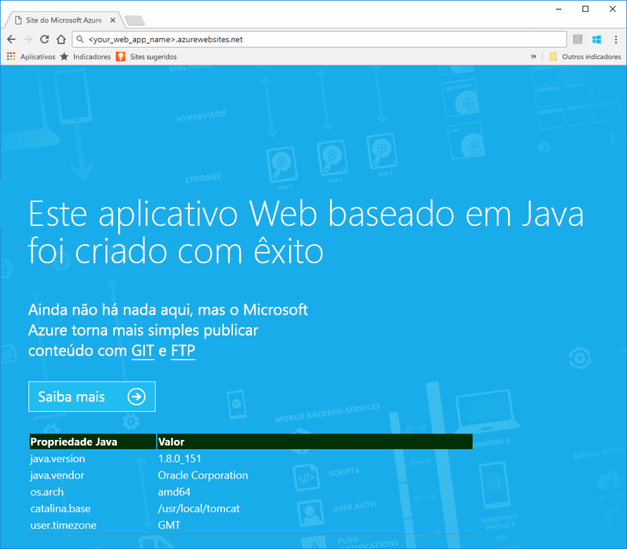
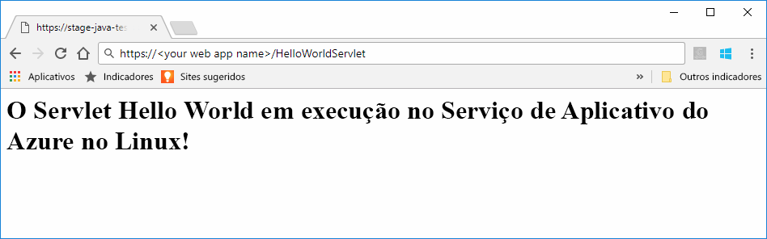

# <a name="preview-create-a-java-web-app-in-app-service-on-linux"></a>Versão prévia: criar um aplicativo Web Java no Serviço de Aplicativo do Azure no Linux

O Serviço de Aplicativo no Linux atualmente fornece um recurso de versão prévia para dar suporte a aplicativos Web em Java. Analise os [Termos de uso complementares para versões prévias do Microsoft Azure](https://azure.microsoft.com/support/legal/preview-supplemental-terms/) para saber mais sobre versões prévias. [A implantação de aplicativos Web Java em um contêiner do Linux na nuvem usando o Kit de Ferramentas do Azure para IntelliJ](https://docs.microsoft.com/java/azure/intellij/azure-toolkit-for-intellij-hello-world-web-app-linux) é uma abordagem alternativa para implantar o aplicativo Java em seu próprio contêiner.

> [!NOTE]
> Este artigo implanta um aplicativo Web Java no Serviço de Aplicativo no Linux.
>

O [Serviço de Aplicativo no Linux](app-service-linux-intro.md) fornece um serviço de hospedagem na Web altamente escalonável e com aplicação automática de patches usando o sistema operacional Linux. Este início rápido mostra como implantar um aplicativo Java no Serviço de Aplicativo no Linux usando uma imagem interna. Crie o aplicativo Web com imagem interna usando a [CLI do Azure](https://docs.microsoft.com/cli/azure/get-started-with-azure-cli) e use o Git para implantar o código Java no aplicativo Web.


[!INCLUDE [quickstarts-free-trial-note](../../../includes/quickstarts-free-trial-note.md)]


## <a name="prerequisites"></a>pré-requisitos

Para concluir este guia de início rápido: 

* Você precisa ter uma assinatura do Azure. Se você não tiver uma assinatura do Azure, crie uma [conta gratuita](https://azure.microsoft.com/free/?ref=microsoft.com&utm_source=microsoft.com&utm_medium=docs&utm_campaign=visualstudio) antes de começar.
* [Instalar o Git](https://git-scm.com/).
* Instale o [Eclipse](https://www.eclipse.org/downloads/).


[!INCLUDE [cloud-shell-try-it.md](../../../includes/cloud-shell-try-it.md)]

[!INCLUDE [Configure deployment user](../../../includes/configure-deployment-user.md)]

[!INCLUDE [Create resource group](../../../includes/app-service-web-create-resource-group-linux.md)]

[!INCLUDE [Create app service plan](../../../includes/app-service-web-create-app-service-plan-linux.md)]


## <a name="create-a-web-app"></a>Criar um aplicativo Web

No Cloud Shell, crie um [aplicativo Web](../app-service-web-overview.md) no plano do Serviço de Aplicativo do `myAppServicePlan`. Você pode fazer isso usando o comando [`az webapp create`](/cli/azure/webapp?view=azure-cli-latest#az_webapp_create). No exemplo a seguir, substitua *\<app_name>* por um nome do aplicativo exclusivo globalmente (os caracteres válidos são `a-z`, `0-9` e `-`). 

```azurecli-interactive
az webapp create --name <app_name> --resource-group myResourceGroup --plan myAppServicePlan --runtime "TOMCAT|8.5-jre8"
```

Para o parâmetro **runtime**, use um dos seguintes tempos de execução:
 * TOMCAT|8.5-jre8
 * TOMCAT|9.0-jre8


Quando o aplicativo Web tiver sido criado, a CLI do Azure mostrará informações semelhantes ao exemplo a seguir:

```json
{
  "additionalProperties": {},
  "availabilityState": "Normal",
  "clientAffinityEnabled": true,
  "clientCertEnabled": false,
  "cloningInfo": null,
  "containerSize": 0,
  "dailyMemoryTimeQuota": 0,
  "defaultHostName": "<your web app name>.azurewebsites.net",
  "enabled": true,
  "enabledHostNames": [
    "<your web app name>.azurewebsites.net",
    "<your web app name>.scm.azurewebsites.net"
  ],
  "ftpPublishingUrl": "ftp://<your ftp URL>",  
  < JSON data removed for brevity. >
}
```

Copie o valor para **ftpPublishingUrl**. Você usará isso posteriormente se escolher a implantação de FTP.

Navegue até o aplicativo Web recém-criado.

```
http://<app_name>.azurewebsites.net
```

Se o aplicativo Web estiver em execução, você verá uma tela padrão semelhante à imagem abaixo:




## <a name="download-the-sample-java-app"></a>Baixar o aplicativo Java de exemplo

Em uma janela de terminal no computador, execute o comando a seguir para clonar o repositório do aplicativo de exemplo para o computador local. Você implantará este aplicativo de exemplo em uma etapa posterior.

```bash
git clone https://github.com/Azure-Samples/java-docs-hello-world
```


## <a name="deploying-the-java-app-to-app-service-on-linux"></a>Implantando o aplicativo Java no Serviço de Aplicativo no Linux

Abra o projeto de exemplo no [Eclipse](https://www.eclipse.org/downloads/) e [exporte o aplicativo Java para um arquivo WAR (Web Archive)](http://help.eclipse.org/kepler/index.jsp?topic=%2Forg.eclipse.wst.webtools.doc.user%2Ftopics%2Ftwcrewar.html) chamado `helloworld.war`.

Para implantar o arquivo WAR do aplicativo Java, você pode usar o WarDeploy (atualmente em [versão prévia](https://azure.microsoft.com/support/legal/preview-supplemental-terms/)) ou FTP.

Dependendo de qual método de implantação você usar, o caminho relativo para navegar até o seu aplicativo Web Java será um pouco diferente.

### <a name="deploy-with-wardeploy"></a>Implantar com o WarDeploy 

Para implantar o arquivo WAR com o WarDeploy, use a linha de comando de exemplo cURL a seguir para enviar uma solicitação POST para *https://<your app name>.scm.azurewebsites.net/api/wardeploy*. A solicitação POST deve conter o arquivo .war no corpo da mensagem. As credenciais de implantação para seu aplicativo são fornecidas na solicitação usando a autenticação BÁSICA HTTP. Para saber mais sobre o WarDeploy, confira [Implantar seu aplicativo no Serviço de Aplicativo do Azure com um arquivo ZIP ou WAR](../app-service-deploy-zip.md).

```bash
curl -X POST -u <username> --data-binary @"<war_file_path>" https://<app_name>.scm.azurewebsites.net/api/wardeploy
```

Atualize o seguinte:

* `username` - Use o nome de usuário das credenciais de implantação criado anteriormente.
* `war_file_path` - Use o caminho local do arquivo WAR.
* `app_name` - Use o nome do aplicativo criado anteriormente.

Execute o comando. Quando solicitado pelo cURL, digite a senha das credenciais de implantação.

Navegue até o aplicativo implantado usando a URL a seguir no navegador da Web.

```bash
http://<app_name>.azurewebsites.net
```

O código Java de exemplo está em execução em um aplicativo Web com imagem interna.


Navegue até o servlet usando seu navegador da Web.

```bash
http://<app_name>.azurewebsites.net/HelloWorldServlet
```

O servlet está executando um aplicativo Web com imagem interna.




**Parabéns!** Você implantou seu primeiro aplicativo Java no Serviço de Aplicativo no Linux.


### <a name="ftp-deployment"></a>Implantação de FTP

Como alternativa, você também pode usar FTP para implantar o arquivo WAR. 

Envie o arquivo por FTP para o diretório */home/site/wwwroot/webapps* de seu aplicativo Web. A linha de comando de exemplo abaixo usa cURL:

```bash
curl -T war_file_path -u "app_name\username" ftp://webappFTPURL/site/wwwroot/webapps/
```

Atualize o seguinte:

* `war_file_path` - Use o caminho local do arquivo WAR.
* `app_name` - Use o nome do aplicativo criado anteriormente.
* `username` - Use o nome de usuário das credenciais de implantação criado anteriormente.
* `webappFTPURL` - Use o valor **nome do host FTP** para o aplicativo Web que você copiou anteriormente. O nome do host FTP também é listado na folha **Visão Geral** de seu aplicativo Web no [portal do Azure](https://portal.azure.com/).

Execute o comando. Quando solicitado pelo cURL, digite a senha das credenciais de implantação.


Navegue até o aplicativo implantado usando a URL a seguir no navegador da Web.

```bash
http://<app_name>.azurewebsites.net/helloworld
```

O código Java de exemplo está em execução em um aplicativo Web com imagem interna.


Navegue até o servlet usando seu navegador da Web.

```bash
http://<app_name>.azurewebsites.net/helloworld/HelloWorldServlet
```

O código Java de exemplo está em execução em um aplicativo Web com imagem interna.


**Parabéns!** Você implantou seu primeiro aplicativo Java no Serviço de Aplicativo no Linux.


[!INCLUDE [cli-samples-clean-up](../../../includes/cli-samples-clean-up.md)]


## <a name="next-steps"></a>Próximas etapas

Para obter mais informações sobre como usar o Java com o Azure, consulte os links a seguir:

* [Azure para desenvolvedores Java](https://docs.microsoft.com/java/azure/)
* [Implantar um aplicativo Web Olá, Mundo em um contêiner do Linux na nuvem usando o Kit de Ferramentas do Azure para IntelliJ](https://docs.microsoft.com/java/azure/intellij/azure-toolkit-for-intellij-hello-world-web-app-linux)
* [Ferramentas Java para Visual Studio Team Services](https://java.visualstudio.com/)
