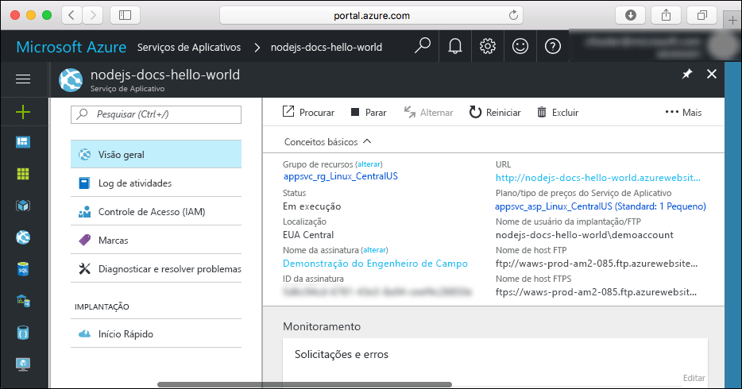

# <a name="create-a-nodejs-web-app-in-azure-app-service-on-linux"></a>Criar um aplicativo Web Node.js no Serviço de Aplicativo do Azure no Linux

> [!NOTE]
> Este artigo implanta um aplicativo no Serviço de Aplicativo no Linux. Para implantar o Serviço de aplicativo no _Windows_, consulte [Criar um aplicativo Web Node.js no Azure](../app-service-web-get-started-nodejs.md).
>

O [Serviço de Aplicativo no Linux](app-service-linux-intro.md) fornece um serviço de hospedagem na Web altamente escalonável e com aplicação automática de patches usando o sistema operacional Linux. Este início rápido mostra como implantar um aplicativo Node.js no Serviço de Aplicativo no Linux usando o [Cloud Shell](https://docs.microsoft.com/en-us/azure/cloud-shell/overview).

Você concluirá este início rápido no Cloud Shell, mas você também pode executar esses comandos localmente com [CLI do Azure](/cli/azure/install-azure-cli).


[!INCLUDE [quickstarts-free-trial-note](../../../includes/quickstarts-free-trial-note.md)]

[!INCLUDE [cloud-shell-try-it.md](../../../includes/cloud-shell-try-it.md)]

## <a name="install-web-app-extension-for-cloud-shell"></a>Instalar a extensão do aplicativo Web para o Cloud Shell

Para concluir este início rápido, você precisará adicionar a [az web app extension](https://docs.microsoft.com/en-us/cli/azure/extension?view=azure-cli-latest#az-extension-add). Se a extensão já estiver instalada, você deve atualizá-la para a versão mais recente. Para atualizar a extensão do aplicativo Web, digite `az extension update -n webapp`.

Para instalar a extensão webapp, execute o seguinte comando:

```bash
az extension add -n webapp
```

Quando a extensão tiver sido instalada, o Cloud Shell mostra as informações para o exemplo a seguir:

```bash
The installed extension 'webapp' is in preview.
```

## <a name="download-the-sample"></a>Baixar o exemplo

No Cloud Shell, crie um diretório de início rápido e depois altere-o.

```bash
mkdir quickstart

cd quickstart
```

Em seguida, execute o comando a seguir para clonar o repositório de aplicativos de exemplo ao seu diretório de início rápido.

```bash
git clone https://github.com/Azure-Samples/nodejs-docs-hello-world
```

Na execução, ele exibe informações semelhantes ao seguinte exemplo:

```bash
Cloning into 'nodejs-docs-hello-world'...
remote: Counting objects: 40, done.
remote: Total 40 (delta 0), reused 0 (delta 0), pack-reused 40
Unpacking objects: 100% (40/40), done.
Checking connectivity... done.
````

## <a name="create-a-web-app"></a>Criar um aplicativo Web

Altere para o diretório que contém o código de exemplo e execute o comando `az webapp up`.

No exemplo a seguir, substitua <app_name> por um nome de aplicativo exclusivo.

```bash
cd nodejs-docs-hello-world

az webapp up -n <app_name>
```

Esse comando pode demorar um pouco para ser executado. Na execução, ele exibe informações semelhantes ao seguinte exemplo:

```json
Creating Resource group 'appsvc_rg_Linux_CentralUS' ...
Resource group creation complete
Creating App service plan 'appsvc_asp_Linux_CentralUS' ...
App service plan creation complete
Creating app '<app_name>' ....
Webapp creation complete
Updating app settings to enable build after deployment
Creating zip with contents of dir /home/username/quickstart/nodejs-docs-hello-world ...
Preparing to deploy and build contents to app.
Fetching changes.

Generating deployment script.
Generating deployment script.
Generating deployment script.
Running deployment command...
Running deployment command...
Running deployment command...
Deployment successful.
All done.
{
  "app_url": "https://<app_name>.azurewebsites.net",
  "location": "Central US",
  "name": "<app_name>",
  "os": "Linux",
  "resourcegroup": "appsvc_rg_Linux_CentralUS ",
  "serverfarm": "appsvc_asp_Linux_CentralUS",
  "sku": "STANDARD",
  "src_path": "/home/username/quickstart/nodejs-docs-hello-world ",
  "version_detected": "6.9",
  "version_to_create": "node|6.9"
}
```

O comando `az webapp up` realiza as seguintes ações:

- Criar um grupo de recursos padrão.

- Criar um plano de serviço de aplicativo padrão.

- Criar um aplicativo com o nome especificado.

- Arquivos [de implantação zip](https://docs.microsoft.com/en-us/azure/app-service/app-service-deploy-zip) do diretório de trabalho atual para o aplicativo Web.

## <a name="browse-to-the-app"></a>Navegar até o aplicativo

Navegue até o aplicativo implantado usando o navegador da Web. Substitua <app_name> pelo nome exclusivo do seu aplicativo Web.

```bash
http://<app_name>.azurewebsites.net
```

O código de exemplo do Node.js está em execução em um aplicativo Web com imagem interna.


**Parabéns!** Você implantou seu primeiro aplicativo Node.js no Serviço de Aplicativo no Linux.

## <a name="update-and-redeploy-the-code"></a>Atualizar e reimplantar o código

No Cloud Shell, digite `nano index.js` para abrir o editor de texto nano.


 Faça uma pequena alteração no texto na chamada para `response.end`:

```nodejs
response.end("Hello Azure!");
```

Salve suas alterações e saia do nano. Use o comando `^O` para salvar e `^X` para sair.

Agora você vai reimplantar o aplicativo. Substitua `<app_name>` pelo seu aplicativo Web.

```bash
az webapp up -n <app_name>
```

Depois que a implantação for concluída, troque para a janela do navegador aberta na etapa **Navegar até o aplicativo** e atualize a página.


## <a name="manage-your-new-azure-web-app"></a>Gerenciar seu novo aplicativo Web do Azure

Vá para o <a href="https://portal.azure.com" target="_blank">portal do Azure</a> para gerenciar o aplicativo Web que você criou.

No menu à esquerda, clique em **Serviços de Aplicativos** e então clique no nome do seu aplicativo Web do Azure.


A página Visão Geral do seu aplicativo Web é exibida. Aqui você pode concluir tarefas básicas de gerenciamento como procurar, parar, iniciar, reiniciar e excluir.



O menu à esquerda fornece páginas diferentes para configurar seu aplicativo.

## <a name="clean-up-resources"></a>Limpar recursos

Nas etapas anteriores, você criou os recursos do Azure em um grupo de recursos. Se você não espera precisar desses recursos no futuro, exclua o grupo de recursos do Cloud Shell. Se você modificou a região, atualize o nome do grupo de recursos `appsvc_rg_Linux_CentralUS` ao grupo de recursos específico para seu aplicativo.

```azurecli-interactive
az group delete --name appsvc_rg_Linux_CentralUS
```

Esse comando pode demorar um pouco para ser executado.

## <a name="next-steps"></a>Próximas etapas

> [!div class="nextstepaction"]
> [Node.js com o MongoDB](tutorial-nodejs-mongodb-app.md)
