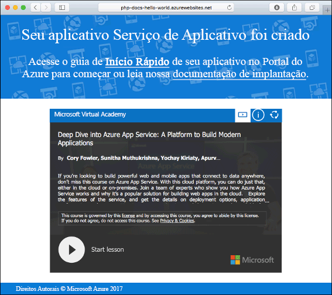
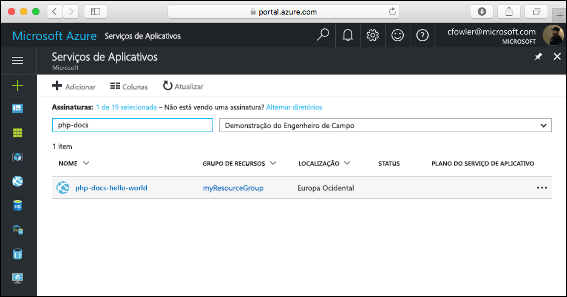
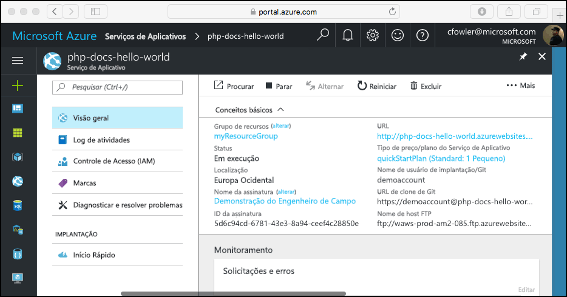

# <a name="create-a-php-web-app-in-app-service-on-linux"></a>Criar um aplicativo Web PHP no Serviço de Aplicativo no Linux

O [Serviço de Aplicativo no Linux](app-service-linux-intro.md) fornece um serviço de hospedagem na Web altamente escalonável e com aplicação automática de patches usando o sistema operacional Linux. Este tutorial de guia de início rápido mostra como implantar um aplicativo PHP no Serviço de Aplicativo do Azure no Linux. Crie o aplicativo Web com imagem interna usando a [CLI do Azure](https://docs.microsoft.com/cli/azure/get-started-with-azure-cli) no Cloud Shell e use o Git para implantar o código PHP no aplicativo Web.

![Aplicativo de exemplo em execução no Azure]](media/quickstart-php/hello-world-in-browser.png)

Você pode seguir as etapas abaixo usando um computador Mac, Windows ou Linux.

## <a name="prerequisites"></a>Pré-requisitos

Para concluir este guia de início rápido:

* [Instalar o Git](https://git-scm.com/)
* [Instalar o PHP](https://php.net)

[!INCLUDE [quickstarts-free-trial-note](../../../includes/quickstarts-free-trial-note.md)]

## <a name="download-the-sample"></a>Baixar o exemplo

Em uma janela de terminal, execute os comandos a seguir para clonar o aplicativo de exemplo no computador local e navegue para o diretório que contém o código de exemplo.

```bash
git clone https://github.com/Azure-Samples/php-docs-hello-world
cd php-docs-hello-world
```

## <a name="run-the-app-locally"></a>Executar o aplicativo localmente

Execute o aplicativo localmente abrindo uma janela do terminal e usando o comando `php` para iniciar o servidor interno da Web do PHP.

```bash
php -S localhost:8080
```

Abra um navegador da Web e navegue até o aplicativo de exemplo em `http://localhost:8080`.

Você verá o **Olá, Mundo!** mensagem do aplicativo de exemplo exibida na página.


Na janela do terminal, pressione **Ctrl+C** para sair do servidor Web.

[!INCLUDE [cloud-shell-try-it.md](../../../includes/cloud-shell-try-it.md)]

[!INCLUDE [Configure deployment user](../../../includes/configure-deployment-user.md)]

[!INCLUDE [Create resource group](../../../includes/app-service-web-create-resource-group.md)]

[!INCLUDE [Create app service plan](../../../includes/app-service-web-create-app-service-plan-linux.md)]

## <a name="create-a-web-app-with-built-in-image"></a>Criar um aplicativo Web com imagem interna

[!INCLUDE [Create web app](../../../includes/app-service-web-create-web-app-php-no-h.md)] 

Navegue até o site para ver seu aplicativo Web recém-criado com imagem interna. Substitua _&lt;nome do aplicativo>_ por um nome exclusivo do aplicativo.

```bash
http://<app name>.azurewebsites.net
```



[!INCLUDE [Push to Azure](../../../includes/app-service-web-git-push-to-azure.md)] 

```bash
Counting objects: 2, done.
Delta compression using up to 4 threads.
Compressing objects: 100% (2/2), done.
Writing objects: 100% (2/2), 352 bytes | 0 bytes/s, done.
Total 2 (delta 1), reused 0 (delta 0)
remote: Updating branch 'master'.
remote: Updating submodules.
remote: Preparing deployment for commit id '25f18051e9'.
remote: Generating deployment script.
remote: Running deployment command...
remote: Handling Basic Web Site deployment.
remote: Kudu sync from: '/home/site/repository' to: '/home/site/wwwroot'
remote: Copying file: '.gitignore'
remote: Copying file: 'LICENSE'
remote: Copying file: 'README.md'
remote: Copying file: 'index.php'
remote: Ignoring: .git
remote: Finished successfully.
remote: Running post deployment command(s)...
remote: Deployment successful.
To https://<app_name>.scm.azurewebsites.net/<app_name>.git
   cc39b1e..25f1805  master -> master
```

## <a name="browse-to-the-app"></a>Navegar até o aplicativo

Navegue até o aplicativo implantado usando o navegador da Web.

```bash
http://<app_name>.azurewebsites.net
```

O código de exemplo PHP está em execução em um aplicativo Web com imagem interna.


**Parabéns!** Você implantou seu primeiro aplicativo PHP no Serviço de Aplicativo no Linux.

## <a name="update-locally-and-redeploy-the-code"></a>Atualizar localmente e reimplantar o código

Usando um editor de texto local, abra o arquivo `index.php` no aplicativo do PHP e faça uma pequena alteração no texto dentro da cadeia de caracteres para `echo`:

```php
echo "Hello Azure!";
```

Confirme suas alterações no Git e, em seguida, envie as alterações de código por push para o Azure.

```bash
git commit -am "updated output"
git push azure master
```

Depois que a implantação for concluída, troque para a janela do navegador aberta na etapa **Navegar até o aplicativo** e atualize a página.


## <a name="manage-your-new-azure-web-app"></a>Gerenciar seu novo aplicativo Web do Azure

Vá para o <a href="https://portal.azure.com" target="_blank">portal do Azure</a> para gerenciar o aplicativo Web que você criou.

No menu à esquerda, clique em **Serviços de Aplicativos** e então clique no nome do seu aplicativo Web do Azure.



A página Visão Geral do seu aplicativo Web é exibida. Aqui você pode executar tarefas básicas de gerenciamento como procurar, parar, iniciar, reiniciar e excluir.



O menu à esquerda fornece páginas diferentes para configurar seu aplicativo. 

[!INCLUDE [cli-samples-clean-up](../../../includes/cli-samples-clean-up.md)]

## <a name="next-steps"></a>Próximas etapas

> [!div class="nextstepaction"]
> [PHP com MySQL](tutorial-php-mysql-app.md)
