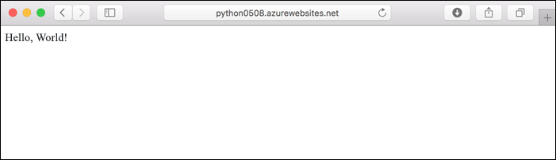
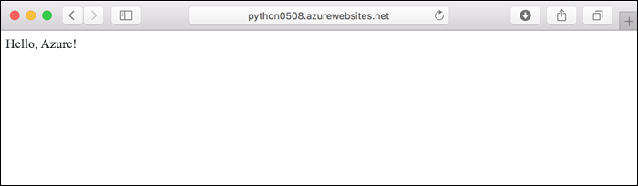
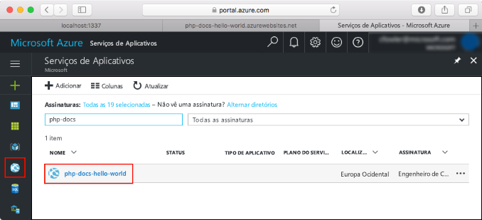
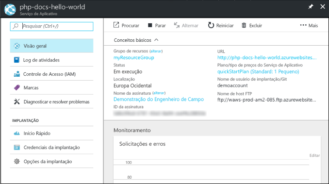

# <a name="create-a-python-app-in-azure-app-service-on-linux-preview"></a>Criar um aplicativo Python no Serviço de Aplicativo do Azure no Linux (Versão Prévia)

O [Serviço de Aplicativo no Linux](app-service-linux-intro.md) fornece um serviço de hospedagem na Web altamente escalonável e com aplicação automática de patches usando o sistema operacional Linux. Este início rápido mostra como implantar um aplicativo Python com base na imagem Python interna (versão prévia) no Serviço de Aplicativo no Linux usando a [CLI do Azure](/cli/azure/install-azure-cli).

Você pode seguir as etapas deste artigo usando um computador Mac, Windows ou Linux.



[!INCLUDE [quickstarts-free-trial-note](../../../includes/quickstarts-free-trial-note.md)]

## <a name="prerequisites"></a>Pré-requisitos

Para concluir este guia de início rápido:

* <a href="https://www.python.org/downloads/" target="_blank">Instale o Python 3.7</a>
* <a href="https://git-scm.com/" target="_blank">Instalar o Git</a>

## <a name="download-the-sample"></a>Baixar o exemplo

Em uma janela do terminal, execute os comandos a seguir para clonar o aplicativo de exemplo no computador local e navegue para o diretório que contém o código de exemplo.

```bash
git clone https://github.com/Azure-Samples/python-docs-hello-world
cd python-docs-hello-world
```

O repositório contém um *application.py*, que diz ao Serviço de Aplicativo que o repositório contém um aplicativo Flask. Para obter mais informações, consulte [Personalizações e o processo de inicialização do contêiner](how-to-configure-python.md).

## <a name="run-the-app-locally"></a>Executar o aplicativo localmente

Execute o aplicativo no local para ver como ele deve ficar quando o implantar no Azure. Abra uma janela do terminal e use os comandos a seguir para instalar as dependências necessárias e iniciar o servidor de desenvolvimento interno. 

```bash
# In Bash
python3 -m venv venv
source venv/bin/activate
pip install -r requirements.txt
FLASK_APP=application.py flask run

# In PowerShell
py -3 -m venv env
env\scripts\activate
pip install -r requirements.txt
Set-Item Env:FLASK_APP ".\application.py"
flask run
```

Abra um navegador da Web e navegue até o aplicativo de exemplo em `http://localhost:5000/`.

Você verá o **Olá, Mundo!** mensagem do aplicativo de exemplo exibida na página.


Na janela do terminal, pressione **Ctrl+C** para sair do servidor Web.

[!INCLUDE [cloud-shell-try-it.md](../../../includes/cloud-shell-try-it.md)]

[!INCLUDE [Configure deployment user](../../../includes/configure-deployment-user.md)]

[!INCLUDE [Create resource group](../../../includes/app-service-web-create-resource-group-linux.md)]

[!INCLUDE [Create app service plan](../../../includes/app-service-web-create-app-service-plan-linux.md)]

## <a name="create-a-web-app"></a>Criar um aplicativo Web

[!INCLUDE [Create web app](../../../includes/app-service-web-create-web-app-python-linux-no-h.md)]

Navegue até o site para ver o aplicativo recém-criado com imagem interna. Substitua _&lt;nome do aplicativo>_ pelo nome de seu aplicativo.

```bash
http://<app_name>.azurewebsites.net
```

Seu novo aplicativo deve ficar assim:


[!INCLUDE [Push to Azure](../../../includes/app-service-web-git-push-to-azure.md)] 

```bash
Counting objects: 42, done.
Delta compression using up to 8 threads.
Compressing objects: 100% (39/39), done.
Writing objects: 100% (42/42), 9.43 KiB | 0 bytes/s, done.
Total 42 (delta 15), reused 0 (delta 0)
remote: Updating branch 'master'.
remote: Updating submodules.
remote: Preparing deployment for commit id 'c40efbb40e'.
remote: Generating deployment script.
remote: Generating deployment script for python Web Site
.
.
.
remote: Finished successfully.
remote: Running post deployment command(s)...
remote: Deployment successful.
remote: App container will begin restart within 10 seconds.
To https://user2234@cephalin-python.scm.azurewebsites.net/cephalin-python.git
 * [new branch]      master -> master
 ```

## <a name="browse-to-the-app"></a>Navegar até o aplicativo

Navegue até o aplicativo implantado usando o navegador da Web.

```bash
http://<app_name>.azurewebsites.net
```

O código de exemplo Python está em execução no Serviço de Aplicativo no Linux com uma imagem interna.


**Parabéns!** Você implantou seu primeiro aplicativo Python no Serviço de Aplicativo no Linux.

## <a name="update-locally-and-redeploy-the-code"></a>Atualizar localmente e reimplantar o código

No repositório local, abra o arquivo `application.py` e faça uma pequena alteração no texto na última linha:

```python
return "Hello Azure!"
```

Confirme suas alterações no Git e, em seguida, envie as alterações de código por push para o Azure.

```bash
git commit -am "updated output"
git push azure master
```

Depois que a implantação for concluída, troque para a janela do navegador aberta na etapa **Navegar até o aplicativo** e atualize a página.



## <a name="manage-your-new-azure-app"></a>Gerenciar seu novo aplicativo do Azure

Acesse o <a href="https://portal.azure.com" target="_blank">portal do Azure</a> para gerenciar o aplicativo que você criou.

No menu à esquerda, clique em **Serviços de Aplicativos** e, em seguida, clique no nome do aplicativo do Azure.



Você verá a página Visão geral do aplicativo. Aqui você pode executar tarefas básicas de gerenciamento como procurar, parar, iniciar, reiniciar e excluir.



O menu à esquerda fornece páginas diferentes para configurar seu aplicativo. 

[!INCLUDE [cli-samples-clean-up](../../../includes/cli-samples-clean-up.md)]

## <a name="next-steps"></a>Próximas etapas

A imagem interna do Python no Serviço de Aplicativo no Linux está atualmente em versão prévia, sendo possível personalizar o comando usado para iniciar o aplicativo. Nesse caso, também é possível criar aplicativos Python de produção usando um contêiner personalizado.

> [!div class="nextstepaction"]
> [Python com PostgreSQL](tutorial-python-postgresql-app.md)

> [!div class="nextstepaction"]
> [Configurar um comando de inicialização personalizado](how-to-configure-python.md#customize-startup-command)

> [!div class="nextstepaction"]
> [Solução de problemas](how-to-configure-python.md#troubleshooting)

> [!div class="nextstepaction"]
> [Usar imagens personalizadas](tutorial-custom-docker-image.md)
