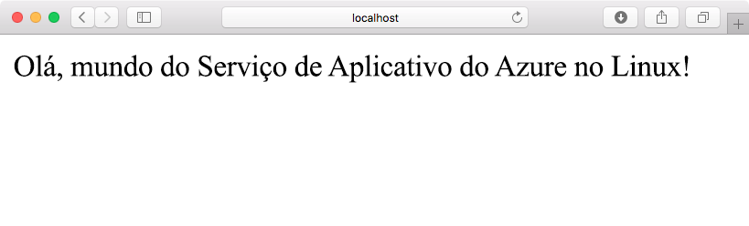
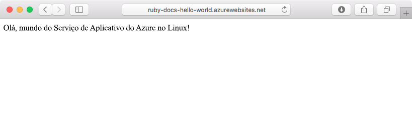
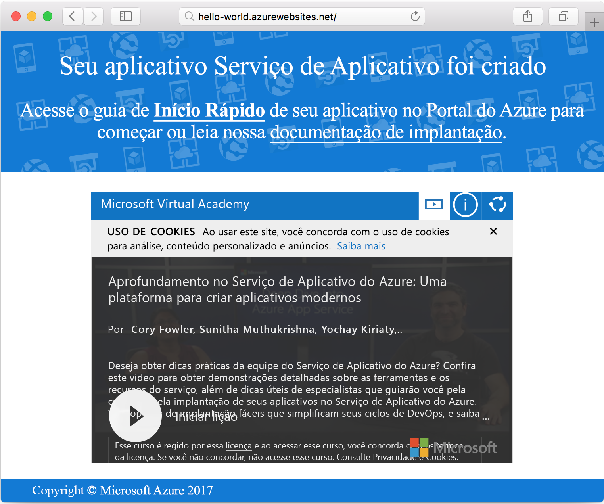

# <a name="create-a-ruby-app-in-app-service-on-linux"></a>Criar um aplicativo Ruby no Serviço de Aplicativo no Linux

O [Serviço de Aplicativo no Linux](app-service-linux-intro.md) fornece um serviço de hospedagem na Web altamente escalonável e com aplicação automática de patches. Este guia de início rápido mostra como criar um aplicativo Ruby on Rails básico e implantá-lo no Azure como um aplicativo Web no Linux.



## <a name="prerequisites"></a>pré-requisitos

* <a href="https://www.ruby-lang.org/en/documentation/installation/#rubyinstaller" target="_blank">Instale o Ruby 2.4.1 ou superior</a>
* <a href="https://git-scm.com/" target="_blank">Instalar o Git</a>

[!INCLUDE [quickstarts-free-trial-note](../../../includes/quickstarts-free-trial-note.md)]

## <a name="download-the-sample"></a>Baixar o exemplo

Em uma janela de terminal, execute o comando a seguir para clonar o repositório do aplicativo de exemplo para o computador local:

```bash
git clone https://github.com/Azure-Samples/ruby-docs-hello-world
```

## <a name="run-the-application-locally"></a>Executar o aplicativo localmente

Execute o servidor de trilhos para que o aplicativo funcione. Altere para o diretório *hello-world* e o comando `rails server` iniciará o servidor.

```bash
cd hello-world\bin
rails server
```

Usando o navegador da Web, navegue até `http://localhost:3000` para testar o aplicativo localmente.


## <a name="modify-app-to-display-welcome-message"></a>Modificar o aplicativo para exibir a mensagem de boas-vindas

Modifique o aplicativo para que ele exiba uma mensagem de boas-vindas. Primeiro, você deve configurar uma rota, modificando o arquivo *~/workspace/ruby-docs-hello-world/config/routes.rb* para incluir uma rota denominada `hello`.

  ```ruby
  Rails.application.routes.draw do
      #For details on the DSL available within this file, see http://guides.rubyonrails.org/routing.html
      root 'application#hello'
  end
  ```

Altere o controlador do aplicativo para que ele retorne a mensagem como HTML para o navegador. 

Abra *~/workspace/hello-world/app/controllers/application_controller.rb* para edição. Modifique a classe `ApplicationController` para que ela se assemelhe ao seguinte exemplo de código:

  ```ruby
  class ApplicationController > ActionController :: base
    protect_from_forgery with: :exception
    def hello
      render html: "Hello, world from Azure Web App on Linux!"
    end
  end
  ```

Seu aplicativo está configurado. Usando o navegador da Web, navegue até `http://localhost:3000` para confirmar a página inicial de raiz.



[!INCLUDE [Try Cloud Shell](../../../includes/cloud-shell-try-it.md)]

[!INCLUDE [Configure deployment user](../../../includes/configure-deployment-user.md)]

## <a name="create-a-ruby-web-app-on-azure"></a>Criar um aplicativo Web Ruby no Azure

Um grupo de recursos é necessário para conter os ativos necessários para seu aplicativo Web. Para criar um grupo de recursos, use o comando [az group create]().

```azurecli-interactive
az group create --location westeurope --name myResourceGroup
```

Use o comando [az appservice plan create](/cli/azure/appservice/plan?view=azure-cli-latest#az_appservice_plan_create) para criar um plano de serviço de aplicativo para seu aplicativo Web.

```azurecli-interactive
az appservice plan create --name myAppServicePlan --resource-group myResourceGroup --is-linux
```

Em seguida, execute o comando [az webapp create](/cli/azure/webapp?view=azure-cli-latest#az_webapp_create) para criar o aplicativo Web que usa o plano de serviço recém-criado. Observe que o tempo de execução é definido como `ruby|2.3`. Não se esqueça de substituir `<app name>` por um nome exclusivo do aplicativo.

```azurecli-interactive
az webapp create --resource-group myResourceGroup --plan myAppServicePlan --name <app name> \
--runtime "ruby|2.3" --deployment-local-git
```

A saída do comando revela as informações sobre o aplicativo Web criado recentemente, bem como a URL de implantação. O arquivo deve ser semelhante ao exemplo seguinte. Copie a URL para uso posterior neste tutorial.

```bash
https://<deployment user name>@<app name>.scm.azurewebsites.net/<app name>.git
```

Após um aplicativo Web ser criado, uma página de **Visão geral** ficará disponível para exibição. Navegue até ela. A seguinte página inicial é exibida:




## <a name="deploy-your-application"></a>Implantar seu aplicativo

Execute os seguintes comandos para implantar o aplicativo local em seu site do Azure:

```bash
git remote add azure <Git deployment URL from above>
git add -A
git commit -m "Initial deployment commit"
git push azure master
```

Confirme que as operações de implantação remota relatam êxito. Os comandos produzem uma saída semelhante ao texto a seguir:

```bash
remote: Using sass-rails 5.0.6
remote: Updating files in vendor/cache
remote: Bundle gems are installed into ./vendor/bundle
remote: Updating files in vendor/cache
remote: ~site/repository
remote: Finished successfully.
remote: Running post deployment command(s)...
remote: Deployment successful.
To https://<your web app name>.scm.azurewebsites.net/<your web app name>.git
  579ccb....2ca5f31  master -> master
myuser@ubuntu1234:~workspace/<app name>$
```

Depois que a implantação for concluída, reinicie o aplicativo Web para a implantação entrar em vigor usando o comando [az webapp restart](/cli/azure/webapp?view=azure-cli-latest#az_webapp_restart), conforme mostrado aqui:

```azurecli-interactive
az webapp restart --name <app name> --resource-group myResourceGroup
```

Navegue até o site e verifique os resultados.

```bash
http://<app name>.azurewebsites.net
```


> [!NOTE]
> Enquanto o aplicativo estiver reiniciando, tentar navegar pelo site leva a um código de status HTTP `Error 503 Server unavailable`. Pode levar alguns minutos para reiniciar completamente.
>

[!INCLUDE [Clean-up section](../../../includes/cli-script-clean-up.md)]

## <a name="next-steps"></a>Próximas etapas

> [!div class="nextstepaction"]
> [Ruby on Rails com MySQL](tutorial-ruby-mysql-app.md)
