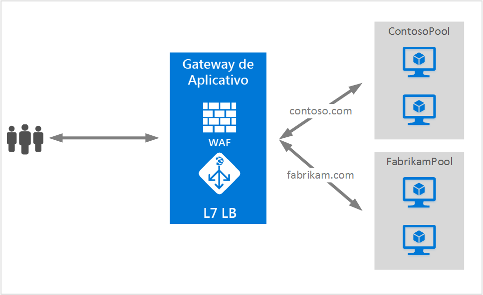

# Habilitando política de SSL e SSL de ponta a ponta no gateway de aplicativo
## Visão geral
O gateway de aplicativo dá suporte a terminação SSL no gateway, pelo qual o tráfego flui geralmente descriptografado até os servidores de back-end. Isso permite que os servidores Web fiquem livres da sobrecarga dispendiosa de criptografia/descriptografia. No entanto, para alguns clientes, a comunicação descriptografada com os servidores de back-end não é uma opção aceitável. Isso pode ser devido a requisitos de segurança/conformidade ou o aplicativo pode só aceitar conexões seguras. Para tais aplicativos, o gateway de aplicativo agora dá suporte a criptografia SSL de ponta a ponta.

O SSL de ponta a ponta permite transmitir com segurança dados confidenciais para o back-end criptografado aproveitando as vantagens dos recursos de balanceamento de carga de Camada 7 que o gateway de aplicativo fornece, como afinidade de cookie, roteamento baseado em URL, suporte a roteamento baseado em sites ou capacidade de injetar cabeçalhos X-Forwarded-*.

Quando configurado com o modo de comunicação SSL de ponta a ponta, o gateway de aplicativo encerra as sessões de SSL de usuário no gateway e descriptografa o tráfego do usuário. Ele aplica as regras configuradas para selecionar uma instância de pool de back-end apropriada para rotear o tráfego. O gateway de aplicativo, em seguida, inicia uma nova conexão SSL com o servidor de back-end e criptografa novamente os dados usando o certificado de chave pública do servidor de back-end antes de transmitir a solicitação para o back-end. O SSL de ponta a ponta SSL é habilitado ao definir a configuração de protocolo no BackendHTTPSetting como Https, que é então aplicado a um pool de back-end. Cada servidor de back-end no pool de back-end com SSL de ponta a ponta habilitado deve ser configurado com um certificado para permitir uma comunicação segura.

Neste exemplo, as solicitações de https://contoso.com podem ser roteadas para ContosoServerPool via HTTP e as de https://fabrikam.com serão roteadas para FabrikamServerPool via HTTPS usando SSL de ponta a ponta.

## SSL de ponta a ponta e lista branca de certificados
O gateway de aplicativo se comunica somente com instâncias de back-end conhecidas que têm o certificado na lista branca do gateway. Para habilitar a lista branca de certificados, você precisa carregar a chave pública dos certificados de servidor de back-end no gateway de aplicativo. Somente conexões de back-end conhecido e na lista branca são permitidas; as demais resultam em erro de gateway. Os certificados autoassinados servem somente para teste e não são recomendados para cargas de trabalho de produção. Esses certificados também deverão estar na lista branca do gateway de aplicativo, conforme descrito acima, antes de poderem ser usados.

## Política de SSL do Gateway de Aplicativo
O gateway de aplicativo também dá suporte a políticas de negociação de SSL configuráveis, que permitem que os clientes tenham controle rígido sobre conexões SSL no gateway de aplicativo.

1. SSL 2.0 e 3.0 são forçados como desabilitados para todos os Gateways de Aplicativo. Eles não são configuráveis.
2. A definição de uma política de SSL dá a você a opção de desabilitar qualquer um destes três protocolos: TLSv1_0, TLSv1_1, TLSv1_2.
3. Se nenhuma política SSL for definida, todos os três (TLSv1_0, TLSv1_1, TLSv1_2) deverão ser habilitados.

## Próximas etapas
Depois de aprender sobre SSL de ponta a ponta e política de SSL, vá para [Habilitar o SSL de ponta a ponta no gateway de aplicativo](application-gateway-end-to-end-ssl-powershell.md) a fim de criar um gateway de aplicativo com capacidade de enviar tráfego para o back-end de forma criptografada.

<!--HONumber=Oct16_HO2-->

