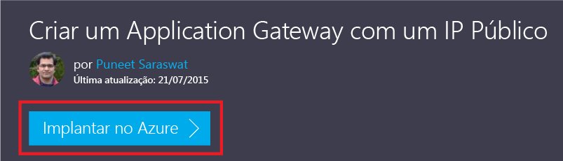
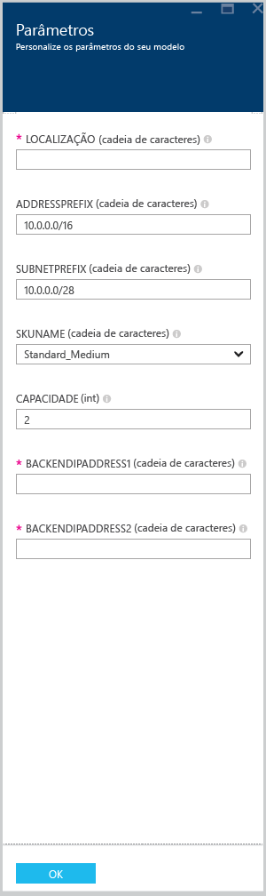

# <a name="create-an-application-gateway-by-using-the-azure-resource-manager-template"></a>Criar um gateway de aplicativo usando o modelo do Gerenciador de Recursos do Azure

> [!div class="op_single_selector"]
> * [Portal do Azure](application-gateway-create-gateway-portal.md)
> * [PowerShell do Azure Resource Manager](application-gateway-create-gateway-arm.md)
> * [Azure Classic PowerShell](application-gateway-create-gateway.md)
> * [Modelo do Azure Resource Manager](application-gateway-create-gateway-arm-template.md)
> * [CLI do Azure](application-gateway-create-gateway-cli.md)

O Gateway de Aplicativo do Azure é um balanceador de carga de camada 7. Ele fornece failover e solicitações HTTP de roteamento de desempenho entre diferentes servidores, estejam eles na nuvem ou no local. O Gateway de Aplicativo fornece muitos recursos do ADC (Controlador de entrega de aplicativos), incluindo o balanceamento de carga de HTTP, a afinidade de sessão baseada em cookies, o descarregamento de protocolo SSL (Secure Sockets Layer), as sondas de integridade personalizadas, suporte para vários sites e muitos outros. Para conferir uma lista completa dos recursos com suporte, visite [Visão geral do Gateway de Aplicativo](application-gateway-introduction.md)

Este artigo orienta a baixar e a modificar um modelo existente do Azure Resource Manager do GitHub e a implantar o modelo do GitHub, do PowerShell e da CLI do Azure.

Se você estiver simplesmente implantando o modelo do Gerenciador de Recursos do Azure diretamente do GitHub, sem nenhuma alteração, ignore para implantar um modelo do GitHub.

## <a name="scenario"></a>Cenário

Neste cenário, você:

* Crie um Gateway de Aplicativo com o firewall do aplicativo Web.
* Criará uma rede virtual chamada VirtualNetwork1, com um bloco CIDR 10.0.0.0/16 reservado.
* Criará uma sub-rede chamada Appgatewaysubnet que usa 10.0.0.0/28 como seu bloco CIDR.
* Configurará dois IPs de back-end definidos anteriormente para os servidores Web nos quais deseja balancear a carga do tráfego. Neste exemplo de modelo, os IPs de back-end são 10.0.1.10 e 10.0.1.11.

> [!NOTE]
> Essas configurações são os parâmetros para esse modelo. Para personalizar o modelo, você pode alterar as regras, o ouvinte, o SSL e outras opções no arquivo azuredeploy.json.


## <a name="download-and-understand-the-azure-resource-manager-template"></a>Baixar e compreender o modelo do Gerenciador de Recursos do Azure

Você pode baixar o modelo existente do Gerenciador de Recursos do Azure para criar uma rede virtual e duas sub-redes do GitHub, fazer as alterações desejadas e reutilizá-la. Para fazer isso, execute as seguintes etapas:

1. Navegue até [Criar Gateway de Aplicativo com o firewall de aplicativo Web habilitado](https://github.com/Azure/azure-quickstart-templates/tree/master/101-application-gateway-waf).
1. Clique em **azuredeploy.json** e em **RAW**.
1. Salve o arquivo em uma pasta local do computador.
1. Se você estiver familiarizado com os modelos do Gerenciador de Recursos do Azure, pule para a etapa 7.
1. Abra o arquivo que você salvou e examine o conteúdo em **parâmetros** na linha
1. Os parâmetros do modelo do Gerenciador de Recursos do Azure fornecem um espaço reservado para valores que podem ser preenchidos durante a implantação.

  | Parâmetro | Descrição |
  | --- | --- |
  | **subnetPrefix** |Bloco CIDR para a sub-rede do Gateway de Aplicativo. |
  | **applicationGatewaySize** | O tamanho do Gateway de Aplicativo.  O WAF permite apenas médio e grande. |
  | **backendIpaddress1** |Endereço IP do primeiro servidor Web. |
  | **backendIpaddress2** |Endereço IP do segundo servidor Web. |
  | **wafEnabled** | Configuração para determinar se o WAF está habilitado.|
  | **wafMode** | Modo do firewall do aplicativo Web.  As opções disponíveis são **prevenção** ou **detecção**.|
  | **wafRuleSetType** | Tipo de conjunto de regras para WAF.  Atualmente, OWASP é a única opção com suporte. |
  | **wafRuleSetVersion** |Versão de conjunto de regras. As opções com suporte atualmente são OWASP CRS 2.2.9 e 3.0. |

1. Verifique o conteúdo em **recursos** e observe as seguintes propriedades:

   * **type**. Tipo de recurso que está sendo criado pelo modelo. Nesse caso, o tipo é `Microsoft.Network/applicationGateways`, que representa um gateway de aplicativo.
   * **name**. Nome do recurso. Observe o uso de `[parameters('applicationGatewayName')]`, que significa o nome que é fornecido como entrada por você ou um arquivo de parâmetro durante a implantação.
   * **properties**. Lista de propriedades do recurso. Esse modelo usa a rede virtual e o endereço IP público durante a criação do gateway de aplicativo.

   > [!NOTE]
   > Para obter mais informações sobre modelos, visite: [Referência de modelos do Resource Manager](/templates/)

1. Navegue de volta para [https://github.com/Azure/azure-quickstart-templates/blob/master/101-application-gateway-waf/](https://github.com/Azure/azure-quickstart-templates/blob/master/101-application-gateway-waf).
1. Clique em **azuredeploy-parameters.json** e em **RAW**.
1. Salve o arquivo em uma pasta local do computador.
1. Abra o arquivo que você salvou e edite os valores dos parâmetros. Use os valores a seguir para implantar o gateway de aplicativo descrito em nosso cenário.

    ```json
    {
        "$schema": "http://schema.management.azure.com/schemas/2015-01-01/deploymentParameters.json#",
        "contentVersion": "1.0.0.0",
        "parameters": {
            "addressPrefix": {
            "value": "10.0.0.0/16"
            },
            "subnetPrefix": {
            "value": "10.0.0.0/28"
            },
            "applicationGatewaySize": {
            "value": "WAF_Medium"
            },
            "capacity": {
            "value": 2
            },
            "backendIpAddress1": {
            "value": "10.0.1.10"
            },
            "backendIpAddress2": {
            "value": "10.0.1.11"
            },
            "wafEnabled": {
            "value": true
            },
            "wafMode": {
            "value": "Detection"
            },
            "wafRuleSetType": {
            "value": "OWASP"
            },
            "wafRuleSetVersion": {
            "value": "3.0"
            }
        }
    }
    ```

1. Salve o arquivo. Você pode testar o modelo JSON e o modelo de parâmetro usando ferramentas de validação de JSON online, como [JSlint.com](http://www.jslint.com/).

## <a name="deploy-the-azure-resource-manager-template-by-using-powershell"></a>Implantar o modelo do Gerenciador de Recursos do Azure usando o PowerShell

Se você nunca usou o Azure PowerShell, visite: [Como instalar e configurar o Azure PowerShell](/powershell/azure/overview) e siga as instruções para entrar no Azure e selecionar sua assinatura.

1. Fazer logon no PowerShell

    ```powershell
    Login-AzureRmAccount
    ```

1. Verificar as assinaturas da conta.

    ```powershell
    Get-AzureRmSubscription
    ```

    Você deve se autenticar com suas credenciais.

1. Escolha quais das suas assinaturas do Azure deseja usar.

    ```powershell
    Select-AzureRmSubscription -Subscriptionid "GUID of subscription"
    ```

1. Se necessário, crie um grupo de recursos usando o cmdlet **New-AzureResourceGroup** . No exemplo a seguir, você cria um grupo de recursos chamado AppgatewayRG no local do Leste dos EUA.

    ```powershell
    New-AzureRmResourceGroup -Name AppgatewayRG -Location "West US"
    ```

1. Execute o cmdlet **New-AzureRmResourceGroupDeployment** para implantar a nova rede virtual usando os arquivos de modelo e parâmetro anteriores que você baixou e modificou.
    
    ```powershell
    New-AzureRmResourceGroupDeployment -Name TestAppgatewayDeployment -ResourceGroupName AppgatewayRG `
    -TemplateFile C:\ARM\azuredeploy.json -TemplateParameterFile C:\ARM\azuredeploy-parameters.json
    ```

## <a name="deploy-the-azure-resource-manager-template-by-using-the-azure-cli"></a>Implantar o modelo do Gerenciador de Recursos do Azure usando a CLI do Azure

Para implantar o modelo do Azure Resource Manager baixado usando a CLI do Azure, execute as etapas abaixo:

1. Se você nunca usou a CLI do Azure, confira [Instalar e configurar a CLI do Azure](/cli/azure/install-azure-cli) e siga as instruções até o ponto em que você seleciona sua conta e assinatura do Azure.

1. Se for necessário, execute o comando `az group create` para criar um grupo de recursos, conforme mostra o trecho de código abaixo. Observe a saída do comando. A lista exibida após a saída explicar os parâmetros usados. Para saber mais sobre grupos de recursos, visite [Visão geral do Azure Resource Manager](../azure-resource-manager/resource-group-overview.md).

    ```azurecli
    az group create --location westus --name appgatewayRG
    ```
    
    **-n (or --name)**. Nome do novo grupo de recursos. Para nosso cenário, é *appgatewayRG*.
    
    **-l (ou --location)**. Região do Azure onde o novo grupo de recursos é criado. Para nosso cenário, esse grupo é *westus*.

1. Execute o cmdlet `az group deployment create` para implantar a nova rede virtual usando o modelo e os arquivos de parâmetro que você baixou e modificou na etapa anterior. A lista exibida após a saída explicar os parâmetros usados.

    ```azurecli
    az group deployment create --resource-group appgatewayRG --name TestAppgatewayDeployment --template-file azuredeploy.json --parameters @azuredeploy-parameters.json
    ```

## <a name="deploy-the-azure-resource-manager-template-by-using-click-to-deploy"></a>Implantar o modelo do Gerenciador de Recursos do Azure usando o clique para implantar

Clique para implantar é outra maneira de usar modelos do Gerenciador de Recursos do Azure. É uma maneira fácil de usar modelos com o portal do Azure.

1. Vá até [Criar um Gateway de Aplicativo com o firewall do aplicativo Web](https://azure.microsoft.com/documentation/templates/101-application-gateway-waf/).

1. Clique em **Implantar no Azure**.

    
    
1. Preencha os parâmetros do modelo de implantação no portal e clique em **OK**.

    
    
1. Selecione **Concordo com os termos e condições declarados acima** e clique em **Comprar**.

1. Na folha Implantação personalizada, clique em **Criar**.

## <a name="providing-certificate-data-to-resource-manager-templates"></a>Fornecendo dados de certificado aos modelos do Resource Manager

Ao usar o SSL com um modelo, o certificado precisa ser fornecido em uma cadeia de caracteres base64 em vez de ser carregado. Para converter .pfx ou .cer para uma sequência de caracteres base64 usar um dos seguintes comandos. Os comandos a seguir convertem o certificado a uma sequência de caracteres base64, que pode ser fornecida ao modelo. A saída esperada é uma cadeia de caracteres que pode ser armazenada em uma variável e colada no modelo.

### <a name="macos"></a>macOS
```bash
cert=$( base64 <certificate path and name>.pfx )
echo $cert
```

### <a name="windows"></a>Windows
```powershell
[System.Convert]::ToBase64String([System.IO.File]::ReadAllBytes("<certificate path and name>.pfx"))
```

## <a name="delete-all-resources"></a>Excluir todos os recursos

Para excluir todos os recursos criados neste artigo, conclua uma das seguintes etapas:

### <a name="powershell"></a>PowerShell

```powershell
Remove-AzureRmResourceGroup -Name appgatewayRG
```

### <a name="azure-cli"></a>CLI do Azure

```azurecli
az group delete --name appgatewayRG
```

## <a name="next-steps"></a>Próximas etapas

Se desejar configurar o descarregamento SSL, visite [Configurar um Gateway de Aplicativo para descarregamento SSL](application-gateway-ssl.md).

Para configurar um Gateway de Aplicativo para usar com um balanceador de carga interno, visite [Criar um Gateway de Aplicativo com um ILB (balanceador de carga interno)](application-gateway-ilb.md).

Se deseja saber mais sobre as opções de balanceamento de carga no geral, visite:

* [Balanceador de carga do Azure](https://azure.microsoft.com/documentation/services/load-balancer/)
* [Gerenciador de Tráfego do Azure](https://azure.microsoft.com/documentation/services/traffic-manager/)

