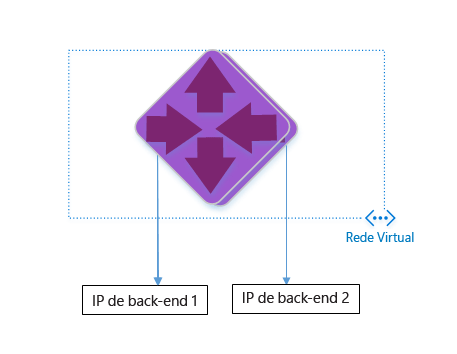

<properties 
   pageTitle="Criar o Application Gateway usando os modelos do Gerenciador de Recursos do Azure | Microsoft Azure"
   description="Esta página fornece instruções para criar um Application Gateway do Azure usando o modelo do Gerenciador de Recursos do Azure"
   documentationCenter="na"
   services="application-gateway"
   authors="joaoma"
   manager="jdial"
   editor="tysonn"/>
<tags 
   ms.service="application-gateway"
   ms.devlang="na"
   ms.topic="hero-article" 
   ms.tgt_pltfrm="na"
   ms.workload="infrastructure-services" 
   ms.date="11/10/2015"
   ms.author="joaoma"/>

# Criar um Application Gateway usando o modelo ARM

O Application Gateway é a camada 7 do balanceador de carga. Ele fornece o failover e solicitações HTTP de roteamento de desempenho entre diferentes servidores, estejam eles na nuvem ou no local. O Application Gateway tem os seguintes recursos de entrega de aplicativo: balanceamento de carga HTTP, afinidade de sessão baseada em cookie, descarregamento SSL.

> [AZURE.SELECTOR]
- [Azure Classic PowerShell](application-gateway-create-gateway.md)
- [Azure Resource Manager PowerShell](application-gateway-create-gateway-arm.md)
- [Azure Resource Manager template](application-gateway-create-gateway-arm-template.md)

 

Você aprenderá a baixar e a modificar um modelo ARM existente do GitHub e implantar o modelo do GitHub, PowerShell e da CLI do Azure.

Se você estiver simplesmente implantando o modelo ARM diretamente do GitHub, sem nenhuma alteração, pule para implantar um modelo do github.

## Cenário

Neste cenário, você criará:

- Um Application Gateway com 2 instâncias;
- Uma rede virtual chamada VirtualNetwork1, com um bloco CIDR reservado de 10.0.0.0/16;
- Uma sub-rede chamada Appgatewaysubnet usando 10.0.0.0/28 como seu bloco CIDR;
- IPs de back-end definidos anteriormente na Configuração 2 para os servidores Web nos quais deseja balancear a carga do tráfego. Neste exemplo de modelo, os IPs de back-end que estão sendo usados são 10.0.1.10 e 10.0.1.11

>[AZURE.NOTE]Esses são os parâmetros para este modelo. Você pode alterar as regras, o ouvinte e o SSL abrindo azuredeploy.json para personalizar o modelo.

## Baixar e entender o modelo ARM

No github, você pode baixar o modelo ARM existente para criar uma rede virtual e duas sub-redes; faça as alterações que desejar e reutilize-o. Para isso, siga as etapas abaixo.

1. Navegue até https://raw.githubusercontent.com/azure/azure-quickstart-templates/master/101-create-application-gateway/
2. Clique em **azuredeploy.json** e em **RAW**.
3. Salve o arquivo em uma pasta local do computador.
4. Se você estiver familiarizado com modelos ARM, pule para a etapa 7.
5. Abra o arquivo que você acabou de salvar e examine o conteúdo em **parameters** na linha 5. Os parâmetros do modelo ARM fornecem um espaço reservado para valores que podem ser preenchidos durante a implantação.

	| Parâmetro | Descrição |
	|---|---|
	| **local** | A região do Azure onde o Application Gateway será criado |
	| **VirtualNetwork1** | Nome para a nova rede virtual |
	| **addressPrefix** | Espaço de endereço para a rede virtual, no formato CIDR |
	| **ApplicationGatewaysubnet** | Nome da sub-rede do Application Gateway |
	| **subnetPrefix** | Bloco CIDR para a sub-rede do Application Gateway |
	| **skuname** | tamanho da instância de sku |
	| **capacidade** | número de instâncias |
	| **backendaddress1** | Endereço IP do primeiro servidor Web |
	| **backendaddress2** | Endereço IP do segundo servidor Web |
	

>[AZURE.IMPORTANT]Os modelos ARM mantidos no github pode mudar ao longo do tempo. Certifique-se de verificar o modelo antes de usá-lo.
	
6. Verifique o conteúdo em **resources** e observe o seguinte:

	- **type**. Tipo de recurso que está sendo criado pelo modelo. Nesse caso, **Microsoft.Network/applicationGateways**, que representa um Application Gateway.
	- **name**. Nome do recurso. Observe o uso de **[parameters('applicationGatewayName')]**, que significa o nome que será fornecido como entrada pelo usuário ou um arquivo de parâmetro durante a implantação.
	- **properties**. Lista de propriedades do recurso. Esse modelo usa a rede virtual e o endereço IP público durante a criação do Application Gateway.

7. Navegue de volta para https://raw.githubusercontent.com/azure/azure-quickstart-templates/master/101-create-application-gateway/azuredeploy.json.
8. Clique em **azuredeploy-paremeters.json** e em **RAW**.
9. Salve o arquivo em uma pasta local do computador.
10. Abra o arquivo que acabou de salvar e edite os valores dos parâmetros. Use os valores abaixo para implantar o Application Gateway descrito em nosso cenário.

		{
		  "$schema": "http://schema.management.azure.com/schemas/2015-01-01/deploymentParameters.json#",
		{
    	"location" : {
        "value" : "West US"
    	},
    	"addressPrefix": {
        "value": "10.0.0.0/16"
    	},
    	"subnetPrefix": {
        "value": "10.0.0.0/24"
    	},
    	"skuName": {
        "value": "Standard_Small"
    	},
    	"capacity": {
        "value": 2
    	},
    	"backendIpAddress1": {
        "value": "10.0.1.10"
    	},
    	"backendIpAddress2": {
        "value": "10.0.1.11"
    	}
		}

11. Salve o arquivo. Você pode testar o modelo Json e modelo de parâmetro usando ferramentas de validação de json online como [JSlint.com](http://www.jslint.com/)
 
## Implantar o modelo ARM usando o PowerShell

1. Se você nunca usou o Azure PowerShell, consulte [Como Instalar e Configurar o Azure PowerShell](powershell-install-configure.md) e siga as instruções até o fim para entrar no Azure e selecionar sua assinatura.

### Etapa 1

		Login-AzureRmAccount

### Etapa 2

Verificar as assinaturas da conta

		get-AzureRmSubscription 

Você deverá se autenticar com suas credenciais. 

### Etapa 3 

Escolha quais das suas assinaturas do Azure deseja usar. 

		Select-AzureRmSubscription -Subscriptionid "GUID of subscription"

### Etapa 4

	
Se necessário, crie um novo grupo de recursos usando o cmdlet `New-AzureResourceGroup`. No exemplo abaixo, você criará um novo grupo de recursos chamado AppgatewayRG no local Leste dos EUA:

	 New-AzureRmResourceGroup -Name AppgatewayRG -Location "East US"
		VERBOSE: 5:38:49 PM - Created resource group 'AppgatewayRG' in location 'eastus'

		ResourceGroupName : AppgatewayRG
		Location          : eastus
		ProvisioningState : Succeeded
		Tags              :
		Permissions       :
	                 Actions  NotActions
	                 =======  ==========
	                  *

		ResourceId        : /subscriptions/xxxxxxxxxxxxxxxxxxxxxxxxxxxxxx/resourceGroups/AppgatewayRG

4. Execute o cmdlet New-AzureRmResourceGroupDeployment para implantar a nova rede virtual usando os arquivos de modelo e parâmetro que você baixou e modificou acima.

		New-AzureRmResourceGroupDeployment -Name TestAppgatewayDeployment -ResourceGroupName AppgatewayRG `
 		   -TemplateFile C:\ARM\azuredeploy.json -TemplateParameterFile C:\ARM\azuredeploy-parameters.json

A saída gerada pela linha de comando será a seguinte:

		DeploymentName    : testappgatewaydeployment
		ResourceGroupName : appgatewayRG
		ProvisioningState : Succeeded
		Timestamp         : 9/19/2015 1:49:41 AM
		Mode              : Incremental
		TemplateLink      :
		Parameters        :
                   Name             Type                       Value
                   ===============  =========================  ==========
                   location         String                     East US
                   addressPrefix    String                     10.0.0.0/16
                   subnetPrefix     String                     10.0.0.0/24
                   skuName          String                     Standard_Small
                   capacity         Int                        2
                   backendIpAddress1  String                     10.0.1.10
                   backendIpAddress2  String                     10.0.1.11
					
		Outputs           :

## Implantar o modelo ARM usando a CLI do Azure

Para implantar o modelo ARM baixado usando a CLI do Azure, siga as etapas abaixo.

1. Se você nunca usou a CLI do Azure, consulte [Instalar e configurar a CLI do Azure](xplat-cli-install.md) e siga as instruções até o ponto em que você seleciona sua conta e assinatura do Azure.
2. Execute o comando **azure config mode** para alternar para o modo do Gerenciador de Recursos, como mostrado abaixo.

		azure config mode arm

Este é o resultado esperado para o comando descrito acima:

		info:	New mode is arm

3. Se necessário, execute **azure group create** para criar um novo grupo de recursos, como mostrado abaixo. Observe a saída do comando. A lista exibida após a saída explicar os parâmetros usados. Para saber mais sobre grupos de recursos, visite [Visão geral do Gerenciador de Recursos do Azure](resource-group-overview.md).

		azure group create -n appgatewayRG -l eastus

**-n (ou --name)**. Nome do novo grupo de recursos. Para nosso cenário, *appgatewayRG*.

**-l (ou --location)**. Região do Azure em que o novo grupo de recursos será criado. Para nosso cenário, *Eastus*.

4. Execute o cmdlet **azure group deployment create** para implantar a nova rede virtual usando o modelo e os arquivos de parâmetro que você baixou e modificou acima. A lista exibida após a saída explicar os parâmetros usados.

		azure group deployment create -g appgatewayRG -n TestAppgatewayDeployment -f C:\ARM\azuredeploy.json -e C:\ARM\azuredeploy-parameters.json

Este é o resultado esperado para o comando descrito acima:

		azure group deployment create -g appgatewayRG -n TestAppgatewayDeployment -f C:\ARM\azuredeploy.json -e C:\ARM\azuredeploy-parameters.json
		info:    Executing command group deployment create
		+ Initializing template configurations and parameters
		+ Creating a deployment
		info:    Created template deployment "TestAppgatewayDeployment"
		+ Waiting for deployment to complete
		data:    DeploymentName     : TestAppgatewayDeployment
		data:    ResourceGroupName  : appgatewayRG
		data:    ProvisioningState  : Succeeded
		data:    Timestamp          : 2015-09-21T20:50:27.5129912Z
		data:    Mode               : Incremental
		data:    Name               Type    Value
		data:    -----------------  ------  --------------
		data:    location           String  East US
		data:    addressPrefix      String  10.0.0.0/16
		data:    subnetPrefix       String  10.0.0.0/24	
		data:    skuName            String  Standard_Small
		data:    capacity           Int     2
		data:    backendIpAddress1  String  10.0.1.10
		data:    backendIpAddress2  String  10.0.1.11
		info:    group deployment create command OK

**-g (ou --resource-group)**. Nome do grupo de recursos em que a nova Rede Virtual será criada.

**-f (ou --template-file)**. Caminho para o arquivo de modelo ARM.

**-e (ou --parameters-file)**. Caminho para o arquivo de parâmetros ARM.

## Implantar modelo ARM usando clique para implantar

Clique para implantar é outra maneira de usar modelos ARM. É uma maneira fácil de usar modelos com o portal do Azure.

### Etapa 1 
Usar o link [Clicar para implantar o Application Gateway](https://azure.microsoft.com/documentation/templates/101-application-gateway-public-ip/) redirecionará você para a página de modelo do portal do Application Gateway.

### Etapa 2 

Clique em "implantar no Azure"

### Etapa 3

Preencha os parâmetros do modelo de implantação no portal e clique em OK

### Etapa 4

Selecione "Termos legais" e clique em "comprar"

### Etapa 5

Na folha "implantação personalizada", clique em "criar".

 
## Próximas etapas

Se desejar configurar o descarregamento SSL, confira [Configurar um Application Gateway para descarregamento SSL](application-gateway-ssl.md).

Se desejar configurar um Application Gateway para usar com o ILB, consulte [Criar um Application Gateway com um ILB (Balanceador de Carga Interno)](application-gateway-ilb.md).

Se deseja obter mais informações sobre as opções de balanceamento de carga no geral, consulte:

- [Balanceador de carga do Azure](https://azure.microsoft.com/documentation/services/load-balancer/)
- [Gerenciador de Tráfego do Azure](https://azure.microsoft.com/documentation/services/traffic-manager/)

<!---HONumber=AcomDC_0107_2016-->