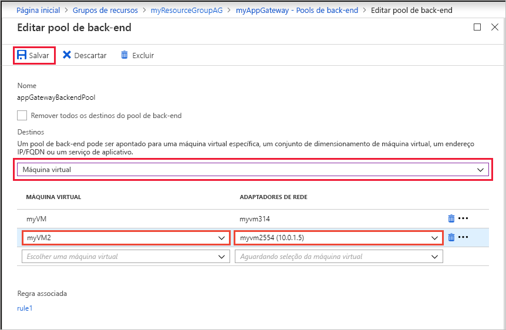

# <a name="create-an-application-gateway-using-the-azure-portal"></a>Criar um gateway de aplicativo usando o portal do Azure

Você pode usar o portal do Azure para criar ou gerenciar gateways de aplicativos. Este guia de início rápido mostra como criar recursos de rede, servidores de back-end e um gateway de aplicativo.

Se você não tiver uma assinatura do Azure, crie uma [conta gratuita](https://azure.microsoft.com/free/?WT.mc_id=A261C142F) antes de começar.

## <a name="log-in-to-azure"></a>Fazer logon no Azure

Faça logon no portal do Azure em [http://portal.azure.com](http://portal.azure.com)

## <a name="create-an-application-gateway"></a>Criar um Gateway de Aplicativo

É necessário uma rede virtual para a comunicação entre os recursos que você criar. Duas sub-redes são criadas neste exemplo: uma para o gateway de aplicativo e a outra para os servidores de back-end. Você pode criar uma rede virtual ao mesmo tempo que cria o gateway de aplicativo.

1. Clique no botão **Novo** encontrado no canto superior esquerdo do portal do Azure.
2. Selecione **Rede** e, em seguida, selecione **Gateway de Aplicativo** na lista em destaque.
3. Insira esses valores para o gateway de aplicativo:

    - *myAppGateway* - para o nome do gateway de aplicativo.
    - *myResourceGroupAG* - para o novo grupo de recursos.

    

4. Aceite os valores padrão para as outras configurações e clique em **OK**.
5. Clique em **Escolher uma rede virtual**, clique em **Criar novo** e, em seguida, insira esses valores para a rede virtual:

    - *myVNet* – para o nome da rede virtual.
    - *10.0.0.0/16* – para o espaço de endereço da rede virtual.
    - *myAGSubnet* – para o nome da sub-rede.
    - *10.0.0.0/24* – para o espaço de endereço da sub-rede.

    

6. Clique em **OK** para criar a rede virtual e a sub-rede.
6. Clique em **Escolher um endereço IP público**, clique em **Criar novo** e, em seguida, digite o nome do endereço IP público. Neste exemplo, o endereço IP público é denominado *myAGPublicIPAddress*. Aceite os valores padrão para as outras configurações e clique em **OK**.
8. Aceite os valores padrão para a configuração de Ouvinte, deixe o firewall do aplicativo Web desabilitado e, em seguida, clique em **OK**.
9. Examine as configurações na página de resumo e clique em **OK** para criar a rede virtual, o endereço IP público e o gateway de aplicativo. Pode demorar vários minutos para o gateway de aplicativo ser criado, aguarde até que a implantação seja concluída com êxito antes de prosseguir para a próxima seção.

### <a name="add-a-subnet"></a>Adicionar uma sub-rede

1. Clique em **Todos os recursos** no menu esquerdo e depois clique em **myVNet** da lista de recursos.
2. Clique em **Sub-redes** e, em seguida, clique em **Sub-rede**.

    

3. Insira *myBackendSubnet* para o nome da subrede e clique em **OK**.

## <a name="create-backend-servers"></a>Criar servidores de back-end

Neste exemplo, você cria duas máquinas virtuais para serem usadas como servidores de back-end para o gateway de aplicativo. Você também instala o IIS nas máquinas virtuais para verificar se o gateway de aplicativo foi criado com êxito.

### <a name="create-a-virtual-machine"></a>Criar uma máquina virtual

1. Clique em **Novo**.
2. Clique em **Computação** e, em seguida, selecione **Windows Server 2016 Datacenter** na lista em destaque.
3. Insira esses valores para a máquina virtual:

    - *myVM* – para o nome da máquina virtual.
    - *azureuser* – para o nome de usuário do administrador.
    - *Azure123456!* para a senha.
    - Clique em **Usar existente** e selecione *myResourceGroupAG*.

4. Clique em **OK**.
5. Selecione **DS1_V2** para o tamanho da máquina virtual e clique em **Selecionar**.
6. Verifique se **myVNet** está selecionada para a rede virtual e se a sub-rede é **myBackendSubnet**. 
7. Clique em **Desabilitado** para desabilitar o diagnóstico de inicialização.
8. Clique em **OK**, examine as configurações na página de resumo e, em seguida, clique em **Criar**.

### <a name="install-iis"></a>Instalar o IIS

1. Abra o shell interativo e certifique-se ele está definido como **PowerShell**.

    

2. Execute o comando a seguir para instalar o IIS na máquina virtual: 

    ```azurepowershell-interactive
    Set-AzureRmVMExtension `
      -ResourceGroupName myResourceGroupAG `
      -ExtensionName IIS `
      -VMName myVM `
      -Publisher Microsoft.Compute `
      -ExtensionType CustomScriptExtension `
      -TypeHandlerVersion 1.4 `
      -SettingString '{"commandToExecute":"powershell Add-WindowsFeature Web-Server; powershell Add-Content -Path \"C:\\inetpub\\wwwroot\\Default.htm\" -Value $($env:computername)"}' `
      -Location EastUS
    ```

3. Crie uma segunda máquina virtual e instale o IIS usando as etapas que você acabou de concluir. Insira *myVM2* para seu nome e para VMName em Set-AzureRmVMExtension.

### <a name="add-backend-servers"></a>Adicionar servidores de back-end

3. Clique em **Todos os recursos** e clique em **myAppGateway**.
4. Clique em **Pools do back-end**. Um pool padrão foi criado automaticamente com o gateway de aplicativo. Clique em **appGatewayBackendPool**.
5. Clique em **Adicionar destino** para adicionar cada máquina virtual que você criou para o pool de back-end.

    

6. Clique em **Salvar**.

## <a name="test-the-application-gateway"></a>Testar o gateway de aplicativo

1. Localize o endereço IP público para o gateway do aplicativo na tela de Visão geral. Clique em **Todos os recursos** e clique em **myAGPublicIPAddress**.

    

2. Copie o endereço IP público e cole-o na barra de endereços do seu navegador.

    


## <a name="clean-up-resources"></a>Limpar recursos

Quando não for mais necessário, exclua o grupo de recursos, o gateway de aplicativo e todos os recursos relacionados. Para fazer isso, selecione o grupo de recursos na folha do gateway de aplicativo e clique em **Excluir**.

## <a name="next-steps"></a>Próximas etapas

Neste guia de início rápido, você criou um grupo de recursos, recursos de rede e servidores de back-end. Você usou, em seguida, esses recursos para criar um gateway de aplicativo. Para saber mais sobre os gateways de aplicativos e seus recursos associados, prossiga para os artigos de instrução.
