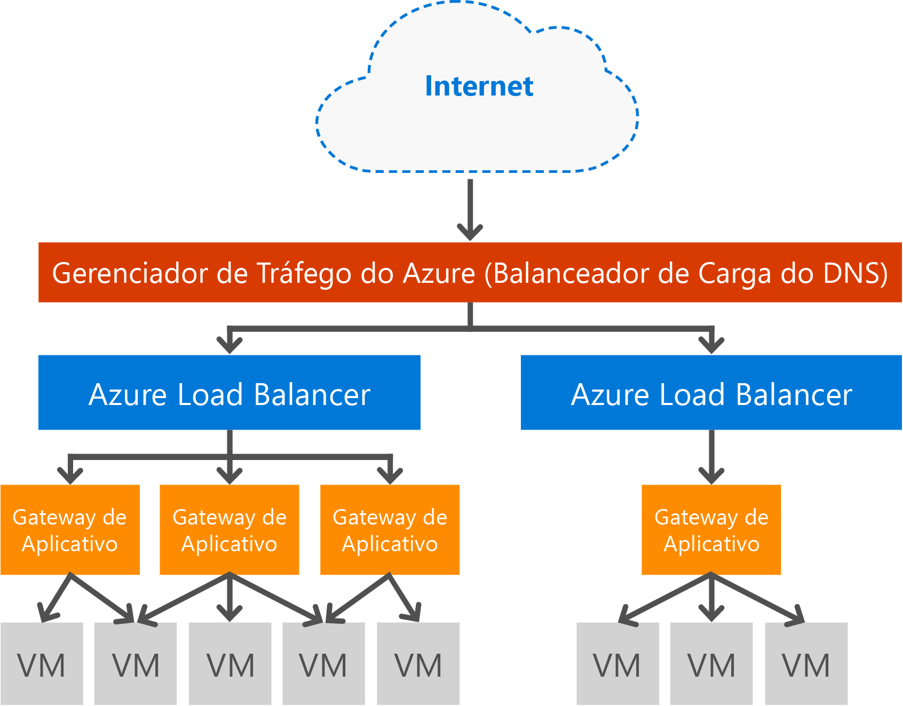

# Visão geral do Application Gateway

## O que é o Gateway de Aplicativo

O Microsoft Azure Application Gateway fornece o ADC (Controlador de Entrega de Aplicativos) como um serviço, oferecendo vários recursos de balanceamento de carga de camada 7 para o aplicativo. Ele permite que os clientes otimizem a produtividade do web farm descarregando a terminação SSL com uso intensivo de CPU para o Gateway de Aplicativo. Ele também fornece outros recursos de roteamento de camada 7, incluindo distribuição round robin do tráfego de entrada, afinidade de sessão, roteamento com base no caminho de URL e a capacidade de hospedar vários sites por trás de um único Gateway de Aplicativo baseado em cookie. O Gateway de Aplicativo também tem um WAF (firewall de aplicativo Web) que protege o aplicativo contra a maioria das 10 vulnerabilidades da Web mais comuns de OWASP. O Gateway de Aplicativo pode ser configurado como um gateway voltado para a Internet, um gateway apenas interno ou uma combinação de ambos. O Gateway de Aplicativo é totalmente gerenciado pelo Azure, escalonável e altamente disponível. Ele fornece um conjunto avançado de recursos de log e diagnósticos para melhor capacidade de gerenciamento. O Gateway de Aplicativo funciona com máquinas virtuais, serviços de nuvem e aplicativos Web voltados para o interior ou o exterior.

O Gateway de Aplicativo é um dispositivo virtual dedicado para o aplicativo e é composto de várias instâncias de trabalho para alta disponibilidade e escalabilidade. Quando você cria um gateway de aplicativo, um ponto de extremidade (VIP público ou IP ILB interno) é usado e associado para tráfego de rede de entrada. Esse IP de ILB ou VIP é fornecido pelo Azure Load Balancer, funcionando no nível de transporte (TCP/UDP) e fazendo com que todo o tráfego de rede entrada seja balanceado para as instâncias de trabalho do Application Gateway. O Gateway de Aplicativo roteará o tráfego HTTP/HTTPS com base em sua configuração seja uma máquina virtual, serviço de nuvem ou um endereço IP interno ou externo. Para ver o SLA e o Preço, confira as páginas [SLA](https://azure.microsoft.com/support/legal/sla/) e [Preço](https://azure.microsoft.com/pricing/details/application-gateway/).

## Recursos

Atualmente, o Gateway de Aplicativo dá suporte à entrega de aplicativo de camada 7 com os seguintes recursos:

* **[Firewall do Aplicativo Web (Visualização)](application-gateway-webapplicationfirewall-overview.md)** - o firewall de aplicativo Web (WAF) no Gateway de Aplicativo do Azure protege aplicativos Web contra ataques comuns baseados na Web, como injeção de SQL, ataques de script entre sites e sequestros de sessão.
* **Balanceamento de carga HTTP** - o Gateway de Aplicativo fornece balanceamento de carga round robin. O balanceamento de carga é feito na camada 7 e é usado somente para o tráfego HTTP(S).
* **Afinidade de sessão baseada em cookies** -esse recurso é útil quando você deseja manter uma sessão de usuário no mesmo back-end. Usando cookies gerenciados de gateway, o Gateway de Aplicativo é capaz de direcionar o tráfego subsequente de uma sessão de usuário para o mesmo back-end para processamento. Esse recurso é importante em casos em que o estado da sessão é salvo localmente no servidor back-end para uma sessão de usuário.
* **[Descarregamento de SSL (Secure Sockets Layer)](application-gateway-ssl-arm.md)** - esse recurso executa a difícil tarefa de descriptografar o tráfego HTTPS longe dos seus servidores Web. Ao encerrar a conexão SSL no Gateway de Aplicativo e encaminhar a solicitação para o servidor não criptografado, o servidor Web é aliviado da descriptografia.  O Gateway de Aplicativo criptografa novamente a resposta antes de enviar novamente ao cliente. Esse recurso é útil em cenários onde o back-end está localizado na mesma rede virtual protegida como o Gateway de Aplicativo no Azure.
* **[SSL de ponta a ponta](application-gateway-backend-ssl.md)** - o Gateway de Aplicativo oferece suporte à criptografia de tráfego de ponta a ponta. O Gateway de Aplicativo faz isso ao encerrar a conexão SSL no gateway de aplicativo. O gateway, em seguida, aplica as regras de roteamento ao tráfego, criptografa o pacote novamente e encaminha o pacote para o back-end apropriado com base nas regras de roteamento definidas. Qualquer resposta do servidor Web passa pelo mesmo processo de volta para o usuário final.
* **[Roteamento de conteúdo baseado em URL](application-gateway-url-route-overview.md)** - esse recurso fornece a capacidade de usar diferentes servidores de back-end para o tráfego diferente. O tráfego para uma pasta no servidor Web ou para uma CDN poderia ser roteado para um back-end diferente, reduzindo a carga desnecessária nos back-ends que não servem conteúdo específico.
* **[Roteamento de vários sites](application-gateway-multi-site-overview.md)** - o Gateway de Aplicativo permite que você consolide até 20 sites em um gateway de aplicativo único.
* **[Suporte ao Websocket](application-gateway-websocket.md)** - outro grande recurso do Gateway de Aplicativo é o suporte nativo para Websocket.
* **[Monitoramento de integridade](application-gateway-probe-overview.md)** - o gateway de aplicativo fornece investigações de integridade de padrão monitoramento de recursos de back-end, bem como personalizada para monitorar a cenários mais específicos.
* **[Diagnóstico avançado](application-gateway-diagnostics.md)** – o Gateway de Aplicativo fornece logs de diagnóstico e acesso completos. Logs do firewall estão disponíveis para recursos de gateway de aplicativo que têm o WAF habilitado.

## Benefícios

O Gateway de Aplicativo é útil para:

* Os aplicativos que exijam solicitações da mesma sessão de usuário/cliente para acessar a mesma máquina virtual de back-end. Exemplos desses aplicativos são os aplicativos de carrinho de compras e servidores de email na Web.
* Aplicativos que deseja liberar de farms do servidor Web da sobrecarga da terminação SSL.
* Aplicativos, como uma Rede de Distribuição de Conteúdo, que exigem que várias solicitações HTTP na mesma conexão TCP de execução longa sejam roteadas ou balanceadas por carga para diferentes servidores back-end.
* Aplicativos que oferecem suporte a tráfego websocket
* Proteger aplicativos Web contra ataques comuns baseados na Web, como injeção SQL, ataques de script entre sites e sequestros de sessão.

O balanceamento de carga do Application Gateway como um serviço gerenciado pelo Azure permite o provisionamento de um balanceador de carga de camada 7 por trás do balanceador de carga de software do Azure. O Gerenciador de Tráfego pode ser usado para concluir o cenário conforme mostrado na imagem a seguir, no qual o Gerenciador de Tráfego fornece redirecionamento e a disponibilidade de tráfego para vários recursos de gateway de aplicativo em diferentes regiões, enquanto o gateway de aplicativo fornece balanceamento de carga de camada 7 entre regiões. Um exemplo desse cenário pode ser encontrado em: [Usando serviços de balanceamento de carga na nuvem do Azure](../traffic-manager/traffic-manager-load-balancing-azure.md)

[!INCLUDE [load-balancer-compare-tm-ag-lb-include.md](../../includes/load-balancer-compare-tm-ag-lb-include.md)]

## Instâncias e tamanhos de gateway

O Gateway de Aplicativo atualmente é oferecido em três tamanhos: **Pequeno**, **Médio** e **Grande**. Os tamanhos de instância pequenos são destinados a cenários de desenvolvimento e teste.

Atualmente, há duas SKUs de Gateway de Aplicativo: **WAF** e **Standard**.

Você pode criar até 50 Application Gateways por assinatura e cada um deles pode ter até 10 instâncias. Cada gateway de aplicativo pode consistir em 20 ouvintes http. Para obter uma lista completa de limites do gateway de aplicativo, consulte [Limites de serviço do Gateway de Aplicativo](../azure-subscription-service-limits.md?toc=%2fazure%2fapplication-gateway%2ftoc.json#application-gateway-limits).

A tabela a seguir mostra uma produtividade de desempenho médio para cada instância do Application Gateway:

| Resposta de página de back-end | Pequena | Média | Grande |
| --- | --- | --- | --- |
| 6 mil |7,5 Mbps |13 Mbps |50 Mbps |
| 100K |35 Mbps |100 Mbps |200 Mbps |

> [!NOTE]
> Esses valores são valores aproximados para uma produtividade do Application Gateway. A produtividade real depende de diversos detalhes de ambiente, como o tamanho médio da página, a localização das instâncias de back-end e o tempo de processamento para fornecer de uma página. Para números de desempenho exatos, você deve executar seus próprios testes. Os valores aqui são fornecidos somente para orientação no planejamento de capacidade.
>
>

## Monitoramento da integridade

O Gateway de Aplicativo do Azure monitora automaticamente a integridade das instâncias de back-end por meio de investigações de integridade básicas ou personalizadas. Usando testes de integridade, isso faz com que somente hosts íntegros respondam ao tráfego. Para saber mais, consulte a [Visão geral do monitoramento de integridade do Application Gateway](application-gateway-probe-overview.md).

## Configurando e gerenciando

Para seu ponto de extremidade, o gateway de aplicativo pode ter um IP público, um IP privado ou ambos, quando é configurado. O Gateway de Aplicativo é configurado em uma rede virtual na sua própria sub-rede. A sub-rede criada ou usada para o gateway de aplicativo não pode conter outros tipos de recursos, os únicos recursos permitidos na sub-rede são outros gateways de aplicativo. Para proteger seus recursos de back-end, os servidores de back-end podem estar contidos em uma sub-rede diferente na mesma rede virtual do que o gateway de aplicativo. Essa sub-rede adicional não é necessária para os aplicativos de back-end, pois desde que o gateway de aplicativo possa acessar o endereço ip, ele será capaz de fornecer recursos ADC aos servidores de back-end.

É possível criar e gerenciar um gateway de aplicativo usando as APIs REST, os cmdlets do PowerShell, a CLI do Azure ou o [portal do Azure](https://portal.azure.com/).

## Próximas etapas

Depois de aprender mais sobre o Gateway de Aplicativo, você pode [criar um Gateway de Aplicativo](application-gateway-create-gateway-portal.md) ou [criar um descarregamento de SSL do Gateway de Aplicativo](application-gateway-ssl-arm.md) para balancear a carga de conexões HTTPS.

Para saber como criar um Application Gateway usando a URL com base em roteamento de conteúdo, acesse [Criar um Application Gateway usando roteamento com base em URL](application-gateway-create-url-route-arm-ps.md) para obter mais informações.

<!--HONumber=Nov16_HO3-->

